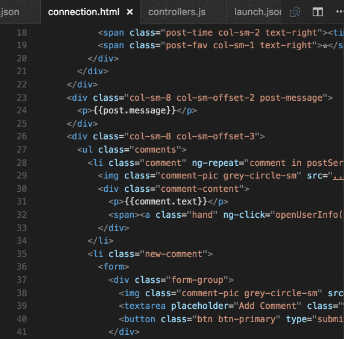
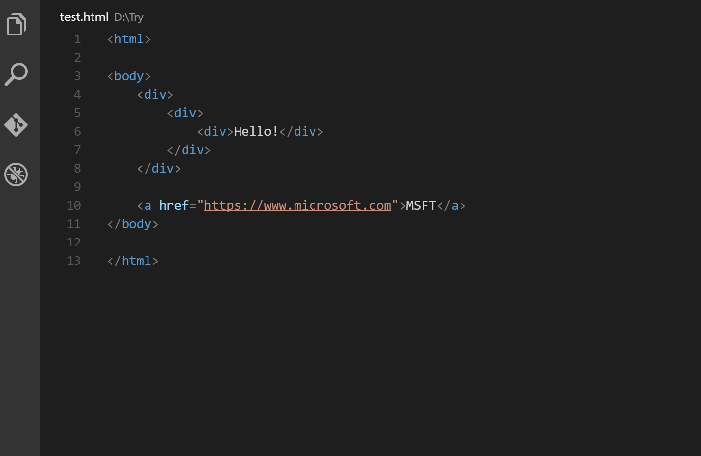
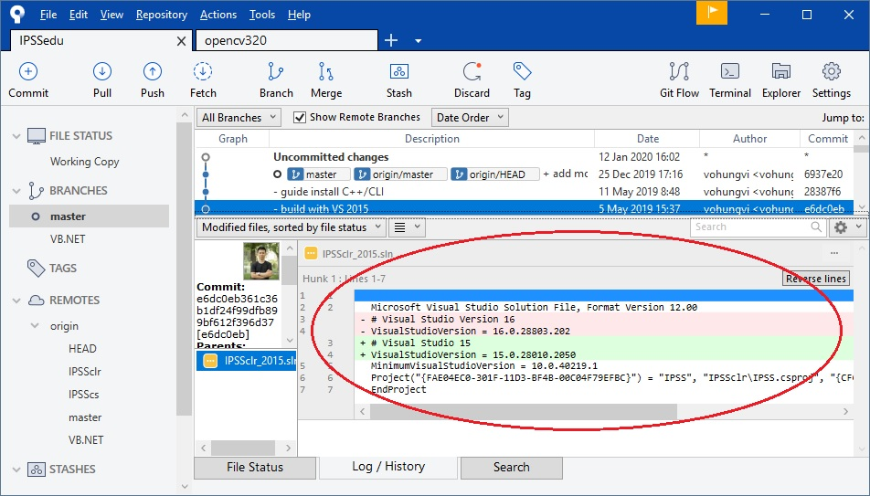
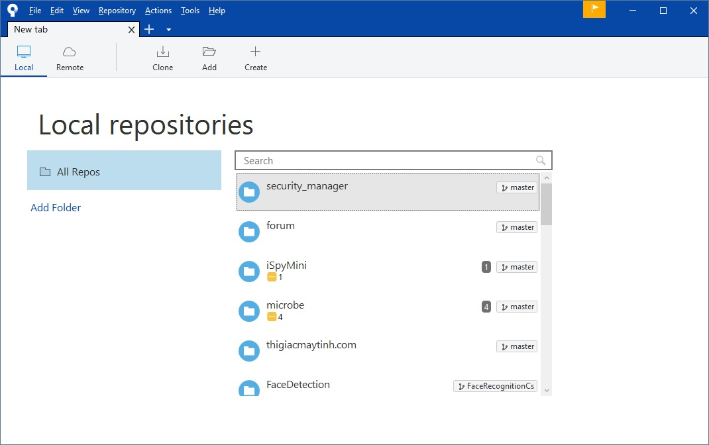

# Công cụ hỗ trợ lập trình

Làm gì cũng cần có công cụ để nhanh chóng, chính xác và dễ dàng hơn. Các tool bên dưới được sử dụng rộng rãi trong các cty lập trình, đã được kiểm chứng tính hiệu quả trong thực tế. Bao gồm:

* Notepad++
* VSCode
* Source Tree
* Beyond compare

## Notepad++

## VSCode

Điều tách biệt giữa 1 người lập trình xuất sắc và một người giỏi là những công cụ mà họ sử dụng. Sử dụng đúng công cụ đúng lúc có thể khiến cuộc sống của các lập trình viên dễ dàng hơn. Điều này không có gì khác biệt giữa các IDE bạn đang sử dụng cả.

Hầu hết các lập trình viên đều đang sử dụng Visual Studio Code – IDE cho phép cài đặt nhiều extensions (tiện ích mở rộng). Sự đa dạng của các tiện ích mở rộng là không cần bàn cãi.

### VS Code Extensions

#### CSS Peek Extensions

Nếu bạn là một người làm lập trình web thì việc sử dụng CSS Peek gần như là bắt buộc. Tiện ích này cho phép bạn xem qua các quy tắc CSS được áp dụng cho một phần tử nhất định trong HTML của bạn chỉ bằng cách di chuột qua tên lớp hoặc ID của phần tử.

Nhưng tiện ích này còn làm được nhiều thứ hơn là chỉ cho bạn thấy các style với tính năng là “Go to” – cho phép bạn chuyển ngay đến các quy tắc CSS được áp dụng cho phần tử. Điều này giúp bạn tiết kiệm rất nhiều thời gian tìm kiếm các selectors phù hợp.

#### Beautify

Nếu bạn thích clean code thì chắc chắn Beautufy sẽ là lựa chọn của bạn. Tiện ích mở rộng này giúp code của bạn trở nên hoàn hảo. Beautify hỗ trợ JavaScript, HTML, CSS, Sass, và JSON.

Phần tuyệt vời nhất của tiện ích này là tất cả các tùy chọn đều có thể tùy chỉnh hoàn toàn - như kích thước thụt lề và nếu tệp nên kết thúc bằng 1 dòng mới. Với các ngôn ngữ mà Beautify đã hỗ trợ, bạn có thể dễ dàng tùy chỉnh các option dựa trên từng ngôn ngữ.

Với hơn 5 triệu lượt tải, extension này xứng đang nằm trong top 20 tiện ích mở rộng được tải nhiều nhất

#### Auto Rename Tag

Tính năng của Auto Rename tag rất đơn giản, dù vậy bạn cũng vẫn nên sử dụng. Tiên ích này cho phép tự động rename (đổi tên) các HTML tags đôi. Nếu bạn đổi tên 1 opening tag thì nó sẽ đổi tên closing tag tương ứng và ngược lại.

Nếu bạn muốn tự động thêm closing tag khi đang gõ trong ngoặc đóng của opening tag, bạn nên tìm hiểu về tiện ích Auto Close Tag. Việc cài đặt cả 2 công cụ này sẽ khiến bạn viết HTML một cách hiệu quả và thống nhất hơn.


#### Night Owl

Đon gian la theme

#### JavaScript (ES6) code snippets

Tiện ích này có hàng tá snippet bạn có thể sử dụng để tạo nên các đoạn code ES6 cho bạn

VD, gõ  clg  sau đó enter sẽ trả kết quả về console.log. Có thể bạn sẽ mất 1 lúc để bạn có thể quen với tất cả snippets hiện có nhưng một khi đã thành thục, bạn có thể gõ code ES6 rất nhanh.

## Source Tree

Trong repo Git (ở đây là GitHub) có nhiều branch khác nhau, mỗi file code có nhiều lần sửa đổi khác nhau. Sử dụng Sourcetree giúp bạn dễ dàng xem được lịch sử của những sửa đổi đó. Hơn nữa giúp bạn quản lý nhiều repo khác nhau trong máy tính.

Nếu không có source tree thì các bạn phải gõ tay từng lệnh như:

```
git clone https://github.com/.....
git pull
git commit
```

### Các tính năng nổi bật gồm

* Xem lịch sử commit một cách dễ dàng: sửa bao nhiêu file, file sửa dòng nào,…
* Dễ dàng chuyển qua lại các branch khác nhau
* Hiển thị thông báo rõ ràng

Hình trên là so sánh sự thay đổi của code trong lịch sử. Dòng màu đỏ là bị xóa, màu xanh là thêm vào, số dòng giữ nguyên nhưng code 2 dòng đó đã thay đổi.

### Giải thích các thuật ngữ

* **Repo**: viết tắt của repository – “thùng chứa” code
* **Origin**: repository gốc, khi bạn clone code tức là bạn clone từ origin. Bài này lấy ví dụ minh họa từ GitHub thì origin được đặt ở GitHub.
* **Working Directory**: folder chứa code trong máy bạn.
* **Pull**: “kéo” code mới từ origin về máy, tương tự như update bên SVN
* **Commit**: cập nhật những sửa đổi của code vào repo trong máy của bạn
* **Push**: “đẩy” những sửa đổi mà bạn đã commit lên origin
* **Hunk**: đoạn code bị sửa đổi trong file, 1 file có thể có nhiều hunk
– **Stage hunk**: chọn hunk để commit
* **Stage file**: chọn file để commit, tương đương stage tất cả hunk trong file đó.

### Cài đặt sourcetree

Các bạn tải về từ trang web: **<https://www.sourcetreeapp.com/>**.

Khi cài đặt chương trình sẽ yêu cầu bạn cài 1 số thứ như Git và .Net Framwork (nếu chưa cài). Khi cài xong chương trình có giao diện như bên dưới

Các repo được hiển thị dưới dạng tab, các bạn có thể quản lý nhiều project khác nhau dễ dàng.

### Các thao tác thường gặp
