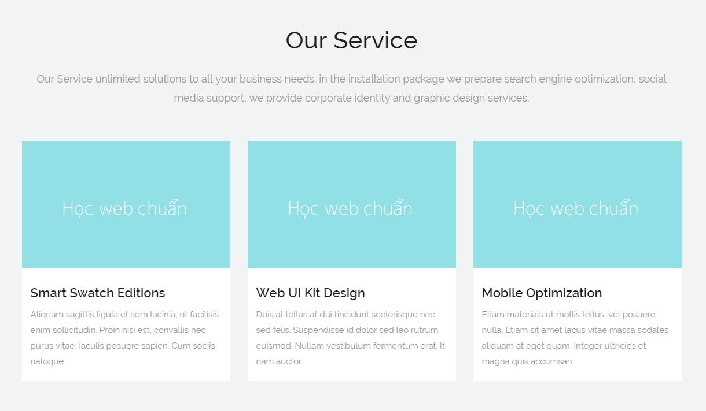
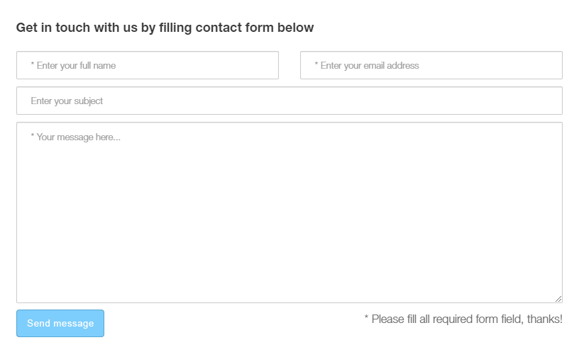

## Bài tập 1: Thực hiện code HTML theo nội dung design dưới đây:

#### Hướng dẫn: Cấu trúc design không phức tạp:

* `<hx>` và đoạn văn.
* Danh sách có 3 mục, mỗi mục có hình, `<hx>` và đoạn văn.

Nội dung layout không quá phức tạp, chỉ cần xử lý float cho danh sách, và xử lý gọn xung quanh như:

* Reset lại `margin-right` cho `li` cuối.
* Xử lý chiều cao cho 3 mục đều **bằng nhau**.

### Bài giải chưa kèm css

```{html}
<!doctype html>
<html lang="en">
<head>
<meta charset="utf-8">
<title>Học web chuẩn</title>
</head>
<body>
  <section class="service">
    <h2>Our Service</h2>
    <p class="lead-text">Our Service lorem ipsum dolor sit amet, consectetur adipiscing elit. Nam sed ipsum erat. Donec feugiat ipsum ac risus auctor dignissim. Phasellus ante dolor, molestie vitae malesuada id, posuere non est.</p>
    <ul class="service-list clearfix">
      <li>
        <p class="service-image"></p>
        <div class="inner">
          <h3>Smart Swatch Editions</h3>
          <p class="info">Augue et dapibus. Nullam venenatis ornare arcu at placerat. Ut eget metus velit. Nam porttitor, arcu eu efficitur ornare, turpis nulla vehicula mauris.</p>
        </div>
      </li>

      <li>
        <p class="service-image"></p>
        <div class="inner">
          <h3>Web UI Kit Design</h3>
          <p class="info">Donec feugiat ipsum ac risus auctor dignissim. Phasellus ante dolor, molestie vitae malesuada id, posuere non est..</p>
        </div>
      </li>

      <li>
        <p class="service-image"></p>
        <div class="inner">
          <h3>Mobile Optimization</h3>
          <p class="info">Etiam rutrum, dolor vitae aliquet finibus, erat quam lacinia nisl, quis tristique dolor ex vel ipsum. Vestibulum rutrum tincidunt tellus. Etiam euismod est.</p>
        </div>
      </li>
    </ul>
  </section>
</body>
</html>
```

### Bài giải kèm css
```{html}
<!doctype html>
<html lang="en">
<head>
<meta charset="utf-8">
<title>Học web chuẩn</title>
<style>
  /* Reset */
  * {
    margin: 0;
    padding: 0;
  }
  ul {
    list-style: none;
  }
  body {
    background-color: #f2f3f5;
    color: #999;
    font-family: Helvetica,sans-serif;
    font-size: 16px;
    line-height: 1.8;
  }
  .clearfix {
    zoom: 1;
  }
  .clearfix:after {
    clear: both;
    content: ".";
    display: block;
    height: 0;
    line-height: 0;
    visibility: hidden;
  }

  /* Layout */
  .service {
    margin: 30px auto;
    width: 1140px;
  }
  .service h2 {
    color: #1f1f1f;
    font-size: 40px;
    margin-bottom: 17px;
    text-align: center;
  }
  .service .lead-text {
    font-size: 18px;
    margin-bottom: 57px;
    text-align: center;
  }
  .service .service-list li {
    background-color: #fff;
    float: left;
    margin-right: 30px;
    min-height: 420px;
    width: 360px;
  }
  .service .service-list li:nth-child(3n) {
    margin-right: 0;
  }
  .service .service-list li .inner {
    padding: 12px 15px;
  }
  .service .service-list li h3 {
    color: #1f1f1f;
    font-size: 24px;
    margin-bottom: 3px;
  }
</style>
</head>
<body>
  <section class="service">
    <h2>Our Service</h2>
    <p class="lead-text">Our Service lorem ipsum dolor sit amet, consectetur adipiscing elit. Nam sed ipsum erat. Donec feugiat ipsum ac risus auctor dignissim. Phasellus ante dolor, molestie vitae malesuada id, posuere non est.</p>
    <ul class="service-list clearfix">
      <li>
        <p class="service-image"></p>
        <div class="inner">
          <h3>Smart Swatch Editions</h3>
          <p class="info">Augue et dapibus. Nullam venenatis ornare arcu at placerat. Ut eget metus velit. Nam porttitor, arcu eu efficitur ornare, turpis nulla vehicula mauris.</p>
        </div>
      </li>

      <li>
        <p class="service-image"></p>
        <div class="inner">
          <h3>Web UI Kit Design</h3>
          <p class="info">Donec feugiat ipsum ac risus auctor dignissim. Phasellus ante dolor, molestie vitae malesuada id, posuere non est..</p>
        </div>
      </li>

      <li>
        <p class="service-image"></p>
        <div class="inner">
          <h3>Mobile Optimization</h3>
          <p class="info">Etiam rutrum, dolor vitae aliquet finibus, erat quam lacinia nisl, quis tristique dolor ex vel ipsum. Vestibulum rutrum tincidunt tellus. Etiam euismod est.</p>
        </div>
      </li>
    </ul>
  </section>
</body>
</html>
```
## Bài tập 2: Thực hiện code HTML theo nội dung design dưới đây:

### Hướng dẫn

* `<hx>` và `<form>`.
`<form>` gồm 3 `<input>`, 1 `<textarea>`, 1 `<button>` và 1 đoạn text ghi chú.
* Do nội dung của `<form>` thường sử dụng để lấy hoặc gửi thông tin, do đó không quá quan trọng SEO cho phần này, nên ta có thể dùng `<table>` hoặc `<div>` hoặc `<p>` cho tiện việc layout.

Phần layout vị trí không khó, cái phức tạp là xử lý các thành phần của form.

* Cần viết `input`, `textarea`, `button` sao cho có thể sử dụng ở những trang khác khác sau này.
* Xử lý chiều rộng của `input`, `textarea` cũng là vấn đề không dễ, cần sử dụng `box-sizing` hỗ trợ.
* Với chiều rộng của input, `textarea` không nên viết trực tiếp, mà cần dùng class chung để còn sử dụng lại sau này.

### Giải (chưa bao gồm css)
```{html}
<!doctype html>
<html lang="en">
<head>
<meta charset="utf-8">
<title>Học web chuẩn</title>
</head>
<body>
  <section class="contact-form">
    <h2>Get in touch with us by filling contact form below</h2>
    <form method="" action="">
      <p><input type="text" name="name" placeholder="* Enter your full name" value=""> <input type="email" name="email" placeholder="* Enter your email address" value=""></p>
      <p><input type="text" name="subject" placeholder="* Enter your subject" value=""></p>
      <p><textarea name="message" placeholder="* Your message here" cols="50" rows="10"></textarea></p>
      <p class="submit"><button type="submit">Send message</button><span>* Please fill all require form field, thanks!</span></p>
    </form>
  </section>
</body>
</html>
```
### Giải (bao gồm css)
```{html}
<!doctype html>
<html lang="en">
<head>
<meta charset="utf-8">
<title>Học web chuẩn</title>
<style>
  /* Reset */
  * {
    margin: 0;
    padding: 0;
  }
  ul {
    list-style: none;
  }
  body {
    color: #6e6e6e;
    font-family: Helvetica,sans-serif;
    font-size: 16px;
    line-height: 1.8;
  }
  /* Viết độc lập các thành phần form, để sử dụng lại */
  input[type="text"],
  input[type="email"],
  textarea {
    border: 1px solid #ccc;
    border-radius: 3px;
    box-shadow: 0 1px 1px 0 #ddd inset;
    /* Cần cho full-width */
    box-sizing: border-box;
    color: #6e6e6e;
    padding-left: 20px;
  }
  input[type="text"],
  input[type="email"] {
    height: 40px;
  }
  textarea {
    padding-top: 10px;
  }
  button {
    background-color: #7dcefd;
    border: 1px solid #59a8d5;
    border-radius: 4px;
    color: #fff;
    cursor: pointer;
    min-width: 125px;
    padding: 11px 10px;
    text-align: center;
    transition: 0.3s background-color;
  }
  button:hover {
    background-color: #59a8d5;
  }
  /* Layout */
  .contact-form {
    margin: 30px auto;
    width: 770px;
  }
  .contact-form h2 {
    color: #383838;
    font-size: 18px;
    margin-bottom: 17px;
  }
  .contact-form p {
    margin-bottom: 10px;
  }
  .contact-form input[type="email"] {
    float: right;
  }
  .contact-form textarea {
    height: 255px;
  }
  .half-size {
    width: 370px;
  }
  .full-size {
    width: 100%;
  }
  .contact-form .submit {
    margin-top: -10px;
  }
  .contact-form .submit span {
    float: right;
  }
</style>
</head>
<body>
  <section class="contact-form">
    <h2>Get in touch with us by filling contact form below</h2>
    <form method="" action="">
      <p><input type="text" name="name" placeholder="* Enter your full name" value="" class="half-size"> <input type="email" name="email" placeholder="* Enter your email address" value="" class="half-size"></p>
      <p><input type="text" name="subject" placeholder="* Enter your subject" value="" class="full-size"></p>
      <p><textarea name="message" placeholder="* Your message here" cols="50" rows="10" class="full-size"></textarea></p>
      <p class="submit"><button type="submit">Send message</button><span>* Please fill all require form field, thanks!</span></p>
    </form>
  </section>
</body>
</html>
```
