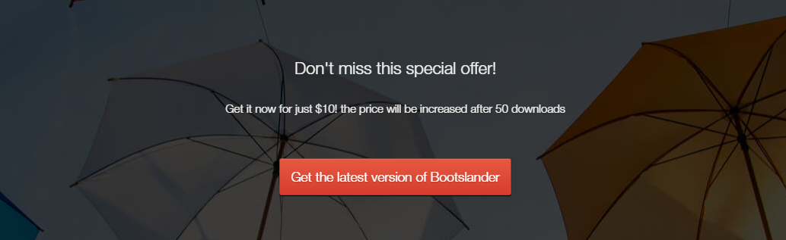

## Công thức chung
* Cần xác định rõ: đâu là image, đâu là text, đâu là button, để biết khi nào dùng hình, khi nào dùng text để sử dụng CSS cho đúng.
*  Thông thường image sẽ là hình chụp, hình design phức tạp,... trong các bài tập của hocwebchuan, image sẽ được thể hiện bằng nội dung có chữ "Học Web Chuẩn", hoặc số VD: "500x600".
* Một số bài tập có sử dụng font icon, hocwebchuan sẽ sử dụng bộ font của fontawesome cho thuận lợi việc code.
*  Nếu cấu trúc là một nhóm có nội dung cụ thể, ta dùng `<section>` bao ngoài.
* Nếu cấu trúc là tiêu đề thì dùng `<hx>`, khi code thực tế thì bạn cần sử dụng `<hx>` cho đúng thứ tự.
* Nếu cấu trúc là image thì dùng ``.
* Nếu cấu trúc là đoạn văn thì dùng `<p>`.
* Nếu cấu trúc là một danh sách thì dùng `<ul> <li>`.
* Nếu cấu trúc là một danh sách có thứ tự, thì dùng `<ol> <li>`.
* Nếu cấu trúc có chứa thông tin nhập liệu, thì ta dùng các thẻ `<form>`.
* Đối với các thành phần lớn gần nhau, theo các nhóm riêng biệt, ta dùng `<div>` để gom lại sẽ thuận lợi cho việc layout.
* Với mỗi thành bao ngoài như `<section>` hay `<div>` ta cần sử dụng id hoặc class để thuận lợi cho việc layout sau này.

## Bài tập 1: Thực hiện code HTML theo nội dung design dưới đây:

#### Hướng dẫn: Cấu trúc design không phức tạp:

* Xem công thức chung bên dưới.
*  Riêng bên trong <hx> có một đoạn nhấn mạnh "Shared Hosting", nên ta cần sử dụng thẻ <strong>
*  2 liên kết button có dạng danh sách, nên ta sử dụng thẻ `<ul> <li>`, nếu không quan trọng SEO chỗ này, thì có thể không cần cũng được.

### Bài giải chưa kèm css

```{html}
<!doctype html>
<html lang="en">
<head>
<meta charset="utf-8">
<title>Học web chuẩn</title>
</head>
<body>
  <section class="best-shared">
    <p class="logo"></p>
    <h2>Best <strong>Shared Hosting</strong> Company</h2>
    <p class="lead-text">With this responsive landing page template, you can promote your all hosting, domain and email services.</p>
    <ul class="btn-list">
      <li><a href="./">View Plans</a></li>
      <li><a href="./">All Features</a></li>
    </ul>
  </section>
</body>
</html>
```

### Bài giải kèm css
```{html}
<!doctype html>
<html lang="en">
<head>
<meta charset="utf-8">
<title>Học web chuẩn</title>
<style>
  /* Reset */
  * {
    margin: 0;
    padding: 0;
  }
  ul {
    list-style: none;
  }
  body {
    color: #333;
    font-family: Helvetica,sans-serif;
    font-size: 16px;
  }

  /* Layout */
  .best-shared {
    margin: 20px auto;
    text-align: center;
    width: 800px;
  }
  .logo {
    margin-bottom: 15px;
  }
  .best-shared h2 {
    font-size: 45px;
    font-weight: normal;
    margin-bottom: 25px;
  }
  .best-shared h2 strong {
    color: #00aeef;
    font-weight: 600;
  }
  .lead-text {
    margin-bottom: 40px;
  }
  .btn-list {
    text-align: center;
  }
  .btn-list li {
    display: inline;
    margin: 0 12px;
  }
  .btn-list li a {
    background-color: #2d3032;
    border-radius: 4px;
    color: #fff;
    display: inline-block;
    height: 56px;
    line-height: 56px;
    min-width: 170px;
    text-decoration: none;
    transition: 0.3s background-color;
  }
  .btn-list li a:hover {
    background-color: #00aeef;
  }
</style>
</head>

<body>
  <section class="best-shared">
    <p class="logo"></p>
    <h2>Best <strong>Shared Hosting</strong> Company</h2>
    <p class="lead-text">With this responsive landing page template, you can promote your all hosting, domain and email services.</p>
    <ul class="btn-list">
      <li><a href="./">View Plans</a></li>
      <li><a href="./">All Features</a></li>
    </ul>
  </section>
</body>
</html>
```

## Bài tập 2: Thực hiện code HTML theo nội dung design dưới đây:

### Hướng dẫn
Cấu trúc design không phức tạp, gồm `<hx>`, đoạn văn dùng `<p>`, và một liên kết `<a>` hoặc có thể dùng `<button>` nếu nó không phải là liên kết.
Do cấu trúc là một nhóm có nội dung cụ thể, do đó ta có thể dùng `<section>` bao ngoài.
Đối với background thì ta dùng CSS cho `<section>` là được.

### Giải (chưa bao gồm css)
```{html}
<!doctype html>
<html lang="en">
<head>
<meta charset="utf-8">
<title>Học web chuẩn</title>
</head>
<body>
  <section class="offer">
    <h2>Don't miss this special offer!</h2>
    <p>Get it now for just $10! the price will be increased after 50 downloads.</p>
    <p class="btn"><a href="./">Get the latest version of Bootslander</a></p>
  </section>
</body>
</html>
```
