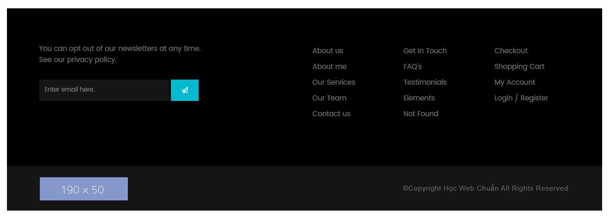

## Bài tập 11: Thực hiện code HTML theo nội dung design dưới đây:

#### Hướng dẫn: Cấu trúc design không phức tạp:

* Design này cũng không phức tạp, gồm tiêu đề và danh sách gồm 3 mục.
* Mỗi một mục của danh sách chứa font icon, Học Web Chuẩn sẽ tạm sử dụng icon của **fontawsome** cho tiện layout, còn khi code thực tế thì các bạn cần tìm đúng font icon của design, hoặc khó quá thì có thể cắt hình nhe.
* Còn lại trong mục là tiêu đề nhỏ và đoạn văn.
* Bài này quan trọng là cách xử lý **background-color**.
* Tách phần background màu xanh bên trên cho khu vực tiêu đề.
* Phần background bên dưới dùng cho phần `<section> `lớn bao ngoài.
* Xử lý position với top giá trị âm, hoặc `margin-top` giá trị âm để đưa danh sách tràn lên trên một đoạn.

### Bài giải chưa kèm css

```{html}
<!doctype html>
<html lang="en">
<head>
<meta charset="utf-8">
<title>Học web chuẩn</title>
<link rel="stylesheet" href="/exercises/css/fontawesome.css" media="all">
</head>
<body>
  <section class="service">
    <h2>Hello, we have bought together the best quality services, offers, projects for you!</h2>
    <ul class="service-list">
      <li>
        <p class="icon"><i class="fas fa-desktop"></i></p>
        <h3>Outstanding design</h3>
        <p class="text">Lorem ipsum dolor sit amet, consectetur adipiscing elit. Nulla sit amet suscipit est.</p>
      </li>

      <li>
        <p class="icon"><i class="fas fa-mobile-alt"></i></p>
        <h3>Responsive Layout</h3>
        <p class="text">Consectetur adipiscing elit. Nulla sit amet suscipit est. Nulla iaculis ipsum sit amet leo euismod maximus. </p>
      </li>

      <li>
        <p class="icon"><i class="fab fa-whmcs"></i></p>
        <h3>Easy to use</h3>
        <p class="text">Nulla iaculis ipsum sit amet leo euismod maximus. consectetur adipiscing elit. Nulla sit amet.</p>
      </li>
    </ul>
  </section>
</body>
</html>
```

### Bài giải kèm css
```{html}
<!doctype html>
<html lang="en">
<head>
<meta charset="utf-8">
<title>Học web chuẩn</title>
<link rel="stylesheet" href="/exercises/css/fontawesome.css" media="all">
<style>
  /* Reset */
  * {
    margin: 0;
    padding: 0;
  }
  ul {
    list-style: none;
  }
  body {
    color: #bababa;
    font-family: Helvetica,sans-serif;
    font-size: 16px;
    line-height: 1.6;
  }
  .clearfix {
    zoom: 1;
  }
  .clearfix:after {
    clear: both;
    content: ".";
    display: block;
    height: 0;
    line-height: 0;
    visibility: hidden;
  }

  /* Layout */
  .service {
    background-color: #f7f6f6;
  }
  .service .head-section {
    background-color: #01bacf;
    padding: 64px 0 91px;
  }
  .service .head-section h2 {
    color: #fff;
    font-size: 33px;
    line-height: 1.1;
    margin: 0 auto;
    width: 1150px;
  }
  .service .service-list {
    margin: 0 auto;
    padding-bottom: 40px;
    position: relative;
    top: -40px;
    width: 1150px;
  }
  .service .service-list li {
    background-color: #fff;
    float: left;
    margin-right: 30px;
    min-height: 220px;
    padding: 65px 30px 30px;
    width: 303px;
  }
  .service .service-list li:last-child {
    margin-right: 0;
  }
  .service .service-list li .icon {
    margin-bottom: 16px;
  }
  .service .service-list li .icon i {
    color: #c2d82e;
    font-size: 40px;
  }
  .service .service-list li h3 {
    color: #000;
    font-size: 19px;
    letter-spacing: 1px;
    margin-bottom: 20px;
  }
</style>
</head>
<body>
  <section class="service">
    <div class="head-section">
      <h2>Hello, we have bought together the best quality<br>
services, offers, projects for you!</h2>
    </div>
    <ul class="service-list clearfix">
      <li>
        <p class="icon"><i class="fas fa-desktop"></i></p>
        <h3>Outstanding design</h3>
        <p class="text">Lorem ipsum dolor sit amet, consectetur adipiscing elit. Nulla sit amet suscipit est.</p>
      </li>

      <li>
        <p class="icon"><i class="fas fa-mobile-alt"></i></p>
        <h3>Responsive Layout</h3>
        <p class="text">Consectetur adipiscing elit. Nulla sit amet suscipit est. Nulla iaculis ipsum sit amet leo euismod maximus. </p>
      </li>

      <li>
        <p class="icon"><i class="fab fa-whmcs"></i></p>
        <h3>Easy to use</h3>
        <p class="text">Nulla iaculis ipsum sit amet leo euismod maximus. consectetur adipiscing elit. Nulla sit amet.</p>
      </li>
    </ul>
  </section>
</body>
</html>
```
## Bài tập 12: Thực hiện code HTML theo nội dung design dưới đây:

### Hướng dẫn

Đây là cấu trúc chi tiết của một footer, tách biệt làm 2 phần:
* Bên trên được tách làm 2 phần riêng, phần bên trái là nội dung gửi mail, phần bên phải là 3 danh sách chứa liên kết.
* Bên dưới là logo và copyright.
* Bài tập này chủ yếu xử lý **background-color** và giao diện cho phần form gửi mail.
* **background-color** chia làm 2 phần, ta có thể sử lý **background-color** cho `<footer>`, và phần **background-color** còn lại cho thành phần lớn nào cũng được.
* Đối với phần form gửi mail, cách xử lý tương tự như các bài tập trước, các bạn có thể xem lại nhe.

### Giải (chưa bao gồm css)
```{html}
<!doctype html>
<html lang="en">
<head>
<meta charset="utf-8">
<title>Học web chuẩn</title>
<link rel="stylesheet" href="/exercises/css/fontawesome.css" media="all">
</head>
<body>
  <footer id="footer">
    <div class="inner">
      <div class="newsletter">
        <p>Lorem ipsum dolor sit amet, consectetur adipiscing elit.</p>
        <form method="" action="">
          <p><input type="email" name="email" placeholder="Enter email here." value=""><button type="submit"><i class="far fa-paper-plane"></i></button></p>
        </form>
      </div>

      <div class="link-list">
        <nav>
          <ul>
            <li><a href="./">About us</a></li>
            <li><a href="./">About me</a></li>
            <li><a href="./">Our Services</a></li>
            <li><a href="./">Our Team</a></li>
            <li><a href="./">Contact us</a></li>
          </ul>
        </nav>
      </div>

      <div class="link-list">
        <ul>
          <li><a href="./">Get In Touch</a></li>
          <li><a href="./">FAQ&#39;s</a></li>
          <li><a href="./">Testimonials</a></li>
          <li><a href="./">Elements</a></li>
          <li><a href="./">Not Found</a></li>
        </ul>
      </div>

      <div class="link-list">
        <ul>
          <li><a href="./">Checkout</a></li>
          <li><a href="./">Shopping Cart</a></li>
          <li><a href="./">My Account</a></li>
          <li><a href="./">Login</a> / <a href="./">Register</a></li>
        </ul>
      </div>
    <!-- .inner --></div>

    <div class="footer-end">
      <p class="logo"></p>
      <p class="copyright">&copy;Copyright Hoc Web Chuan All Right Reserved.</p>
    </div>
  </footer>
</body>
</html>
```
### Giải (bao gồm css)
```{html}
<!doctype html>
<html lang="en">
<head>
<meta charset="utf-8">
<title>Học web chuẩn</title>
<link rel="stylesheet" href="/exercises/css/fontawesome.css" media="all">
<style>
  /* Reset */
  * {
    margin: 0;
    padding: 0;
  }
  ul {
    list-style: none;
  }
  body {
    color: #000;
    font-family: Helvetica,sans-serif;
    font-size: 16px;
    line-height: 1.5;
  }
  .clearfix {
    zoom: 1;
  }
  .clearfix:after {
    clear: both;
    content: ".";
    display: block;
    height: 0;
    line-height: 0;
    visibility: hidden;
  }

  /* Layout */
  #footer {
    background-color: #000;
    color: #626262;
  }
  #footer .footer-end {
    background-color: #151515;
    padding: 24px 0 16px;
  }
  #footer .inner,
  #footer .copyright-section {
    margin: 0 auto;
    width: 1150px;
  }
  #footer .inner {
    padding: 76px 0 90px;
  }
  #footer .inner .newsletter {
    float: left;
    width: 350px;
  }
  #footer .inner .newsletter p {
    margin-bottom: 30px;
  }
  #footer input[type="email"] {
    background-color: #151515;
    border: 1px solid #151515;
    color: #626262;
    box-sizing: border-box;
    height: 46px;
    padding-left: 12px;
    width: 284px;
  }
  #footer button {
    background-color: #01bacf;
    border: 1px solid #01bacf;
    color: #fff;
    cursor: pointer;
    height: 44px;
    min-width: 60px;
    padding: 11px 10px;
    text-align: center;
    transition: 0.3s background-color;
  }
  #footer button:hover {
    background-color: #11dbf2;
  }
  #footer .inner .right-section {
    float: right;
    width: 560px;
  }
  #footer .inner .link-list {
    float: left;
    width: 186px;
    margin-right: 10px;
  }
  #footer .inner .link-list:last-child {
    width: 156px;
    margin-right: 0;
  }
  #footer .inner .link-list li {
    margin-bottom: 10px;
  }
  #footer .inner .link-list a {
    color: #626262;
    text-decoration: none;
    transition: 0.3s color;
  }
  #footer .inner .link-list a:hover {
    color: #ccc;
  }
  #footer .copyright-section .logo {
    float: left;
    width: 190px;
  }
  #footer .copyright-section .copyright {
    float: right;
    padding-top: 15px;
    text-align: right;
    width: 550px;
  }
</style>
</head>
<body>
  <footer id="footer">
    <div class="inner clearfix">
      <div class="newsletter">
        <p>Lorem ipsum dolor sit amet, consectetur adipiscing elit.</p>
        <form method="" action="">
          <p><input type="email" name="email" placeholder="Enter email here." value=""><button type="submit"><i class="far fa-paper-plane"></i></button></p>
        </form>
      </div>

      <div class="right-section">
        <div class="link-list">
          <nav>
            <ul>
              <li><a href="./">About us</a></li>
              <li><a href="./">About me</a></li>
              <li><a href="./">Our Services</a></li>
              <li><a href="./">Our Team</a></li>
              <li><a href="./">Contact us</a></li>
            </ul>
          </nav>
        </div>

        <div class="link-list">
          <ul>
            <li><a href="./">Get In Touch</a></li>
            <li><a href="./">FAQ&#39;s</a></li>
            <li><a href="./">Testimonials</a></li>
            <li><a href="./">Elements</a></li>
            <li><a href="./">Not Found</a></li>
          </ul>
        </div>

        <div class="link-list">
          <ul>
            <li><a href="./">Checkout</a></li>
            <li><a href="./">Shopping Cart</a></li>
            <li><a href="./">My Account</a></li>
            <li><a href="./">Login</a> / <a href="./">Register</a></li>
          </ul>
        </div>
      </div>
    <!-- .inner --></div>

    <div class="footer-end">
      <div class="copyright-section clearfix">
        <p class="logo"></p>
        <p class="copyright">&copy;Copyright Hoc Web Chuan All Right Reserved.</p>
      </div>
    </div>
  </footer>
</body>
</html>
```
