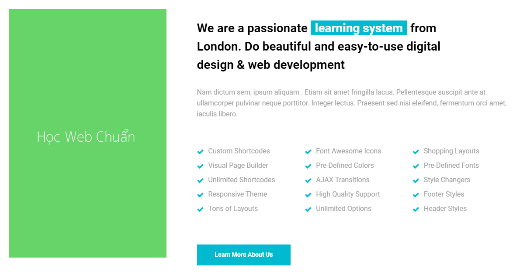
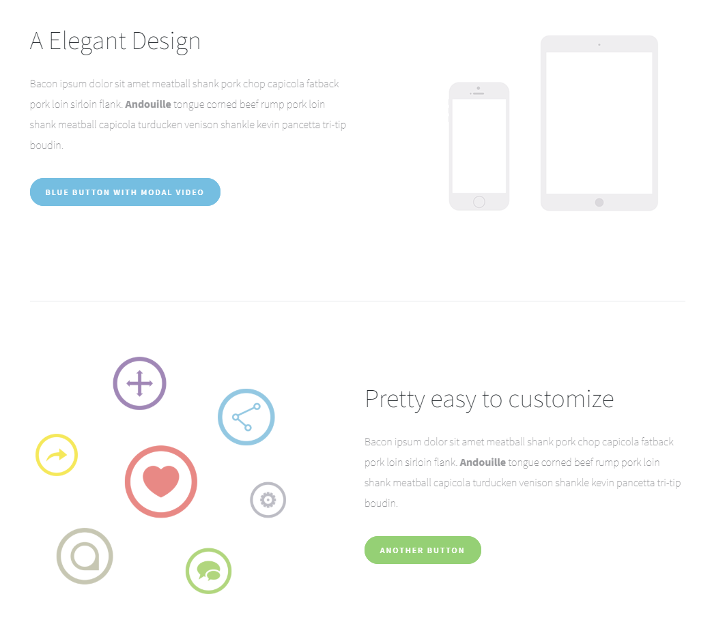

### Bài tập 13: Thực hiện code HTML theo nội dung design dưới đây:

##### Hướng dẫn: Cấu trúc design không phức tạp:
Nội dung desgin tách làm 2 phần:
* Bên trái là một image.
* Bên phải là một cấu trúc với nhiều chi tiết:
* Tiêu đề có chứa một đoạn nhấn "learning system", chỗ này sử dụng `<em>`.
* Tiếp theo là đoạn văn.
* Tiếp theo là một danh sách có sử dụng font icon.
* Phần cuối cùng là một liên kết chi tiết, do đó ta dùng `<a>` chứ không phải là `<button>`.

#### Bài giải chưa kèm css

```{html}
<!doctype html>
<html lang="en">
<head>
<meta charset="utf-8">
<title>Học tepa.edu</title>
<link rel="stylesheet" href="/exercises/css/fontawesome.css" media="all">
</head>
<body>
  <section class="learning">
    <div class="photo"></div>
    <div class="info">
      <h2>We are passionate <em>learning system</em> from London. Do beautiful and easy-to-use digital design &amp; web development</h2>
      <p class="lead-text">Nullam eu justo quis mi varius malesuada nec vitae magna. Pellentesque nec volutpat neque. Praesent a imperdiet sapien, non placerat purus. Donec et finibus ante. Morbi justo enim, semper pulvinar mollis et, accumsan sed dolor.</p>
      <ul class="learning-list">
        <li><i class="fas fa-check"></i> Custom Shortcodes</li>
        <li><i class="fas fa-check"></i> Font Awesome Icons</li>
        <li><i class="fas fa-check"></i> Shopping Layouts</li>
        <li><i class="fas fa-check"></i> Visual Page Builder</li>
        <li><i class="fas fa-check"></i> Pre-Defined Colors</li>
        <li><i class="fas fa-check"></i> Pre-Defined Fonts</li>
        <li><i class="fas fa-check"></i> Unlimited Shortcodes</li>
        <li><i class="fas fa-check"></i> AJAX Transitions</li>
        <li><i class="fas fa-check"></i> Style Changers</li>
        <li><i class="fas fa-check"></i> Responsive Theme</li>
        <li><i class="fas fa-check"></i> High Quality Support</li>
        <li><i class="fas fa-check"></i> Footer Styles</li>
        <li><i class="fas fa-check"></i> Tons of Layouts</li>
        <li><i class="fas fa-check"></i> Unlimited Options</li>
        <li><i class="fas fa-check"></i> Header Styles</li>
      </ul>
      <p class="more"><a href="./">Learn more about us</a></p>
    </div>
  </section>
</body>
</html>
```

#### Bài giải kèm css
```{html}
<!doctype html>
<html lang="en">
<head>
<meta charset="utf-8">
<title>Học tepa.edu</title>
<link rel="stylesheet" href="/exercises/css/fontawesome.css" media="all">
<style>
  /* Reset */
  * {
    margin: 0;
    padding: 0;
  }
  ul {
    list-style: none;
  }
  body {
    color: #a6a6a6;
    font-family: Helvetica,sans-serif;
    font-size: 16px;
    line-height: 1.6;
  }
  .clearfix {
    zoom: 1;
  }
  .clearfix:after {
    clear: both;
    content: ".";
    display: block;
    height: 0;
    line-height: 0;
    visibility: hidden;
  }

  /* Layout */
  .learning {
    margin: 30px auto;
    width: 1150px;
  }
  .learning .photo {
    float: left;
    width: 360px;
  }
  .learning .info {
    float: right;
    width: 720px;
  }
  .learning .info h2 {
    color: #000;
    font-size: 28px;
    line-height: 1.5;
    margin-bottom: 31px;
  }
  .learning .info h2 em {
    background-color: #01bacf;
    color: #fff;
    display: inline-block;
    font-style: normal;
    padding: 0 10px;
  }
  .learning .info .lead-text {
    margin-bottom: 50px;
  }
  .learning .info .learning-list {
    margin-bottom: 60px;
  }
  .learning .info .learning-list li {
    float: left;
    width: 230px;
    margin-bottom: 8px;
    margin-right: 10px;
  }
  .learning .info .learning-list li i {
    color: #01bacf;
    font-size: 14px;
    margin-right: 7px;
  }
  .learning .info .more a {
    background-color: #01bacf;
    color: #fff;
    display: inline-block;
    font-size: 14px;
    font-weight: bold;
    height: 48px;
    line-height: 48px;
    min-width: 194px;
    padding: 0 10px;
    text-align: center;
    text-decoration: none;
    transition: 0.3s background-color;
  }
  .learning .info .more a:hover {
    background-color: #05d4eb;
  }
</style>
</head>
<body>
  <section class="learning clearfix">
    <div class="photo"></div>
    <div class="info">
      <h2>We are passionate <em>learning system</em> from London. Do beautiful and easy-to-use digital design &amp; web development</h2>
      <p class="lead-text">Nullam eu justo quis mi varius malesuada nec vitae magna. Pellentesque nec volutpat neque. Praesent a imperdiet sapien, non placerat purus. Donec et finibus ante. Morbi justo enim, semper pulvinar mollis et, accumsan sed dolor.</p>
      <ul class="learning-list clearfix">
        <li><i class="fas fa-check"></i> Custom Shortcodes</li>
        <li><i class="fas fa-check"></i> Font Awesome Icons</li>
        <li><i class="fas fa-check"></i> Shopping Layouts</li>
        <li><i class="fas fa-check"></i> Visual Page Builder</li>
        <li><i class="fas fa-check"></i> Pre-Defined Colors</li>
        <li><i class="fas fa-check"></i> Pre-Defined Fonts</li>
        <li><i class="fas fa-check"></i> Unlimited Shortcodes</li>
        <li><i class="fas fa-check"></i> AJAX Transitions</li>
        <li><i class="fas fa-check"></i> Style Changers</li>
        <li><i class="fas fa-check"></i> Responsive Theme</li>
        <li><i class="fas fa-check"></i> High Quality Support</li>
        <li><i class="fas fa-check"></i> Footer Styles</li>
        <li><i class="fas fa-check"></i> Tons of Layouts</li>
        <li><i class="fas fa-check"></i> Unlimited Options</li>
        <li><i class="fas fa-check"></i> Header Styles</li>
      </ul>
      <p class="more"><a href="./">Learn more about us</a></p>
    </div>
  </section>
</body>
</html>
```
### Bài tập 14: Thực hiện code HTML theo nội dung design dưới đây:

#### Hướng dẫn

* Có nhiều cách layout nội dung này, có thể dùng cấu trúc list `<ul>` với mỗi một nhóm là một `<li>`, tuy nhiên, để thuận lợi cho việc layout chúng ta vẫn có thể dùng `<div>` vẫn được.
* **Chú ý** phần đặt tên class, đặt tên sao cho có thể thay đổi vị trí trái và phải vẫn không thay đổi ý nghĩa của nó.
* Layout này chú ý chỗ hình đôi khi bên phải, đôi khi bên trái, ta cần code sao cho khi thay đổi vị trí của hình thì không cần thay đổi css.
* Để code được như vậy, ta cần tách biệt phần `float` và phần chi tiết riêng ra, bằng cách sử dụng thêm `class`.
* Phần `border` bo góc cho liên kết `<a>`, ta sử dụng giá trị khoảng `30px` là được.

#### Giải (chưa bao gồm css)
```{html}
<!doctype html>
<html lang="en">
<head>
<meta charset="utf-8">
<title>Học tepa.edu</title>
<link rel="stylesheet" href="/exercises/css/fontawesome.css" media="all">
</head>
<body>
  <section class="feature">
    <div class="inner clearfix">
      <div class="detail">
        <h3>A Elegant Design</h3>
        <p class="text-info">Consectetur adipiscing elit. Nulla sit amet suscipit est. Nulla iaculis ipsum sit amet leo euismod maximus. <strong>Mauris</strong> in ultricies nulla. Quisque vitae ipsum quis odio efficitur tincidunt nec at lectus.</p>
        <p class="more"><a href="./">BLUE BUTTON WITH MODAL VIDEO</a></p>
      </div>
      <div class="photo"></div>
    </div>

    <div class="inner clearfix">
      <div class="photo"></div>
      <div class="detail">
        <h3>Pretty easy to customize</h3>
        <p class="text-info">Suspendisse potenti. Sed a cursus dolor. Vivamus metus nisi, ultrices vel porttitor sollicitudin, aliquam id tortor. Vestibulum justo libero, dapibus vitae nibh at, faucibus dignissim massa.</p>
        <p class="more"><a href="./">ANOTHER BUTTON</a></p>
      </div>
    </div>
  </section>
</body>
</html>
```
#### Giải (bao gồm css)
```{html}
<!doctype html>
<html lang="en">
<head>
<meta charset="utf-8">
<title>Học tepa.edu</title>
<link rel="stylesheet" href="/exercises/css/fontawesome.css" media="all">
<style>
  /* Reset */
  * {
    margin: 0;
    padding: 0;
  }
  ul {
    list-style: none;
  }
  body {
    color: #98999c;
    font-family: Helvetica,sans-serif;
    font-size: 16px;
    line-height: 1.8;
  }
  .clearfix {
    zoom: 1;
  }
  .clearfix:after {
    clear: both;
    content: ".";
    display: block;
    height: 0;
    line-height: 0;
    visibility: hidden;
  }

  /* Layout */
  .feature {
    margin: 30px auto;
    width: 960px;
  }
  .feature .inner {
    border-bottom: 1px solid #e7e9eb;
    padding: 84px 0 134px;
  }
  .feature .inner:last-child {
    border-bottom: none;
  }
  .feature .box-l {
    float: left;
  }
  .feature .box-r {
    float: right;
  }
  .feature .detail {
    width: 470px;
  }
  .feature .detail h3 {
    color: #21262a;
    font-size: 34px;
    font-weight: normal;
    margin-bottom: 17px;
  }
  .feature .detail .text-info {
    margin-bottom: 30px;
  }
  .feature .detail .more a {
    border-radius: 30px;
    color: #fff;
    display: inline-block;
    font-size: 11px;
    font-weight: 600;
    height: 41px;
    line-height: 41px;
    opacity: 1;
    padding: 0 23px;
    text-decoration: none;
    transition: 0.3s opacity;
  }
  .feature .detail .more a.blue {
    background-color: #75bee1;
  }
  .feature .detail .more a.green {
    background-color: #95d075;
  }
  .feature .detail .more a:hover {
    opacity: 0.8;
  }
  .feature .photo {
    width: 370px;
  }
</style>
</head>
<body>
  <section class="feature">
    <div class="inner clearfix">
      <div class="box-l detail">
        <h3>A Elegant Design</h3>
        <p class="text-info">Consectetur adipiscing elit. Nulla sit amet suscipit est. Nulla iaculis ipsum sit amet leo euismod maximus. <strong>Mauris</strong> in ultricies nulla. Quisque vitae ipsum quis odio efficitur tincidunt nec at lectus.</p>
        <p class="more"><a href="./" class="blue">BLUE BUTTON WITH MODAL VIDEO</a></p>
      </div>
      <div class="box-r photo"></div>
    </div>

    <div class="inner clearfix">
      <div class="box-l photo"></div>
      <div class="box-r detail">
        <h3>Pretty easy to customize</h3>
        <p class="text-info">Suspendisse potenti. Sed a cursus dolor. Vivamus metus nisi, ultrices vel porttitor sollicitudin, aliquam id tortor. Vestibulum justo libero, dapibus vitae nibh at, faucibus dignissim massa.</p>
        <p class="more"><a href="./" class="green">ANOTHER BUTTON</a></p>
      </div>
    </div>
  </section>
</body>
</html>
```
