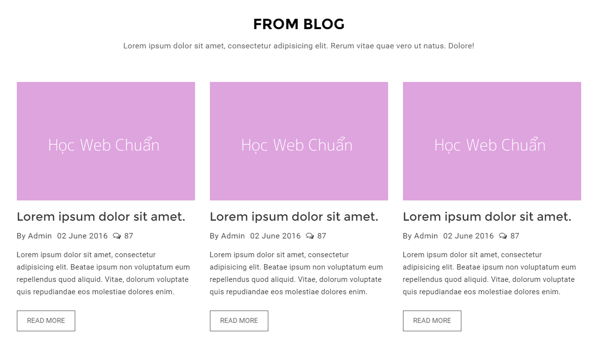
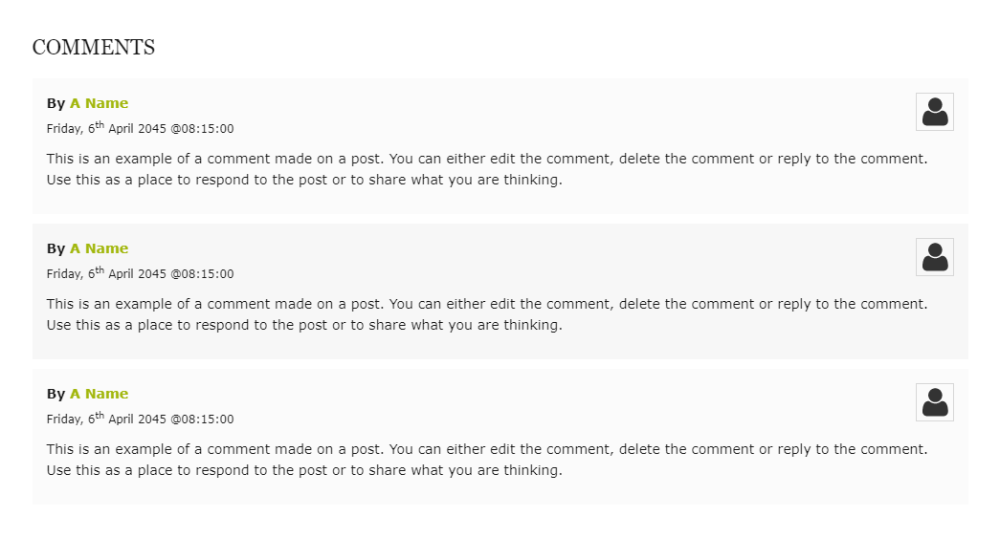

### Bài tập 15: Thực hiện code HTML theo nội dung design dưới đây:

##### Hướng dẫn: Cấu trúc design không phức tạp:
* Nội dung này tương tự như bài tập đã được giới thiệu trước [đây](exercises_1_2.md), bạn xem lại nhe.
* Chú ý ở phần thông tin bài post: "Admin", "02 June 2016" và "87" đây là dạng danh sách, tuy nhiên nếu không cần cho SEO thì bạn có thể dụng <div> thay thế cho danh sách vẫn được.

#### Bài giải chưa kèm css

```{html}
<!doctype html>
<html lang="en">
<head>
<meta charset="utf-8">
<title>Học tepa.edu</title>
<link rel="stylesheet" href="/exercises/css/fontawesome.css" media="all">
</head>
<body>
  <section class="blog">
    <h2>FROM BLOG</h2>
    <p class="lead-text">Lorem ipsum dolor sit amet, consectetur adipiscing elit. Nulla sit amet suscipit est.</p>
    <ul class="blog-list">
      <li>
        <p class="photo"></p>
        <h3>Nulla iaculis ipsum sit amet adipiscing.</h3>
        <ul class="post-detail">
          <li>By Admin</li>
          <li>02 June 2016</li>
          <li><i class="far fa-comments"></i> 87</li>
        </ul>
        <p class="text">Vestibulum justo libero, dapibus vitae nibh at, faucibus dignissim massa. Curabitur quis urna scelerisque, dignissim turpis nec, volutpat risus.</p>
        <p class="more"><a href="./">READ MORE</a></p>
      </li>

      <li>
        <p class="photo"></p>
        <h3>Etiam eu odio quis felis pretium.</h3>
        <ul class="post-detail">
          <li>By Admin</li>
          <li>02 June 2016</li>
          <li><i class="far fa-comments"></i> 87</li>
        </ul>
        <p class="text">Mauris nec dictum ipsum. Proin massa orci, laoreet non scelerisque in, tempor quis nunc. Maecenas lacus arcu, posuere et congue sed.</p>
        <p class="more"><a href="./">READ MORE</a></p>
      </li>

      <li>
        <p class="photo"></p>
        <h3>Sed a cursus dolor vivamus metus.</h3>
        <ul class="post-detail">
          <li>By Admin</li>
          <li>02 June 2016</li>
          <li><i class="far fa-comments"></i> 87</li>
        </ul>
        <p class="text">Etiam ac pharetra leo. Ut vel diam sagittis, vestibulum neque et, efficitur nisi. Lorem ipsum dolor sit amet, consectetur adipiscing elit. Lorem ipsum dolor sit amet, consectetur adipiscing elit.</p>
        <p class="more"><a href="./">READ MORE</a></p>
      </li>
    </ul>
  </section>
</body>
</html>
```

#### Bài giải kèm css
```{html}
<!doctype html>
<html lang="en">
<head>
<meta charset="utf-8">
<title>Học tepa.edu</title>
<link rel="stylesheet" href="/exercises/css/fontawesome.css" media="all">
<style>
  /* Reset */
  * {
    margin: 0;
    padding: 0;
  }
  ul {
    list-style: none;
  }
  body {
    color: #333;
    font-family: Helvetica,sans-serif;
    font-size: 15px;
    line-height: 1.8;
  }
  .clearfix {
    zoom: 1;
  }
  .clearfix:after {
    clear: both;
    content: ".";
    display: block;
    height: 0;
    line-height: 0;
    visibility: hidden;
  }

  /* Layout */
  .blog {
    margin: 30px auto;
    width: 1140px;
  }
  .blog h2 {
    color: #000;
    font-size: 29px;
    margin-bottom: 5px;
    text-align: center;
  }
  .blog .lead-text {
    margin-bottom: 57px;
    text-align: center;
  }
  .blog .blog-list > li {
    background-color: #fff;
    float: left;
    margin-right: 30px;
    min-height: 420px;
    width: 360px;
  }
  .blog .blog-list > li:nth-child(3n) {
    margin-right: 0;
  }
  .blog .blog-list > li h3 {
    color: #1f1f1f;
    font-size: 24px;
    margin-bottom: 3px;
  }
  .blog .blog-list .photo,
  .blog .blog-list h3 {
    margin-bottom: 2px;
  }
  .blog .blog-list .post-detail {
    margin-bottom: 12px;
  }
  .blog .blog-list .post-detail li {
    display: inline;
    margin-right: 7px;
  }
  .blog .blog-list .info-text {
    margin-bottom: 24px;
  }
  .blog .blog-list .more a {
    border: 1px solid #555;
    color: #555;
    display: inline-block;
    font-size: 14px;
    height: 42px;
    line-height: 42px;
    min-width: 118px;
    text-align: center;
    text-decoration: none;
    transition: 0.3s all;
  }
  .blog .blog-list .more a:hover {
    background-color: #555;
    color: #fff;
  }
</style>
</head>
<body>
  <section class="blog">
    <h2>FROM BLOG</h2>
    <p class="lead-text">Lorem ipsum dolor sit amet, consectetur adipiscing elit vitae nibh at. Nulla sit amet suscipit est.</p>
    <ul class="blog-list">
      <li>
        <p class="photo"></p>
        <h3>Nulla iaculis ipsum sit amet.</h3>
        <ul class="post-detail">
          <li>By Admin</li>
          <li>02 June 2016</li>
          <li><i class="far fa-comments"></i> 87</li>
        </ul>
        <p class="info-text">Vestibulum justo libero, dapibus vitae nibh at, faucibus dignissim massa. Curabitur quis urna scelerisque, dignissim turpis nec, volutpat risus.</p>
        <p class="more"><a href="./">READ MORE</a></p>
      </li>

      <li>
        <p class="photo"></p>
        <h3>Etiam eu odio quis felis.</h3>
        <ul class="post-detail">
          <li>By Admin</li>
          <li>02 June 2016</li>
          <li><i class="far fa-comments"></i> 87</li>
        </ul>
        <p class="info-text">Mauris nec dictum ipsum. Proin massa orci, laoreet non scelerisque in, tempor quis nunc. Maecenas lacus arcu, posuere et congue sed.</p>
        <p class="more"><a href="./">READ MORE</a></p>
      </li>

      <li>
        <p class="photo"></p>
        <h3>Sed a cursus dolor vivamus.</h3>
        <ul class="post-detail">
          <li>By Admin</li>
          <li>02 June 2016</li>
          <li><i class="far fa-comments"></i> 87</li>
        </ul>
        <p class="info-text">Etiam ac pharetra leo. Ut vel diam sagittis, vestibulum neque et, efficitur nisi. Lorem ipsum dolor sit amet, consectetur adipiscing elit. Lorem ipsum dolor sit amet, consectetur adipiscing elit.</p>
        <p class="more"><a href="./">READ MORE</a></p>
      </li>
    </ul>
  </section>
</body>
</html>
```
### Bài tập 16: Thực hiện code HTML theo nội dung design dưới đây:

#### Hướng dẫn

* Nội dung design lặp lại giống nhau, gồm một tiêu đề và một danh sách.
* Bên trong danh sách gồm 4 nội dung, do đây là nội dung comment, nên cũng không quan trọng về SEO lắm, nên chúng ta có thể sử dụng `<div> `hoặc `<p>` cho mỗi nội dung nhỏ.
Design có 2 phần cần chú ý.
* Màu nền xen kẻ đậm nhạt giữa các mục, ta sử dụng bộ chọn `:nth-child()` để lọc vị trí mục chẵn lẻ.
* Vị trí của avatar, có thể sử dụng `float` hoặc `position` đều được, tuy nhiên phần này sử dụng `position` thì hiệu qua tốt hơn (kiểm soát vỡ **layout** tốt hơn `float`).
* Chú ý phần ngày "6th", ở đây Học tepa.edu không làm cho chữ "th" lên cao, vì làm thì dễ nhưng khi đổ dữ liệu động sẽ gây khó khăn cho các bạn programmer, nếu muốn làm cho giống design, các bạn chỉ cần gắn thẻ `<sup>` là được, hoặc điều khiển bằng css.

#### Giải (chưa bao gồm css)
```{html}
<!doctype html>
<html lang="en">
<head>
<meta charset="utf-8">
<title>Học tepa.edu</title>
<link rel="stylesheet" href="/exercises/css/fontawesome.css" media="all">
</head>
<body>
  <section class="comment">
    <h2>COMMENTS</h2>
    <ul class="comment-list">
      <li>
        <div class="head-commnent">
          <p class="name">By <em>A Name</em></p>
          <p class="time">Friday, 6th April 2015 @08:15:00</p>
          <p class="avatar"><i class="fas fa-user-alt"></i></p>
        </div>
        <p class="content">Vestibulum justo libero, dapibus vitae nibh at, faucibus dignissim massa. Curabitur quis urna scelerisque, dignissim turpis nec, volutpat risus.</p>
      </li>

      <li>
        <div class="head-commnent">
          <p class="name">By <em>A Name</em></p>
          <p class="time">Friday, 6th April 2015 @08:15:00</p>
          <p class="avatar"><i class="fas fa-user-alt"></i></p>
        </div>
        <p class="content">Mauris nec dictum ipsum. Proin massa orci, laoreet non scelerisque in, tempor quis nunc. Maecenas lacus arcu, posuere et congue sed, volutpat posuere orci.</p>
      </li>

      <li>
        <div class="head-commnent">
          <p class="name">By <em>A Name</em></p>
          <p class="time">Friday, 6th April 2015 @08:15:00</p>
          <p class="avatar"><i class="fas fa-user-alt"></i></p>
        </div>
        <p class="content">Etiam ac pharetra leo. Ut vel diam sagittis, vestibulum neque et, efficitur nisi. Lorem ipsum dolor sit amet, consectetur adipiscing elit.</p>
      </li>
    </ul>
  </section>
</body>
</html>
```
#### Giải (bao gồm css)
```{html}
<!doctype html>
<html lang="en">
<head>
<meta charset="utf-8">
<title>Học tepa.edu</title>
<link rel="stylesheet" href="/exercises/css/fontawesome.css" media="all">
<style>
  /* Reset */
  * {
    margin: 0;
    padding: 0;
  }
  ul {
    list-style: none;
  }
  body {
    color: #191919;
    font-family: Helvetica,sans-serif;
    font-size: 15px;
    line-height: 1.5;
  }
  .clearfix {
    zoom: 1;
  }
  .clearfix:after {
    clear: both;
    content: ".";
    display: block;
    height: 0;
    line-height: 0;
    visibility: hidden;
  }

  /* Layout */
  .comment {
    margin: 30px auto;
    width: 978px;
  }
  .comment h2 {
    font-size: 22px;
    font-weight: normal;
    margin-bottom: 14px;
  }
  .comment .comment-list li {
    background-color: #fbfbfb;
    margin-bottom: 10px;
    padding: 15px 15px 18px;
  }
  .comment .comment-list li:nth-child(2n) {
    background-color: #f7f7f7;
  }
  .comment .head-commnent {
    position: relative;
  }
  .comment .head-commnent .avatar {
    border: 1px solid #d7d7d7;
    font-size: 30px;
    height: 38px;
    padding-top: 0;
    position: absolute;
    right: 0;
    text-align: center;
    top: 0;
    width: 38px;
  }
  .comment .head-commnent .name {
    font-weight: 600;
    margin-bottom: 8px;
  }
  .comment .head-commnent .name em {
    color: #a2b70d;
    font-style: normal;
  }
  .comment .head-commnent .time {
    font-size: 13px;
    margin-bottom: 10px;
  }
</style>
</head>
<body>
  <section class="comment">
    <h2>COMMENTS</h2>
    <ul class="comment-list">
      <li>
        <div class="head-commnent">
          <p class="name">By <em>A Name</em></p>
          <p class="time">Friday, 6th April 2015 @08:15:00</p>
          <p class="avatar"><i class="fas fa-user-alt"></i></p>
        </div>
        <p class="content">Vestibulum justo libero, dapibus vitae nibh at, faucibus dignissim massa. Curabitur quis urna scelerisque, dignissim turpis nec, volutpat risus.</p>
      </li>

      <li>
        <div class="head-commnent">
          <p class="name">By <em>A Name</em></p>
          <p class="time">Friday, 6th April 2015 @08:15:00</p>
          <p class="avatar"><i class="fas fa-user-alt"></i></p>
        </div>
        <p class="content">Mauris nec dictum ipsum. Proin massa orci, laoreet non scelerisque in, tempor quis nunc. Maecenas lacus arcu, posuere et congue sed, volutpat posuere orci.</p>
      </li>

      <li>
        <div class="head-commnent">
          <p class="name">By <em>A Name</em></p>
          <p class="time">Friday, 6th April 2015 @08:15:00</p>
          <p class="avatar"><i class="fas fa-user-alt"></i></p>
        </div>
        <p class="content">Etiam ac pharetra leo. Ut vel diam sagittis, vestibulum neque et, efficitur nisi. Lorem ipsum dolor sit amet, consectetur adipiscing elit.</p>
      </li>
    </ul>
  </section>
</body>
</html>
```
