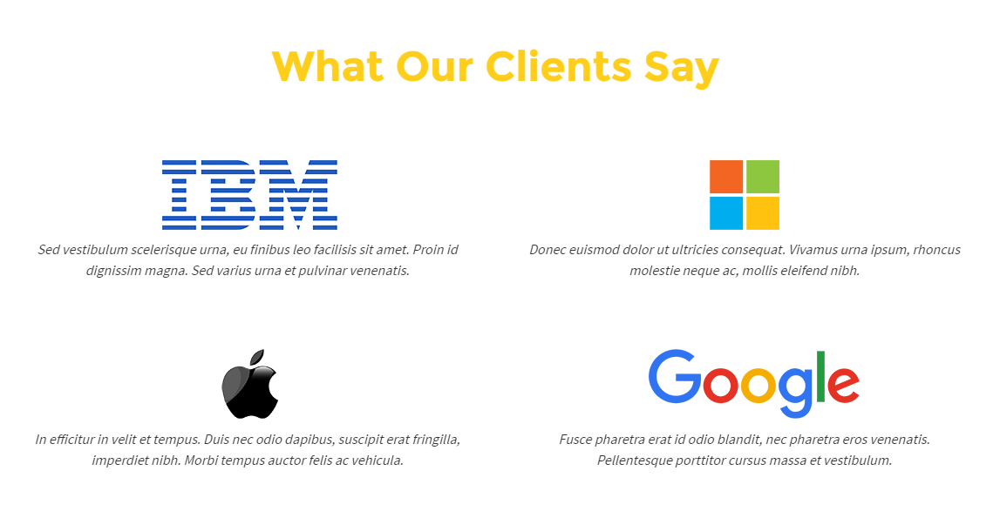

## Bài tập 13: Thực hiện code HTML theo nội dung design dưới đây:

#### Hướng dẫn: Cấu trúc design không phức tạp:
* Design là dạng danh sách, với mỗi mục là một nhóm gồm image và text.
* Nội dung có thể thêm hoặc bớt, chú ý code sao cho có thêm hoặc bớt cũng không làm ảnh hưởng cấu trúc layout.
* Giao diện này không khó thực hiện nhe, quan trọng là canh chiều rộng phù hợp thôi, cẩn thận khi text nhiều sẽ vỡ layout.

### Bài giải chưa kèm css

```{html}
<!doctype html>
<html lang="en">
<head>
<meta charset="utf-8">
<title>Học web chuẩn</title>
</head>
<body>
  <section class="client">
    <h2>What Our Clients Say</h2>
    <ul class="client-list">
      <li>
        <p class="logo"></p>
        <p class="info-text">Vestibulum justo libero, dapibus vitae nibh at, faucibus dignissim massa. Curabitur quis, dignissim turpis nec, volutpat risus.</p>
      </li>

      <li>
        <p class="logo"></p>
        <p class="info-text">Consectetur adipiscing elit. Nulla sit amet suscipit est. Nulla iaculis ipsum sit. Donec malesuada posuere mi.</p>
      </li>

      <li>
        <p class="logo"></p>
        <p class="info-text">Mauris nec dictum ipsum. Proin massa orci, laoreet non, tempor quis nunc. Maecenas lacus arcu, posuere et congue sed.</p>
      </li>

      <li>
        <p class="logo"></p>
        <p class="info-text">Vivamus metus nisi, ultrices vel porttitor sollicitudin, aliquam id tortor. Vestibulum justo libero, dapibus vitae nibh at.</p>
      </li>
    </ul>
  </section>
</body>
</html>
```

### Bài giải kèm css
```{html}
<!doctype html>
<html lang="en">
<head>
<meta charset="utf-8">
<title>Học web chuẩn</title>
<style>
  /* Reset */
  * {
    margin: 0;
    padding: 0;
  }
  ul {
    list-style: none;
  }
  body {
    color: #333;
    font-family: Helvetica,sans-serif;
    font-size: 15px;
    line-height: 1.6;
  }
  .clearfix {
    zoom: 1;
  }
  .clearfix:after {
    clear: both;
    content: ".";
    display: block;
    height: 0;
    line-height: 0;
    visibility: hidden;
  }

  /* Layout */
  .client {
    margin: 30px auto;
    width: 1140px;
  }
  .client h2 {
    color: #ffce1b;
    font-size: 45px;
    margin-bottom: 31px;
    text-align: center;
  }
  .client .client-list li {
    float: left;
    padding: 40px;
    text-align: center;
    width: 490px;
  }
  .client .client-list li:nth-child(3n) {
  /* Xóa float cho thành phần thứ 3, 6, 9 ... */
    clear: left;
  }
  .client .client-list li .logo {
    margin-bottom: 4px;
  }
  .client .client-list li .info-text {
    font-style: italic;
  }
</style>
</head>
<body>
  <section class="client">
    <h2>What Our Clients Say</h2>
    <ul class="client-list">
      <li>
        <p class="logo"></p>
        <p class="info-text">Vestibulum justo libero, dapibus vitae nibh at, faucibus dignissim massa. Curabitur quis, dignissim turpis nec, volutpat risus.</p>
      </li>

      <li>
        <p class="logo"></p>
        <p class="info-text">Consectetur adipiscing elit. Nulla sit amet suscipit est. Nulla iaculis ipsum sit. Donec malesuada posuere mi.</p>
      </li>

      <li>
        <p class="logo"></p>
        <p class="info-text">Mauris nec dictum ipsum. Proin massa orci, laoreet non, tempor quis nunc. Maecenas lacus arcu, posuere et congue sed.</p>
      </li>

      <li>
        <p class="logo"></p>
        <p class="info-text">Vivamus metus nisi, ultrices vel porttitor sollicitudin, aliquam id tortor. Vestibulum justo libero, dapibus vitae nibh at.</p>
      </li>
    </ul>
  </section>
</body>
</html>
```
## Bài tập 18: Thực hiện code HTML theo nội dung design dưới đây:

### Hướng dẫn

* Design là dạng danh sách, với mỗi mục là một nhóm gồm image bên trái và nhóm nội dung bên phải.
* Nội dung có thể thêm hoặc bớt, code sao cho có thêm hoặc bớt cũng không làm ảnh hưởng cấu trúc layout.
* Bài tập này giúp các bạn thực hành lại kiến thức từ các bài tập trước, mở rộng hơn ở việc xử lý tạo hình tròn cho image, cần sử dụng border-radius: 50%.

### Giải (chưa bao gồm css)
```{html}
<!doctype html>
<html lang="en">
<head>
<meta charset="utf-8">
<title>Học web chuẩn</title>
</head>
<body>
  <section class="client">
    <h2>WHAT OUR CLIENTS SAY</h2>
    <ul class="client-list">
      <li>
        <p class="avatar"></p>
        <div class="message">
          <p class="detail">&quot;Vestibulum justo libero, dapibus vitae nibh at, faucibus dignissim massa. Curabitur quis urna scelerisque, dignissim turpis nec, volutpat risus.&quot;</p>
          <p class="name">John Doe</p>
        </div>
      </li>

      <li>
        <p class="avatar"></p>
        <div class="message">
          <p class="detail">&quot;Consectetur adipiscing elit. Nulla sit amet suscipit est. Nulla iaculis ipsum sit amet leo euismod maximus. Donec malesuada posuere mi.&quot;</p>
          <p class="name">Johnathan Doe</p>
        </div>
      </li>

      <li>
        <p class="avatar"></p>
        <div class="message">
          <p class="detail">&quot;Mauris nec dictum ipsum. Proin massa orci, laoreet non scelerisque in, tempor quis nunc. Maecenas lacus arcu, posuere et congue sed, volutpat posuere orci.&quot;</p>
          <p class="name">Doe Brother</p>
        </div>
      </li>

      <li>
        <p class="avatar"></p>
        <div class="message">
          <p class="detail">&quot;Vivamus metus nisi, ultrices vel porttitor sollicitudin, aliquam id tempor quis nunc tortor. Vestibulum justo libero, dapibus vitae nibh at, faucibus dignissim massa.&quot;</p>
          <p class="name">John Sister</p>
        </div>
      </li>

      <li>
        <p class="avatar"></p>
        <div class="message">
          <p class="detail">&quot;Etiam ac pharetra leo. Ut vehicula tortor vel diam sagittis, vestibulum neque et, efficitur nisi. Lorem ipsum dolor sit amet, consectetur adipiscing elit.&quot;</p>
          <p class="name">Jonh Uncle</p>
        </div>
      </li>

      <li>
        <p class="avatar"></p>
        <div class="message">
          <p class="detail">&quot;Nunc condimentum risus ut sapien eleifend semper. Fusce vehicula tortor sit amet lorem posuere finibus. a dapibus sapien.&quot;</p>
          <p class="name">Doe Mother</p>
        </div>
      </li>
    </ul>
  </section>
</body>
</html>
```
### Giải (bao gồm css)
```{html}
<!doctype html>
<html lang="en">
<head>
<meta charset="utf-8">
<title>Học web chuẩn</title>
<style>
  /* Reset */
  * {
    margin: 0;
    padding: 0;
  }
  ul {
    list-style: none;
  }
  body {
    color: #000;
    font-family: Helvetica,sans-serif;
    font-size: 15px;
    line-height: 1.5;
  }
  .clearfix {
    zoom: 1;
  }
  .clearfix:after {
    clear: both;
    content: ".";
    display: block;
    height: 0;
    line-height: 0;
    visibility: hidden;
  }

  /* Layout */
  .client {
    background-color: #f6f6f6;
    margin: 30px auto;
    padding: 40px;
    width: 1110px;
  }
  .client h2 {
    color: #333;
    font-size: 34px;
    margin-bottom: 99px;
    position: relative;
    text-align: center;
  }
  /* Line cho h2 */
  .client h2:after {
    background-color: #627afe;
    bottom: -5px;
    content: "";
    display: block;
    left: 47%;
    height: 4px;
    width: 60px;
    position: absolute;
  }
  .client .client-list li {
    color: #7c7c7c;
    float: left;
    line-height: 1.35;
    margin-bottom: 40px;
    margin-right: 60px;
    position: relative;
    width: 330px;
  }
  .client .client-list li:nth-child(3n) {
    margin-right: 0;
  }
  .client .client-list li .avatar {
    position: absolute;
    left: 0;
    top: 0;
  }
  .client .client-list li .avatar img {
    border-radius: 50%;
    height: 66px;
    width: 66px;
  }
  .client .client-list li .message {
    padding-left: 80px;
  }
  .client .client-list li .message .detail {
    font-style: italic;
    margin-bottom: 10px;
  }
  .client .client-list li .message .name {
    font-weight: 600;
  }
</style>
</head>
<body>
  <section class="client">
    <h2>WHAT OUR CLIENTS SAY</h2>
    <ul class="client-list clearfix">
      <li>
        <p class="avatar"></p>
        <div class="message">
          <p class="detail">&quot;Vestibulum justo libero, dapibus vitae nibh at, faucibus dignissim massa. Curabitur quis urna scelerisque, dignissim turpis nec, volutpat risus.&quot;</p>
          <p class="name">John Doe</p>
        </div>
      </li>

      <li>
        <p class="avatar"></p>
        <div class="message">
          <p class="detail">&quot;Consectetur adipiscing elit. Nulla sit amet suscipit est. Nulla iaculis ipsum sit amet leo euismod maximus. Donec malesuada posuere mi.&quot;</p>
          <p class="name">Johnathan Doe</p>
        </div>
      </li>

      <li>
        <p class="avatar"></p>
        <div class="message">
          <p class="detail">&quot;Mauris nec dictum ipsum. Proin massa orci, laoreet non scelerisque in, tempor quis nunc. Maecenas lacus arcu, posuere et congue sed, volutpat posuere orci.&quot;</p>
          <p class="name">Doe Brother</p>
        </div>
      </li>

      <li>
        <p class="avatar"></p>
        <div class="message">
          <p class="detail">&quot;Vivamus metus nisi, ultrices vel porttitor sollicitudin, aliquam id tempor quis nunc tortor. Vestibulum justo libero, dapibus vitae nibh at, faucibus dignissim massa.&quot;</p>
          <p class="name">John Sister</p>
        </div>
      </li>

      <li>
        <p class="avatar"></p>
        <div class="message">
          <p class="detail">&quot;Etiam ac pharetra leo. Ut vehicula tortor vel diam sagittis, vestibulum neque et, efficitur nisi. Lorem ipsum dolor sit amet, consectetur adipiscing elit.&quot;</p>
          <p class="name">Jonh Uncle</p>
        </div>
      </li>

      <li>
        <p class="avatar"></p>
        <div class="message">
          <p class="detail">&quot;Nunc condimentum risus ut sapien eleifend semper. Fusce vehicula tortor sit amet lorem posuere finibus. a dapibus sapien.&quot;</p>
          <p class="name">Doe Mother</p>
        </div>
      </li>
    </ul>
  </section>
</body>
</html>
```
