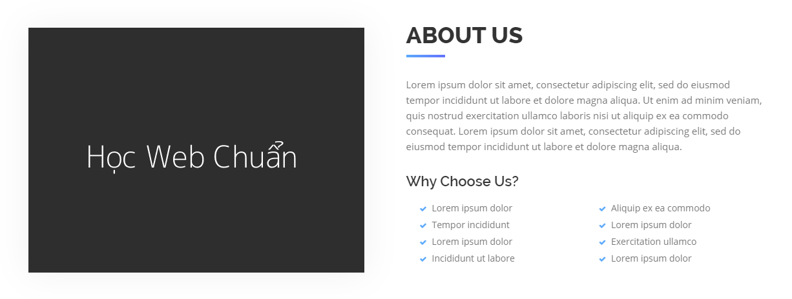

### Bài tập 3: Thực hiện code HTML theo nội dung design dưới đây:

##### Hướng dẫn: Cấu trúc design không phức tạp:

* Một image bên trái.
* Một nhóm nội dung bên phải gồm:
  * `<hx>`.
  * Đoạn văn.
  * `<hx>` nhỏ.
  * Một danh sách.
* Design này cần quan tâm line cho `h2`, nếu chưa biết cách làm, bạn có thể dụng `background-image` tạm.
* Phần lớn là kỹ thuật **float** với xử lý khoảng cách phù hợp.

#### Bài giải chưa kèm css

```{html}
<!doctype html>
<html lang="en">
<head>
<meta charset="utf-8">
<title>Học web chuẩn</title>
<link rel="stylesheet" href="/exercises/css/fontawesome.css" media="all">
</head>
<body>
  <section class="about-us">
    <div class="image">
      
    </div>
    <div class="detail">
      <h2>ABOUT US</h2>
      <p>Lorem ipsum dolor sit amet, consectetur adipiscing elit. Nam sed ipsum erat. Donec feugiat ipsum ac risus auctor dignissim. Phasellus ante dolor, molestie vitae malesuada id, posuere non est. Phasellus vulputate pharetra tempor. Aliquam in tortor in arcu iaculis malesuada.</p>
      <section>
        <h3>Why Choose Us?</h3>
        <ul class="choose-list">
          <li><i class="fas fa-check"></i> Lorem ipsum dolor</li>
          <li><i class="fas fa-check"></i> Nam sed ipsum erat</li>
          <li><i class="fas fa-check"></i> Consectetur adipiscing</li>
          <li><i class="fas fa-check"></i> Donec feugiat ipsum ac</li>
          <li><i class="fas fa-check"></i> Phasellus vulputate</li>
          <li><i class="fas fa-check"></i> Risus auctor dignissim</li>
          <li><i class="fas fa-check"></i> liquam in tortor in</li>
          <li><i class="fas fa-check"></i> Molestie vitae malesuada</li>
        </ul>
      </section>
    </div>
  </section>
</body>
</html>
```

#### Bài giải kèm css
```{html}
<!doctype html>
<html lang="en">
<head>
<meta charset="utf-8">
<title>Học web chuẩn</title>
<link rel="stylesheet" href="/exercises/css/fontawesome.css" media="all">
<style>
  /* Reset */
  * {
    margin: 0;
    padding: 0;
  }
  ul {
    list-style: none;
  }
  body {
    color: #666;
    font-family: Helvetica,sans-serif;
    font-size: 15px;
    line-height: 1.6;
  }
  .clearfix {
    zoom: 1;
  }
  .clearfix:after {
    clear: both;
    content: ".";
    display: block;
    height: 0;
    line-height: 0;
    visibility: hidden;
  }

  /* Layout */
  .about-us {
    margin: 30px auto;
    width: 1140px;
  }
  .about-us .image {
    float: left;
    width: 520px;
  }
  .about-us .detail {
    float: right;
    width: 560px;
  }
  .about-us .detail h2 {
    color: #333;
    font-size: 36px;
    margin-bottom: 42px;
    position: relative;
  }
  /* Line cho h2 */
  .about-us .detail h2:after {
    background-color: #516cfe;
    bottom: -6px;
    content: "";
    display: block;
    left: 0;
    height: 3px;
    width: 60px;
    position: absolute;
  }
  .about-us .detail .info-text {
    margin-bottom: 22px;
  }
  .about-us .detail h3 {
    color: #333;
    font-size: 22px;
  }
  .about-us .detail .choose-list {
    padding: 14px 0 0 20px;
  }
  .about-us .detail .choose-list li {
    float: left;
    width: 50%;
  }
  .about-us .detail .choose-list li i {
    color: #4fa2fb;
    font-size: 10px;
    padding-right: 5px;
  }
</style>
</head>
<body>
  <section class="about-us clearfix">
    <div class="image">
      
    </div>
    <div class="detail">
      <h2>ABOUT US</h2>
      <p class="info-text">Lorem ipsum dolor sit amet, consectetur adipiscing elit. Nam sed ipsum erat. Donec feugiat ipsum ac risus auctor dignissim. Phasellus ante dolor, molestie vitae malesuada id, posuere non est. Phasellus vulputate pharetra tempor. Aliquam in tortor in arcu iaculis malesuada.</p>
      <section>
        <h3>Why Choose Us?</h3>
        <ul class="choose-list">
          <li><i class="fas fa-check"></i> Lorem ipsum dolor</li>
          <li><i class="fas fa-check"></i> Nam sed ipsum erat</li>
          <li><i class="fas fa-check"></i> Consectetur adipiscing</li>
          <li><i class="fas fa-check"></i> Donec feugiat ipsum ac</li>
          <li><i class="fas fa-check"></i> Phasellus vulputate</li>
          <li><i class="fas fa-check"></i> Risus auctor dignissim</li>
          <li><i class="fas fa-check"></i> liquam in tortor in</li>
          <li><i class="fas fa-check"></i> Molestie vitae malesuada</li>
        </ul>
      </section>
    </div>
  </section>
</body>
</html>
```
### Bài tập 4: Thực hiện code HTML theo nội dung design dưới đây:

#### Hướng dẫn

Đây là một danh sách, danh sách này gồm các phần như sau:
* Một image bên trái.
* Một nhóm nội dung bên phải gồm:
  * `<hx>`.
  * Đoạn văn.
Ta nhìn thấy design là một danh sách gồm các mục giống nhau, do đó ta chỉ cần quan tâm đến chỉnh sửa 1 mục `li`, chỉnh cho các thành phần bên trong `li `đúng vị trí, sau đó chỉnh cho tổng thể là được, border sẽ gán cho `li`, và nhớ phục hồi lại cho li cuối.

#### Giải (chưa bao gồm css)
```{html}
<!doctype html>
<html lang="en">
<head>
<meta charset="utf-8">
<title>Học web chuẩn</title>
</head>
<body>
  <ul class="info-list">
    <li>
      <div class="image"></div>
      <section class="detail">
        <h3>CLIMATE CHANGE</h3>
        <p>Etiam cras ac sapien ipsum. Morbi scelerisque efficitur nibh a fringilla. Nam et diam vel justo praesent rhoncus volutpat turpis vitae hendrerit.</p>
      </section>
    </li>

    <li>
      <div class="image"></div>
      <section class="detail">
        <h3>COMPREHENSIVE IMMIGRATION REFORM</h3>
        <p>Morbi scelerisque efficitur nibh a fringilla. Nam et diam vel justo feugiat venenatis. Praesent rhoncus volutpat turpis vitae hendrerit.</p>
      </section>
    </li>

    <li>
      <div class="image"></div>
      <section class="detail">
        <h3>ECONOMIC OPPORTUNITY</h3>
        <p>Phasellus vulputate pharetra tempor. Aliquam in tortor in arcu iaculis malesuada, nam et diam vel justo feugiat venenatis.</p>
      </section>
    </li>

    <li>
      <div class="image"></div>
      <section class="detail">
        <h3>HEALTH CARE</h3>
        <p>onec feugiat ipsum ac risus auctor dignissim. Phasellus ante dolor, molestie vitae malesuada id, posuere non est.</p>
      </section>
    </li>
  </ul>
</body>
</html>
```
#### Giải (bao gồm css)
```{html}
<!doctype html>
<html lang="en">
<head>
<meta charset="utf-8">
<title>Học web chuẩn</title>
<style>
  /* Reset */
  * {
    margin: 0;
    padding: 0;
  }
  ul {
    list-style: none;
  }
  body {
    color: #9b9b9b;
    font-family: Helvetica,sans-serif;
    font-size: 16px;
    line-height: 1.8;
  }
  .clearfix {
    zoom: 1;
  }
  .clearfix:after {
    clear: both;
    content: ".";
    display: block;
    height: 0;
    line-height: 0;
    visibility: hidden;
  }

  /* Layout */
  .info-list {
    background-color: #f2f3f5;
    margin: 30px auto;
    padding: 25px;
    width: 650px;
  }
  .info-list li {
    border-bottom: 1px dashed #f44336;
    margin-bottom: 20px;
    padding-bottom: 10px;
  }
  .info-list li:last-child {
    border-bottom: none;
    margin-bottom: 0;
    padding-bottom: 0;
  }
  .info-list li .image {
    float: left;
    width: 100px;
  }
  .info-list li .image img {
    border-radius: 6px;
  }
  .info-list li .detail {
    float: right;
    padding-top: 3px;
    width: 520px;
  }
  .info-list li .detail h3 {
    color: #1f1f1f;
    margin-bottom: 6px;
    font-size: 18px;
  }
</style>
</head>
<body>
  <ul class="info-list">
    <li class="clearfix">
      <div class="image"></div>
      <section class="detail">
        <h3>CLIMATE CHANGE</h3>
        <p>Etiam cras ac sapien ipsum. Morbi scelerisque efficitur nibh a fringilla. Nam et diam vel justo praesent rhoncus volutpat turpis vitae hendrerit.</p>
      </section>
    </li>

    <li class="clearfix">
      <div class="image"></div>
      <section class="detail">
        <h3>COMPREHENSIVE IMMIGRATION REFORM</h3>
        <p>Morbi scelerisque efficitur nibh a fringilla. Nam et diam vel justo feugiat venenatis. Praesent rhoncus volutpat turpis vitae hendrerit.</p>
      </section>
    </li>

    <li class="clearfix">
      <div class="image"></div>
      <section class="detail">
        <h3>ECONOMIC OPPORTUNITY</h3>
        <p>Phasellus vulputate pharetra tempor. Aliquam in tortor in arcu iaculis malesuada, nam et diam vel justo feugiat venenatis.</p>
      </section>
    </li>

    <li class="clearfix">
      <div class="image"></div>
      <section class="detail">
        <h3>HEALTH CARE</h3>
        <p>onec feugiat ipsum ac risus auctor dignissim. Phasellus ante dolor, molestie vitae malesuada id, posuere non est.</p>
      </section>
    </li>
  </ul>
</body>
</html>
```
