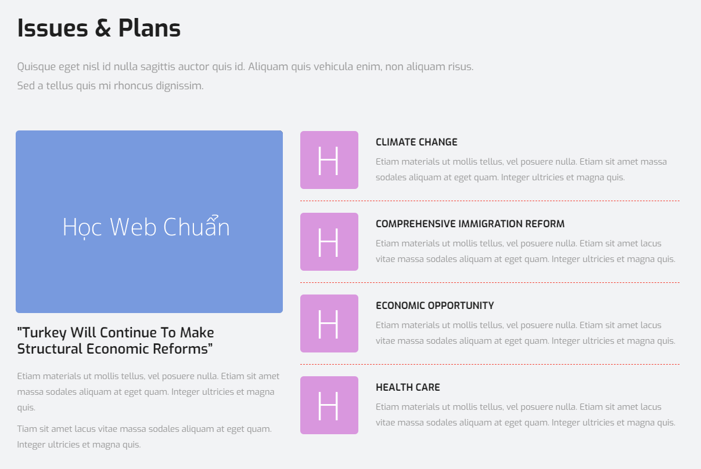

### Bài tập 5: Thực hiện code HTML theo nội dung design dưới đây:

##### Hướng dẫn: Cấu trúc design không phức tạp:

Áp dụng kết quả của bài tập trước, ta phân tích design như sau:
* Bên trên là tiêu đề `<hx>` và đoạn văn.
* Một nhóm nội dung bên trái gồm:
  * Image.
  * `<hx>` nhỏ.
  * Đoạn văn.
* Một nhóm nội dung bên phải cấu trúc giống bài tập trước.
* Nhớ sử dụng `<div>` bao ngoài các nội dung lớn.
Ta thấy nội dung layout chia làm 3 phần, sử dụng layout bình thường, không có điểm đặc biệt:
* Phần: tiêu đề hx và đoạn văn.
* Phần nhóm nội dung bên trái gồm
* Phần nội dung bên phải, áp dụng kết quả của bài trước.


#### Bài giải chưa kèm css

```{html}
<!doctype html>
<html lang="en">
<head>
<meta charset="utf-8">
<title>Học tepa.edu</title>
</head>
<body>
  <section class="plans">
    <h2>Issues &amp; Plans</h2>
    <p class="lead-text">Quisque efficitur ipsum ante, eu pretium neque tristique vitae.<br>
Donec ac ipsum in lorem molestie.</p>
    <div class="clearfix">
      <div class="left-group">
        <p class="image"></p>
        <h3>&quot;Turkey Will Continues To Make Structure Economic Reforms&quot;</h3>
        <p>Quisque efficitur ipsum ante, eu pretium neque tristique vitae. Donec ac ipsum in lorem molestie vestibulum ornare eu nibh. Donec ac velit.<br>
Praesent commodo nunc eros. Vivamus iaculis eleifend est, non blandit risus interdum id.</p>
      </div>
      <div class="right-group">
        <ul class="info-list">
          <li>
            <div class="image"></div>
            <section class="detail">
              <h3>CLIMATE CHANGE</h3>
              <p>Etiam cras ac sapien ipsum. Morbi scelerisque efficitur nibh a fringilla. Nam et diam vel justo praesent rhoncus volutpat turpis vitae hendrerit.</p>
            </section>
          </li>

          <li>
            <div class="image"></div>
            <section class="detail">
              <h3>COMPREHENSIVE IMMIGRATION REFORM</h3>
              <p>Morbi scelerisque efficitur nibh a fringilla. Nam et diam vel justo feugiat venenatis. Praesent rhoncus volutpat turpis vitae hendrerit.</p>
            </section>
          </li>

          <li>
            <div class="image"></div>
            <section class="detail">
              <h3>ECONOMIC OPPORTUNITY</h3>
              <p>Phasellus vulputate pharetra tempor. Aliquam in tortor in arcu iaculis malesuada, nam et diam vel justo feugiat venenatis.</p>
            </section>
          </li>

          <li>
            <div class="image"></div>
            <section class="detail">
              <h3>HEALTH CARE</h3>
              <p>onec feugiat ipsum ac risus auctor dignissim. Phasellus ante dolor, molestie vitae malesuada id, posuere non est.</p>
            </section>
          </li>
        </ul>
      </div>
    </div>
  </section>
</body>
</html>
```

#### Bài giải kèm css
```{html}
<!doctype html>
<html lang="en">
<head>
<meta charset="utf-8">
<title>Học tepa.edu</title>
<style>
  /* Reset */
  * {
    margin: 0;
    padding: 0;
  }
  ul {
    list-style: none;
  }
  body {
    background-color: #f2f3f5;
    color: #9b9b9b;
    font-family: Helvetica,sans-serif;
    font-size: 15px;
    line-height: 1.8;
  }
  .clearfix {
    zoom: 1;
  }
  .clearfix:after {
    clear: both;
    content: ".";
    display: block;
    height: 0;
    line-height: 0;
    visibility: hidden;
  }

  /* Layout */
  .plans {
    margin: 30px auto;
    width: 1145px;
  }
  .plans h2 {
    color: #1f1f1f;
    font-size: 42px;
    margin-bottom: 15px;
  }
  .plans .lead-text {
    font-size: 19px;
    margin-bottom: 40px;
  }
  .plans .left-group {
    float: left;
    margin-bottom: 20px;
    width: 460px;
  }
  .plans .left-group .image {
    margin-bottom: 8px;
  }
  .plans .left-group .image img {
    border-radius: 6px;
  }
  .plans .left-group h3 {
    color: #1f1f1f;
    font-size: 25px;
    line-height: 1.2;
    margin-bottom: 20px;
  }
  .plans .right-group {
    float: right;
    width: 650px;
  }
  .plans .right-group .info-list li {
    border-bottom: 1px dashed #f44336;
    margin-bottom: 20px;
    padding-bottom: 10px;
  }
  .plans .right-group .info-list li:last-child {
    border-bottom: none;
    margin-bottom: 0;
    padding-bottom: 0;
  }
  .plans .right-group .info-list li .image {
    float: left;
    width: 100px;
  }
  .plans .right-group .info-list li .image img {
    border-radius: 6px;
  }
  .plans .right-group .info-list li .detail {
    float: right;
    padding-top: 3px;
    width: 520px;
  }
  .plans .right-group .info-list li .detail h3 {
    color: #1f1f1f;
    margin-bottom: 6px;
    font-size: 18px;
  }
</style>
</head>
<body>
  <section class="plans">
    <h2>Issues &amp; Plans</h2>
    <p class="lead-text">Quisque efficitur ipsum ante, eu pretium neque tristique vitae.<br>
Donec ac ipsum in lorem molestie.</p>
    <div class="clearfix">
      <div class="left-group">
        <p class="image"></p>
        <h3>&quot;Turkey Will Continues To Make Structure Economic Reforms&quot;</h3>
        <p>Quisque efficitur ipsum ante, eu pretium neque tristique vitae. Donec ac ipsum in lorem molestie vestibulum ornare eu nibh. Donec ac velit.<br>
Praesent commodo nunc eros. Vivamus iaculis eleifend est, non blandit risus interdum id.</p>
      </div>
      <div class="right-group">
        <ul class="info-list">
          <li class="clearfix">
            <div class="image"></div>
            <section class="detail">
              <h3>CLIMATE CHANGE</h3>
              <p>Etiam cras ac sapien ipsum. Morbi scelerisque efficitur nibh a fringilla. Nam et diam vel justo praesent rhoncus volutpat turpis vitae hendrerit.</p>
            </section>
          </li>

          <li class="clearfix">
            <div class="image"></div>
            <section class="detail">
              <h3>COMPREHENSIVE IMMIGRATION REFORM</h3>
              <p>Morbi scelerisque efficitur nibh a fringilla. Nam et diam vel justo feugiat venenatis. Praesent rhoncus volutpat turpis vitae hendrerit.</p>
            </section>
          </li>

          <li class="clearfix">
            <div class="image"></div>
            <section class="detail">
              <h3>ECONOMIC OPPORTUNITY</h3>
              <p>Phasellus vulputate pharetra tempor. Aliquam in tortor in arcu iaculis malesuada, nam et diam vel justo feugiat venenatis.</p>
            </section>
          </li>

          <li class="clearfix">
            <div class="image"></div>
            <section class="detail">
              <h3>HEALTH CARE</h3>
              <p>onec feugiat ipsum ac risus auctor dignissim. Phasellus ante dolor, molestie vitae malesuada id, posuere non est.</p>
            </section>
          </li>
        </ul>
      </div>
    </div>
  </section>
</body>
</html>
```
### Bài tập 6: Thực hiện code HTML theo nội dung design dưới đây:

#### Hướng dẫn

Cấu trúc bài này cũng không phức tạp:

* Tiêu đề `<hx>` và đoạn văn.
* Một `<form>` gồm 4 <input>, 2 `<select> <option>`, 1 `<textarea>` và một `<button>`
* Một nhóm nội dung bên phải giống bài trước.

Bài này layout không khó, cái khó vẫn là điều khiển các thành phần form, cách xử lý khác so với bài trước, mục đích giúp bạn tiếp cận được nhiều cách code khác nhau.

* Cần viết `input, textarea, button `sao cho có thể sử dụng ở những trang khác khác sau này.
* Xử lý chiều rộng của `input, textarea` cũng là vấn đề không dễ, cần sử dụng `box-sizing` hỗ trợ.
* Với chiều rộng của `input, textarea` không nên viết trực tiếp, mà cần dùng class chung để còn sử dụng lại sau này.

#### Giải (chưa bao gồm css)
```{html}
<!doctype html>
<html lang="en">
<head>
<meta charset="utf-8">
<title>Học tepa.edu</title>
</head>
<body>
  <section class="help">
    <h2>Need Help? Sure we are Online!</h2>
    <p class="lead-text">Etiam dapibus purus porttitor, egestas dui at, scelerisque nulla suspendisse et diam vel justo praesent risus.<br>
Nulla ut sagittis lorem nam tempor eros sit amet purus congue.</p>
    <form method="" action="">
      <div class="help-form">
        <p><input type="text" name="first-name" placeholder="First Name" value=""> <input type="text" name="last-name" placeholder="Last Name" value=""></p>
        <p><input type="email" name="email" placeholder="Your Email" value=""> <input type="tel" name="phone" placeholder="Your Phone" value=""></p>
        <p>
          <select name="country">
            <option>Select Country</option>
            <option value="vietnam">Vietnam</option>
            <option value="canada">Canada</option>
            <option value="japan">Japan</option>
          </select>
          <select name="course">
            <option>Select Course</option>
            <option value="html">HTML</option>
            <option value="css">CSS</option>
            <option value="javascript">Javascript</option>
          </select></p>
        <p><textarea name="message" placeholder="Content" cols="50" rows="10"></textarea></p>
        <p class="submit-btn"><button type="submit">Submit</button></p>
      </div>
    </form>
  </section>
</body>
</html>
```
#### Giải (bao gồm css)
```{html}
<!doctype html>
<html lang="en">
<head>
<meta charset="utf-8">
<title>Học tepa.edu</title>
<style>
  /* Reset */
  * {
    margin: 0;
    padding: 0;
  }
  ul {
    list-style: none;
  }
  body {
    color: #a3a3a3;
    font-family: Helvetica,sans-serif;
    font-size: 16px;
    line-height: 1.8;
  }
  /* Viết độc lập các thành phần form, để sử dụng lại */
  input[type="text"],
  input[type="email"],
  input[type="tel"],
  select,
  textarea {
    border: 1px solid #ecedee;
    border-radius: 3px;
    /* Cần cho full-width */
    box-sizing: border-box;
    padding-left: 25px;
    padding-right: 25px;
  }
  input[type="text"],
  input[type="email"],
  input[type="tel"],
  select {
    height: 55px;
  }
  select {
    color: #a3a3a3;
  }
  /* Điều khiển màu sắc cho placeholder */
  ::placeholder {
    color: #a3a3a3;
    opacity: 1;
  }
  textarea {
    padding-top: 20px;
    font-family: Helvetica,sans-serif;
  }
  button {
    background-color: #2d3032;
    border: 1px solid #2d3032;
    border-radius: 3px;
    color: #fff;
    cursor: pointer;
    width: 100%;
    padding: 18px 0 16px;
    text-align: center;
    transition: 0.3s background-color;
  }
  button:hover {
    background-color: #606162;
  }
  .clearfix {
    zoom: 1;
  }
  .clearfix:after {
    clear: both;
    content: ".";
    display: block;
    height: 0;
    line-height: 0;
    visibility: hidden;
  }

  /* Layout */
  .help {
    margin: 30px auto;
    width: 990px;
  }
  .help h2 {
    color: #030303;
    font-size: 42px;
    font-weight: normal;
    margin-bottom: 11px;
    text-align: center;
  }
  .help .lead-text {
    line-height: 2;
    margin-bottom: 58px;
    text-align: center;
  }
  .help-form {
    background-color: #f2f3f5;
    border: 1px solid #ececed;
    box-shadow: 0 10px 14px 0 #ddd;
    padding: 40px 30px 10px;
  }
  .help-form p {
    margin-bottom: 30px;
  }
  .help-form p :nth-child(2) {
    float: right;
  }
  .help-form textarea {
    height: 160px;
  }
  .half-size {
    width: 450px;
  }
  .full-size {
    width: 100%;
  }
  .help-form .submit-btn {
    font-size: 16px;
    margin-top: -7px;
  }
</style>
</head>
<body>
  <section class="help">
    <h2>Need Help? Sure we are Online!</h2>
    <p class="lead-text">Etiam dapibus purus porttitor, egestas dui at, scelerisque nulla suspendisse et diam vel justo praesent risus.<br>
Nulla ut sagittis lorem nam tempor eros sit amet purus congue.</p>
    <form method="" action="">
      <div class="help-form">
        <p class="clearfix"><input type="text" name="first-name" placeholder="First Name" value="" class="half-size"> <input type="text" name="last-name" placeholder="Last Name" value="" class="half-size"></p>
        <p class="clearfix"><input type="email" name="email" placeholder="Your Email" value="" class="half-size"> <input type="tel" name="phone" placeholder="Your Phone" value="" class="half-size"></p>
        <p class="clearfix">
          <select name="country" class="half-size">
            <option>Select Country</option>
            <option value="vietnam">Vietnam</option>
            <option value="canada">Canada</option>
            <option value="japan">Japan</option>
          </select>
          <select name="course" class="half-size">
            <option>Select Course</option>
            <option value="html">HTML</option>
            <option value="css">CSS</option>
            <option value="javascript">Javascript</option>
          </select></p>
        <p><textarea name="message" placeholder="Content" cols="50" rows="10" class="full-size"></textarea></p>
        <p class="submit-btn"><button type="submit">Submit</button></p>
      </div>
    </form>
  </section>
</body>
</html>
```
