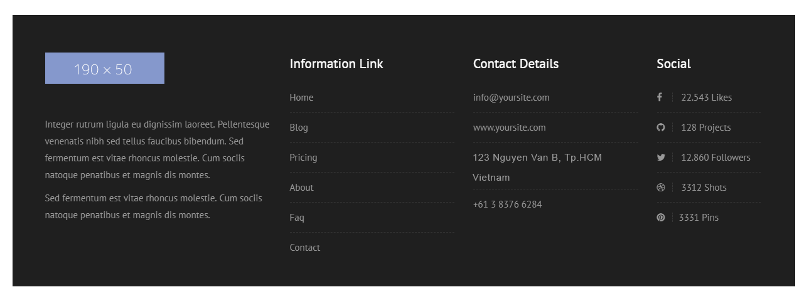
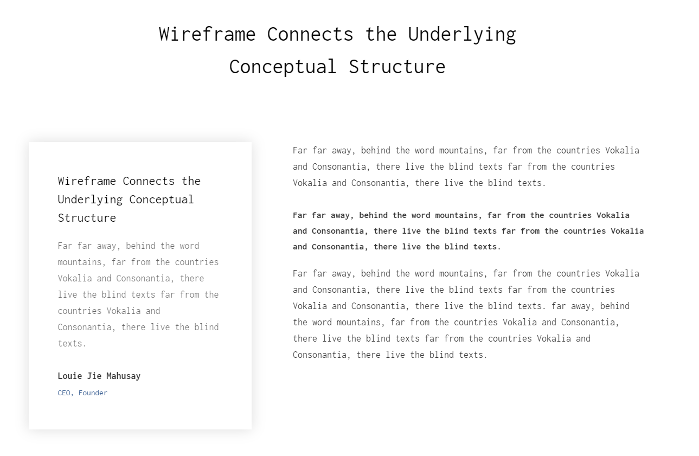

## Bài tập 7: Thực hiện code HTML theo nội dung design dưới đây:

#### Hướng dẫn: Cấu trúc design không phức tạp:

* Đây là design của một footer thường gặp, gồm logo, text giới thiệu, và các list chứa link tương ứng.
* Với design này ta sử dụng 4 `<div>` cho dễ layout, tiêu đề thì vẫn dùng `<hx>`, còn lại các danh sách ta dùng `<ul> <li>`.
* Chú ý là ở phần Social có sử dụng font icon.
* Bài tập này các bạn chú ý dùng `width` đi kèm với `float` nhe, cũng cẩn thận khi dùng `padding` và `margin`.


### Bài giải chưa kèm css

```{html}
<!doctype html>
<html lang="en">
<head>
<meta charset="utf-8">
<title>Học web chuẩn</title>
<link rel="stylesheet" href="/exercises/css/fontawesome.css" media="all">
</head>
<body>
  <footer id="footer">
    <div class="inner">
      <div class="about-us">
        <p class="logo"></p>
        <p>Lorem ipsum dolor sit amet, consectetur adipiscing elit. Nulla sit amet suscipit est. Nulla iaculis ipsum sit amet leo euismod maximus. Donec malesuada posuere mi, nec scelerisque nibh porta eu. Mauris in ultricies nulla. Quisque vitae ipsum quis odio efficitur tincidunt.</p>
        <p>Nullam viverra a velit et sodales. Etiam eu odio quis felis pretium interdum quis in velit. Nullam eu justo quis mi varius malesuada nec vitae magna.</p>
      </div>

      <div class="info-link">
        <h3>Information Link</h3>
        <nav>
          <ul class="link-list">
            <li><a href="./">Home</a></li>
            <li><a href="./">Blog</a></li>
            <li><a href="./">Pricing</a></li>
            <li><a href="./">About</a></li>
            <li><a href="./">Faq</a></li>
            <li><a href="./">Contact</a></li>
          </ul>
        </nav>
      </div>

      <div class="contact-detail">
        <h3>Contact Details</h3>
        <ul class="link-list">
          <li><a href="mailto:info@yoursite.com">info@yoursite.com</a></li>
          <li><a href="www.yoursite.com">www.yoursite.com</a></li>
          <li><address>123 Nguyen Van B, HCM City, Vietnam</address></li>
          <li><a href="tel:+61383766284">+61 38376 6284</a></li>
        </ul>
      </div>

      <div class="social">
        <h3>Social</h3>
        <ul class="link-list">
          <li><i class="fab fa-facebook-f"></i> 22.543 Likes</li>
          <li><i class="fab fa-github"></i> 128 Projects</li>
          <li><i class="fab fa-twitter"></i> 12.860 Followers</li>
          <li><i class="fab fa-dribbble"></i> 3312 Shots</li>
          <li><i class="fab fa-pinterest"></i> 3331 Pins</li>
        </ul>
      </div>
    </div>
  </footer>
</body>
</html>
```

### Bài giải kèm css
```{html}
<!doctype html>
<html lang="en">
<head>
<meta charset="utf-8">
<title>Học web chuẩn</title>
<link rel="stylesheet" href="/exercises/css/fontawesome.css" media="all">
<style>
  /* Reset */
  * {
    margin: 0;
    padding: 0;
  }
  ul {
    list-style: none;
  }
  body {
    color: #000;
    font-family: Helvetica,sans-serif;
    font-size: 15px;
    line-height: 1.8;
  }
  .clearfix {
    zoom: 1;
  }
  .clearfix:after {
    clear: both;
    content: ".";
    display: block;
    height: 0;
    line-height: 0;
    visibility: hidden;
  }

  /* Layout */
  #footer {
    background-color: #1f1f1f;
    color: #999;
    padding: 60px 0 28px;
  }
  #footer .inner {
    margin: 0 auto;
    width: 1140px;
  }
  #footer .inner h3 {
    color: #fff;
    margin-top: 3px;
    margin-bottom: 25px;
  }
  #footer .inner .about-us {
    float: left;
    width: 360px;
  }
  #footer .inner .about-us .logo {
    margin-bottom: 42px;
  }
  #footer .inner > div {
    float: left;
    margin-right: 30px;
  }
  #footer .inner > div:last-child {
    margin-right: 0;
  }
  #footer .inner .info-link,
  #footer .inner .contact-detail {
    width: 260px;
  }
  #footer .inner .social {
    width: 165px;
  }
  #footer .inner ul.link-list li {
    border-bottom: 1px dashed #363636;
    font-size: 15px;
    margin-bottom: 11px;
    padding-bottom: 9px;
  }
  #footer .inner ul.link-list li:last-child {
    border-bottom: none;
    margin-bottom: 0;
  }
  #footer .inner ul.link-list li a {
    color: #999;
    text-decoration: none;
    transition: 0.3s color;
  }
  #footer .inner ul.link-list li a:hover {
    color: #fff;
  }
  #footer .inner ul.link-list li i {
    border-right: 1px dashed #363636;
    padding-right: 16px;
    margin-right: 14px;
    font-size: 14px;
  }
  #footer .inner ul.link-list li address {
    font-style: normal;
  }
</style>
</head>
<body>
  <footer id="footer">
    <div class="inner clearfix">
      <div class="about-us">
        <p class="logo"></p>
        <p>Lorem ipsum dolor sit amet, consectetur adipiscing elit. Nulla sit amet suscipit est. Nulla iaculis ipsum sit amet leo euismod maximus. Donec malesuada posuere mi, nec scelerisque nibh porta eu.</p>
        <p>Nullam viverra a velit et sodales. Etiam eu odio quis felis pretium interdum quis in velit.</p>
      </div>

      <div class="info-link">
        <h3>Information Link</h3>
        <nav>
          <ul class="link-list">
            <li><a href="./">Home</a></li>
            <li><a href="./">Blog</a></li>
            <li><a href="./">Pricing</a></li>
            <li><a href="./">About</a></li>
            <li><a href="./">Faq</a></li>
            <li><a href="./">Contact</a></li>
          </ul>
        </nav>
      </div>

      <div class="contact-detail">
        <h3>Contact Details</h3>
        <ul class="link-list">
          <li><a href="mailto:info@yoursite.com">info@yoursite.com</a></li>
          <li><a href="www.yoursite.com">www.yoursite.com</a></li>
          <li><address>123 Nguyen Van B, HCM City, Vietnam</address></li>
          <li><a href="tel:+61383766284">+61 38376 6284</a></li>
        </ul>
      </div>

      <div class="social">
        <h3>Social</h3>
        <ul class="link-list">
          <li><i class="fab fa-facebook-f"></i> 22.543 Likes</li>
          <li><i class="fab fa-github"></i> 128 Projects</li>
          <li><i class="fab fa-twitter"></i> 12.860 Followers</li>
          <li><i class="fab fa-dribbble"></i> 3312 Shots</li>
          <li><i class="fab fa-pinterest"></i> 3331 Pins</li>
        </ul>
      </div>
    </div>
  </footer>
</body>
</html>
```
## Bài tập 8: Thực hiện code HTML theo nội dung design dưới đây:

### Hướng dẫn

* Bên trên là tiêu đề lớn.
* Bên dưới chia làm 2 phần:
  * Bên trái là một nhóm gồm tiêu đề nhỏ, đoạn văn, chữ ký và list chức danh, list này nếu không quan trọng SEO thì có thể dùng `<div>` hoặc `<p>` đều được.
  * Bên phải gồm 3 đoạn văn, chú ý đoạn giữa được in đậm, có ý nhấn mạnh, do đó có thể dùng `<strong>`.
* Bài này layout đơn giản, nhưng cần cẩn thận việc xử lý **khoảng cách, font-size, color**.
* Phần **font-family** sử dụng Google Font, tuy nhiên Học Web Chuẩn không làm thao tác này, vì muốn các bạn tập trung sử lý phần khác hơn.

### Giải (chưa bao gồm css)
```{html}
<!doctype html>
<html lang="en">
<head>
<meta charset="utf-8">
<title>Học web chuẩn</title>
</head>
<body>
  <section class="wireframe">
    <h2>Wireframe Connects the Underlying Conceptual Structure</h2>
    <div class="clearfix">
      <div class="box-message">
        <h3>Wireframe Connects the Underlying Conceptual Structure</h3>
        <p>Lorem ipsum dolor sit amet, consectetur adipiscing elit. Nulla sit amet suscipit est. Nulla iaculis ipsum sit amet leo euismod maximus. Donec malesuada posuere mi, nec scelerisque. Quisque vitae ipsum quis odio nec at lectus.</p>
        <p class="author"><strong>Louie Jie Mahusay</strong></p>
        <p class="link"><em>CEO</em>, <em>Founder</em></p>
      </div>

      <div class="content">
        <p>Nullam viverra a velit et sodales. Etiam eu odio quis felis pretium interdum quis in velit. Nullam eu justo quis mi varius malesuada nec vitae magna. Pellentesque nec volutpat neque..</p>
        <p><strong>Etiam in vehicula neque. Suspendisse potenti. Sed a cursus dolor. Vivamus metus nisi, ultrices vel porttitor sollicitudin, aliquam id tortor. Vestibulum justo libero, dapibus vitae nibh at, faucibus dignissim massa.</strong></p>
        <p>Integer ultrices lorem nec ante tempor, ut ornare lectus dignissim. Etiam ac pharetra leo. Ut vel diam sagittis, vestibulum neque et, efficitur nisi. Lorem ipsum dolor sit amet, consectetur adipiscing elit. Lorem ipsum dolor sit amet, consectetur adipiscing elit. Sed bibendum tellus ac nulla aliquet, vitae sollicitudin mauris blandit. Aliquam enim mauris, phasellus in luctus lorem.</p>
      </div>
    </div>
  </section>
</body>
</html>
```
### Giải (bao gồm css)
```{html}
<!doctype html>
<html lang="en">
<head>
<meta charset="utf-8">
<title>Học web chuẩn</title>
<style>
  /* Reset */
  * {
    margin: 0;
    padding: 0;
  }
  ul {
    list-style: none;
  }
  body {
    color: #343434;
    font-family: Helvetica,sans-serif;
    font-size: 16px;
    line-height: 1.8;
    letter-spacing: 1px;
  }
  .clearfix {
    zoom: 1;
  }
  .clearfix:after {
    clear: both;
    content: ".";
    display: block;
    height: 0;
    line-height: 0;
    visibility: hidden;
  }

  /* Layout */
  .wireframe {
    margin: 30px auto;
    width: 1140px;
  }
  .wireframe h2 {
    font-size: 36px;
    font-weight: 500;
    margin-bottom: 100px;
    line-height: 1.7;
    text-align: center;
  }
  .wireframe .box-message {
    box-shadow: 0 0 20px 1px #ddd;
    color: #676767;
    float: left;
    padding: 54px 54px 22px;
    width: 300px;
  }
  .wireframe .box-message h3 {
    font-size: 21px;
    line-height: 1.65;
    margin-bottom: 20px;
  }
  .wireframe .box-message p {
    line-height: 1.9;
    margin-bottom: 30px;
  }
  .wireframe .box-message .author {
    margin-bottom: 0;
  }
  .wireframe .box-message em {
    color: #2b538a;
    font-size: 13px;
    font-style: normal;
  }
  .wireframe .content {
    float: right;
    width: 656px;
  }
  .wireframe .content p {
    margin-bottom: 30px;
  }
</style>
</head>
<body>
  <section class="wireframe">
    <h2>Wireframe Connects the Underlying<br>Conceptual Structure</h2>
    <div class="clearfix">
      <div class="box-message">
        <h3>Wireframe Connects the Underlying Conceptual Structure</h3>
        <p>Lorem ipsum dolor sit amet, consectetur adipiscing elit. Nulla sit amet suscipit est. Nulla iaculis ipsum sit amet leo euismod maximus. Donec malesuada posuere mi, nec scelerisque. Quisque vitae ipsum quis odio nec at lectus.</p>
        <p class="author"><strong>Louie Jie Mahusay</strong></p>
        <p class="link"><em>CEO</em>, <em>Founder</em></p>
      </div>

      <div class="content">
        <p>Nullam viverra a velit et sodales. Etiam eu odio quis felis pretium interdum quis in velit. Nullam eu justo quis mi varius malesuada nec vitae magna. Pellentesque nec volutpat neque..</p>
        <p><strong>Etiam in vehicula neque. Suspendisse potenti. Sed a cursus dolor. Vivamus metus nisi, ultrices vel porttitor sollicitudin, aliquam id tortor. Vestibulum justo libero, dapibus vitae nibh at, faucibus dignissim massa.</strong></p>
        <p>Integer ultrices lorem nec ante tempor, ut ornare lectus dignissim. Etiam ac pharetra leo. Ut vel diam sagittis, vestibulum neque et, efficitur nisi. Lorem ipsum dolor sit amet, consectetur adipiscing elit. Lorem ipsum dolor sit amet, consectetur adipiscing elit. Sed bibendum tellus ac nulla aliquet, vitae sollicitudin mauris blandit. Aliquam enim mauris, phasellus in luctus lorem.</p>
      </div>
    </div>
  </section>
</body>
</html>
```
