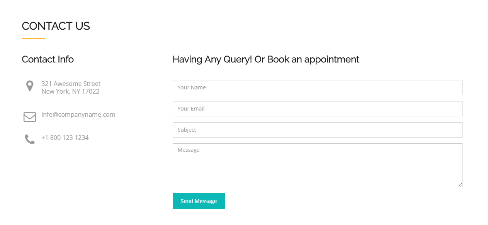
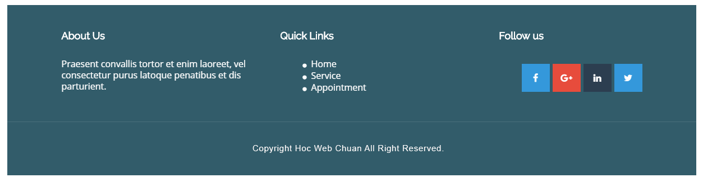

### Bài tập 9: Thực hiện code HTML theo nội dung design dưới đây:

##### Hướng dẫn: Cấu trúc design không phức tạp:

* Phần bên trái là một list thông tin, ta sử dụng `<ul> <li>`, chú ý có sử dụng font icon.
* Phần bên phải là một form contact, dùng các thành phần `<form>`.


#### Bài giải chưa kèm css

```{html}
<!doctype html>
<html lang="en">
<head>
<meta charset="utf-8">
<title>Học web chuẩn</title>
<link rel="stylesheet" href="/exercises/css/fontawesome.css" media="all">
</head>
<body>
  <section class="contact-us">
    <h2>CONTACT US</h2>
    <div class="clearfix">
      <div class="info">
        <h3>Contact Info</h3>
        <ul class="contact-list">
          <li><i class="fas fa-map-marker-alt"></i> 321 Awesome Street<br>
New York, NY 17022</li>
          <li><i class="far fa-envelope"></i> info@companyname.com</li>
          <li><i class="fas fa-phone-alt"></i> <a href="tel:+18001231234">+1 800 123 1234</a></li>
        </ul>
      </div>

      <div class="contact-form">
        <h3>Having Any Query! Or Book an appointment</h3>
        <form method="" action="">
          <p><input type="text" name="name" placeholder="Your Name" value=""></p>
          <p><input type="email" name="email" placeholder="Your Email" value=""></p>
          <p><input type="text" name="subject" placeholder="Subject" value=""></p>
          <p><textarea name="message" placeholder="Message" cols="50" rows="10"></textarea></p>
          <p class="submit-btn"><button type="submit">Send Message</button></p>
        </form>
      </div>
    </div>
  </section>
</body>
</html>
```

#### Bài giải kèm css
```{html}
<!doctype html>
<html lang="en">
<head>
<meta charset="utf-8">
<title>Học web chuẩn</title>
<link rel="stylesheet" href="/exercises/css/fontawesome.css" media="all">
<style>
  /* Reset */
  * {
    margin: 0;
    padding: 0;
  }
  ul {
    list-style: none;
  }
  body {
    color: #9a9a9a;
    font-family: Helvetica,sans-serif;
    font-size: 16px;
    line-height: 1.8;
  }
  input[type="text"],
  input[type="email"],
  textarea {
    border: 1px solid #ccc;
    box-shadow: 0 1px 2px 0 #ddd inset;
    /* Cần cho full-width */
    box-sizing: border-box;
    font-size: 15px;
    padding-left: 20px;
    width: 100%;
  }
  input[type="text"],
  input[type="email"] {
    height: 40px;
  }
  textarea {
    font-family: Helvetica,sans-serif;
    padding-top: 10px;
  }
  button {
    background-color: #0cb8b6;
    border: 1px solid #0cb8b6;
    color: #fff;
    cursor: pointer;
    min-width: 135px;
    padding: 11px 10px;
    text-align: center;
    transition: 0.3s background-color;
  }
  button:hover {
    background-color: #18ccca;
  }
  .clearfix {
    zoom: 1;
  }
  .clearfix:after {
    clear: both;
    content: ".";
    display: block;
    height: 0;
    line-height: 0;
    visibility: hidden;
  }

  /* Layout */
  .contact-us {
    margin: 30px auto;
    width: 1140px;
  }
  .contact-us .info {
    float: left;
    width: 380px;
  }
  .contact-us h2 {
    color: #222;
    font-size: 29px;
    font-weight: 500;
    margin-bottom: 42px;
    position: relative;
  }
  /* Line cho h2 */
  .contact-us h2:after {
    background-color: #ffb737;
    bottom: -5px;
    content: "";
    display: block;
    left: 0;
    height: 3px;
    width: 60px;
    position: absolute;
  }
  .contact-us h3 {
    color: #222;
    font-size: 22px;
    font-weight: 500;
    margin-bottom: 32px;
  }
  .contact-us .contact-list li {
    line-height: 1.4;
    margin-bottom: 36px;
    padding-left: 48px;
    position: relative;
  }
  .contact-us .contact-list li i {
    font-size: 27px;
    position: absolute;
    left: 0;
    text-align: center;
    width: 34px;
  }
  .contact-us .contact-list li a {
    color: #9a9a9a;
    text-decoration: none;
  }
  .contact-us .contact-form {
    float: right;
    width: 750px;
  }
  .contact-us .contact-form p {
    margin-bottom: 15px;
  }
  .contact-us .contact-form .submit-btn {
    margin-top: -10px;
  }
  .contact-us .contact-form textarea {
    height: 114px;
  }
 </style>
</head>
<body>
  <section class="contact-us">
    <h2>CONTACT US</h2>
    <div class="clearfix">
      <div class="info">
        <h3>Contact Info</h3>
        <ul class="contact-list">
          <li><i class="fas fa-map-marker-alt"></i> 321 Awesome Street<br>
New York, NY 17022</li>
          <li><i class="far fa-envelope"></i> info@companyname.com</li>
          <li><i class="fas fa-phone-alt"></i> <a href="tel:+18001231234">+1 800 123 1234</a></li>
        </ul>
      </div>

      <div class="contact-form">
        <h3>Having Any Query! Or Book an appointment</h3>
        <form method="" action="">
          <p><input type="text" name="name" placeholder="Your Name" value=""></p>
          <p><input type="email" name="email" placeholder="Your Email" value=""></p>
          <p><input type="text" name="subject" placeholder="Subject" value=""></p>
          <p><textarea name="message" placeholder="Message" cols="50" rows="10"></textarea></p>
          <p class="submit-btn"><button type="submit">Send Message</button></p>
        </form>
      </div>
    </div>
  </section>
</body>
</html>
```
### Bài tập 10: Thực hiện code HTML theo nội dung design dưới đây:

#### Hướng dẫn

Design này là footer, cấu trúc tách biệt làm 2 phần.
* Phần bên trên chia làm 3 phần, cấu trúc mỗi phần làm như các bài tập trước.
* Phần bên dưới là copyright, nên dùng `<p>` hoặc `<div>` đều được.
Tiến hành layout như bình thường, nhưng cần chú ý:
* Chấm tròn của phần Quick Links, cần sử dụng cách chèn chấm tròn bằng mã ký tự vào `li:after`.
* Phần mạng xã hội, cần viết class riêng cho màu sắc, để sử dụng lại sau này.

#### Giải (chưa bao gồm css)
```{html}
<!doctype html>
<html lang="en">
<head>
<meta charset="utf-8">
<title>Học web chuẩn</title>
<link rel="stylesheet" href="/exercises/css/fontawesome.css" media="all">
</head>
<body>
  <footer id="footer">
    <div class="inner">
      <div class="about-us">
        <h3>About us</h3>
        <p>Nullam viverra a velit et sodales. Etiam eu odio quis felis pretium interdum quis in velit. Nullam eu justo.</p>
      </div>

      <div class="info-link">
        <h3>Quick Links</h3>
        <nav>
          <ul>
            <li><a href="./">Home</a></li>
            <li><a href="./">Service</a></li>
            <li><a href="./">Appointment</a></li>
          </ul>
        </nav>
      </div>

      <div class="follow-us">
        <h3>Follow Us</h3>
        <ul>
          <li><a href="./"><i class="fab fa-facebook-f"></i></a></li>
          <li><a href="./"><i class="fab fa-google-plus-g"></i></a></li>
          <li><a href="./"><i class="fab fa-twitter"></i></a></li>
          <li><a href="./"><i class="fab fa-linkedin-in"></i></a></li>
        </ul>
      </div>
    </div>

    <p class="copyright">Copyright Hoc Web Chuan All Right Reserved.</p>
  </footer>
</body>
</html>
```
#### Giải (bao gồm css)
```{html}
<!doctype html>
<html lang="en">
<head>
<meta charset="utf-8">
<title>Học web chuẩn</title>
<link rel="stylesheet" href="/exercises/css/fontawesome.css" media="all">
<style>
  /* Reset */
  * {
    margin: 0;
    padding: 0;
  }
  ul {
    list-style: none;
  }
  body {
    color: #000;
    font-family: Helvetica,sans-serif;
    font-size: 16px;
    line-height: 1.8;
  }
  .clearfix {
    zoom: 1;
  }
  .clearfix:after {
    clear: both;
    content: ".";
    display: block;
    height: 0;
    line-height: 0;
    visibility: hidden;
  }

  /* Layout */
  #footer {
    background-color: #325c6a;
    color: #fff;
    line-height: 1.4;
  }
  #footer a {
    color: #fff;
    text-decoration: none;
  }
  #footer .inner {
    margin: 0 auto;
    padding: 40px 0;
    width: 1040px;
  }
  #footer .inner > div {
    float: left;
    margin-right: 50px;
    width: 340px;
  }
  #footer .inner > div:last-child {
    margin-right: 0;
    width: 260px;
  }
  #footer .inner h3 {
    font-size: 18px;
    margin-bottom: 30px;
  }
  #footer .inner .info-link ul {
    padding-left: 58px;
  }
  #footer .inner .info-link li {
    position: relative;
  }
  #footer .inner .info-link li:after {
    content: "●";
    display: block;
    font-size: 16px;
    position: absolute;
    left: -17px;
    top: 0;
  }
  #footer .inner .info-link li a:hover {
    text-decoration: underline;
  }
  #footer .inner .follow-us ul {
    text-align: right;
  }
  #footer .inner .follow-us li {
    display: inline;
    margin-right: 1px;
  }
  #footer .inner .follow-us li a {
    display: inline-block;
    height: 50px;
    line-height: 54px;
    opacity: 1;
    text-align: center;
    transition: 0.3s all;
    width: 50px;
  }
  .facebook a {
    background-color: #3498db;
  }
  .google-plus a {
    background-color: #e74c3c;
  }
  .twitter a {
    background-color: #2c3e50;
  }
  .linkedin a {
    background-color: #3498db;
  }
  #footer .copyright {
    border-top: 1px solid #4b707c;
    font-size: 15px;
    padding: 38px 0 35px;
    text-align: center;
  }
  #footer .inner .follow-us li a:hover {
    background-color: #fff;
    color: #666;
  }
</style>
</head>
<body>
  <footer id="footer">
    <div class="inner clearfix">
      <div class="about-us">
        <h3>About us</h3>
        <p>Nullam viverra a velit et sodales. Etiam eu odio quis felis pretium interdum quis in velit. Nullam eu justo.</p>
      </div>

      <div class="info-link">
        <h3>Quick Links</h3>
        <nav>
          <ul>
            <li><a href="./">Home</a></li>
            <li><a href="./">Service</a></li>
            <li><a href="./">Appointment</a></li>
          </ul>
        </nav>
      </div>

      <div class="follow-us">
        <h3>Follow Us</h3>
        <ul>
          <li class="facebook"><a href="./"><i class="fab fa-facebook-f"></i></a></li>
          <li class="google-plus"><a href="./"><i class="fab fa-google-plus-g"></i></a></li>
          <li class="twitter"><a href="./"><i class="fab fa-twitter"></i></a></li>
          <li class="linkedin"><a href="./"><i class="fab fa-linkedin-in"></i></a></li>
        </ul>
      </div>
    </div>

    <p class="copyright">Copyright Hoc Web Chuan All Right Reserved.</p>
  </footer>
</body>
</html>
```
