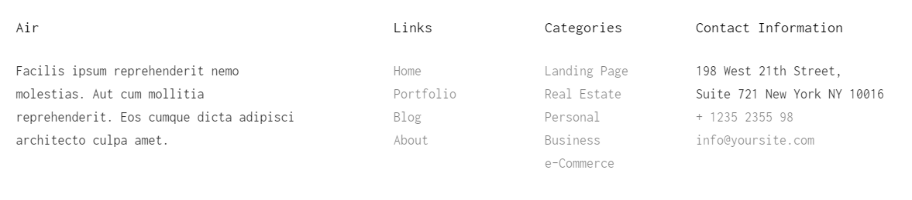
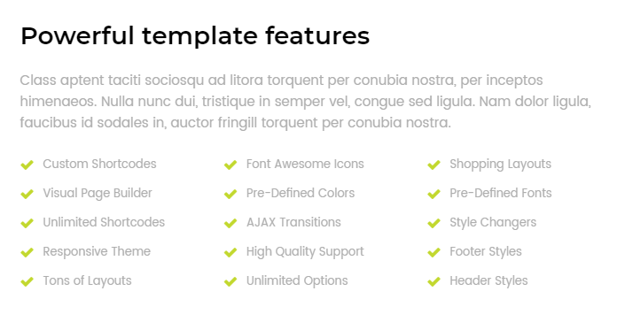

## Bài tập 13: Thực hiện code HTML theo nội dung design dưới đây:

#### Hướng dẫn: Cấu trúc design không phức tạp:

* Đây là cấu trúc footer, thông thường sẽ gồm có nội dung giới thiệu, liên kết, và nội dung liên hệ.
* Nhìn vô ta sẽ thấy một danh sách lớn, chứa 4 phần, tuy nhiên footer thường cho biết thông tin nhiều hơn là SEO, do đó ở đây ta có thể dùng <div> cho tiện việc layout.
* 2 phần **"Links"** và **"Categories"** là 2 danh sách liên kết, ta dùng `<ul> <li>`.
* Phần **"Contact Information"** ta cần chú ý liên kết email và điện thoại, để khi sử dụng trên Smartphone có thể click gửi mail hoặc gọi điện thoại được.
* Phần địa chỉ cần sử dụng `<address>`
* Nhìn vô ta sẽ thấy một danh sách lớn, chứa 4 phần, ta có thể sử dụng float để dàn hàng ngang cho 3 phần này.
* Chú ý cách sử dụng width.
* Đối với bài thực tế, các bạn cần sử dụng Google Font để tìm đúng dạng font có trong design nhe.

### Bài giải chưa kèm css

```{html}
<!doctype html>
<html lang="en">
<head>
<meta charset="utf-8">
<title>Học web chuẩn</title>
</head>
<body>
  <footer>
    <div class="air">
      <h4>Air</h4>
      <p>Facilisis turpis et finibus tincidunt.<br>
Integer varius malesuada nisi ut lobortis.<br>
Cras a neque arcu quisque dictum.<br>
Sagittis enim vel suscipit.</p>
    </div>

    <div class="links">
      <h4>Links</h4>
      <nav>
        <ul>
          <li><a href="./">Home</a></li>
          <li><a href="./">Portfolio</a></li>
          <li><a href="./">Blog</a></li>
          <li><a href="./">About</a></li>
        </ul>
      </nav>
    </div>

    <div class="categories">
      <h4>Categories</h4>
      <nav>
        <ul>
          <li><a href="./">Landing Page</a></li>
          <li><a href="./">Real Estate</a></li>
          <li><a href="./">Personal</a></li>
          <li><a href="./">Business</a></li>
          <li><a href="./">E-Commerce</a></li>
        </ul>
      </nav>
    </div>

    <div class="contact">
      <h4>Contact Information</h4>
      <address>198 West 21th Street, Suite 721 New York NY 10016</address>
      <p><a href="tel:+1235235598">+ 1235 2355 98</a></p>
      <p><a href="mailto:infor@yoursite.com">infor@yoursite.com</a></p>
    </div>
  </footer>
</body>
</html>
```

### Bài giải kèm css
```{html}
<!doctype html>
<html lang="en">
<head>
<meta charset="utf-8">
<title>Học web chuẩn</title>
<style>
  /* Reset */
  * {
    margin: 0;
    padding: 0;
  }
  a {
    color: #7f7f7f;
    text-decoration: none;
    transition: 0.3s color;
  }
  a:hover {
    color: #333;
  }
  ul {
    list-style: none;
  }
  body {
    color: #333;
    font-family: Helvetica,sans-serif;
    font-size: 16px;
    line-height: 1.9;
  }
  .clearfix {
    zoom: 1;
  }
  .clearfix:after {
    clear: both;
    content: ".";
    display: block;
    height: 0;
    line-height: 0;
    visibility: hidden;
  }

  /* Layout */
  footer {
    margin: 30px auto;
    position: relative;
    width: 1140px;
  }
  footer div {
    float: left;
  }
  footer div h4 {
    margin-bottom: 27px;
  }
  footer .air {
    max-width: 490px;
    width: 42.98%
  }
  footer .links {
    max-width: 195px;
    width: 17.10%;
  }
  footer .categories {
    max-width: 195px;
    width: 17.10%;
  }
  footer .contact {
    max-width: 260px;
    width: 22.82%;
  }
  footer .contact address {
    font-style: normal;
  }
</style>
</head>
<body>
  <footer class="clearfix">
    <div class="air">
      <h4>Air</h4>
      <p>Facilisis turpis et arcu finibus tincidunt.<br>
Integer varius nisi ut lobortis.<br>
Cras a neque arcu quisque faucibus vehicula.<br>
Sagittis enim vel suscipit.</p>
    </div>

    <div class="links">
      <h4>Links</h4>
      <nav>
        <ul>
          <li><a href="./">Home</a></li>
          <li><a href="./">Portfolio</a></li>
          <li><a href="./">Blog</a></li>
          <li><a href="./">About</a></li>
        </ul>
      </nav>
    </div>

    <div class="categories">
      <h4>Categories</h4>
      <nav>
        <ul>
          <li><a href="./">Landing Page</a></li>
          <li><a href="./">Real Estate</a></li>
          <li><a href="./">Personal</a></li>
          <li><a href="./">Business</a></li>
          <li><a href="./">E-Commerce</a></li>
        </ul>
      </nav>
    </div>

    <div class="contact">
      <h4>Contact Information</h4>
      <address>198 West 21th Street,<br>
Suite 721 New York NY 10016</address>
      <p><a href="tel:+1235235598">+ 1235 2355 98</a></p>
      <p><a href="mailto:infor@yoursite.com">infor@yoursite.com</a></p>
    </div>
  </footer>
</body>
</html>
```
## Bài tập 14: Thực hiện code HTML theo nội dung design dưới đây:

### Hướng dẫn

* Nội dung design này đơn giản: tiêu đề, đoạn văn và danh sách.
* Design này chú ý phần danh sách, cần sử dụng float sao cho tất cả các mục đều đúng vị trí, không chia 3 list.

### Giải (chưa bao gồm css)
```{html}
<!doctype html>
<html lang="en">
<head>
<meta charset="utf-8">
<title>Học web chuẩn</title>
<link rel="stylesheet" href="/exercises/css/fontawesome.css" media="all">
</head>
<body>
  <section class="features">
    <h2>Powerful template features</h2>
    <p>cursus odio, et pellentesque erat ultrices et. Nunc eget quam at eros malesuada porta.<br>
Suspendisse auctor, leo at bibendum consequat, mauris erat hendrerit dolor, vel porta lacus.<br>
Integer facilisis turpis et finibus tincidunt. Integer varius malesuada.</p>
    <ul>
      <li><i class="fas fa-check"></i><a href="./">Custom Shortcodes</a></li>
      <li><i class="fas fa-check"></i><a href="./">Font Awesome icons</a></li>
      <li><i class="fas fa-check"></i><a href="./">Shopping Layouts</a></li>
      <li><i class="fas fa-check"></i><a href="./">Visual Page Builder</a></li>
      <li><i class="fas fa-check"></i><a href="./">Pre-defined Colors</a></li>
      <li><i class="fas fa-check"></i><a href="./">Pre-defind Fronts</a></li>
      <li><i class="fas fa-check"></i><a href="./">Unlimited Shortcodes</a></li>
      <li><i class="fas fa-check"></i><a href="./">AJAX transitions</a></li>
      <li><i class="fas fa-check"></i><a href="./">Style Changers</a></li>
      <li><i class="fas fa-check"></i><a href="./">Responsive Theme</a></li>
      <li><i class="fas fa-check"></i><a href="./">High Quality Support</a></li>
      <li><i class="fas fa-check"></i><a href="./">Footer Styles</a></li>
      <li><i class="fas fa-check"></i><a href="./">Tons Of Layouts</a></li>
      <li><i class="fas fa-check"></i><a href="./">Unlimited Options</a></li>
      <li><i class="fas fa-check"></i><a href="./">Header Styles</a></li>
    </ul>
  </section>
</body>
</html>
```
### Giải (bao gồm css)
```{html}
<!doctype html>
<html lang="en">
<head>
<meta charset="utf-8">
<title>Học web chuẩn</title>
<link rel="stylesheet" href="/exercises/css/fontawesome.css" media="all">
<style>
  /* Reset */
  * {
    margin: 0;
    padding: 0;
  }
  ul {
    list-style: none;
  }
  body {
    color: #aeaeae;
    font-family: Helvetica,sans-serif;
    font-size: 16px;
    line-height: 1.5;
  }
  .clearfix {
    zoom: 1;
  }
  .clearfix:after {
    clear: both;
    content: ".";
    display: block;
    height: 0;
    line-height: 0;
    visibility: hidden;
  }

  /* Layout */
  .features {
    margin: 30px auto;
    width: 690px;
  }
  .features h2 {
    color: #000;
    font-size: 27px;
    margin-bottom: 20px;
  }
  .features .description {
    margin-bottom: 23px;
  }
  .features ul li {
    float: left;
    font-size: 15px;
    margin-bottom: 10px;
    width: 33%;
  }
  .features ul li i {
    color: #c2d82e;
    margin-right: 10px;
  }
</style>
</head>
<body>
  <section class="features">
    <h2>Powerful template features</h2>
    <p class="description">cursus odio, et pellentesque erat ultrices et. Nunc eget quam at eros malesuada porta.<br>
Suspendisse auctor, leo at bibendum consequat, mauris erat hendrerit dolor, vel porta lacus.<br>
Integer facilisis turpis et finibus tincidunt. Integer varius malesuada.</p>
    <ul>
      <li><i class="fas fa-check"></i>Custom Shortcodes</li>
      <li><i class="fas fa-check"></i>Font Awesome icons</li>
      <li><i class="fas fa-check"></i>Shopping Layouts</li>
      <li><i class="fas fa-check"></i>Visual Page Builder</li>
      <li><i class="fas fa-check"></i>Pre-defined Colors</li>
      <li><i class="fas fa-check"></i>Pre-defind Fronts</li>
      <li><i class="fas fa-check"></i>Unlimited Shortcodes</li>
      <li><i class="fas fa-check"></i>AJAX transitions</li>
      <li><i class="fas fa-check"></i>Style Changers</li>
      <li><i class="fas fa-check"></i>Responsive Theme</li>
      <li><i class="fas fa-check"></i>High Quality Support</li>
      <li><i class="fas fa-check"></i>Footer Styles</li>
      <li><i class="fas fa-check"></i>Tons Of Layouts</li>
      <li><i class="fas fa-check"></i>Unlimited Options</li>
      <li><i class="fas fa-check"></i>Header Styles</li>
    </ul>
  </section>
</body>
</html>
```
