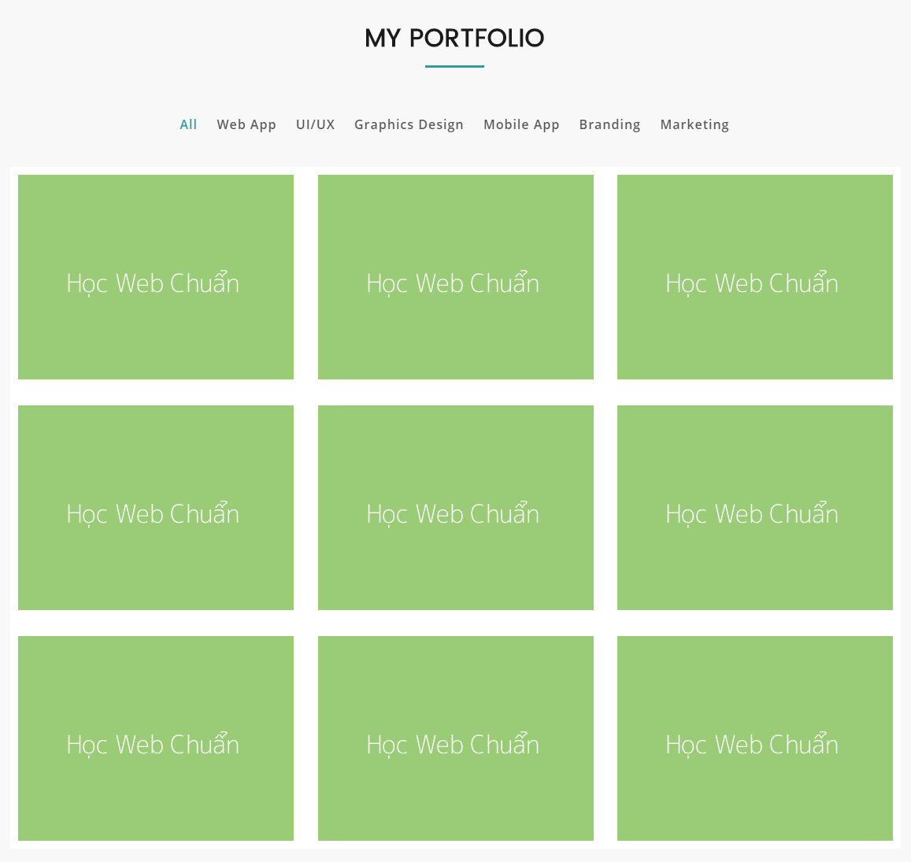
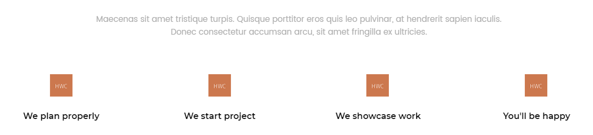

## Bài tập 7: Thực hiện code HTML theo nội dung design dưới đây:

#### Hướng dẫn: Cấu trúc design không phức tạp:

* Design chia làm 2 danh sách, một danh sách chứa link text, và một danh sách chứa hình.
* Ứng với mỗi danh sách ta dùng `<ul> <li>`.
* Line cho `<hx>` ta có thể sử dụng CSS để hạn chế thêm code cho HTML.
* Chú ý 2 danh sách, một danh sách chứa text, và một danh sách chứa hình.
* Với danh sách text ta có thể dùng `display: inline;` để thuận lợi về mặt điều chỉnh vị trí ở giữa.
* Với danh sách chứa hình ta dùng `float` sẽ thuận lợi về mặt điều chỉnh khoảng cách hay thêm bớt hình, cần chú ý reset lại các khoảng cách các hình bên phải và cuối danh sách.

### Bài giải chưa kèm css

```{html}
<!doctype html>
<html lang="en">
<head>
<meta charset="utf-8">
<title>Học web chuẩn</title>
</head>
<body>
  <section class="portfolio">
    <h2>MY PORTFOLIO</h2>
    <ul class="list-tab">
      <li><a href="./">All</a></li>
      <li><a href="./">Web App</a></li>
      <li><a href="./">UI/UX</a></li>
      <li><a href="./">Graphics Design</a></li>
      <li><a href="./">Mobile App</a></li>
      <li><a href="./">Branding</a></li>
      <li><a href="./">Marketing</a></li>
    </ul>
    <ul class="galerry">
      <li><a href="./"></a></li>
      <li><a href="./"></a></li>
      <li><a href="./"></a></li>
      <li><a href="./"></a></li>
      <li><a href="./"></a></li>
      <li><a href="./"></a></li>
      <li><a href="./"></a></li>
      <li><a href="./"></a></li>
      <li><a href="./"></a></li>
    </ul>
  </section>
</body>
</html>
```

### Bài giải kèm css
```{html}
<!doctype html>
<html lang="en">
<head>
<meta charset="utf-8">
<title>Học web chuẩn</title>
<style>
  /* Reset */
  * {
    margin: 0;
    padding: 0;
  }
  ul {
    list-style: none;
  }
  body {
    background-color: #f8f8f8;
    color: #1c1b1b;
    font-family: Helvetica,sans-serif;
    font-size: 16px;
    line-height: 1.5;
  }
  a {
    color: #555;
    font-weight: 600;
    text-decoration: none;
    transition: 0.3s color;
  }
  a:hover {
    color: #359a9a;
  }
  .clearfix {
    zoom: 1;
  }
  .clearfix:after {
    clear: both;
    content: ".";
    display: block;
    height: 0;
    line-height: 0;
    visibility: hidden;
  }

  /* Layout */
  .portfolio {
    margin: 30px auto;
    width: 1130px;
  }
  .portfolio h2 {
    font-size: 32px;
    font-weight: 600;
    margin-bottom: 30px;
    text-align: center;
  }
  /* line của h2 */
  .portfolio h2:after {
    background-color: #339999;
    content: "";
    display: block;
    height: 3px;
    margin: 11px auto 30px;
    position: relative;
    width: 75px;
  }
  .portfolio .list-tab {
    margin-bottom: 40px;
    text-align: center;
  }
  .portfolio .list-tab li {
    display: inline;
    font-size: 17px;
    margin-right: 20px;
  }
  .portfolio .list-tab li.active a {
    color: #359a9a;
  }
  .portfolio .galerry {
    background-color: #fff;
    padding: 10px;
    padding-bottom: 6px;
  }
  .portfolio .galerry li {
    float: left;
    margin-right: 30px;
    margin-bottom: 22px;
    width: 350px;
  }
  .portfolio .galerry li:nth-child(3n) {
    margin-right: 0;
  }
  .portfolio .galerry li:nth-last-of-type(-n+3) {
    margin-bottom: 0;
  }
</style>
</head>
<body>
  <section class="portfolio">
    <h2>MY PORTFOLIO</h2>
    <ul class="list-tab">
      <li class="active"><a href="./">All</a></li>
      <li><a href="./">Web App</a></li>
      <li><a href="./">UI/UX</a></li>
      <li><a href="./">Graphics Design</a></li>
      <li><a href="./">Mobile App</a></li>
      <li><a href="./">Branding</a></li>
      <li><a href="./">Marketing</a></li>
    </ul>
    <ul class="galerry clearfix">
      <li><a href="./"></a></li>
      <li><a href="./"></a></li>
      <li><a href="./"></a></li>
      <li><a href="./"></a></li>
      <li><a href="./"></a></li>
      <li><a href="./"></a></li>
      <li><a href="./"></a></li>
      <li><a href="./"></a></li>
      <li><a href="./"></a></li>
    </ul>
  </section>
</body>
</html>
```
## Bài tập 8: Thực hiện code HTML theo nội dung design dưới đây:

### Hướng dẫn

* Design gồm 2 phần, một là đoạn văn, một là danh sách, bên trong mỗi mục của danh sách có chi tiết nhỏ.

### Giải (chưa bao gồm css)
```{html}
<!doctype html>
<html lang="en">
<head>
<meta charset="utf-8">
<title>Học web chuẩn</title>
</head>
<body>
  <div class="workflow">
    <p class="lead-text">Maecenas a dolor vel nisl interdum vulputate. Maecenas tincidunt, urna semper iaculis pellentesque, lorem neque maximus diam.</p>
    <ul class="flow-list">
      <li><a href="./"><br>
We plan properly</a></li>
      <li><a href="./"><br>
We start project</a></li>
      <li><a href="./"><br>
We showcase work</a></li>
      <li><a href="./"><br>
You'll be happy</a></li>
    </ul>
  </div>
</body>
</html>
```
### Giải (bao gồm css)
```{html}
<!doctype html>
<html lang="en">
<head>
<meta charset="utf-8">
<title>Học web chuẩn</title>
<style>
  /* Reset */
  * {
    margin: 0;
    padding: 0;
  }
  a {
    color: #333;
    text-decoration: none;
    transition: 0.3s color;
  }
  a:hover {
    color: #c00;
  }
  ul {
    list-style: none;
  }
  body {
    color: #333;
    font-family: Helvetica,sans-serif;
    font-size: 16px;
    line-height: 1.5;
  }

  /* Layout */
  .workflow {
    margin: 30px auto;
    width: 1040px;
  }
  .workflow .lead-text {
    color: #b4b4b4;
    margin-bottom: 50px;
    text-align: center;
  }
  .workflow .flow-list li {
    width: 260px;
    float: left;
    text-align: center;
  }
  .workflow .flow-list li a {
    font-size: 17px;
    font-weight: bold;
  }
  .workflow .flow-list li img {
    display: inline-block;
    margin-bottom: 17px;
  }
</style>
</head>
<body>
  <div class="workflow">
    <p class="lead-text">Maecenas a dolor vel nisl interdum vulputate. Maecenas tincidunt, urna semper iaculis pellentesque.<br>
Donec venenatis in eros eget bibendum sed vel ex eget massa mattis.</p>
    <ul class="flow-list">
      <li><a href="./"><br>
We plan properly</a></li>
      <li><a href="./"><br>
We start project</a></li>
      <li><a href="./"><br>
We showcase work</a></li>
      <li><a href="./"><br>
You'll be happy</a></li>
    </ul>
  </div>
</body>
</html>
```
