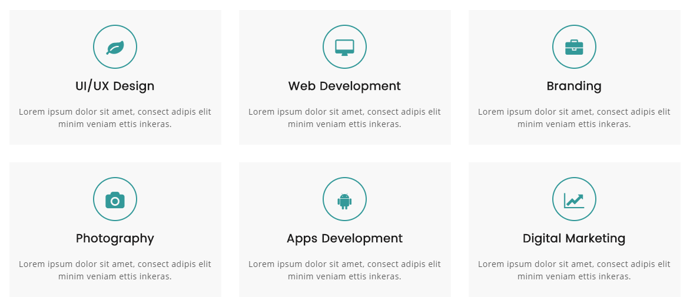
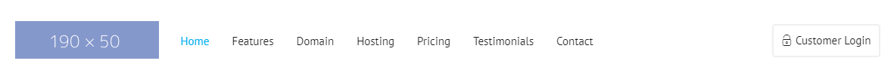

## Bài tập 11: Thực hiện code HTML theo nội dung design dưới đây:

#### Hướng dẫn: Cấu trúc design không phức tạp:

* Design này cũng là một danh sách, bên trong mỗi mục có nội dung chi tiết, ta dùng `<ul> <li>`.
* Các icons trong các mục, là font icon, nên chúng ta sử dụng font-awesome.
* Chú ý sử dụng `<hx>` cho tiêu đề.
* Có nhiều cách để làm bài tập này, có thể dùng float, hoặc box flex.
* Icon có border tròn bao ngoài, cách làm giống như `Bài tập 3`.
* Canh giữa từng mục bằng `text-align: center;`.

### Bài giải chưa kèm css

```{html}
<!doctype html>
<html lang="en">
<head>
<meta charset="utf-8">
<title>Học web chuẩn</title>
<link rel="stylesheet" href="/exercises/css/fontawesome.css" media="all">
</head>
<body>
  <ul class="product-list">
    <li>
      <p class="icon"><i class="fas fa-leaf"></i></p>
      <h3>UI/UX Design</h3>
      <p class="text">Lorem ipsum dolor sit amet, consectetur adipiscing elit mi quis, vulputate magna.</p>
    </li>
    <li>
      <p class="icon"><i class="fa fa-desktop"></i></p>
      <h3>Web Development</h3>
      <p class="text">Lorem ipsum dolor sit amet, consectetur adipiscing elit mi quis, vulputate magna.</p>
    </li>
    <li>
      <p class="icon"><i class="fa fa-briefcase"></i></p>
      <h3>Branding</h3>
      <p class="text">Lorem ipsum dolor sit amet, consectetur adipiscing elit mi quis, vulputate magna.</p>
    </li>
    <li>
      <p class="icon"><i class="fa fa-camera"></i></p>
      <h3>Photography</h3>
      <p class="text">Lorem ipsum dolor sit amet, consectetur adipiscing elit mi quis, vulputate magna.</p>
    </li>
    <li>
      <p class="icon"><i class="fab fa-android"></i></p>
      <h3>Apps Development</h3>
      <p class="text">Lorem ipsum dolor sit amet, consectetur adipiscing elit mi quis, vulputate magna.</p>
    </li>
    <li>
      <p class="icon"><i class="fas fa-chart-line"></i></p>
      <h3>Digital Marketing</h3>
      <p class="text">Lorem ipsum dolor sit amet, consectetur adipiscing elit mi quis, vulputate magna.</p>
    </li>
  </ul>
</body>
</html>
```

### Bài giải kèm css
```{html}
<!doctype html>
<html lang="en">
<head>
<meta charset="utf-8">
<title>Học web chuẩn</title>
<link rel="stylesheet" href="/exercises/css/fontawesome.css" media="all">
<style>
  /* Reset */
  * {
    margin: 0;
    padding: 0;
  }
  ul {
    list-style: none;
  }
  body {
    color: #333;
    font-family: Helvetica,sans-serif;
    font-size: 16px;
    line-height: 1.5;
  }
  .clearfix {
    zoom: 1;
  }
  .clearfix:after {
    clear: both;
    content: ".";
    display: block;
    height: 0;
    line-height: 0;
    visibility: hidden;
  }

  /* Layout */
  .product-list {
    margin: 30px auto;
    width: 1140px;
  }
  .product-list li {
    background-color: #f8f8f8;
    float: left;
    margin-bottom: 30px;
    margin-right: 30px;
    padding: 25px 15px;
    text-align: center;
    width: 330px;
  }
  .product-list li:nth-child(3n) {
    margin-right: 0;
  }
  .product-list li:nth-child(3n+1) {
    clear: left;
  }
  .product-list li .icon {
    border: 2px solid #399;
    border-radius: 50%;
    color: #399;
    font-size: 28px;
    display: inline-block;
    height: 71px;
    line-height: 78px;
    margin-bottom: 15px;
    text-align: center;
    width: 71px;
  }
  .product-list li h3 {
    margin-bottom: 20px;
  }
  .product-list li .text {
    color: #5b5b5b;
    font-size: 14px;
  }
</style>
</head>
<body>
  <ul class="product-list clearfix">
    <li>
      <p class="icon"><i class="fas fa-leaf"></i></p>
      <h3>UI/UX Design</h3>
      <p class="text">Lorem ipsum dolor sit amet, consectetur adipiscing elit mi quis, vulputate magna.</p>
    </li>
    <li>
      <p class="icon"><i class="fa fa-desktop"></i></p>
      <h3>Web Development</h3>
      <p class="text">Lorem ipsum dolor sit amet, consectetur adipiscing elit mi quis, vulputate magna.</p>
    </li>
    <li>
      <p class="icon"><i class="fa fa-briefcase"></i></p>
      <h3>Branding</h3>
      <p class="text">Lorem ipsum dolor sit amet, consectetur adipiscing elit mi quis, vulputate magna.</p>
    </li>
    <li>
      <p class="icon"><i class="fa fa-camera"></i></p>
      <h3>Photography</h3>
      <p class="text">Lorem ipsum dolor sit amet, consectetur adipiscing elit mi quis, vulputate magna.</p>
    </li>
    <li>
      <p class="icon"><i class="fab fa-android"></i></p>
      <h3>Apps Development</h3>
      <p class="text">Lorem ipsum dolor sit amet, consectetur adipiscing elit mi quis, vulputate magna.</p>
    </li>
    <li>
      <p class="icon"><i class="fas fa-chart-line"></i></p>
      <h3>Digital Marketing</h3>
      <p class="text">Lorem ipsum dolor sit amet, consectetur adipiscing elit mi quis, vulputate magna.</p>
    </li>
  </ul>
</body>
</html>
```
## Bài tập 12: Thực hiện code HTML theo nội dung design dưới đây:

### Hướng dẫn

* Design này là phần header, gồm có logo (image), danh sách (navigation - liên kết điều hướng), và button.
* Logo thường sử dụng `<h1>` và có liên kết về trang chủ.
* Phần danh sách là một điều hướng (navigation), do đó cần bao ngoài bằng tag `<nav>`.
* Chú ý phần `<button>` có chứa một font-icon.
* Nhìn design ta thấy rõ chia 2 phần, bên trái (gồm logo và thanh điều hướng navigation) và bên phải (button login), có thể dùng float, hoặc position cho button login đều được.
* Bài giải này `Tepa Edu` sẽ sử dụng position cho button login.

### Giải (chưa bao gồm css)
```{html}
<!doctype html>
<html lang="en">
<head>
<meta charset="utf-8">
<title>Học web chuẩn</title>
<link rel="stylesheet" href="/exercises/css/fontawesome.css" media="all">
</head>
<body>
  <header>
    <h1 id="logo"><a href="./"></a></h1>
    <nav class="navigation">
      <ul>
        <li><a href="./">Home</a></li>
        <li><a href="./">Features</a></li>
        <li><a href="./">Domain</a></li>
        <li><a href="./">Hosting</a></li>
        <li><a href="./">Pricing</a></li>
        <li><a href="./">Testimonials</a></li>
        <li><a href="./">Contact</a></li>
      </ul>
    </nav>
    <p class="login"><i class="fas fa-lock"></i><button>Customer Login</button></p>
  </header>
</body>
</html>
```
### Giải (bao gồm css)
```{html}
<!doctype html>
<html lang="en">
<head>
<meta charset="utf-8">
<title>Học web chuẩn</title>
<link rel="stylesheet" href="/exercises/css/fontawesome.css" media="all">
<style>
  /* Reset */
  * {
    margin: 0;
    padding: 0;
  }
  ul {
    list-style: none;
  }
  body {
    color: #333;
    font-family: Helvetica,sans-serif;
    font-size: 16px;
    line-height: 1.5;
  }
  .clearfix {
    zoom: 1;
  }
  .clearfix:after {
    clear: both;
    content: ".";
    display: block;
    height: 0;
    line-height: 0;
    visibility: hidden;
  }

  /* Layout */
  header {
    margin: 30px auto;
    position: relative;
    width: 1140px;
  }
  header #logo {
    float: left;
  }
  header .navigation {
    float: left;
    padding: 15px 0 0 29px;
  }
  header .navigation li {
    display: inline-block;
    margin-right: 26px;
  }
  header .navigation li a {
    color: #1f1f1f;
    font-size: 14px;
    text-decoration: none;
    transition: 0.3s color;
  }
  header .navigation li.active a,
  header .navigation li a:hover {
    color: #00aeef;
  }
  header .login {
    position: absolute;
    right: 0;
    top: 4px;
  }
  header .login button {
    background: none;
    border: 2px solid #efefef;
    border-radius: 4px;
    cursor: pointer;
    font-size: 14px;
    padding: 13px 12px 11px;
    transition: 0.3s border-color;
  }
  header .login button:hover {
    border-color: #00aeef;
  }
</style>
</head>
<body>
  <header class="clearfix">
    <h1 id="logo"><a href="./"></a></h1>
    <nav class="navigation">
      <ul>
        <li class="active"><a href="./">Home</a></li>
        <li><a href="./">Features</a></li>
        <li><a href="./">Domain</a></li>
        <li><a href="./">Hosting</a></li>
        <li><a href="./">Pricing</a></li>
        <li><a href="./">Testimonials</a></li>
        <li><a href="./">Contact</a></li>
      </ul>
    </nav>
    <p class="login"><button><i class="fas fa-lock"></i> Customer Login</button></p>
  </header>
</body>
</html>
```
