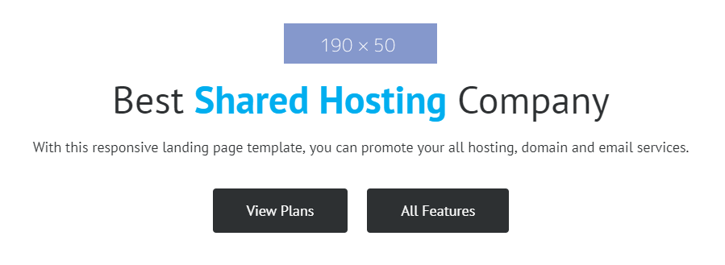
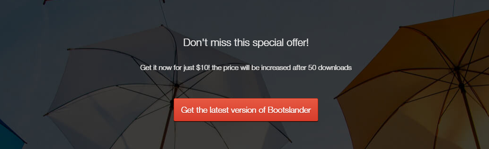

## Bài tập 1: Thực hiện code HTML theo nội dung design dưới đây:

#### Hướng dẫn: Cấu trúc design không phức tạp:

* Xem công thức chung bên dưới.
*  Riêng bên trong <hx> có một đoạn nhấn mạnh "Shared Hosting", nên ta cần sử dụng thẻ <strong>
*  2 liên kết button có dạng danh sách, nên ta sử dụng thẻ `<ul> <li>`, nếu không quan trọng SEO chỗ này, thì có thể không cần cũng được.

### Bài giải chưa kèm css

```{html}
<!doctype html>
<html lang="en">
<head>
<meta charset="utf-8">
<title>Học web chuẩn</title>
</head>
<body>
  <section class="best-shared">
    <p class="logo"></p>
    <h2>Best <strong>Shared Hosting</strong> Company</h2>
    <p class="lead-text">With this responsive landing page template, you can promote your all hosting, domain and email services.</p>
    <ul class="btn-list">
      <li><a href="./">View Plans</a></li>
      <li><a href="./">All Features</a></li>
    </ul>
  </section>
</body>
</html>
```

### Bài giải kèm css
```{html}
<!doctype html>
<html lang="en">
<head>
<meta charset="utf-8">
<title>Học web chuẩn</title>
<style>
  /* Reset */
  * {
    margin: 0;
    padding: 0;
  }
  ul {
    list-style: none;
  }
  body {
    color: #333;
    font-family: Helvetica,sans-serif;
    font-size: 16px;
  }

  /* Layout */
  .best-shared {
    margin: 20px auto;
    text-align: center;
    width: 800px;
  }
  .logo {
    margin-bottom: 15px;
  }
  .best-shared h2 {
    font-size: 45px;
    font-weight: normal;
    margin-bottom: 25px;
  }
  .best-shared h2 strong {
    color: #00aeef;
    font-weight: 600;
  }
  .lead-text {
    margin-bottom: 40px;
  }
  .btn-list {
    text-align: center;
  }
  .btn-list li {
    display: inline;
    margin: 0 12px;
  }
  .btn-list li a {
    background-color: #2d3032;
    border-radius: 4px;
    color: #fff;
    display: inline-block;
    height: 56px;
    line-height: 56px;
    min-width: 170px;
    text-decoration: none;
    transition: 0.3s background-color;
  }
  .btn-list li a:hover {
    background-color: #00aeef;
  }
</style>
</head>

<body>
  <section class="best-shared">
    <p class="logo"></p>
    <h2>Best <strong>Shared Hosting</strong> Company</h2>
    <p class="lead-text">With this responsive landing page template, you can promote your all hosting, domain and email services.</p>
    <ul class="btn-list">
      <li><a href="./">View Plans</a></li>
      <li><a href="./">All Features</a></li>
    </ul>
  </section>
</body>
</html>
```

## Bài tập 2: Thực hiện code HTML theo nội dung design dưới đây:

### Hướng dẫn

Cấu trúc design không phức tạp, gồm `<hx>`, đoạn văn dùng `<p>`, và một liên kết `<a>` hoặc có thể dùng `<button>` nếu nó không phải là liên kết.

Do cấu trúc là một nhóm có nội dung cụ thể, do đó ta có thể dùng `<section>` bao ngoài.
Đối với background thì ta dùng CSS cho `<section>` là được.

Nhìn vào design, ta thấy ngay hình nền (background) bên dưới, với hình này ta sử dụng background image cho `<section>` là được.

Nội dung bên trong canh giữa, nên ta sẽ sử dụng text-align: center; để canh giữa các phần này.

Liên kết button cần phải chỉnh nhiều kỹ thuật CSS3 như: background-gradient, box-shadow, ..., nếu bạn chưa học qua CSS3 thì bạn có thể bỏ qua các thuộc tính ở phần liên kết button này, chỉ cần dùng background-color cho đơn giản là được.

### Giải (chưa bao gồm css)
```{html}
<!doctype html>
<html lang="en">
<head>
<meta charset="utf-8">
<title>Học web chuẩn</title>
</head>
<body>
  <section class="offer">
    <h2>Don't miss this special offer!</h2>
    <p>Get it now for just $10! the price will be increased after 50 downloads.</p>
    <p class="btn"><a href="./">Get the latest version of Bootslander</a></p>
  </section>
</body>
</html>
```
### Giải (bao gồm css)
```{html}
<!doctype html>
<html lang="en">
<head>
<meta charset="utf-8">
<title>Học web chuẩn</title>
<style>
  /* Reset */
  * {
    margin: 0;
    padding: 0;
  }
  ul {
    list-style: none;
  }
  body {
    color: #333;
    font-family: Helvetica,sans-serif;
    font-size: 14px;
  }

  /* Layout */
  .offer {
    background: url(/exercises/images/bg_special.png) no-repeat left top;
    color: #fff;
    padding: 80px 0 60px;
    text-align: center;
    width: 100%;
  }
  .offer h2 {
    font-weight: normal;
    margin-bottom: 30px;
  }
  .offer .info {
    margin-bottom: 30px;
  }
  .offer .btn a {
    box-shadow: inset 0px 0px 0px 0px #cf866c;
    background: linear-gradient(to bottom, #e4553f 5%, #d83f2e 100%);
    border-radius: 4px;
    border: 1px solid #942911;
    color: #fff;
    display: inline-block;
    font-size: 16px;
    opacity: 1;
    padding: 16px 14px;
    text-decoration: none;
    text-shadow: 0px 1px 0px #854629;
    transition: 0.3s all;
  }
  .offer .btn a:hover {
    opacity: 0.8;
  }
</style>
</head>
<body>
  <section class="offer">
    <h2>Don't miss this special offer!</h2>
    <p class="info">Get it now for just $10! the price will be increased after 50 downloads</p>
    <p class="btn"><a href="./">Get the latest version of Bootslander</a></p>
  </section>
</body>
</html>
```
