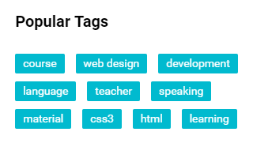
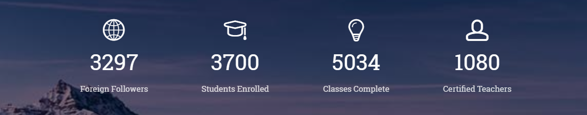

## Bài tập 9: Thực hiện code HTML theo nội dung design dưới đây:

#### Hướng dẫn: Cấu trúc design không phức tạp:

* Design gồm tiêu đề và một danh sách có liên kết.
* Dùng `display: inline-block;` cho danh sách để tiện việc điều khiển khoảng cách.

### Bài giải chưa kèm css

```{html}
<!doctype html>
<html lang="en">
<head>
<meta charset="utf-8">
<title>Học web chuẩn</title>
</head>
<body>
  <section class="tag-list">
    <h2>Popular Tags</h2>
    <ul>
      <li><a href="./">course</a></li>
      <li><a href="./">web design</a></li>
      <li><a href="./">development</a></li>
      <li><a href="./">language</a></li>
      <li><a href="./">teacher</a></li>
      <li><a href="./">speaking</a></li>
      <li><a href="./">material</a></li>
      <li><a href="./">css3</a></li>
      <li><a href="./">html</a></li>
      <li><a href="./">learning</a></li>
    </ul>
  </section>
</body>
</html>
```

### Bài giải kèm css
```{html}
<!doctype html>
<html lang="en">
<head>
<meta charset="utf-8">
<title>Học web chuẩn</title>
<style>
  /* Reset */
  * {
    margin: 0;
    padding: 0;
  }
  ul {
    list-style: none;
  }
  body {
    color: #333;
    font-family: Helvetica,sans-serif;
    font-size: 16px;
    line-height: 1.5;
  }

  /* Layout */
  .tag-list {
    margin: 30px auto;
    width: 300px;
  }
  .tag-list h2 {
    font-size: 20px;
    margin-bottom: 26px;
  }
  .tag-list ul li {
    display: inline-block;
    margin-bottom: 10px;
    margin-right: 10px;
  }
  .tag-list ul li a {
    background-color: #01bacf;
    border-radius: 2px;
    color: #fff;
    display: inline-block;
    font-size: 12px;
    letter-spacing: 1px;
    padding: 4px 10px 3px;
    text-decoration: none;
    transition: 0.3s background-color;
  }
  .tag-list ul li a:hover {
    background-color: #9ae13e;
  }
</style>
</head>
<body>
  <section class="tag-list">
    <h2>Popular Tags</h2>
    <ul>
      <li><a href="./">course</a></li>
      <li><a href="./">web design</a></li>
      <li><a href="./">development</a></li>
      <li><a href="./">language</a></li>
      <li><a href="./">teacher</a></li>
      <li><a href="./">speaking</a></li>
      <li><a href="./">material</a></li>
      <li><a href="./">css3</a></li>
      <li><a href="./">html</a></li>
      <li><a href="./">learning</a></li>
    </ul>
  </section>
</body>
</html>
```
## Bài tập 10: Thực hiện code HTML theo nội dung design dưới đây:

### Hướng dẫn

* Design gồm một danh sách, bên trong mỗi mục có nội dung chi tiết, ta dùng `<ul> <li>`.
* Các icons trong các mục, là font icon, nên chúng ta sử dụng `font-awesome` là được, các bạn cố gắng tìm icon cho giống design, bài học này Học Web Chuẩn dùng fontawesome cho nhanh thôi, nên có lẽ không giống đâu.
* Nội dung chỉ hiển thị thông tin thống kê, do đó không cần dùng liên kết.
* Đối với background thì ta dùng css cho tag `<div>` bao ngoài là được.
* Bài này cũng không khó, mục đích giúp các bạn thực hành chi tiết bên trong từng item của danh sách.
* Dùng float cho danh sách, bên trong chủ yếu sử dụng font-size và điều chỉnh khoảng cách.

### Giải (chưa bao gồm css)
```{html}
<!doctype html>
<html lang="en">
<head>
<meta charset="utf-8">
<title>Học web chuẩn</title>
<link rel="stylesheet" href="/exercises/css/fontawesome.css" media="all">
</head>
<body>
  <div class="analytic">
    <ul>
      <li>
        <p class="icon"><i class="fas fa-globe"></i></p>
        <p class="number">3297</p>
        <p>Foreign Follower</p>
      </li>
      <li>
        <p class="icon"><i class="fas fa-graduation-cap"></i></p>
        <p class="number">3700</p>
        <p>Students Enrolled</p>
      </li>
      <li>
        <p class="icon"><i class="far fa-lightbulb"></i></p>
        <p class="number">5034</p>
        <p>Classes Complete</p>
      </li>
      <li>
        <p class="icon"><i class="far fa-user"></i></p>
        <p class="number">1080</p>
        <p>Certified Teachers</p>
      </li>
    </ul>
  </div>
</body>
</html>
```
### Giải (bao gồm css)
```{html}
<!doctype html>
<html lang="en">
<head>
<meta charset="utf-8">
<title>Học web chuẩn</title>
<link rel="stylesheet" href="/exercises/css/fontawesome.css" media="all">
<style>
  /* Reset */
  * {
    margin: 0;
    padding: 0;
  }
  ul {
    list-style: none;
  }
  body {
    color: #333;
    font-family: Helvetica,sans-serif;
    font-size: 16px;
    line-height: 1.5;
  }

  /* Layout */
  .analytic {
    background: url(../images/bg_analytic.png) no-repeat left top;
    margin: 30px auto;
    padding: 38px 0;
    width: 1180px;
  }
  .analytic ul {
    text-align: center;
  }
  .analytic ul li {
    color: #fff;
    display: inline-block;
    width: 250px;
    text-align: center;
  }
  .analytic ul li p {
    width: 100%;
  }
  .analytic ul li .icon {
    margin-bottom: 14px;
  }
  .analytic ul li .icon i {
    font-size: 45px;
  }
  .analytic ul li .number {
    font-size: 43px;
    margin-bottom: 7px;
  }
</style>
</head>
<body>
  <div class="analytic">
    <ul>
      <li>
        <p class="icon"><i class="fas fa-globe"></i></p>
        <p class="number">3297</p>
        <p>Foreign Follower</p>
      </li>
      <li>
        <p class="icon"><i class="fas fa-graduation-cap"></i></p>
        <p class="number">3700</p>
        <p>Students Enrolled</p>
      </li>
      <li>
        <p class="icon"><i class="far fa-lightbulb"></i></p>
        <p class="number">5034</p>
        <p>Classes Complete</p>
      </li>
      <li>
        <p class="icon"><i class="far fa-user"></i></p>
        <p class="number">1080</p>
        <p>Certified Teachers</p>
      </li>
    </ul>
  </div>
</body>
</html>
```
