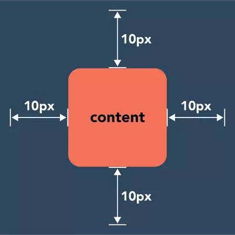

# HTML-CSS-Interview-Questions
<!-- basic -->
## CSS là gì?

Cascading Style Sheets (thường được gọi đơn giản là CSS ) là ngôn ngữ được sử dụng để giải thích và mô tả cách thức những cái được viết bằng ngôn ngữ đánh dấu (như HTML) nên được hiển thị.

Nói một cách đơn giản, CSS được sử dụng để trực quan hóa những thứ được viết bằng HTML, chẳng hạn như hình ảnh, phông chữ, hình nền, v.v.

Khi nói đến các câu hỏi phỏng vấn CSS cơ bản như vậy, các nhà tuyển dụng thường tìm kiếm những người có thể giải thích bằng ngôn từ của chính họ chứ không phải là đọc thuộc lòng như robot. Đó là lý do tại sao bạn nên cố gắng học CSS từ các định nghĩa đơn giản nhất!

## CSS "framework" là gì?

Trong CSS, các khung framework đơn giản là các thư viện của các tệp được tạo trước có thể được sử dụng trong thiết kế các trang web yêu cầu một số thiết kế CSS mặc định, phổ biến hơn.

## Làm thế nào để chỉ định màu trong CSS?

* Khi học về CSS, bạn sẽ biết được là có hai cách chỉ định màu - RGB (red-đỏ, green-xanh lá, và blue-xanh lam) và mã hexadecimal color (mã màu thập lục phân).
* RGB (red, green, and blue) là viết tắt của màu đỏ, xanh lá cây và xanh dương. Sự kết hợp khác nhau của các màu này (tùy thuộc vào tỷ lệ phần trăm của mỗi màu được sử dụng) có thể tạo ra nhiều màu sắc khác nhau.
* Mã hexadecimal color (mã màu thập lục phân) là một mã đại diện cho một màu sắc cụ thể. Các mã này được tạo thành từ sáu chữ cái và số khác nhau (mỗi sự kết hợp đại diện cho một màu khác nhau).

## Điểm khác nhau của ID selector và Class selector trong CSS?

* id là duy nhất. Mỗi phần tử chỉ có thể có một id và trang HTML chỉ có thể có một phần tử có id đó
* class thì ngược lại. Bạn có thể sử dụng cùng một class trên nhiều phần tử và một phần tử có thể có nhiều class.
* Mọi thông tin tạo kiểu cần được áp dụng cho nhiều đối tượng trên một trang nên được thực hiện với một class.

## Pseudo-class trong CSS là gì?

Một Pseudo class trong CSS được dùng để xác định trạng thái đặc biệt của một phần tử. Nó có thể được kết hợp với một bộ chọn CSS (selector) để thêm hiệu ứng cho các phần tử hiện có dựa trên trạng thái của chúng. Ví dụ:

```
/*
   Any <a> element which the user's pointer is hovering will go green
*/
a:hover {
  color: green;
}
/* Selects any <a> that has been visited and makes the text purple*/
a:visited {
  color: purple;
}
```

## Bạn biết những loại CSS selector nào?

* Basic CSS Selectors
* Descendant CSS Selectors
* Multiple CSS Selector
* Combination CSS Selectors
* Sibling CSS Selectors
* Pseudo CSS Selectors
* Pseudo CSS Selectors
* Attribute CSS Selectors

## Giải thích CSS box model và các thành phần bố cục trong nó?

**CSS box model** là một mô hình bố cục hình chữ nhật cho các phần tử HTML bao gồm những điều sau:

* **Content** \- Nội dung của box, nơi text và images xuất hiện.
* **Padding** \- Vùng trong suốt bao quanh content (tức là khoảng cách giữa border và content).
* **Border** \- Đường viền bao quanh padding (nếu có) và content.
* **Margin** \- Một vùng trong suốt bao quanh border (tức là khoảng cách giữa border và bất kỳ phần tử lân cận nào).

## Có những cách nào để ẩn một phần tử trong CSS?

* Cách 1: sử dụng `opacity: 0;`
* Cách 2: sử dụng `visibility: hidden;`
* Cách 3: sử dụng `display: none;`

## Thuộc tính float trong CSS thường dùng để làm gì?

Dùng để đặt các thẻ HTML theo hướng nằm ngang, float thường dùng 2 giá trị **left** và **right**.

## Margin và padding trong CSS khác nhau thế nào?

Margin: Nó là không gian xung quanh một phần tử. Margin được sử dụng để di chuyển một phần tử lên hoặc xuống trên một trang cũng như sang trái hoặc sang phải. Margin hoàn toàn trong suốt và không có bất kỳ màu nền nào. Mục đích chính của margin là đẩy các phần tử liền kề ra xa khỏi phần tử có chứa thuộc tính margin.



**Padding** : Nó là khoảng trống giữa phần tử và nội dung liên quan bên trong nó. Padding xác định các phần tử sẽ trông như thế nào và cách chúng sẽ được đặt bên trong một container.Khi phần tử có thuộc tính padding thì khoảng trống giữa nội dung bên trong phần tử với lề của phần tử đó sẽ tăng lên và background của padding sẽ phụ thuộc vào background của phần tử. Khi thêm padding thì kích thước của phần tử có thể thay đổi, mặc định thì kích thước của nó sẽ tăng lên.

<!-- junior -->
## Nêu những điểm khác nhau giữa CSS và CSS3?

Một số tính năng nổi bật được bổ sung thêm trong CSS3:

* animation: Xác định chuyển động của một thành phần
* appearance: Định dạng cho thành phần trông như giao diện chuẩn gần với người dùng.
* backface-visibility: Xác định bề mặt sau của thành phần khi thực hiện một chuyển động xoay.
* background-clip: Xác định vùng background được cắt bớt theo vùng được giới hạn.
* background-origin: Xác định giá trị tương đối của background giới hạn theo vùng giới hạn.
* background gradient: Tạo màu sắc cho background theo biên độ giảm dần đều.
* multiple background: Sử dụng để khai báo nhiều background khác nhau trong cùng một tag.
* border-image: Dùng để định dạng các border bằng hình ảnh.
* border-radius: Dùng để định dạng các dạng bo góc của border.
* box-align: Xác định vị trí cho thành phần thoe chiều dọc hoặc theo chiều thẳng đứng.
* box-direction: Xác định hướng cho thành phần.
* box-flex: Xác định sự ưu tiên linh hoạt theo các thành phần khác.
* box-ordinal-group: Cho biết thứ tự ưu tiên của các thành phần.
* box-orient: Xác định thành phần theo mép rìa của thành phần.
* box-sizing: Xác định lại chiều rộng và chiều cao của thành phần.
* box-shadow: Định dạng bóng cho thành phần.
* column: Dùng để chia nội dung thành phần thành nhiều cột khác nhau.
* @font-face: Định dạng các dạng font chữ khác nhau theo các dạng font riêng.
* font-size-adjust: Dùng để định dạng điều chỉnh cho font chữ, độ lớn của chữ được thể hiện bởi phép nhân.
* @keyframes: Dùng để điều khiển diễn biến một hoạt động của thành phần, được dùng kèm với thuộc tính animation
* nav: Di chuyển qua lại giữa các thành phần điều hướng (navigate) bằng ác di chuyển các phím mũi tên
* opacity: Hiển thị cấp độ trong suốt cho thành phần.
* perspective: Cho ta thấy được chiều sâu của thành phần trong khai báo 3D.
* perspective-origin: Định nghĩa trục quay cho thành phần sử dụng perspective.
* resize: Định dạng cho vùng nội dung mà người dụng có thể thay đổi được kích thước.
* text-justify: Tăng hoặc giảm khoảng cách giữa các từ và giữa các ký tự sao cho dàn đều thành phần.
* text-overflow: Xác định vùng text được cắt bớt.
* text-shadow: Xác định đổ bóng cho text.
* transform: Xác định một quá trình chuyển đổi khi có một hành động.
* word-break: Sẽ làm cho những hữ trong một từ không còn là một thể thống nhất, nghĩa là có thể xuống dòng bất cứ vị trí nào trong từ.
* word-wrap: Sẽ làm cho những từ dài xuống hàng mà không làm vỡ layout.

## Bạn biết các đơn vị đo độ dài nào và hãy giải thích về chúng?

**Đơn vị tương đối - Relative Units**

* % (percentages): Đơn vị tương đối về kích thước của phần tử con so với phần tử mẹ (parrent). Ví dụ: Nếu phần tử mẹ có thuộc tính width:500px, phần tử con có thuộc tính width:50% thì có nghĩa là phần tử con có thuộc tính width:250px
* em: Là đơn vị tương đối dựa vào thuộc tính font-size của phần tử mẹ. Ví dụ: Nếu phần tử mẹ có thuộc tính font-size:16px, phần tử con có thuộc tính font-size:2em thì có nghĩa là phần tử con có thuộc tính font-size:32px
* rem(root em): Là đơn vị tương đối dựa vào thuộc tính font-size của phần html (root element). Ví dụ: Nếu phần tử html có thuộc tính font-size:12px phần tử mẹ có thuộc tính font-size:16px, phần tử con có thuộc tính font-size:2rem thì có nghĩa là phần tử con có thuộc tính font-size:24px; Tức là đơn vị rem không phụ thuộc vào phần tử mẹ.

**Đơn vị tuyệt đối - Absolute Units**

* px \*: pixels (1px = 1/96th of 1in)
* pt: points (1pt = 1/72 of 1in)
* pc: picas (1pc = 12 pt)
* cm: centimeters
* mm: millimeters
* in: inches (1in = 96px = 2.54cm)

## Điểm khác biệt giữa "width: auto" và "width: 100%" trong CSS?

* Auto sẽ đạt điểm độ rộng đầy đủ và sẽ trừ đi độ rộng của border, margin, padding,…
* 100% sẽ buộc thẻ đó bằng độ rộng của thẻ cha và tự động nới rộng ra them nếu có them các border, padding, margin,… điều đó sẽ gây ra một số vấn đề không mong muốn)

## Giải thích các giá trị của thuộc tính position: Fixed, Absolute, Relative, Static

* Relative: Định vị trí tuyệt đối (vị trí bao ngoài), lúc này các thẻ HTML bên trong sẽ coi nó là thẻ cha.
* Absolute: Định vị trí tương đối theo thẻ cha (thẻ khai báo relative) hoặc thẻ body nếu ko có khai báo.
* Fixed: Định vị trí tương đối cho của sổ Browser của trình duyệt (khi kéo scroll nó sẽ không bị ẩn đi).
* Static: Dạng mặc định - sẽ hiển thị theo đúng thứ tự của nó (thường dùng để hủy các thuộc tính bên dưới).

## Thẻ "div" và thẻ "span" khác nhau thế nào?

Thẻ span với thuộc tính display: inline và thẻ div với thuộc tính display:block. Chúng ta thường dùng thẻ span khi muốn các element nằm trên cùng 1 line. Không được đặt thẻ block vào trong thẻ inline được, nhưng ngược lại có thể đặt thẻ inline trong thẻ block. Ví dụ:

```
<div>
  Hi<span
    >I'm the start of the span element
    <div>I'm illegal</div>
    I'm the end of the span</span
  >
  Bye I'm the end of the div
</div>
```
<!-- middle -->
## Giải thích ý nghĩa các CSS selectors dưới đây?

* div, p: chọn tất cả các thẻ div và tất cả các thẻ p.
* div p: chọn tất cả các thẻ p nằm trong thẻ div.
* div > p: chọn tất cả thẻ p có thẻ cha trực tiếp là thẻ div.
* div + p: chọn tất cả thẻ p cùng cấp với thẻ div và được đặt trực tiếp sau thẻ div.
* div ~ p: chọn tất cả thẻ p cùng cấp với thẻ div
