# Responsive Web Design
## Responsive Web Design là gì?
Responsive Web Design (RWD) là xu hướng mới theo đó quy trình thiết kế và phát triển web sẽ đáp ứng mọi thiết bị và môi trường của người dùng theo các tiêu chí kích thước và chiều của màn hình thiết bị. Responsive Web Design được tạo nên từ 3 thành phần cơ bản:
1. Flexible Grid based layout
2. Media Queries
3. Flexible Media
## Tại sao cần Responsive Web Design
1. Giúp tiết kiệm rất nhiều thời gian và chi phí khi mà bạn không cần phải duy trì từng phiên bản web khác nhau cho điện thoại và máy tính
2. Responsive Web Design giúp cải thiện SEO (search ranking) cho trang web của bạn khi mà mọi luồng đều chỉ dẫn đến một địa chỉ URL duy nhất thay vì nhiều URL khác nhau. Các báo cáo Google Analytics của bạn sẽ vẽ nên một bức tranh tốt hơn về việc sử dụng trang web của bạn vì dữ liệu từ người dùng di động và máy tính để bàn sẽ được hợp nhất. Điều tương tự cũng xảy ra với các chỉ số (like, chia sẻ) trên các trang mạng xã hội như Facebook, Twitter,...
3. Responsive Design giúp bạn dễ dàng bảo trì trang web khi mà nó không liên quan gì đến phía server, chỉ việc thay đổi html và css để thay đổi giao diện hoặc bố cục thích hợp với các thiết bị khác nhau.
## Flexible Grid Based Layouts
### 1. Viewport
Viewport là khung hình người dùng nhìn thấy trên thiết bị của họ khi vào một trang web bất kì. Với mỗi thiết khác nhau lại có viewport khác nhau. Nếu trang web cố định kích thước thì trình duyệt sẽ tự động thu nhỏ nội dung khi chuyển từ màn hình máy tính qua smartphone - điều này tạo nên trải nghiệm không tốt cho người dùng.
Trong html5
```
<meta name="viewport" content="width=device-width, initial-scale=1.0">
```
Trong đó:
* `width=device-width`: thiết lập chiều rộng của trang web theo chiều rộng của thiết bị

* `initial-scale=1.0`: thiết lập mức độ zoom ban đầu khi trang web được load bởi trình duyệt
* `user-scalable=no`: Cho phép người dùng phóng to màn hình hay không (giá trị `yes` hoặc` no`)

Xem qua ví dụ sau đây để thấy rõ sự khác biệt khi sử dụng viewport và khi không sử dụng **viewport**:
<p align="center">
    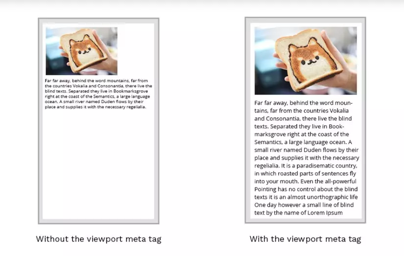
</p>

Cách sử dụng:
```
<!DOCTYPE HTML>
<html>
<head>
<meta name="viewport" content="width=device-width, maximum-scale=1.0, initial-scale=1.0, user-scalable=no">
</head>
<body>

</body>
</html>
```

### 2. GridView

<p align="center">
    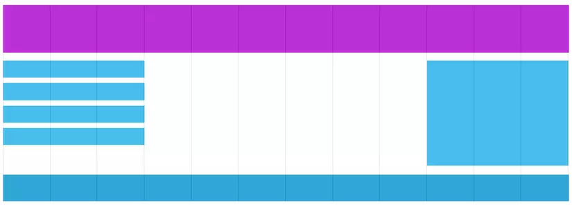
</p>

Rất nhiều trang web được xây dựng trên gridview, có nghĩa là trang web được chia thành các cột đều nhau. Một gridview thường có 12 cột ứng với 100% độ rộng và sẽ thu nhỏ hoặc mở rộng khi bạn thay đổi kích thước trình duyệt. Việc sử dụng gridview sẽ giúp bạn dễ dàng đặt vị trí các phần tử trên trang hơn, thuận lợi cho việc thực hiện responsive về sau.

Cùng xem qua ví dụ sau:
```
.container {
  width: 538px;
}
section,
aside {
  margin: 10px;
}
section {
  float: left;
  width: 340px;
}
aside {
  float: right;
  width: 158px;
}

```

<p align="center">
    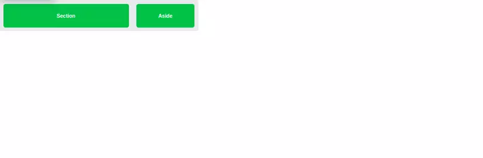
</p>

Ở đây các phần tử được giữ cố định nên khi thay đổi kích thước container thì kích thước các phần tử bên trong vẫn không thay đổi. Thay vào đó chúng ta có thể sử dụng `%` hoặc `em` để giúp các phần tử thay đổi theo kích thước của container.
```
section,
aside {
  margin: 1.858736059%; /*  10px ÷ 538px = .018587361 */
}
section {
  float: left;
  width: 63.197026%;    /* 340px ÷ 538px = .63197026 */
}
aside {
  float: right;
  width: 29.3680297%;  /* 158px ÷ 538px = .293680297 */
}
```

<p align="center">
    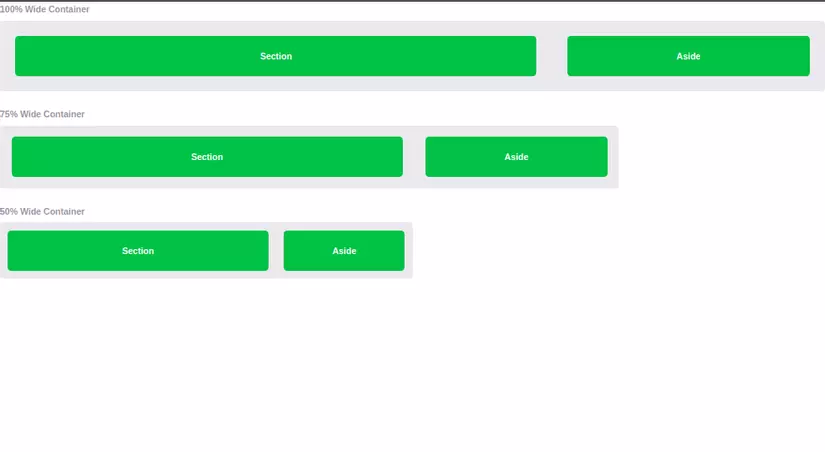
</p>

Lưu ý: Trong nội dung trên Grid-View sẽ được xây dựng hoàn toàn 1 cách thủ công để chúng ta có thể hiểu rõ cơ chế hoạt động của 1 Grid-View là như thế nào, hoàn toàn không phụ thuộc vào các thư viện CSS có sẵn như Bootstrap hay Foundation.

Ngoài ra chúng ta có thể sử dụng các class của bootstrap để chia grid.

```
<div class="row">
  <div class="col-3">...</div> <!-- 25% -->
  <div class="col-9">...</div> <!-- 75% -->
</div>
```

Tuy nhiên Flexible grid layout không là không đủ. Khi trang web có độ rộng nhỏ thì kích thước các phần tử bên trong cũng nhỏ theo khiến nội dung hiển thị không tốt. Để giải quyết vấn đề này chúng ta cùng đi đến phần tiếp theo.

### Breakpoint
Breakpoint, là những điểm (chiều rộng màn hình của thiết bị) mà ở đó giao diện được chuyển đổi cho phù hợp với thiết bị hiện tại, ví dụ như màn hình rộng hơn 1024px, thì có background-color màu đỏ, nhỏ hơn 1024px thì background-color màu xanh, khi này ta gọi 1024 là breakpoint.

Tùy vào chiều rộng hiển thị của thiết bị mà breakpoint sẽ khác nhau, hiện nay có rất nhiều thiết bị, tương ứng sẽ có nhiều chiều rộng khác nhau, nên sẽ có nhiều breakpoint khác nhau, do đó ta không thể thiết lập beakpoint cho từng loại thiết bị được.

Điểm breakpoint thường gặp
* 320 px	Màn hình chiều dọc cho smartphone nhỏ (VD iPhone 5)
* 480 px	Màn hình chiều ngang cho smartphone nhỏ
* 640 px	Màn hình chiều ngang cho smartphone vừa
* 768 px	Màn hình chiều dọc cho tablet (VD: iPad)
* 1024 px	Màn hình chiều ngang cho tablet (VD: iPad), hoặc chiều dọc cho tablet lớn (VD iPad Pro)

### Media Queries
Media Queries là một kỹ thuật CSS được giới thiệu trong CSS3. Ta sử dụng cú pháp **@media** để bao gồm một khối các thuộc tính CSS chỉ khi một điều kiện nhất định là đúng. Nói một cách đơn giản là ta sẽ định nghĩa CSS riêng cho một nhóm các thiết bị có kích thước giống nhau.<br>
Media Queries có thể được sử dụng trực tiếp trong thẻ HTML hoặc viết bên trong file css. ( Nên sử dụng @media bên trong css để tránh việc phải viết lặp lại nhiều lần)
```
<!-- Separate CSS File -->
<link href="styles.css" rel="stylesheet" media="all and (max-width: 1024px)">
```
```
/* @media Rule */
@media all and (max-width: 1024px) {...}

/* @import Rule */
@import url(styles.css) all and (max-width: 1024px) {...}
```sql
Mỗi media query có thể bao gồm một media type và theo sau bởi nhiều biểu thức. Các media types phổ biến bao gồm `all`, `screen`, `tv`,`print`. HTML5 còn bao gồm cả `3d-glasses`. Nếu media type không được chỉ định thì media query sẽ mặc định media type là `screen`.
## 1. Các biểu thức logic bên trong Media Queries
Có 3 loại toán tử logic khác nhau có thể sử dụng bên trong  media queries bao gồm `and`, `not` và `only`.

Sử dụng toán tử `and` trong media queries cho phép ta thêm điều kiện bổ sung. Ví dụ sau chọn tất cả các màn hình có độ rộng từ 800 đến 1024 pixels:
```js
@media all and (min-width: 800px) and (max-width: 1024px) {...}
```
Trong khi đó toán tử not lại phủ định truy vấn được xác định. Ví dụ dưới đây áp dụng với các thiết bị màn hình không màu ( đen và trắng screen):
```
@media not screen and (color) {...}
```
Cuối cùng là toán tử only áp dụng cho truy vấn thỏa mãn điều kiện. Biểu thức dưới đây chỉ chọn màn hình hướng theo chiều dọc:
```
@media only screen and (orientation: portrait) {...}
```
Ví dụ đơn giản
```
div {
    background-color: blue;
}

@media only screen and (max-width: 1024px) {
    div {
        background-color: red;
    }
}
```
Nội dung code trên như sau:
* Tất cả các thiết bị sẽ có background-color: blue, riêng các thiết bị có màn hình nhỏ hơn 1024px sẽ có `background-color: red`.
* `only screen`: chỉ dành cho trang hiển thị (không dành cho bản in (print)).
* `max-width`: chỉ tác dụng cho chiều rộng màn hình lớn nhất là `1024px`, tức là những màn hình nào nhỏ hơn `1024px` đều sẽ bị ảnh hưởng code bên trong, cụ thể là `div` sẽ có `background-color: red`.

### Media Features trong Media Queries

Media feature xác định các thuộc tính hoặc thành phần nào sẽ được nhắm tới trong media queries.

#### Height & Width
Đây chính là một trong những media feature phổ biến nhất xoay quanh việc xác định chiều cao và chiều rộng cho viewport của thiết bị hoặc browser. Chiều cao và chiều rộng được chỉ định qua từ khóa height và width. Giá trị của height hoặc width có thể là đơn vị độ dài, tương đối hoặc tuyệt đối. Chúng còn thường được đi kèm với các tiền tố min và max để xác định giới hạn màn hình mà các truy vấn được áp dụng. Ví dụ
```
@media all and (min-width: 320px) and (max-width: 780px) {...}
```
#### Orientation: Portrait / Landscape
Media queries còn được sử dụng để xác định hướng của browser thiết bị sử dụng từ khóa orientation, cho phép ta xác định thiết bị đang được xem nằm ở hướng dọc (portrait) hay ngang (landscape). Tính năng này được áp dụng chủ yếu trên các thiết bị di động.
```
@media all and (orientation: landscape) {...}
```
#### Aspect Ratio
Tỉ lệ khung hình (aspect ratio) trong media queries cho phép ta chỉ định tỉ lệ chiều rộng\chiều cao của thiết bị mà truy vấn được áp dụng . Chúng cũng thường đi kèm với các tiền tố `min` và `max`.
```
@media all and (min-device-aspect-ratio: 16/9) {...}
```
#### Resolution
Tính năng độ phân giải (resolution) chỉ định độ phân giải của thiết bị đầu ra theo mật độ pixel, hay còn được gọi là điểm ảnh trên mỗi inch (DPI - Dots Per Inch) . Chúng sẽ không đi kèm với các tiền tố `min` và `max` mà thay vào đó là số điểm ảnh trên mỗi pixel `dppx` và số điểm ảnh trên cm `dpcm`.
```
@media print and (min-resolution: 300dpi) {...}
```
#### Nguyên tắc Mobile First trong Responsive
<p align="center">
    
</p>
Moble First nghĩa là bạn luôn thiết kế ứng dụng cho màn hình mobile trước rồi mới đến các màn hình lớn dần. ( Điều này giúp trang web hiển thị nhanh hơn trên các thiết bị màn hình nhỏ hơn) . Ví dụ :

```
/*Smart phone nhỏ*/
@media screen and (min-width: 240px){

}
/*Iphone(480 x 640)*/
@media screen and (min-width: 320px){

}
/*Tablet nhỏ(480 x 640)*/
@media screen and (min-width: 480px){

}
/*Ipad dọc(768 x 1024)*/
@media screen and (min-width: 768px){

}
/*Ipad ngang(1024 x 768)*/
@media screen and (min-width: 1024px){

}
```
#### Media Queries Demo
```
@media all and (max-width: 420px) {
  section, aside {
    float: none;
    width: auto;
  }
}
```
<p align="center">
    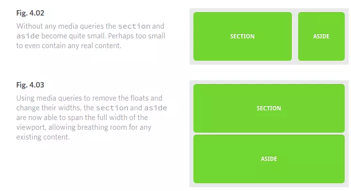
</p>

### Flexible Media
Cuối cùng nhưng không kém phần quan trọng chính là flexible media. Khi mà viewport thay đổi kích thước thì các đa phương tiện (ảnh, video,..) cũng cần có khả năng thay đổi sao cho phù hợp.

Một cách thông dụng là set width là `100%` cùng với `height: auto`. Khi đó ảnh hoặc video sẽ thay đổi chiều rộng và chiều cao sao cho phù hợp với độ dãn của màn hình.
```
img {
  width: 100%;
  height: auto;
}
```
Nếu muốn ảnh hoặc video thay đổi theo viewport nhưng không quá kích thước gốc của nó ta có thể sử dụng thuộc tính `max-width`:
```
img {
  max-width: 100%;
  height: auto;
}
```
### Responsive image
Một tấm hình (image) thường có kích thước cố định, nếu ta không xử lý thì image này sẽ không chạy tốt trên các chiều rộng màn hình khác nhau, ví dụ trong trường hợp màn hình nhỏ hơn chiều rộng tấm hình, thì sẽ có thanh cuộn (scroll bar) ngang.

Để image có thể chạy tốt trên các màn hinh khác nhau, chúng ta sử dụng `width` và `max-width` kết hợp.
#### Cách viết một responsive image
```
img {
    width: percent;
    max-with: pixcel;
}
```
* `width: percent`: cho chiều rộng image co giản tỷ lệ theo chiều rộng của màn hình thiết bị, VD: **width: 100%** thì image lúc nào cũng sẽ có chiều rộng bằng với chiều rộng màn hình thiết bị, cho dù màn hinh thiết bị co giản rộng lớn ra sao thì image luôn là **100%** (chiều cao mặc định auto - tự động tỷ lệ theo chiều rộng).
* `max-width: pixcel`: chiều rộng lớn nhất thường sẽ cho bằng với chiều rộng thực tế của image, mục đích là khi màn hình thiết bị lớn hơn image, thì chiều rộng của image sẽ trả về ban đầu, mục đích không phóng to image, tránh làm giảm chất lượng hình ảnh.
#### Ví dụ responsive image
Chúng ta sẽ thử dùng width và max-width để tạo image hiển thị linh hoạt cho tất cả các dạng màn hình của từng thiết bị, ta làm như sau:
HTML viết:
```

```
CSS viết:
```
img {
    width: 100%;
    max-width: 960px;/* chiều rộng của image */
}
```
Do chiều rộng màn hình hiển thị nhỏ hơn chiều rộng image, nên chiều rộng image hiện tại sẽ là 100% so với chiều rộng hiển thị.

<p align="center">
    
</p>

### Responsive thay đổi image
Thỉnh thoảng có những design, hình ảnh trên PC và SP sẽ khác nhau, ví dụ như hình trên PC lớn hơn, nội dung text xem trên PC rõ, nhưng khi xem trên SP lại rất nhỏ, khi đó designer sẽ thiết kế một image khác, với nội dung text lớn hơn dành riêng cho SP.

Trường hợp này, ta có thể lựa chọn sử dụng **background-image** thay thế cho **image**, nhưng đôi lúc bắt buộc cần phải sử dụng ``.

Giải pháp ở đây có nhiều cách, như sử dụng Javascript, CSS, HTML, ..., trong phạm vi bài học này, Học tepa.edu sẽ giới thiệu tới các bạn 2 cách đơn giản mà rất hiệu quả đó là dùng tag HTML `<picture>` và CSS.
#### Responsive thay đổi image với <picture>
Cách này sử dụng hiệu quả, tuy nhiên chỉ dùng được cho những trình duyệt mới nhất gần đây.
```
<picture>
    <source media="(min-width: 1025px)" srcset="img_red.jpg">
    <source media="(min-width: 641px)" srcset="img_blue.jpg">
    
</picture>
```
* `media="(min-width: 1025px)"`: nội dung này chỉ hiển thị cho thiết bị có màn hình lớn hơn 1024px.
* `media="(min-width: 640px)"`: nội dung này chỉ hiển thị cho thiết bị có màn hình lớn hơn 640px.
* ``: sẽ hiển thị image này, nếu không thỏa các điều kiện trên, tức là màn hình nhỏ hơn 640px.
Nội dung trên sẽ cho ta kết quả sau:
<p align="center">
    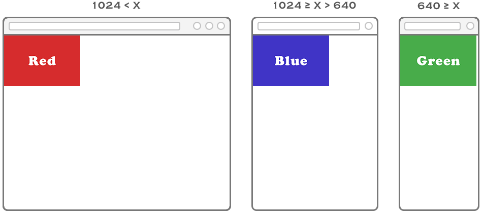
</p>

#### Responsive thay đổi image với CSS
Thay vì dùng **media** như trên, ta có thể sử dụng CSS để thay thế, cách làm này nhỏ gọn, tiện lợi, tuy nhiên nếu lạm dụng nhiều sẽ khiến cho trang HTML nặng nề hơn, hiệu quả load page cũng kém đi.

Cách làm là ta sử dụng các class khác nhau để điều khiển ẩn hiện các hình khác nhau, cách này không những sử dụng cho image mà còn sử dụng cho nhiều thành phần khác nhau, ta làm như sau: <br>
HTML viết:
```


```
CSS viết:
```
/* Hiển thị cho PC, nên tablet và SP sẽ ẩn */
@media only screen and (min-width: 1025px) {
    .tablet, .sp {
        display: none;
    }
}

/* Hiển thị cho tablet, nên PC và SP sẽ ẩn */
@media only screen and (max-width:1024px) and (min-width: 641px) {
    .sp, .pc {
        display: none;
    }
}

/* Hiển thị cho SP, nên tablet và PC sẽ ẩn */
@media only screen and (max-width: 640px) {
    .pc, .tablet {
        display: none;
    }
}
```
Cách ghi là PC, SP, Tablet chỉ mang tính chất tượng trưng, vì hiện tại có rất nhiều điện thoại có chiều rộng lớn hơn cả Tablet, tuy vậy cách ghi trên cũng không ảnh hưởng gì vì nội dung vẫn hiển thì đúng, tốt hơn việc xử lý cho từng thiết bị riêng biệt (như xử lý cho từng thiết bị: Samsung Galaxy, iPhone 5S, iPhone 6Plus, iPad, Google Nexus, ...) vừa mất thời gian, vừa không bao quát hết các trường hợp.

Click ví dụ responsive thay đổi image bắng CSS để xem kết quả.

Xem kết quả sẽ cho ta thấy:

* Với màn hình lớn hơn **1025px** sẽ ẩn `class="tablet"` và `class="sp"`, khi này sẽ chỉ còn image **img_red.jpg**.
* Với màn hình lớn hơn **640px** và tới max **1024px** sẽ ẩn `class="pc"` và `class="sp"`, khi này sẽ chỉ còn image **img_blue.jpg**.
* Với màn hình từ **640px** trở xuống sẽ ẩn `class="tablet"` và `class="pc"`, khi này sẽ chỉ còn image **img_yellow.jpg**.
### Responsive paragraph
Tùy vào yêu cầu cụ thể mà ta sẽ thiết lập chiều rộng của đoạn văn bản (paragraph), nhưng thông thường ta nên để chiều rộng mặc định hoặc 100% để linh hoạt theo từng màn hình.

Một trường hợp khác là chiều rộng paragraph phụ thuộc vào chiều rộng của thành phần bên ngoài, khi này ta vẫn thiết lập chiều rộng paragraph theo mặc định hoặc 100%, và cần thiết lập chiều rộng của thành phần bên ngoài tùy vào màn hình, ví dụ với màn hình lớn, thì chiều rộng thành phần bên ngoài ta thiết lập chiều rộng cố định (theo design), đối với màn hình nhỏ, ta sẽ thiết lập phần trăm, xem ví dụ sau đây để hiểu rõ hơn:


```
<div>
    <p>Cras vitae orci mattis, venenatis nisl in, ullamcorper orci. Aliquam ultricies, nunc eu tincidunt tempus, lectus quam fermentum orci, nec congue nunc metus molestie velit. Pellentesque vel vulputate dui. Donec et congue magna. Maecenas dignissim ut libero vel euismod. Maecenas et vestibulum nisi, in rutrum ligula. Vivamus a varius enim.</p>
</div>
```
CSS viết:
```
div {
    margin: 0 auto; /* thuộc tính này giúp cho thành phần div vào giữa */
    border: 1px solid #ccc;
    width: 100%;
    max-width: 600px; /* ví dụ chiều rộng lớn nhất theo design */
}
```
<p align="center">
    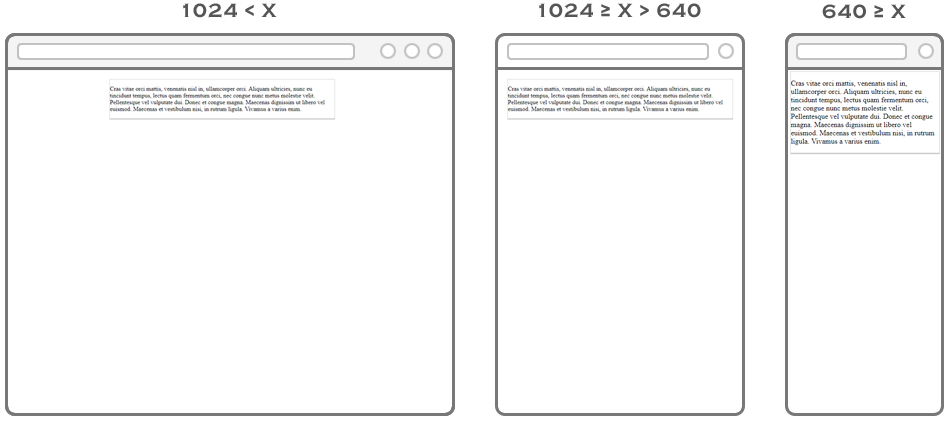
</p>

#### Responsive paragraph với image
<p align="center">
    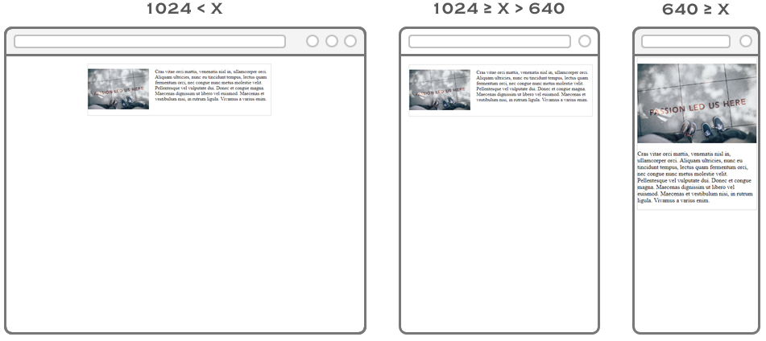
</p>

Cách thể hiện responsive paragraph với image không khó, vẫn là cách xử lý max-width và width, tuy nhiên nếu paragraph và image là 2 thành phần sử dụng float thì ta cần xử lý thêm một chút ở phần float và width, các bạn xem ví dụ sau để hiểu rõ hơn nhé: giả sử design thiết kế cho PC có thành phần bao ngoài là 600px, và màn hình SP sẽ linh hoạt, 100%, ta có:

HTMl viết:
```
<div>
    <p class="image"></p>
    <p class="text">Cras vitae orci mattis, venenatis nisl in, ullamcorper orci. Aliquam ultricies, nunc eu tincidunt tempus, lectus quam fermentum orci, nec congue nunc metus molestie velit. Pellentesque vel vulputate dui. Donec et congue magna. Maecenas dignissim ut libero vel euismod. Maecenas et vestibulum nisi, in rutrum ligula. Vivamus a varius enim.</p>
</div>
```
CSS viết:
```
div {
        margin: 0 auto;
        border: 1px solid #ccc;
        width: 100%;
        max-width: 600px;
    }

    /* Đây là thủ thuật clearfix, ai chưa biết thì xem lại bài học CSS he */
    div:after {
        clear: both;
        content: ".";
        display: block;
        height: 0;
        line-height: 0;
        visibility: hidden;
    }

    .image {
        float: left;
        margin-right: 20px;
        width: 200px;
    }

    .image img {
        max-width: 100%; /* Dành cho hình có width lớn hơn thành phần bao ngoài */
    }

    .text {
        float: left;
        width: 380px;
    }

    @media only screen and (max-width: 640px) {
        .image,
        .text {
            float: none;
            width: 100%;
        }

        .image {
            margin-right: 0;
        }
    }
```
Đoạn code trên ta xử lý cho màn hình nhỏ hơn 640px, với các thuộc tính và giá trị như sau:

* `float: none`: ở màn hình SP nếu sử dụng **float** sẽ khiến cho image nhỏ và nội dung text dài, do đó loại bỏ **float** đi.
* `width: 100%`: cho chiều rộng full 100% thành phần bao ngoài.
* `margin-right: 0`: trả về **margin-right**, vì nếu không thì image sẽ bị tràn **20px** bên phải.
### Responsive với list
<p align="center">
    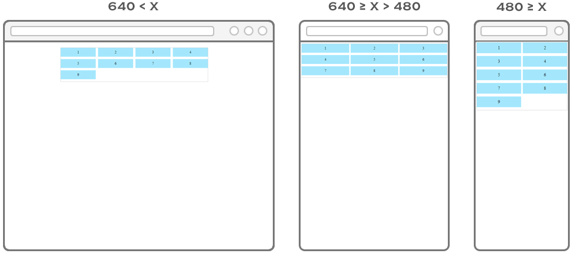
</p>

HTML viết
```
<ul>
    <li>1</li>
    <li>2</li>
    <li>3</li>
    <li>4</li>
    <li>5</li>
    <li>6</li>
    <li>7</li>
    <li>8</li>
    <li>9</li>
</ul>
```
CSS:
```
ul, li {
    list-style: none;
    padding: 0;
}

ul {
    border: 1px solid #ccc;
    margin: 0 auto;
    width: 630px;
    max-width: 100%;
}

/* Đây là thủ thuật clearfix, ai chưa biết thì xem lại bài học CSS he */
ul:after {
    clear: both;
    content: ".";
    display: block;
    height: 0;
    line-height: 0;
    visibility: hidden;
}

ul li {
    background-color: #a4e7fd;
    float: left;
    margin-right: 10px;
    margin-bottom: 10px;
    padding: 10px 0;
    text-align: center;
    width: 150px;
}

@media only screen and (min-width: 641px) {
    ul li:nth-child(4n){
        margin-right: 0;
    }
}

@media only screen and (max-width: 640px) and (min-width: 481px) {
    ul li {
        margin-right: 1%;
        width: 32.6666%;
    }

    ul li:nth-child(3n){
        margin-right: 0;
    }
}

@media only screen and (max-width: 480px) {
    ul li {
        margin-right: 2%;
        width: 49%;
    }

    ul li:nth-child(2n){
        margin-right: 0;
    }
}
```
Giải thích:
* `min-width: 641px`: nội dung trong đây chỉ ảnh hưởng cho các màn hình lớn hơn **640px**, làm thao tác này ta sẽ không cần reset lại cho các màn hình nhỏ hơn.
* `max-width: 640px` và `min-width: 481px`: nội dung trong đây chỉ ảnh hưởng cho các màn hình nhỏ hơn **640px** và lớn hơn **480px**, ta sẽ không cần reset lại cho các màn hình nhỏ hơn **480px**.

  * `width: 32.6666%`: với màn hình này, ta sẽ sử dụng phần trăm, và điều khiển list sao cho chỉ còn hiển thị 3 item, tùy vào yêu cầu mà bạn có thể điều chỉnh tùy ý, các bạn có thể sử dụng công cụ sau để tìm % thích hợp Generator: Block list float.
  * `margin-right: 1%`: Ta cũng chuyển margin-right sang dạng phần trăm mới đảm bảo tính linh hoạt.
  * `ul li:nth-child(3n)`: khi này, do list hàng ngang chỉ còn 3 item, nên .
* `max-width: 480px`: nội dung trong đây chỉ ảnh hưởng cho các màn hình nhỏ hơn **480px**.

### Responsive table
Table là dạng layout dành cho việc hiển thị dữ liệu nhiều, chi tiết, nên việc hiển thị trên các màn hình nhỏ sẽ không đơn giản đối với những bạn mới biết về layout web, bài học này sẽ giúp các bạn biết cách thực hiện responsive một số dạng table thường gặp.

Table có nhiều dạng khác nhau, tuy nhiên 2 dạng thường gặp là table dọc và table ngang, ta lần lượt xem hướng dẫn cách xử lý table trên các chiều rộng màn hình khác nhau nhé.
#### Responsive với table dọc
<p align="center">
    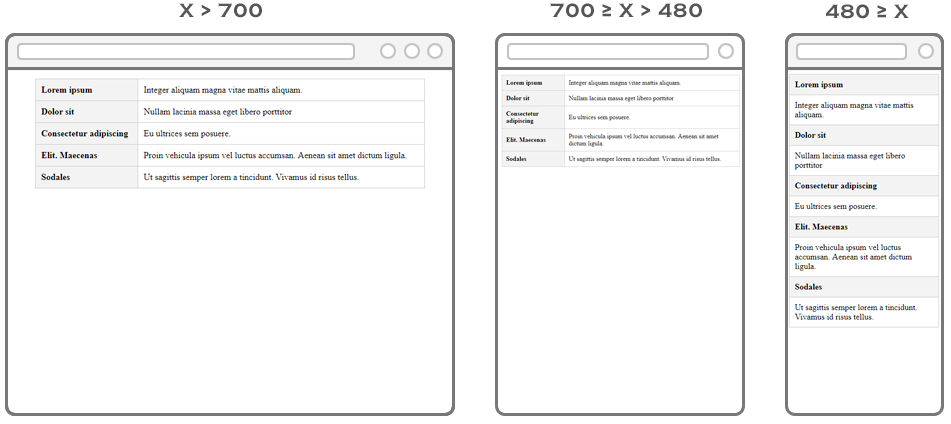
</p>

#### Responsive với table ngang
<p align="center">
    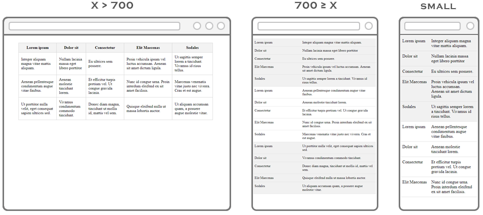
</p>

#### Responsive với table phức tạp
<p align="center">
    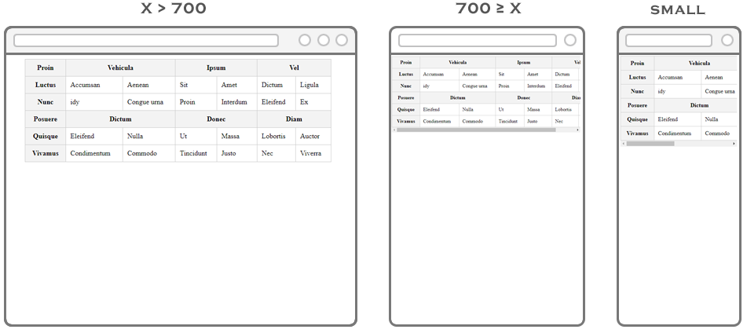
</p>

### Responsive form
Thông thường form sẽ có 2 dạng:

* Dạng `<label>` sẽ sắp xen kẽ với nội dung nhập liệu (dạng đơn giản)
* Dạng `<label>` sẽ sắp bên trái, nội dung nhập liệu sẽ sắp bên phải (dạng table dọc)

<p align="center">
    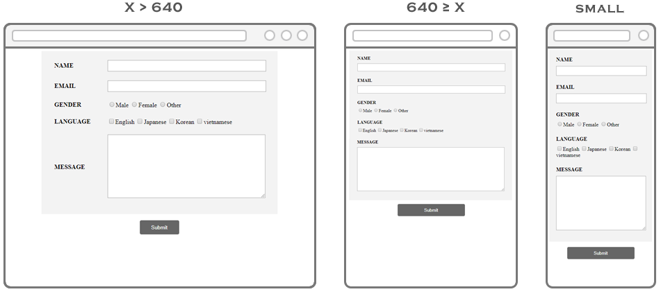
</p>

### Responsive đổi vị trí - flex order
<p align="center">
    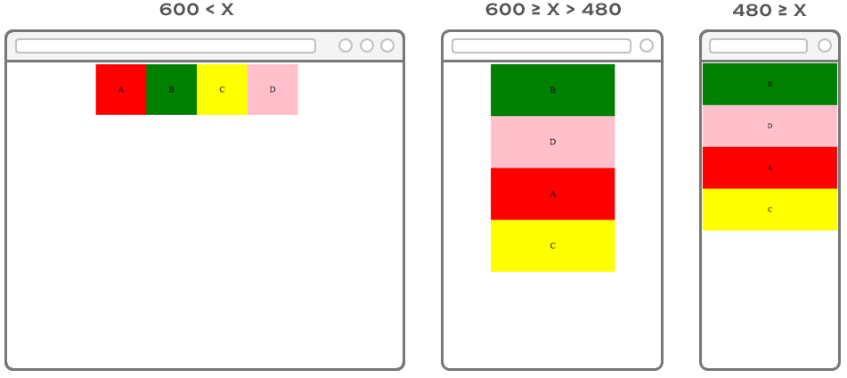
</p>

### Responsive - layout block
<p align="center">
    
</p>

### Các dạng Responsive
* Responsive - ưu tiên Mobile (Mobile first)
* Responsive - ưu tiên PC (Desktop layout)
* Responsive - cách viết theo thứ tự màn hình
* Responsive - cách viết theo tính năng


## Trích nguồn
* [Responsive image https://hocwebchuan.com/](https://hocwebchuan.com/tutorial/responsive/responsive_image.php)
