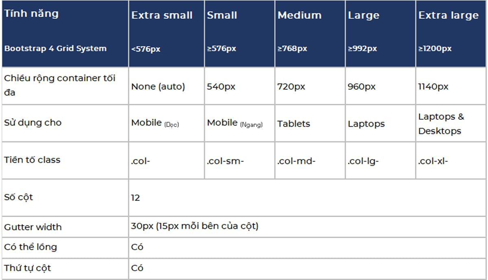
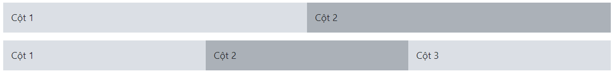

# Bootstrap

## 1. THIẾT LẬP DỰ ÁN BOOTSTRAP

Bây giờ chúng ta sẽ tạo một Bootstrap template cơ bản bằng cách thêm các tệp Bootstrap CSS và JS, cũng như JavaScript phụ thuộc khác như jQuery và Popper.js thông qua CDN.

Mình khuyên bạn nên thêm Bootstrap trong dự án của mình thông qua CDN (Mạng phân phối nội dung) vì CDN mang lại lợi ích về hiệu suất bằng cách giảm thời gian tải, vì họ đang lưu trữ tệp trên nhiều máy chủ trên toàn cầu để khi người dùng yêu cầu, tệp sẽ được phân phát từ máy chủ gần họ nhất.

### Bước #1: Tạo trang HTML đơn giản

Mở VSCode (hoặc trình soạn thảo yêu thích của bạn) và tạo một tệp HTML mới với tên **basic.html**

```
<head>
    <meta charset="utf-8">
    <meta name="viewport" content="width=device-width, initial-scale=1, shrink-to-fit=no">
    <title>Trang HTML đơn giản</title>
</head>

<body>
    <h1>Xin chào Bootstrap!</h1>
</body>
```

> Lưu ý #1: Luôn bao gồm thẻ <meta> viewport bên trong phần head để cho phép phóng to và đảm bảo hiển thị phù hợp trên thiết bị di động.

> Lưu ý #2: Nếu bạn không xem được thì bạn cần vào Codepen.io, vượt captcha và quay lại đây tải lại trang nhé.

### Bước #2: Đặt file HTML này làm Template

Để làm cho file HTML đơn giản này trở thành Template Bootstrap, bạn chỉ cần thêm các tệp Bootstrap CSS và JS cũng như jQuery và Popper.js bắt buộc bằng cách sử dụng link CDN.

Bạn nên bao gồm các tệp JavaScript ở cuối trang, ngay trước thẻ đóng `</body>` để cải thiện hiệu suất tải trang, như được hiển thị trong ví dụ sau:

```
<head>
    <meta charset="utf-8">
    <meta name="viewport" content="width=device-width, initial-scale=1, shrink-to-fit=no">
    <title>Template Bootstrap</title>
    <!-- File Bootstrap CSS -->
    <link rel="stylesheet" href="https://stackpath.bootstrapcdn.com/bootstrap/4.5.0/css/bootstrap.min.css">
    <!-- CSS tùy chỉnh của bạn ở dưới này -->
</head>

<body>
    <h1>Xin chào Bootstrap!</h1>

    <!-- Code của bạn ở trên -->
    <!-- Các File JS:
        1: jQuery đầu tiên
        2: Sau đó Popper.js
        3: Cuối cùng là Bootstrap JS
    -->
    <script src="https://code.jquery.com/jquery-3.5.1.min.js"></script>
    <script src="https://cdn.jsdelivr.net/npm/popper.js@1.16.0/dist/umd/popper.min.js"></script>
    <script src="https://stackpath.bootstrapcdn.com/bootstrap/4.5.0/js/bootstrap.min.js"></script>
</body>
```

Tất cả đã sẵn sàng!

Sau khi thêm các tệp CSS và JS của Bootstrap cũng như thư viện jQuery và Popper.js cần thiết, chúng ta có thể bắt đầu lập trình web ngay với Bootstrap Framework.

Thuộc tính **integrity** và **crossorigin** đã được thêm vào link CDN để triển khai (SRI - Subresource Integrity). Đây là một tính năng bảo mật cho phép bạn giảm thiểu nguy cơ tấn công bắt nguồn từ các CDN bị xâm phạm, bằng cách đảm bảo rằng các tệp mà trang web của bạn tìm nạp (từ CDN hoặc bất kỳ nơi nào) đã được phân phối mà không có các sửa đổi bất ngờ hoặc độc hại.

Nó hoạt động bằng cách cho phép bạn cung cấp mã băm mà tệp được tìm nạp phải khớp.

> Ghi chú: Nếu khách truy cập vào trang web của bạn đã tải xuống tệp CSS và JS của Bootstrap từ cùng một CDN. Khi truy cập các trang web khác, nó sẽ được tải từ bộ nhớ cache của trình duyệt thay vì lại phải tải xuống, dẫn đến thời gian tải nhanh hơn.

### Bước #3: Lưu file

Bây giờ hãy lưu tệp trên màn hình của bạn dưới dạng 'bootstrap-template.html'.

Để mở tệp này trong trình duyệt web, hãy điều hướng đến tệp, sau đó nhấp chuột phải vào tệp và chọn open. Ngoài ra, bạn có thể mở trình duyệt của mình và kéo tệp này vào đó.

> Lưu ý: Điều quan trọng đảm bảo phần mở rộng chính xác là .html. Nếu không, một số trình soạn thảo văn bản, chẳng hạn như Notepad trên Windows, sẽ tự động lưu nó dưới dạng .txt

Ngoài ra, bạn cũng có thể tải xuống các tệp CSS và JS của Bootstrap từ trang web chính thức của họ và đưa vào dự án của bạn.

Tải xuống được biên dịch chứa phiên bản đã được biên dịch và rút gọn của các tệp CSS và JavaScript để giúp web nhanh hơn.

Tuy nhiên, phiên bản đã biên dịch không bao gồm bất kỳ phụ thuộc JavaScript tùy chọn nào như jQuery và Popper.js. Trong khi đó, bản Bootstrap source chứa các tệp nguồn gốc cho tất cả CSS và JavaScript, cùng với bản sao cục bộ của tài liệu.

Tải xuống và giải nén bản Bootstrap compiled. Bây giờ nếu bạn nhìn vào bên trong các thư mục, bạn sẽ thấy nó chứa các tệp CSS và JS đã biên dịch (bootstrap.*), cũng như CSS và JS đã biên dịch và rút gọn (bootstrap.min.*).

Sử dụng các tệp bootstrap.min.css và bootstrap.min.js.

Sử dụng phiên bản rút gọn của các tệp CSS và JS sẽ cải thiện hiệu suất trang web của bạn và tiết kiệm băng thông do HTTP request và kích thước tải xuống nhỏ hơn.

> Lưu ý: Các plugin JavaScript của Bootstrap yêu cầu phải có jQuery. Bạn có thể tải xuống phiên bản mới nhất của jQuery tại đây <https://jquery.com/download/>. Bạn cũng cần thêm Popper.js trước JS của Bootstrap để các chú giải hoạt động!

OK. Bây giờ bạn đã cài đặt xong, hãy đi vào cùng tìm hiểu về

## #2. HỆ THỐNG LƯỚI CỦA BOOTSTRAP

Hệ thống lưới Bootstrap là cách nhanh nhất và dễ dàng để tạo bố cục trang web responsive.

### 2.1. Hệ thống lưới Bootstrap là gì?

Phiên bản Bootstrap 4 mới nhất giới thiệu hệ thống lưới flexbox mới dành cho thiết bị di động có tỷ lệ thích hợp lên đến 12 cột khi kích thước thiết bị hoặc khung nhìn tăng lên.

Bootstrap 4 bao gồm các lớp lưới được xác định trước để nhanh chóng tạo bố cục lưới cho các loại thiết bị khác nhau như điện thoại di động, máy tính bảng, máy tính xách tay và máy tính để bàn, v.v.

VD:Bạn có thể sử dụng các lớp .col-* để tạo cột lưới cho các thiết bị cực nhỏ như điện thoại di động ở chế độ dọc.

* Tương tự, bạn có thể sử dụng các lớp `.col-sm-*` để tạo cột lưới cho các thiết bị màn hình nhỏ như điện thoại di động ở chế độ ngang
* Các lớp `.col-md-*` cho các thiết bị màn hình trung bình như máy tính bảng
* Các lớp `.col-lg-*` cho các thiết bị lớn như máy tính để bàn
* Và các lớp `.col-xl-*` cho màn hình máy tính cực lớn.

Bảng sau đây tóm tắt một số tính năng chính của hệ thống lưới Bootstrap mới.
<p align="center">
    
</p>

Việc áp dụng bất kỳ lớp `.col-sm-*` nào cho một phần tử sẽ không chỉ ảnh hưởng đến kiểu dáng của phần tử đó trên các thiết bị nhỏ mà còn ảnh hưởng cả trên các thiết bị vừa, lớn và cực lớn có chiều rộng màn hình lớn hơn hoặc bằng 540px, nếu bạn không thêm tùy chỉnh lớp `.col-md-*`, `.col-lg-*` hoặc .col-xl-* cho nó.

Tương tự, lớp `.col-md-*` sẽ không chỉ ảnh hưởng đến kiểu dáng của các phần tử trên các thiết bị vừa mà còn trên các thiết bị lớn và cực lớn nếu không có lớp `.col-lg-*` hoặc .`col-xl-*`

Làm thế nào để tạo hàng và cột bằng cách sử dụng hệ thống lưới responsive 12 cột này?

```
<div class="container">
    <!-- Hàng với 2 cột bằng nhau -->
    <div class="row">
        <div class="col-md-6">Cột trái</div>
        <div class="col-md-6">Cột phải</div>
    </div>

    <!-- Hàng với 2 cột chia tỷ lệ 1:2 -->
    <div class="row">
        <div class="col-md-4">Cột trái</div>
        <div class="col-md-8">Cột phải</div>
    </div>

    <!-- Hàng với 2 cột chia tỷ lệ 1:3 -->
    <div class="row">
        <div class="col-md-3">Cột trái</div>
        <div class="col-md-9">Cột phải</div>
    </div>
</div>
```

Kết quả:
<p align="center">
    
</p>

## Trích nguồn

* [Learn Bootstrap 4 in 30 minutes](https://www.freecodecamp.org/news/learn-bootstrap-4-in-30-minute-by-building-a-landing-page-website-guide-for-beginners-f64e03833f33/)
