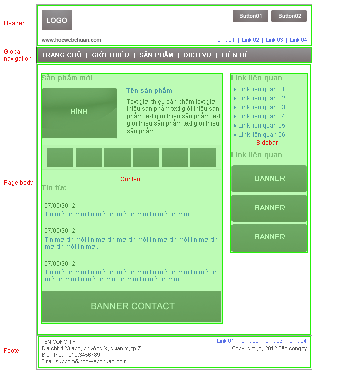
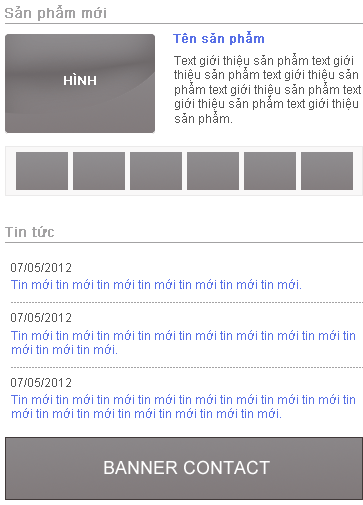
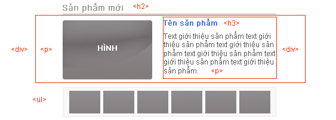
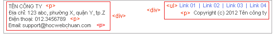

# Elements and Structure
## HTML
HTML (HyperText Markup Language) is used to give content to a web page and instructs web browsers on how to structure that content.
## Element Content
The content of an HTML element is the information between the opening and closing tags of an element.
```
<h1>Codecademy is awesome! 🙂</h1>
```
## `<li>` List Item Element
The `<li>` list item element create list items inside:
* Ordered lists `<ol>`
* Unordered lists `<ul>`
```
<ol>
  <li>Head east on Prince St</li>
  <li>Turn left on Elizabeth</li>
</ol>

<ul>
  <li>Cookies</li>
  <li>Milk</li>
</ul>
```
## `<video>` Video Element

The `<video>` element embeds a media player for video playback. The `src` attribute will contain the URL to the video. Adding the controls attribute will display video `controls` in the media player.

Note: The content inside the opening and closing tag is shown as a fallback in browsers that don’t support the element.
```
<video src="test-video.mp4" controls>
  Video not supported
</video>
```
## `<em>` Emphasis Element
The `<em>` emphasis element emphasizes text and browsers will usually italicize the emphasized text by default.
```
<p>This <em>word</em> will be emphasized in italics.</p>
```
## `<ol>` Ordered List Element
The `<ol>` ordered list element creates a list of items in sequential order. Each list item appears numbered by default.
```
<ol>
  <li>Preheat oven to 325 F 👩‍🍳</li>
  <li>Drop cookie dough 🍪</li>
  <li>Bake for 15 min ⏰</li>
</ol>
```
## `<div>` Div Element
The `<div>` element is used as a container that divides an HTML document into sections and is short for “division”. `<div>` elements can contain flow content such as headings, paragraphs, links, images, etc.
```
<div>
  <h1>A section of grouped elements</h1>
  <p>Here’s some text for the section</p>
</div>
<div>
  <h1>Second section of grouped elements</h1>
  <p>Here’s some text</p>
</div>
```
## HTML Structure
HTML is organized into a family tree structure. HTML elements can have parents, grandparents, siblings, children, grandchildren, etc.
```
<body>
  <div>
    <h1>It's div's child and body's grandchild</h1>
    <h2>It's h1's sibling</h2>
  </div>
</body>
```
## Closing Tag
An HTML closing tag is used to denote the end of an HTML element. The syntax for a closing tag is a left angle bracket `<` followed by a forward slash `/` then the element name and a right angle bracket to close `>`.
```
<body>
  ...
</body>
```
## Attribute Name and Values
HTML attributes consist of a name and a value using the following syntax: **name="value"** and can be added to the opening tag of an HTML element to configure or change the behavior of the element.
```
<elementName name="value"></elementName>
```
## `<br>` Line Break Element
The `<br>` line break element will create a line break in text and is especially useful where a division of text is required, like in a postal address. The line break element requires only an opening tag and must not have a closing tag.
```
A line break haiku.<br>
Poems are a great use case.<br>
Oh joy! A line break.
```
## `` Image Element
HTML image `` elements embed images in documents. The src attribute contains the image URL and is mandatory. `` is an empty element meaning it should not have a closing tag.
```

```
## `<h1>-<h6>` Heading Elements
HTML can use six different levels of heading elements. The heading elements are ordered from the highest level `<h1>` to the lowest level `<h6>`.
```
<h1>Breaking News</h1>
<h2>This is the 1st subheading</h2>
<h3>This is the 2nd subheading</h3>
...
<h6>This is the 5th subheading</h6>
```
## `<p>` Paragraph Element
The `<p>` paragraph element contains and displays a block of text.
```
<p>This is a block of text! Lorem ipsum dolor sit amet, consectetur adipisicing elit.</p>
```
## Unique ID Attributes
In HTML, specific and unique id attributes can be assigned to different elements in order to differentiate between them.

When needed, the id value can be called upon by CSS and JavaScript to manipulate, format, and perform specific instructions on that element and that element only. Valid id attributes should begin with a letter and should only contain letters (a-Z), digits (0-9), hyphens (-), underscores (_), and periods (.).
```
<h1 id="A1">Hello World</h1>
```
## HTML Attributes
HTML attributes are values added to the opening tag of an element to configure the element or change the element’s default behavior. In the provided example, we are giving the `<p>` (paragraph) element a unique identifier using the id attribute and changing the color of the default text using the style attribute.
```
<p id="my-paragraph" style="color: green;">Here’s some text for a paragraph that is being altered by HTML attributes</p>
```
## `<ul>` Unordered List Element
The `<ul>` unordered list element is used to create a list of items in no particular order. Each individual list item will have a bullet point by default.
```
<ul>
  <li>Play more music 🎸</li>
  <li>Read more books 📚</li>
</ul>
```
## `alt` Attribute
An `` element can have alternative text via the alt attribute. The alternative text will be displayed if an image fails to render due to an incorrect URL, if the image format is not supported by the browser, if the image is blocked from being displayed, or if the image has not been received from the URL.

The text will be read aloud if screen reading software is used and helps support visually impaired users by providing a text descriptor for the image content on a webpage.
```

```
## `<body>` Body Element

The `<body>` element represents the content of an HTML document. Content inside `<body> `tags are rendered on the web browsers.

Note: There can be only one` <body>` element in a document.
```
<body>
  <h1>Learn to code with Codecademy :)</h1>
</body>
```
## `<span>` Span Element
The `<span>` element is an inline container for text and can be used to group text for styling purposes. However, as `<span>` is a generic container to separate pieces of text from a larger body of text, its use should be avoided if a more semantic element is available.
```
<p><span>This text</span> may be styled differently than the surrounding text.</p>
```
## `<strong>` Strong Element
The `<strong>` element highlights important, serious, or urgent text and browsers will normally render this highlighted text in bold by default.
```
<p>This is <strong>important</strong> text!</p>
```
## HTML Element
An HTML element is a piece of content in an HTML document and uses the following syntax: opening tag + content + closing tag. In the code provided:
* `<p>` is the opening tag.
* Hello World! is the content.
* `</p> `is the closing tag.
```
<p>Hello World!</p>
```
## HTML Tag
The syntax for a single HTML tag is an opening angle bracket `<` followed by the element name and a closing angle bracket `>`. Here is an example of an opening `<div>` tag.
```
<div>
```
## `<a>` Anchor Element
The `<a>` anchor element is used to create hyperlinks in an HTML document. The hyperlinks can point to other webpages, files on the same server, a location on the same page, or any other URL via the hyperlink reference attribute, href. The href determines the location the anchor element points to.
```
<!-- Creating text links -->
<a href="http://www.codecademy.com">Visit this site</a>

<!-- Creating image links -->
<a href="http://www.codecademy.com">
	Click this image
</a>
```


### Học HTML
#### HTML là gì
HTML là ngôn ngữ đánh dấu, thể hiện bằng các tag (gọi là thẻ), những thẻ này giúp cho trình duyệt đọc được nội dung, có thể là text, image, hay video, form ..., và sau đó trình duyệt sẽ hiển thị nội dung cho người dùng xem.

HTML có hơn 80 thẻ, mỗi thẻ có một nhiệm vụ riêng, tuy nhiên sẽ có những thẻ được sử dụng thường xuyên, bài học HTML này sẽ giúp các bạn biết được cách sử dụng các thẻ thường được dùng này.

Do công việc thực tế hiện nay sẽ là cách kết hợp giữa HTML/XHTML và HTML5, nên Học Web Chuẩn sẽ hướng dẫn cách code chung cho 2 phiên bản này, mục đích để các bạn có thể thực tế áp dụng cho công việc được.

Để cho dễ hình dung chúng ta sẽ chia các thẻ làm các nhóm sau:

* Nhóm các thẻ block, các thẻ này dùng để sắp xếp bố cục cho trang web.
* Nhóm các thẻ inline, là những thẻ cơ bản nhất, chỉ chứa được các thẻ inline cùng cấp hoặc text.



Với những phân tích trên, ta thấy những phần như: header, global navigation, page body, content, sidebar, footer đều là những phần nội dung lớn, do đó ta sẽ sử dụng thẻ `<div></div>` cho những thành phần này:

```{html}
<!DOCTYPE html>
<html>
<head>
<meta charset=utf-8" />
<title>Tiêu đề trang web</title>
</head>

<body>
<div id="header">Viết nội dung phần header ở đây</div>

<div id="gNav">Viết nội dung phần global navigation ở đây</div>

<div id="pageBody">
<div id="content">Viết nội dung phần content ở đây</div>
<div id="sidebar">Viết nội dung phần sidebar ở đây</div>
</div>

<div id="footer">Viết nội dung phần footer ở đây</div>
</body>
</html>
```
### Phần đầu: header


*  Phần bên trái: ta tạm gá»i là hLeft (header left), phần này chứa logo và domain trang web .Logo sử dụng image nên ta dùng thẻ ``, nhưng do logo là phần quan trá»ng nhất của trang, nên ta sử dụng thẻ `<h1>` bao ngoài thẻ` `.
Domain ta thấy cần bao bên ngoài bằng thẻ `<p>` là được.
* Phần bên phải: ta tạm gọi là hRight (header right), phần này chứa 2 button và một danh sách chứa link
    * 2 button này có thể coi như một danh sách không có thứ tự do đó ta có thể sử dụng thẻ `<ul><li>`.
    * Danh sách chứa link cũng thuộc dạng danh sách không có thứ tự vì vậy ta cũng có thể sử dụng thẻ `<ul><li>`.
* Để tiện cho việc điều khiển các thẻ, ta sử dụng 2 thẻ <div> bao bên ngoài phần bên trái và bên phải, vậy phần header ta có thể code như sau:

```{html}
<div id="header">
<div class="hLeft">
<h1></h1>
<p>www.hocwebchuan.com</p>
<!-- / class hLeft --></div>

<div class="hRight">
<ul>
<li><a href="#"></a></li>
<li><a href="#"></a></li>
</ul>

<ul>
<li><a href="#">link 01</a></li>
<li><a href="#">link 02</a></li>
<li><a href="#">link 03</a></li>
<li><a href="#">link 04</a></li>
</ul>
<!-- / class hRight --></div>
<!-- / id header --></div>
```
Kết nối phần header này vào phần cấu trúc cơ bản ta có được cấu trúc sau:
```{html}
<!DOCTYPE html>
<html>
<head>
<meta charset=utf-8" />
<title>Tiêu đề trang web</title>
</head>

<body>
<div id="layout">
<div id="header">
<div class="hLeft">
<h1></h1>
<p>www.hocwebchuan.com</p>
<!-- / class hLeft --></div>

<div class="hRight">
<ul>
<li><a href="#"></a></li>
<li><a href="#"></a></li>
</ul>
<ul>
<li><a href="#">link 01</a></li>
<li><a href="#">link 02</a></li>
<li><a href="#">link 03</a></li>
<li><a href="#">link 04</a></li>
</ul>
<!-- / class hRight --></div>
<!-- / id header --></div>

<div id="gNav">
Viết nội dung phần global navigation ở đây
<!-- / id gNav --></div>

<div id="pageBody">
<div id="content">
Viết nội dung phần content ở đây
<!-- / id content --></div>

<div id="sidebar">
Viết nội dung phần sidebar ở đây
<!-- / id sidebar --></div>
<!-- / id pageBody --></div>

<div id="footer">
Viết nội dung phần footer ở đây
<!-- / id footer --></div>
<!-- / id layout --></div>
</body>
</html>
```
### Global navigation: Phần liên kết toàn cục global
<p align="center">
    
</p>

```{html}
<!DOCTYPE html>
<html>
<head>
<meta charset=utf-8" />
<title>Tiêu đề trang web</title>
</head>

<body>
<div id="layout">
<div id="header">
<div class="hLeft">
<h1></h1>
<p>www.hocwebchuan.com</p>
<!-- / class hLeft --></div>

<div class="hRight">
<ul>
<li><a href="#"></a></li>
<li><a href="#"></a></li>
</ul>
<ul>
<li><a href="#">link 01</a></li>
<li><a href="#">link 02</a></li>
<li><a href="#">link 03</a></li>
<li><a href="#">link 04</a></li>
</ul>
<!-- / class hRight --></div>
<!-- / id header --></div>

<div id="gNav">
<ul>
<li><a href="#">TRANG CHỦ</a></li>
<li><a href="#">GIỚI THIỆU</a></li>
<li><a href="#">SẢN PHẨM</a></li>
<li><a href="#">DỊCH VỤ</a></li>
<li><a href="#">LIÊN HỆ</a></li>
</ul>
<!-- / id gNav --></div>

<div id="pageBody">
<div id="content">
Viết nội dung phần content ở đây
<!-- / id content --></div>

<div id="sidebar">
Viết nội dung phần sidebar ở đây
<!-- / id sidebar --></div>
<!-- / id pageBody --></div>

<div id="footer">
Viết nội dung phần footer ở đây
<!-- / id footer --></div>
<!-- / id layout --></div>
</body>
</html>
```

### Phần nội dung chính : content
Nhìn vào cấu trúc phần content ở trên, ta thấy nội dung gồm 3 phần: phần "Sản phẩm mới", phần "Tin tức" và phần banner.
<p align="center">
    
</p>
Nhìn vào cấu trúc phần content ở trên, ta thấy nội dung gồm 3 phần: phần "Sản phẩm mới", phần "Tin tức" và phần banner.

#### Phần "Sản phẩm mới", ta phân tích:
<p align="center">
    
</p>

* Phần tiêu đề "Sản phẩm mới" ta sử dụng `<h2>` (vì `<h1>` đã sử dụng cho logo trong phần header).
* Đối với hình lớn, ta sử dụng thẻ `<p>`.
* Phần nội dung bên phải, ta sử dụng thẻ `<div>` bao bên ngoài để tiện điều khiển, bên trong ta thấy nội dung có một tiêu đề ta sử dụng thẻ `<h3>` và đoạn text giới thiệu ta sử dụng thẻ `<p>`.
* Phần còn lại là danh sách hình nhỏ, ta sử dụng thẻ danh sách `<ul><li>`
* Để phân biệt phần sản phẩm mới và danh sách những sản phẩm khác, ta sử dụng thẻ `<div>` nhóm phần sản phẩm mới lại.
```{html}
<h2>Sản phẩm mới</h2>
<div class="newProduct">
<p></p>
<div>
<h3>Tên sản phẩm</h3>
<p>Text giới thiệu sản phẩm text giới thiệu sản phẩm text giới thiệu sản phẩm text giới thiệu sản phẩm text giới thiệu sản phẩm text giới thiệu sản phẩm.</p>
</div>
<!-- / class newProduct --></div>

<ul>
<li><a href="#"></a></li>
<li><a href="#"></a></li>
<li><a href="#"></a></li>
<li><a href="#"></a></li>
<li><a href="#"></a></li>
</ul>
```
#### Phần "Tin tức", ta phân tích:
<p align="center">
    
</p>

* Phần tiêu đề "Tin tức" vì cùng cấp với tiêu đề "Sản phẩm mới" nên ta tiếp tục sử dụng `<h2>`.
* Phần bên dưới có dạng danh sách có nội dung và các mục, do đó ta sử dụng bộ 3 thẻ `<dl>`, `<dt>`, `<dd>`.
#### Phần banner:
<p align="center">
    
</p>

> Phần banner này ta thấy chỉ là một tấm hình, do đó chỉ cần sử dụng thẻ `<p>` chứa thẻ `` là đủ, tất nhiên phải có thẻ `<a>` để tạo liên kết

Kết nối phần "Sản phẩm mới", phần "Tin tức" và phần"banner" vào phần cấu trúc cơ bản ta có được cấu trúc sau:

```{html}
<!DOCTYPE html PUBLIC "-//W3C//DTD XHTML 1.0 Transitional//EN" "http://www.w3.org/TR/xhtml1/DTD/xhtml1-transitional.dtd">
<html>
<head>
<meta http-equiv="Content-Type" content="text/html; charset=utf-8" />
<title>Tiêu đề trang web</title>
</head>

<body>
<div id="layout">
<div id="header">
<div class="hLeft">
<h1></h1>
<p>www.hocwebchuan.com</p>
<!-- / class hLeft --></div>

<div class="hRight">
<ul>
<li><a href="#"></a></li>
<li><a href="#"></a></li>
</ul>
<ul>
<li><a href="#">link 01</a></li>
<li><a href="#">link 02</a></li>
<li><a href="#">link 03</a></li>
<li><a href="#">link 04</a></li>
</ul>
<!-- / class hRight --></div>
<!-- / id header --></div>

<div id="gNav">
<ul>
<li><a href="#">TRANG CHỦ</a></li>
<li><a href="#">GIỚI THIỆU</a></li>
<li><a href="#">SẢN PHẨM</a></li>
<li><a href="#">DỊCH VỤ</a></li>
<li><a href="#">LIÊN HỆ</a></li>
</ul>
<!-- / id gNav --></div>

<div id="pageBody">
<div id="content">
<h2>Sản phẩm mới</h2>
<div class="newProduct">
<p></p>
<div>
<h3>Tên sản phẩm</h3>
<p>Text giới thiệu sản phẩm text giới thiệu sản phẩm text giới thiệu sản phẩm text giới thiệu sản phẩm text giới thiệu sản phẩm text giới thiệu sản phẩm.</p>
</div>
<!-- / class newProduct --></div>

<ul>
<li><a href="#"></a></li>
<li><a href="#"></a></li>
<li><a href="#"></a></li>
<li><a href="#"></a></li>
<li><a href="#"></a></li>
</ul>

<h2>Tin tức</h2>
<dl class="news">
<dt>07/05/2012</dt>
<dd><a href="#">Tin mới tin mới tin mới tin mới tin mới tin mới tin mới.</a></dd>

<dt>07/05/2012</dt>
<dd><a href="#">Tin mới tin mới tin mới tin mới tin mới tin mới tin mới tin mới tin mới tin mới tin mới.</a></dd>

<dt>07/05/2012</dt>
<dd><a href="#">Tin mới tin mới tin mới tin mới tin mới tin mới tin mới tin mới tin mới tin mới tin mới tin mới tin mới tin mới tin mới.</a></dd>
</dl>

<p><a href="#"></a></p>
<!-- / id content --></div>

<div id="sidebar">
Viết nội dung phần sidebar ở đây
<!-- / id sidebar --></div>
<!-- / id pageBody --></div>

<div id="footer">
Viết nội dung phần footer ở đây
<!-- / id footer --></div>
<!-- / id layout --></div>
</body>
</html>
```
### Phần nội dung phụ: Sidebar
Nhìn vào phần sidebar ta thấy nội dung chia ra làm 2 phần: phần link liên quan chứa danh sách link, và phần link liên quan chứa banner link, ta phân tích 2 phần này như sau:
<p align="center">
    
</p>

Vì phần "content" và phần "sidebar" có nội dung riêng biệt, nên phần tiêu đề `<hx>` cũng sẽ độc lập nhau, không cần code thứ tự tiêu đề của phần sidebar theo phần content, do đó ta tiếp tục sử dụng `<h2>` cho phần sidebar này.
Hai phần "link liên quan" ta thấy có cấu trúc của một danh sách, do đó cả 2 ta sử dụng thẻ `<ul>` và `<li>` là đủ thể hiện.

```{html}
<!DOCTYPE html>
<html>
<head>
<meta charset=utf-8" />
<meta http-equiv="Content-Type" content="text/html; charset=utf-8" />
<title>Tiêu đề trang web</title>
</head>

<body>
<div id="layout">
<div id="header">
<div class="hLeft">
<h1></h1>
<p>www.hocwebchuan.com</p>
<!-- / class hLeft --></div>

<div class="hRight">
<ul>
<li><a href="#"></a></li>
<li><a href="#"></a></li>
</ul>
<ul>
<li><a href="#">link 01</a></li>
<li><a href="#">link 02</a></li>
<li><a href="#">link 03</a></li>
<li><a href="#">link 04</a></li>
</ul>
<!-- / class hRight --></div>
<!-- / id header --></div>

<div id="gNav">
<ul>
<li><a href="#">TRANG CHỦ</a></li>
<li><a href="#">GIỚI THIỆU</a></li>
<li><a href="#">SẢN PHẨM</a></li>
<li><a href="#">DỊCH VỤ</a></li>
<li><a href="#">LIÊN HỆ</a></li>
</ul>
<!-- / id gNav --></div>

<div id="pageBody">
<div id="content">
<h2>Sản phẩm mới</h2>
<div class="newProduct">
<p></p>
<div>
<h3>Tên sản phẩm</h3>
<p>Text giới thiệu sản phẩm text giới thiệu sản phẩm text giới thiệu sản phẩm text giới thiệu sản phẩm text giới thiệu sản phẩm text giới thiệu sản phẩm.</p>
</div>
<!-- / class newProduct --></div>

<ul>
<li><a href="#"></a></li>
<li><a href="#"></a></li>
<li><a href="#"></a></li>
<li><a href="#"></a></li>
<li><a href="#"></a></li>
<li><a href="#"></a></li>
</ul>

<h2>Tin tức</h2>
<dl class="news">
<dt>07/05/2012</dt>
<dd><a href="#">Tin mới tin mới tin mới tin mới tin mới tin mới tin mới.</a></dd>

<dt>07/05/2012</dt>
<dd><a href="#">Tin mới tin mới tin mới tin mới tin mới tin mới tin mới tin mới tin mới tin mới tin mới.</a></dd>

<dt>07/05/2012</dt>
<dd><a href="#">Tin mới tin mới tin mới tin mới tin mới tin mới tin mới tin mới tin mới tin mới tin mới tin mới tin mới tin mới tin mới.</a></dd>
</dl>

<p><a href="#"></a></p>
<!-- / id content --></div>

<div id="sidebar">
<h2>Link liên quan</h2>
<ul>
<li><a href="#">Link liên quan 01</a></li>
<li><a href="#">Link liên quan 02</a></li>
<li><a href="#">Link liên quan 03</a></li>
<li><a href="#">Link liên quan 04</a></li>
<li><a href="#">Link liên quan 05</a></li>
<li><a href="#">Link liên quan 06</a></li>
</ul>

<h2>Link liên quan</h2>
<ul>
<li><a href="#"></a></li>
<li><a href="#"></a></li>
<li><a href="#"></a></li>
</ul> <!-- / id sidebar --></div>
<!-- / id pageBody --></div>

<div id="footer">
Viết nội dung phần footer ở đây
<!-- / id footer --></div>
<!-- / id layout --></div>
</body>
</html>
```

### Phần cuối trang web: Footer
---
<p align="center">
    
</p>

```{html}
<!DOCTYPE html>
<html>
<head>
<meta charset=utf-8" />
<meta http-equiv="Content-Type" content="text/html; charset=utf-8" />
<title>Tiêu đề trang web</title>
</head>

<body>
<div id="layout">
<div id="header">
<div class="hLeft">
<h1></h1>
<p>www.hocwebchuan.com</p>
<!-- / class hLeft --></div>

<div class="hRight">
<ul>
<li><a href="#"></a></li>
<li><a href="#"></a></li>
</ul>
<ul>
<li><a href="#">link 01</a></li>
<li><a href="#">link 02</a></li>
<li><a href="#">link 03</a></li>
<li><a href="#">link 04</a></li>
</ul>
<!-- / class hRight --></div>
<!-- / id header --></div>

<div id="gNav">
<ul>
<li><a href="#">TRANG CHỦ</a></li>
<li><a href="#">GIỚI THIỆU</a></li>
<li><a href="#">SẢN PHẨM</a></li>
<li><a href="#">DỊCH VỤ</a></li>
<li><a href="#">LIÊN HỆ</a></li>
</ul>
<!-- / id gNav --></div>

<div id="pageBody">
<div id="content">
<h2>Sản phẩm mới</h2>
<div class="newProduct">
<p></p>
<div>
<h3>Tên sản phẩm</h3>
<p>Text giới thiệu sản phẩm text giới thiệu sản phẩm text giới thiệu sản phẩm text giới thiệu sản phẩm text giới thiệu sản phẩm text giới thiệu sản phẩm.</p>
</div>
<!-- / class newProduct --></div>

<ul>
<li><a href="#"></a></li>
<li><a href="#"></a></li>
<li><a href="#"></a></li>
<li><a href="#"></a></li>
<li><a href="#"></a></li>
<li><a href="#"></a></li>
</ul>

<h2>Tin tức</h2>
<dl class="news">
<dt>07/05/2012</dt>
<dd><a href="#">Tin mới tin mới tin mới tin mới tin mới tin mới tin mới.</a></dd>

<dt>07/05/2012</dt>
<dd><a href="#">Tin mới tin mới tin mới tin mới tin mới tin mới tin mới tin mới tin mới tin mới tin mới.</a></dd>

<dt>07/05/2012</dt>
<dd><a href="#">Tin mới tin mới tin mới tin mới tin mới tin mới tin mới tin mới tin mới tin mới tin mới tin mới tin mới tin mới tin mới.</a></dd>
</dl>

<p><a href="#"></a></p>
<!-- / id content --></div>

<div id="sidebar">
<h2>Link liên quan</h2>
<ul>
<li><a href="#">Link liên quan 01</a></li>
<li><a href="#">Link liên quan 02</a></li>
<li><a href="#">Link liên quan 03</a></li>
<li><a href="#">Link liên quan 04</a></li>
<li><a href="#">Link liên quan 05</a></li>
<li><a href="#">Link liên quan 06</a></li>
</ul>

<h2>Link liên quan</h2>
<ul>
<li><a href="#"></a></li>
<li><a href="#"></a></li>
<li><a href="#"></a></li>
</ul> <!-- / id sidebar --></div>
<!-- / id pageBody --></div>

<div id="footer">
<div class="fLeft">
<p>TÊN CÔNG TY</p>
<p>Địa chỉ: 123 abc, phường X, quận Y, tp.Z<br />
Điện thoại: 012.3456789</p>
<p>Email: <a href="mailto:support@hocwebchuan.com">support@hocwebchuan.com</a></p>
<!-- / class fLeft --></div>

<div class="fRight">
<ul>
<li><a href="#">Link 01</a></li>
<li><a href="#">Link 02</a></li>
<li><a href="#">Link 03</a></li>
<li><a href="#">Link 04</a></li>
</ul>
<p>Copyright (c) 2012 Tên công ty</p>
<!-- / class fRight --></div>
<!-- / id footer --></div>
<!-- / id layout --></div>
</body>
</html>
```
