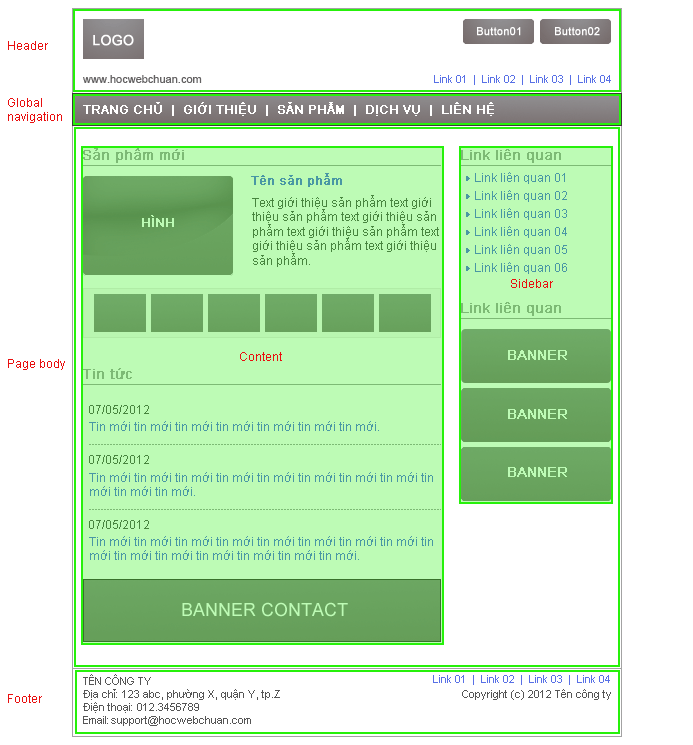
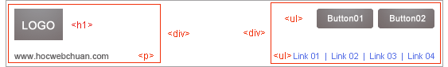

## Học HTML
HTML là ngôn ngữ đánh dấu, thể hiện bằng các tag (gọi là thẻ), những thẻ này giúp cho trình duyệt đọc được nội dung, có thể là text, image, hay video, form ..., và sau đó trình duyệt sẽ hiển thị nội dung cho người dùng xem.

HTML có hơn 80 thẻ, mỗi thẻ có một nhiệm vụ riêng, tuy nhiên sẽ có những thẻ được sử dụng thường xuyên, bài học HTML này sẽ giúp các bạn biết được cách sử dụng các thẻ thường được dùng này.

Do công việc thực tế hiện nay sẽ là cách kết hợp giữa HTML/XHTML và HTML5, nên Học Web Chuẩn sẽ hướng dẫn cách code chung cho 2 phiên bản này, mục đích để các bạn có thể thực tế áp dụng cho công việc được.

Để cho dễ hình dung chúng ta sẽ chia các thẻ làm các nhóm sau:

* Nhóm các thẻ block, các thẻ này dùng để sắp xếp bố cục cho trang web.
* Nhóm các thẻ inline, là những thẻ cơ bản nhất, chỉ chứa được các thẻ inline cùng cấp hoặc text.



Với những phân tích trên, ta thấy những phần như: header, global navigation, page body, content, sidebar, footer đều là những phần nội dung lớn, do đó ta sẽ sử dụng thẻ `<div></div>` cho những thành phần này:

```{html}
<!DOCTYPE html>
<html>
<head>
<meta charset=utf-8" />
<title>Tiêu đề trang web</title>
</head>

<body>
<div id="header">Viết nội dung phần header ở đây</div>

<div id="gNav">Viết nội dung phần global navigation ở đây</div>

<div id="pageBody">
<div id="content">Viết nội dung phần content ở đây</div>
<div id="sidebar">Viết nội dung phần sidebar ở đây</div>
</div>

<div id="footer">Viết nội dung phần footer ở đây</div>
</body>
</html>
```
## Phần đầu: header


*  Phần bên trái: ta tạm gọi là hLeft (header left), phần này chứa logo và domain trang web .Logo sử dụng image nên ta dùng thẻ ``, nhưng do logo là phần quan trọng nhất của trang, nên ta sử dụng thẻ `<h1>` bao ngoài thẻ` `.
Domain ta thấy cần bao bên ngoài bằng thẻ `<p>` là được.
* Phần bên phải: ta tạm gọi là hRight (header right), phần này chứa 2 button và một danh sách chứa link
    * 2 button này có thể coi như một danh sách không có thứ tự do đó ta có thể sử dụng thẻ `<ul><li>`.
    * Danh sách chứa link cũng thuộc dạng danh sách không có thứ tự vì vậy ta cũng có thể sử dụng thẻ `<ul><li>`.
* Để tiện cho việc điều khiển các thẻ, ta sử dụng 2 thẻ <div> bao bên ngoài phần bên trái và bên phải, vậy phần header ta có thể code như sau:

```{html}
<div id="header">
<div class="hLeft">
<h1></h1>
<p>www.hocwebchuan.com</p>
<!-- / class hLeft --></div>

<div class="hRight">
<ul>
<li><a href="#"></a></li>
<li><a href="#"></a></li>
</ul>

<ul>
<li><a href="#">link 01</a></li>
<li><a href="#">link 02</a></li>
<li><a href="#">link 03</a></li>
<li><a href="#">link 04</a></li>
</ul>
<!-- / class hRight --></div>
<!-- / id header --></div>
```
Kết nối phần header này vào phần cấu trúc cơ bản ta có được cấu trúc sau:
```{html}
<!DOCTYPE html>
<html>
<head>
<meta charset=utf-8" />
<title>Tiêu đề trang web</title>
</head>

<body>
<div id="layout">
<div id="header">
<div class="hLeft">
<h1></h1>
<p>www.hocwebchuan.com</p>
<!-- / class hLeft --></div>

<div class="hRight">
<ul>
<li><a href="#"></a></li>
<li><a href="#"></a></li>
</ul>
<ul>
<li><a href="#">link 01</a></li>
<li><a href="#">link 02</a></li>
<li><a href="#">link 03</a></li>
<li><a href="#">link 04</a></li>
</ul>
<!-- / class hRight --></div>
<!-- / id header --></div>

<div id="gNav">
Viết nội dung phần global navigation ở đây
<!-- / id gNav --></div>

<div id="pageBody">
<div id="content">
Viết nội dung phần content ở đây
<!-- / id content --></div>

<div id="sidebar">
Viết nội dung phần sidebar ở đây
<!-- / id sidebar --></div>
<!-- / id pageBody --></div>

<div id="footer">
Viết nội dung phần footer ở đây
<!-- / id footer --></div>
<!-- / id layout --></div>
</body>
</html>
```
## Global navigation: Phần liên kết toàn cục global
