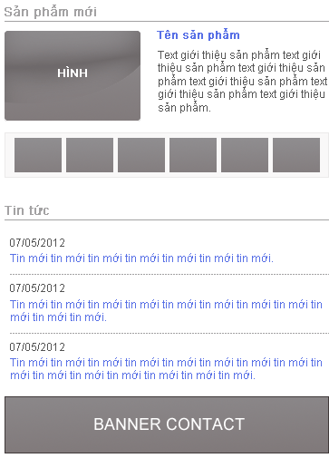
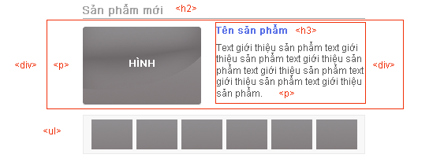
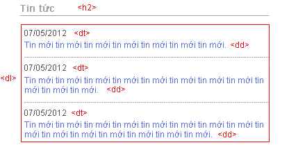
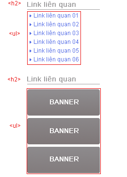

## Học HTML
HTML là ngôn ngữ đánh dấu, thể hiện bằng các tag (gọi là thẻ), những thẻ này giúp cho trình duyệt đọc được nội dung, có thể là text, image, hay video, form ..., và sau đó trình duyệt sẽ hiển thị nội dung cho người dùng xem.

HTML có hơn 80 thẻ, mỗi thẻ có một nhiệm vụ riêng, tuy nhiên sẽ có những thẻ được sử dụng thường xuyên, bài học HTML này sẽ giúp các bạn biết được cách sử dụng các thẻ thường được dùng này.

Do công việc thực tế hiện nay sẽ là cách kết hợp giữa HTML/XHTML và HTML5, nên Học Web Chuẩn sẽ hướng dẫn cách code chung cho 2 phiên bản này, mục đích để các bạn có thể thực tế áp dụng cho công việc được.

Để cho dễ hình dung chúng ta sẽ chia các thẻ làm các nhóm sau:

* Nhóm các thẻ block, các thẻ này dùng để sắp xếp bố cục cho trang web.
* Nhóm các thẻ inline, là những thẻ cơ bản nhất, chỉ chứa được các thẻ inline cùng cấp hoặc text.


Với những phân tích trên, ta thấy những phần như: header, global navigation, page body, content, sidebar, footer đều là những phần nội dung lớn, do đó ta sẽ sử dụng thẻ `<div></div>` cho những thành phần này:

```{html}
<!DOCTYPE html>
<html>
<head>
<meta charset=utf-8" />
<title>Tiêu đề trang web</title>
</head>

<body>
<div id="header">Viết nội dung phần header ở đây</div>

<div id="gNav">Viết nội dung phần global navigation ở đây</div>

<div id="pageBody">
<div id="content">Viết nội dung phần content ở đây</div>
<div id="sidebar">Viết nội dung phần sidebar ở đây</div>
</div>

<div id="footer">Viết nội dung phần footer ở đây</div>
</body>
</html>
```
## Phần đầu: header


*  Phần bên trái: ta tạm gọi là hLeft (header left), phần này chứa logo và domain trang web .Logo sử dụng image nên ta dùng thẻ ``, nhưng do logo là phần quan trọng nhất của trang, nên ta sử dụng thẻ `<h1>` bao ngoài thẻ` `.
Domain ta thấy cần bao bên ngoài bằng thẻ `<p>` là được.
* Phần bên phải: ta tạm gọi là hRight (header right), phần này chứa 2 button và một danh sách chứa link
    * 2 button này có thể coi như một danh sách không có thứ tự do đó ta có thể sử dụng thẻ `<ul><li>`.
    * Danh sách chứa link cũng thuộc dạng danh sách không có thứ tự vì vậy ta cũng có thể sử dụng thẻ `<ul><li>`.
* Để tiện cho việc điều khiển các thẻ, ta sử dụng 2 thẻ <div> bao bên ngoài phần bên trái và bên phải, vậy phần header ta có thể code như sau:

```{html}
<div id="header">
<div class="hLeft">
<h1></h1>
<p>www.hocwebchuan.com</p>
<!-- / class hLeft --></div>

<div class="hRight">
<ul>
<li><a href="#"></a></li>
<li><a href="#"></a></li>
</ul>

<ul>
<li><a href="#">link 01</a></li>
<li><a href="#">link 02</a></li>
<li><a href="#">link 03</a></li>
<li><a href="#">link 04</a></li>
</ul>
<!-- / class hRight --></div>
<!-- / id header --></div>
```
Kết nối phần header này vào phần cấu trúc cơ bản ta có được cấu trúc sau:
```{html}
<!DOCTYPE html>
<html>
<head>
<meta charset=utf-8" />
<title>Tiêu đề trang web</title>
</head>

<body>
<div id="layout">
<div id="header">
<div class="hLeft">
<h1></h1>
<p>www.hocwebchuan.com</p>
<!-- / class hLeft --></div>

<div class="hRight">
<ul>
<li><a href="#"></a></li>
<li><a href="#"></a></li>
</ul>
<ul>
<li><a href="#">link 01</a></li>
<li><a href="#">link 02</a></li>
<li><a href="#">link 03</a></li>
<li><a href="#">link 04</a></li>
</ul>
<!-- / class hRight --></div>
<!-- / id header --></div>

<div id="gNav">
Viết nội dung phần global navigation ở đây
<!-- / id gNav --></div>

<div id="pageBody">
<div id="content">
Viết nội dung phần content ở đây
<!-- / id content --></div>

<div id="sidebar">
Viết nội dung phần sidebar ở đây
<!-- / id sidebar --></div>
<!-- / id pageBody --></div>

<div id="footer">
Viết nội dung phần footer ở đây
<!-- / id footer --></div>
<!-- / id layout --></div>
</body>
</html>
```
## Global navigation: Phần liên kết toàn cục global
<p align="center">
    
</p>

```{html}
<!DOCTYPE html>
<html>
<head>
<meta charset=utf-8" />
<title>Tiêu đề trang web</title>
</head>

<body>
<div id="layout">
<div id="header">
<div class="hLeft">
<h1></h1>
<p>www.hocwebchuan.com</p>
<!-- / class hLeft --></div>

<div class="hRight">
<ul>
<li><a href="#"></a></li>
<li><a href="#"></a></li>
</ul>
<ul>
<li><a href="#">link 01</a></li>
<li><a href="#">link 02</a></li>
<li><a href="#">link 03</a></li>
<li><a href="#">link 04</a></li>
</ul>
<!-- / class hRight --></div>
<!-- / id header --></div>

<div id="gNav">
<ul>
<li><a href="#">TRANG CHỦ</a></li>
<li><a href="#">GIỚI THIỆU</a></li>
<li><a href="#">SẢN PHẨM</a></li>
<li><a href="#">DỊCH VỤ</a></li>
<li><a href="#">LIÊN HỆ</a></li>
</ul>
<!-- / id gNav --></div>

<div id="pageBody">
<div id="content">
Viết nội dung phần content ở đây
<!-- / id content --></div>

<div id="sidebar">
Viết nội dung phần sidebar ở đây
<!-- / id sidebar --></div>
<!-- / id pageBody --></div>

<div id="footer">
Viết nội dung phần footer ở đây
<!-- / id footer --></div>
<!-- / id layout --></div>
</body>
</html>
```

## Phần nội dung chính : content
Nhìn vào cấu trúc phần content ở trên, ta thấy nội dung gồm 3 phần: phần "Sản phẩm mới", phần "Tin tức" và phần banner.
<p align="center">
    
</p>
Nhìn vào cấu trúc phần content ở trên, ta thấy nội dung gồm 3 phần: phần "Sản phẩm mới", phần "Tin tức" và phần banner.

### Phần "Sản phẩm mới", ta phân tích:
<p align="center">
    
</p>

* Phần tiêu đề "Sản phẩm mới" ta sử dụng `<h2>` (vì `<h1>` đã sử dụng cho logo trong phần header).
* Đối với hình lớn, ta sử dụng thẻ `<p>`.
* Phần nội dung bên phải, ta sử dụng thẻ `<div>` bao bên ngoài để tiện điều khiển, bên trong ta thấy nội dung có một tiêu đề ta sử dụng thẻ `<h3>` và đoạn text giới thiệu ta sử dụng thẻ `<p>`.
* Phần còn lại là danh sách hình nhỏ, ta sử dụng thẻ danh sách `<ul><li>`
* Để phân biệt phần sản phẩm mới và danh sách những sản phẩm khác, ta sử dụng thẻ `<div>` nhóm phần sản phẩm mới lại.
```{html}
<h2>Sản phẩm mới</h2>
<div class="newProduct">
<p></p>
<div>
<h3>Tên sản phẩm</h3>
<p>Text giới thiệu sản phẩm text giới thiệu sản phẩm text giới thiệu sản phẩm text giới thiệu sản phẩm text giới thiệu sản phẩm text giới thiệu sản phẩm.</p>
</div>
<!-- / class newProduct --></div>

<ul>
<li><a href="#"></a></li>
<li><a href="#"></a></li>
<li><a href="#"></a></li>
<li><a href="#"></a></li>
<li><a href="#"></a></li>
</ul>
```
### Phần "Tin tức", ta phân tích:
<p align="center">
    
</p>

* Phần tiêu đề "Tin tức" vì cùng cấp với tiêu đề "Sản phẩm mới" nên ta tiếp tục sử dụng `<h2>`.
* Phần bên dưới có dạng danh sách có nội dung và các mục, do đó ta sử dụng bộ 3 thẻ `<dl>`, `<dt>`, `<dd>`.
### Phần banner:
<p align="center">
    
</p>

> Phần banner này ta thấy chỉ là một tấm hình, do đó chỉ cần sử dụng thẻ `<p>` chứa thẻ `` là đủ, tất nhiên phải có thẻ `<a>` để tạo liên kết

Kết nối phần "Sản phẩm mới", phần "Tin tức" và phần"banner" vào phần cấu trúc cơ bản ta có được cấu trúc sau:

```{html}
<!DOCTYPE html PUBLIC "-//W3C//DTD XHTML 1.0 Transitional//EN" "http://www.w3.org/TR/xhtml1/DTD/xhtml1-transitional.dtd">
<html>
<head>
<meta http-equiv="Content-Type" content="text/html; charset=utf-8" />
<title>Tiêu đề trang web</title>
</head>

<body>
<div id="layout">
<div id="header">
<div class="hLeft">
<h1></h1>
<p>www.hocwebchuan.com</p>
<!-- / class hLeft --></div>

<div class="hRight">
<ul>
<li><a href="#"></a></li>
<li><a href="#"></a></li>
</ul>
<ul>
<li><a href="#">link 01</a></li>
<li><a href="#">link 02</a></li>
<li><a href="#">link 03</a></li>
<li><a href="#">link 04</a></li>
</ul>
<!-- / class hRight --></div>
<!-- / id header --></div>

<div id="gNav">
<ul>
<li><a href="#">TRANG CHỦ</a></li>
<li><a href="#">GIỚI THIỆU</a></li>
<li><a href="#">SẢN PHẨM</a></li>
<li><a href="#">DỊCH VỤ</a></li>
<li><a href="#">LIÊN HỆ</a></li>
</ul>
<!-- / id gNav --></div>

<div id="pageBody">
<div id="content">
<h2>Sản phẩm mới</h2>
<div class="newProduct">
<p></p>
<div>
<h3>Tên sản phẩm</h3>
<p>Text giới thiệu sản phẩm text giới thiệu sản phẩm text giới thiệu sản phẩm text giới thiệu sản phẩm text giới thiệu sản phẩm text giới thiệu sản phẩm.</p>
</div>
<!-- / class newProduct --></div>

<ul>
<li><a href="#"></a></li>
<li><a href="#"></a></li>
<li><a href="#"></a></li>
<li><a href="#"></a></li>
<li><a href="#"></a></li>
</ul>

<h2>Tin tức</h2>
<dl class="news">
<dt>07/05/2012</dt>
<dd><a href="#">Tin mới tin mới tin mới tin mới tin mới tin mới tin mới.</a></dd>

<dt>07/05/2012</dt>
<dd><a href="#">Tin mới tin mới tin mới tin mới tin mới tin mới tin mới tin mới tin mới tin mới tin mới.</a></dd>

<dt>07/05/2012</dt>
<dd><a href="#">Tin mới tin mới tin mới tin mới tin mới tin mới tin mới tin mới tin mới tin mới tin mới tin mới tin mới tin mới tin mới.</a></dd>
</dl>

<p><a href="#"></a></p>
<!-- / id content --></div>

<div id="sidebar">
Viết nội dung phần sidebar ở đây
<!-- / id sidebar --></div>
<!-- / id pageBody --></div>

<div id="footer">
Viết nội dung phần footer ở đây
<!-- / id footer --></div>
<!-- / id layout --></div>
</body>
</html>
```
## Phần nội dung phụ: Sidebar
Nhìn vào phần sidebar ta thấy nội dung chia ra làm 2 phần: phần link liên quan chứa danh sách link, và phần link liên quan chứa banner link, ta phân tích 2 phần này như sau:
<p align="center">
    
</p>

Vì phần "content" và phần "sidebar" có nội dung riêng biệt, nên phần tiêu đề `<hx>` cũng sẽ độc lập nhau, không cần code thứ tự tiêu đề của phần sidebar theo phần content, do đó ta tiếp tục sử dụng `<h2>` cho phần sidebar này.
Hai phần "link liên quan" ta thấy có cấu trúc của một danh sách, do đó cả 2 ta sử dụng thẻ `<ul>` và `<li>` là đủ thể hiện.

```{html}
<!DOCTYPE html>
<html>
<head>
<meta charset=utf-8" />
<meta http-equiv="Content-Type" content="text/html; charset=utf-8" />
<title>Tiêu đề trang web</title>
</head>

<body>
<div id="layout">
<div id="header">
<div class="hLeft">
<h1></h1>
<p>www.hocwebchuan.com</p>
<!-- / class hLeft --></div>

<div class="hRight">
<ul>
<li><a href="#"></a></li>
<li><a href="#"></a></li>
</ul>
<ul>
<li><a href="#">link 01</a></li>
<li><a href="#">link 02</a></li>
<li><a href="#">link 03</a></li>
<li><a href="#">link 04</a></li>
</ul>
<!-- / class hRight --></div>
<!-- / id header --></div>

<div id="gNav">
<ul>
<li><a href="#">TRANG CHỦ</a></li>
<li><a href="#">GIỚI THIỆU</a></li>
<li><a href="#">SẢN PHẨM</a></li>
<li><a href="#">DỊCH VỤ</a></li>
<li><a href="#">LIÊN HỆ</a></li>
</ul>
<!-- / id gNav --></div>

<div id="pageBody">
<div id="content">
<h2>Sản phẩm mới</h2>
<div class="newProduct">
<p></p>
<div>
<h3>Tên sản phẩm</h3>
<p>Text giới thiệu sản phẩm text giới thiệu sản phẩm text giới thiệu sản phẩm text giới thiệu sản phẩm text giới thiệu sản phẩm text giới thiệu sản phẩm.</p>
</div>
<!-- / class newProduct --></div>

<ul>
<li><a href="#"></a></li>
<li><a href="#"></a></li>
<li><a href="#"></a></li>
<li><a href="#"></a></li>
<li><a href="#"></a></li>
<li><a href="#"></a></li>
</ul>

<h2>Tin tức</h2>
<dl class="news">
<dt>07/05/2012</dt>
<dd><a href="#">Tin mới tin mới tin mới tin mới tin mới tin mới tin mới.</a></dd>

<dt>07/05/2012</dt>
<dd><a href="#">Tin mới tin mới tin mới tin mới tin mới tin mới tin mới tin mới tin mới tin mới tin mới.</a></dd>

<dt>07/05/2012</dt>
<dd><a href="#">Tin mới tin mới tin mới tin mới tin mới tin mới tin mới tin mới tin mới tin mới tin mới tin mới tin mới tin mới tin mới.</a></dd>
</dl>

<p><a href="#"></a></p>
<!-- / id content --></div>

<div id="sidebar">
<h2>Link liên quan</h2>
<ul>
<li><a href="#">Link liên quan 01</a></li>
<li><a href="#">Link liên quan 02</a></li>
<li><a href="#">Link liên quan 03</a></li>
<li><a href="#">Link liên quan 04</a></li>
<li><a href="#">Link liên quan 05</a></li>
<li><a href="#">Link liên quan 06</a></li>
</ul>

<h2>Link liên quan</h2>
<ul>
<li><a href="#"></a></li>
<li><a href="#"></a></li>
<li><a href="#"></a></li>
</ul> <!-- / id sidebar --></div>
<!-- / id pageBody --></div>

<div id="footer">
Viết nội dung phần footer ở đây
<!-- / id footer --></div>
<!-- / id layout --></div>
</body>
</html>
```

## Phần cuối trang web: Footer
<p align="center">
    
</p>
