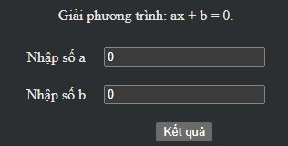

<p><h1>Exercise Day 1</h1></p>

### Ex1. Cách kiểm tra số nguyên dương trong javascript
**HD:** Theo lý thuyết thì số nguyên dương là tập hợp những số chia hết cho 1 và lớn hơn 0. Tức là dãy số 1, 2, 3 ,4 ,5 ,6 ... chính là các số nguyên dương.
**BG:**

```
// @note: Dùng hàm isInteger để kiểm tra số nguyên dương javascript

let laSoNguyenDuong = (value) => {
    return (Number.isInteger(value) && value > 0);
};
console.log(laSoNguyenDuong(1)); // true
console.log(laSoNguyenDuong(1.2)); // false
console.log(laSoNguyenDuong(3)); // true
console.log(laSoNguyenDuong(0)); // false

// @note: Dùng toán tử chia lấy dư để kiểm tra số nguyên dương javascript

let laSoNguyenDuong = (value) => {
    return (typeof value == 'number' && value > 0 && value % 1 == 0);
};

console.log(laSoNguyenDuong(1)); // true
console.log(laSoNguyenDuong(1.2)); // false
console.log(laSoNguyenDuong(3)); // true
console.log(laSoNguyenDuong(0)); // false
```
### Ex2. Cách kiểm tra số nguyên âm trong javascript
**HD:** Thuật toán này đi ngược với thuật toán trong bài kiểm tra số nguyên dương javascript, bởi vì một bên là số dương còn một bên là số ấm.<br>
**BG:**

```
// @note: Dùng hàm isInteger để kiểm tra số nguyên am javascript

function laSoNguyenAm(value){
    return (Number.isInteger(value) && value < 0);
}

console.log(laSoNguyenAm(-1)); // true
console.log(laSoNguyenAm(-1.2)); // false
console.log(laSoNguyenAm(3)); // false
console.log(laSoNguyenAm(0)); // false

// @note: Dùng toán tử chia lấy dư để kiểm tra số nguyên am javascript

let laSoNguyenAm = (value) => {
    return (typeof value == 'number' && value < 0 && value % 1 == 0);
};

console.log(laSoNguyenAm(-1)); // true
console.log(laSoNguyenAm(-1.2)); // false
console.log(laSoNguyenAm(3)); // false
console.log(laSoNguyenAm(0)); // false
```
### Ex3. Tính tổng hai số bằng Javascript (cộng hai số)
**HD:** Bài tập cộng 2 số là cơ bản nhất trong lập trình, bằng cách sử dụng toán tử cộng và kết hợp các hàm khác để tạo ra ứng dụng tính tổng. Tuy nhiên, bài này mình sẽ bổ sung thêm kiến thức nâng cao để những bạn có nền tảng rồi tham khảo nhé.<br>
**BG:** Phân tích bài toán gồm 3 bước<br>
1. Kiểm tra dữ liệu trước khi tính tổng bằng javascript
2. Viết hàm cộng hai số bằng javascript
3. Tính tổng hai số bằng javascript

```
function sum(a, b){
    try{
        a = Number(a);
        b = Number(b);
        if (isNaN(a) || isNaN(b)){
            throw new Error('Dữ liệu bạn nhập vào không phải là số');
        }
        return a + b;
    }
    catch (e){
        console.log(e.message);
        return false;
    }
}
console.log(sum(1, 3)); // =4
```
### Ex4. Tính tổng các phần tử trong mảng javascript
```
//@ex Tính tổng các số có trong mảng
let mang = [1, 5, 9, 10];
```
**HD:** Để tính tổng tất cả các phần tử trong mảng thì ta có rất nhiều cách. Bạn có thể sử dụng vòng lặp for, hàm map, hàm forEach, hàm reduce hoặc reduceRight đều được. Và trong bài này mình sẽ demo tất cả để bạn tự tìm hiểu nhé.
**BG:**<br>
```
// @note: Dùng vòng lặp tính tổng các phần tử trong mảng javascript

function sumArray(mang){
    let sum = 0;
    for (let i = 0; i < mang.length; i++){
        sum += mang[i];
    }

    return sum;
}

let mang = [1, 5, 9, 10];
console.log(sumArray(mang)); // 25

// @note: Dùng forEach tính tổng các phần tử trong mảng javascript

function sumArray(mang){
    let sum = 0;
    mang.forEach(function(value){
        sum += value;
    });

    return sum;
}

let mang = [1, 5, 9, 10];
console.log(sumArray(mang)); // 25

// @note: Dùng map tính tổng các phần tử trong mảng javascript

function sumArray(mang){
    let sum = 0;
    mang.map(function(value){
        sum += value;
    });

    return sum;
}

let mang = [1, 5, 9, 10];
console.log(sumArray(mang)); // 25
```
### Ex5. Hướng dẫn giải phương trình bậc 1 bằng Javascript
**HD:**
Cách giải phương trình bậc nhất một ẩn có dạng `ax+b = 0`

<p align="center">
    
</p>

**BG:**
```
function giai_pt_bac_nhat(a, b)
{
    if (a == 0 && b == 0){
        alert('Phương trình vô số nghiệm');
    }
    else if (a != 0 && b == 0){
        alert('Phương trình có nghiệm x = 0');
    }
    else if (a == 0 && b != 0){
        alert("Phương trình vô nghiệm");
    }
    else {
        alert('Phương trình có nghiệm x = ' + (-b/a));
    }
}
```
Tạo giao diện:
```
<form>
    Nhập số a: <input type="text" id="a" value=""/> <br/>
    Nhập số b: <input type="text" id="b" value=""/> <br/>
    <span id="result"></span> <br/>
    <input type="button" id="giaiBtn" value="Tìm nghiệm"/>
</form>

<script>
    var button = document.getElementById('giaiBtn');
    giaiBtn.onclick = function(){
        let a = document.getElementById('a').value;
        let b = document.getElementById('b').value;

        if (a == "" || b == ""){
            alert("Vui lòng nhập dữ liệu");
        }
        else {
            a = Number(a);
            b = Number(b);
            giai_pt_bac_nhat(a, b);
        }
    };

    function giai_pt_bac_nhat(a, b)
    {
        if (a == 0 && b == 0){
            alert('Phương trình vô số nghiệm');
        }
        else if (a != 0 && b == 0){
            alert('Phương trình có nghiệm x = 0');
        }
        else if (a == 0 && b != 0){
            alert("Phương trình vô nghiệm");
        }
        else {
            alert('Phương trình có nghiệm x = ' + (-b/a));
        }
    }
</script>
```
### Ex6. Kiểm tra số nguyên tố Javascript
**HD:** "Số nguyên tố là số lớn hơn 1 và chia hết cho 1 và chính nó". Như vậy ta sẽ dùng một vòng lặp for lặp từ 2 -> (n-1) và trong quá trình lặp nếu tốn tại số mà n chia hết thì tức là không phải số nguyên tố.

```
function kiem_tra_snt(n)
{
    // Biến cờ hiệu
    var flag = true;

    // Nếu n bé hơn 2 tức là không phải số nguyên tố
    if (n < 2){
        flag = false;
    }
    else if (n == 2){
        flag = true;
    }
    else if (n % 2 == 0){
      flag = false;
    }
    else{
        // lặp từ 3 tới n-1 với bước nhảy là 2 (i+=2)
        for (var i = 3; i < Math.sqrt(n); i+=2)
        {
            if (n % i == 0){
                flag = false;
                break;
            }
        }
    }

    // Kiểm tra biến flag
    if (flag == true){
        document.write(n + " là số nguyên tố <br/>");
    }
    else{
        document.write(n + " không phải là số nguyên tố <br/>");
    }
}
```
