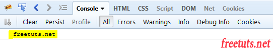

<p><h1>Day 2</h1></p>

- [Chương 5. For Loop](#chương-5-for-loop)
  - [5.1. for statement](#51-for-statement)
  - [5.2. do...while statement](#52-dowhile-statement)
  - [5.3. while statement](#53-while-statement)
  - [5.4. labeled statement](#54-labeled-statement)
  - [5.5. break statement](#55-break-statement)
  - [5.6. continue statement](#56-continue-statement)
  - [5.7. for...in statement](#57-forin-statement)
  - [5.8. for...of statement](#58-forof-statement)
- [Chương 6. Functions](#chương-6-functions)
  - [6.3.  Arrow function](#63--arrow-function)
  - [6.4. Một số ví dụ function](#64-một-số-ví-dụ-function)
- [Chương 7. Hàm console.log trong Javascript (dùng để xem giá trị của biến)](#chương-7-hàm-consolelog-trong-javascript-dùng-để-xem-giá-trị-của-biến)
## Chương 5. For Loop
Các câu lệnh cho các vòng lặp được cung cấp trong JavaScript là:
* for statement
* do...while statement
* while statement
* labeled statement
* break statement
* continue statement
* for...in statement
* for...of statement

### 5.1. for statement
```
var i = 0;
for (i = 0; i < 100; i++){
    // Dòng lệnh xử lý vòng lặp
}
```
Trong đó:

* var i = 0; là khai báo biến điều khiển vòng lặp i
* (i = 0) là điểm bắt đầu lặp (lặp từ 0)
* (i < 100) là điều kiện dừng vòng lặp, nghĩa là lặp nếu i < 100. Bạn có thể dùng một điều kiện bất kì thông qua các toán tử miễn là nó trả về true hoặc false như (i <= 100, i == 100)
* (i++) là tăng bước nhảy, bạn có thể dùng công thức khác như i+=2, i-=2, i--, ...
Như ví dụ trên thì ta sẽ có 100 vòng lặp từ 0 -> 99

**Vòng lặp for lồng nhau**
```
for (var i = 0; i <= 9; i++)
{
    for (var j = 0; j <= 9; j++){
        // In ra vị trí của ma trận [i][j]
        document.write("(["+i+"]["+j+"])");
    }
    // Xuống hàng
    document.write("<br/>");
}
```
Chúng ta thường sử dụng vòng lặp for để giải các bài toán như:

* Kiểm tra số nguyên tố trong JS
* Lặp và xử lý các phần tử trong mảng (sẽ được học trong bài mảng)
* Lặp trong một khoảng từ [a - b]
* Và nhiều dạng toán cơ bản khác.
### 5.2. do...while statement
### 5.3. while statement
### 5.4. labeled statement
### 5.5. break statement
### 5.6. continue statement
### 5.7. for...in statement
### 5.8. for...of statement
## Chương 6. Functions
Functions là một trong những khối xây dựng cơ bản trong JavaScript. Một function là một thủ tục JavaScript-một tập hợp các câu lệnh thực hiện một tác vụ hoặc tính toán một giá trị. Để sử dụng một function, bạn phải định nghĩa nó ở đâu đó trong phạm vi mà bạn muốn gọi nó. Trong phần này sẽ tìm hiểu các kiến thức về function trong javascript.

Một định nghĩa hàm (hay còn gọi là khai báo hàm, hoặc câu lệnh hàm) bao gồm các từ khóa function, tiếp theo là:

Tên của hàm.
Một danh sách các tham số cho hàm, được bao gồm trong ngoặc đơn và được phân tách bằng dấu phẩy.
Các lệnh JavaScript định nghĩa hàm, được bao gồm trong ngoặc nhọn, {}.

```
function square(number) {
  return number * number;
}
```
Cú pháp:
```
function name_of_function(var1, var2, var3, ...)
{
    // Some code
}
```
Trong đó:

* function: là từ khóa của javascript nên bắt buộc phải như vậy
* name_of_function: là tên của hàm, thông thường chúng ta tạo những tên có ý nghĩa như find_max, find_min, ...
* var1, var2 var3, ... là các tham số truyền vào hàm.

 Ví dụ viết hàm kiểm tra số chẵn hay lẽ thì ta sẽ có một tham số đó là số cần kiểm tra.
```
// Tạo hàm
function check_number(number){
  if (number % 2 == 0){
    alert(number + ' là số chẵn');
  }
  else {
    alert(number + 'Số lẻ');
  }
}
// Sử dụng hàm kiểm tra cho 5 số
check_number(1);
check_number(2);
check_number(3);
check_number(4);
check_number(5);
```
### 6.3.  Arrow function
Arrow function còn được gọi là hàm mũi tên, tức là ta sẽ tạo hàm bằng cách sử dụng ký tự =>. Cách tạo này xuất hiện kể từ phiên bản ES6.
```
\\ Cú pháp Function
function name_of_function(var1, var2, var3, ...)
{
    // Nội dung function
}

\\ Cú pháp Arrow function
var name_of_function = (var1, var2, var3, ...) => {
    // Nội dung function
};
```

### 6.4. Một số ví dụ function
Ví dụ 1: thực hiện lại ví dụ trên nhưng sử dụng return để trả kết quả vè, nếu true thì là năm nhuận, false thì không phải năm nhuận.
```
// khai báo hàm
function kiem_tra_nam_nhuan(nam)
{
    // nếu năm chia hết cho 100
    // thì kiểm tra nó có chia hết cho 400 hay không
    if (nam % 100 == 0)
    {
        // nêu chia hết cho 400 thì là năm nhuận
        if (nam % 400 == 0){
            return true;
        }
        else { // ngược lại không phải năm nhuận
            return false;
        }
    }
    else if (nam % 4 == 0){ // trường hợp chia hết cho 4 thì là năm nhuận
        return true;
    }
    else { // cuối cùng trường hợp không phải năm nhuận
        return false;
    }
}
// sử dụng
var flag = kiem_tra_nam_nhuan(4);

if (flag){
    alert('là năm nhuận');
}
else {
    alert('không phải là năm nhuận');
}
```
Ví dụ 2: Viết chương trình kiểm tra một năm có phải là năm nhuận hay không

Năm nhuận là năm chia hết cho 4, nếu chia hết cho 100 thì nó phải chia hết cho 400. Đây là định nghĩa năm nhuận còn chính xác hay không thì mình không biết nhé :D vì có trường hợp nó sai.
```
// khai báo hàm
function kiem_tra_nam_nhuan(nam)
{
    // nếu năm chia hết cho 100
    // thì kiểm tra nó có chia hết cho 400 hay không
    if (nam % 100 == 0)
    {
        // nêu chia hết cho 400 thì là năm nhuận
        if (nam % 400 == 0){
            alert(nam + ' là năm nhuận');
        }
        else { // ngược lại không phải năm nhuận
            alert(nam + ' không phải năm nhuận');
        }
    }
    else if (nam % 4 == 0){ // trường hợp chia hết cho 4 thì là năm nhuận
        alert(nam + ' là năm nhuận');
    }
    else { // cuối cùng trường hợp không phải năm nhuận
        alert(nam + 'không phải là năm nhuận');
    }
}
// sử dụng
kiem_tra_nam_nhuan(4);
```
## Chương 7. Hàm console.log trong Javascript (dùng để xem giá trị của biến)

Console.log là một hàm của Javascript, được sử dụng để debug / kiểm tra / xem giá trị của một biến trong Javascript. Công dụng của console.log là show ra giá trị của một biến, dù biến đó thuộc kiểu dữ lliệu gì đi nữa thì vẫn được hiển thị ở ô console trong hộp thoại Inspect Element.

Ví dụ 1: console.log() một biến bình thường
```
var website = 'freetuts.net';
console.log(website);
```
Kết quả:
<p align="center">
    
</p>
