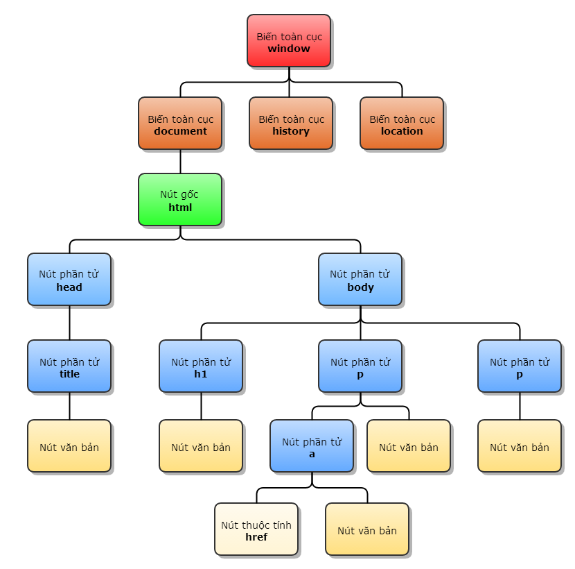
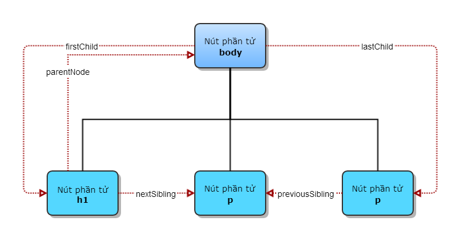
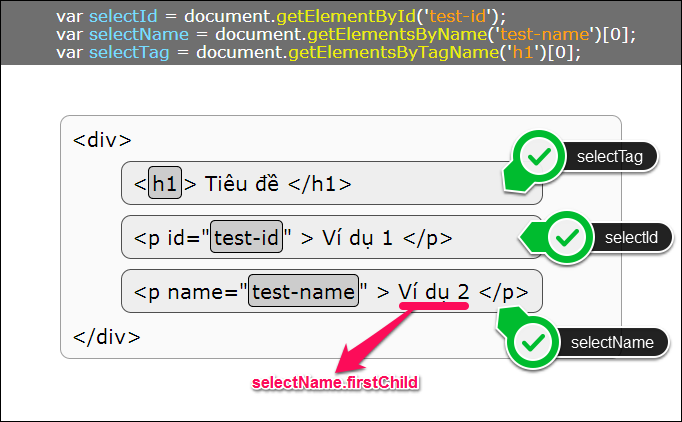

<p><h1>Day 5</h1></p>

## **DOM Là Gì? Thao Tác Với DOM Bằng Javascript**

**Javascript là một ngôn ngữ được sử dụng trong các trình duyệt Browser nên nó đóng một vai trò khá quan trọng trong các ứng dụng website. Và nhiệm vụ của Javascript là thao tác với các tài liệu HTML kết hợp với các cú pháp riêng của nó để tạo nên sự ảo diệu của trang web. Để thao tác được với các thẻ HTML thì nó phải thông qua một cơ chế ta gọi là DOM.**

Vậy trong bài viết này chúng ta cùng tìm hiểu DOM là gì và cách thao tác với DOM bằng Js nhé!

### **DOM là gì?**

DOM là viết tắt của chữ **D**ocument **O**bject **M**odel, dịch tạm ra là mô hình các đối tượng trong tài liệu HTML.  Như các bạn biết trong mỗi thẻ HTML sẽ có những thuộc tính (Properties) và có phân cấp cha - con với các thẻ HTML khác. Sự phân cấp và các thuộc tính của thẻ HTML này ta gọi là **selector** và trong DOM sẽ có nhiệm vụ xử lý các vấn đề như đổi thuộc tính của thẻ, đổi cấu trúc HTML của thẻ,... DOM được dùng để truy xuất các tài liệu dạng HTML và XML, có dạng một cây cấu trúc dữ liệu, và thông thường mô hình DOM độc lập với hệ điều hành và dựa theo kỹ thuật lập trình hướng đối tượng để mô tả tài liệu.

Bạn có thể tham khảo hình vẽ dưới đây để hiểu rõ hơn về DOM.
Bạn có thể tham khảo hình vẽ dưới đây để hiểu rõ hơn về DOM.


Chúng ta có thể thấy tất cả các thẻ HTML sẽ được quản lý trong đối tượng **document**, thẻ cao nhất là thẻ **html**, tiếp theo là phân nhánh **body** và **head**. Bên trong **head** thì có những thẻ như **style**, **title**, ... và bên trong **body** thì là vô số các thẻ HTML khác. Như vậy trong **Javascript**, để thao tác với các thẻ HTML ta phải thông qua đối tượng **document,** để cho nóng thì các bạn xem ví dụ bên dưới trước khi tìm hiểu tiếp nhé :D

```
<html>
  <body>
    <h1 id="main-content"></h1>
    <script language="javascript">
      document.getElementById("main-content").innerHTML = "Chào mừng các bạn đến với website học lập trình online codelearn.io"
    </script>
  </body>
</html>
```

Trong ví dụ này mình có sử dụng một đoạn code xử lý **javascript** như sau:

```
document.getElementById("main-content").innerHTML = "Chào mừng các bạn đến với website học lập trình online codelearn.io"
```

Và đoạn code này có ý nghĩa rằng tìm thẻ có id="main-content"và gán nội dung HTML bên trong của thẻ này là dòng chữ "_Chào mừng các bạn đến với website học lập trình online codelearn.io_".

Với DOM, JavaScript được tất cả sức mạnh cần thiết để tạo ra HTML động:

* JavaScript có thể thay đổi tất cả các phần tử HTML trong trang
* JavaScript có thể thay đổi tất cả các thuộc tính HTML trong trang
* JavaScript có thể thay đổi tất cả các phong cách CSS trong trang
* JavaScript có thể loại bỏ các yếu tố HTML và thuộc tính hiện tại
* JavaScript có thể thêm các yếu tố HTML mới và các thuộc tính
* JavaScript có thể phản ứng với tất cả các sự kiện HTML hiện trong trang
* JavaScript có thể tạo ra các sự kiện HTML mới trong trang

### **HTML DOM là gì?**

HTML DOM là một chuẩn mô hình object và programming interface cho HTML. nó định nghĩa:

* HTML elements như là objects
* properties của tất cả HTML elements
* methods để truy cập đến tất cả HTML elements
* events cho tất cả HTML elements

HTML DOM là một tiêu chuẩn cho phép bạn thực hiện những công việc thao tác với bất kì một trang web: get, change, add, or delete các thành phần của HTML.

### **Cây cấu trúc DOM**

#### **Nút**

Đối với HTML DOM, cấu trúc dạng cây gọi là DOM Tree có nghĩa là mọi thành phần đều được xem là 1 nút (node), được biểu diễn trên 1 cây . Các phần tử khác nhau sẽ được phân loại nút khác nhau nhưng quan trọng nhất là 3 loại: nút gốc (document node), nút phần tử (element node), nút văn bản (text node).

* **Nút gốc**: chính là tài liệu HTML, thường được biểu diễn bởi thẻ \.
* **Nút phần tử**: biểu diễn cho 1 phần tử HTML.
* **Nút văn bản**: mỗi đoạn kí tự trong tài liệu HTML, bên trong 1 thẻ HTML đều là 1 nút văn bản. Đó có thể là tên trang web trong thẻ

* Nút gốc là \.
* 2 nút anh em \ và \ là anh em vì đều là nút con của \.
* Nút \ có 3 con, trong đó \
 là con cả và thẻ \
 thứ 2 là con út.
* Nút phần tử \ có 2 con, trong đó có 1 nút văn bản và 1 nút thuộc tính.

### **Thao tác với DOM**

Việc thao tác với DOM cho bạn sức mạnh “thay đổi thế giới”, vì mọi nội dung đều có thể được cập nhật động thông qua các thuộc tính và phương thức của DOM. Tất tần tật từ thay đổi định dạng chữ, nội dung chữ đến thay đổi cấu trúc các nút và cả thêm nút mới, bạn đều có thể làm được. Do đó, để sáng tạo nội dung tốt, bạn cần hiểu rõ cách thao tác DOM và ý nghĩa của từng thuộc tính, phương thức.

#### **Các Thuộc tính và Phương thức thường gặp**

#### **Thuộc tính:**

* **id:** Định danh – là duy nhất cho mỗi phần tử nên thường được dùng để truy xuất DOM trực tiếp và nhanh chóng.
* **className:** Tên lớp – Cũng dùng để truy xuất trực tiếp như id, nhưng 1 className có thể dùng cho nhiều phần tử.
* **tagName:** Tên thẻ HTML.
* **innerHTML:** Trả về mã HTML bên trong phần tử hiện tại. Đoạn mã HTML này là chuỗi kí tự chứa tất cả phần tử bên trong, bao gồm các nút phần tử và nút văn bản.
* **outerHTML:** Trả về mã HTML của phần tử hiện tại. Nói cách khác, outerHTML = tagName + innerHTML.
* **textContent:** Trả về 1 chuỗi kí tự chứa nội dung của tất cả nút văn bản bên trong phần tử hiện tại.
* **attributes:** Tập các thuộc tính như id, name, class, href, title…
* **style:** Tập các định dạng của phần tử hiện tại
* **value:** Lấy giá trị của thành phần được chọn thành một biến.

#### **Phương thức:**

* **getElementById(id):** Tham chiếu đến 1 nút duy nhất có thuộc tính id giống với id cần tìm.
* **getElementsByTagName(tagname):** Tham chiếu đến tất cả các nút có thuộc tính tagName giống với tên thẻ cần tìm, hay hiểu đơn giản hơn là tìm tất cả các phần tử DOM mang thẻ HTML cùng loại. Nếu muốn truy xuất đến toàn bộ thẻ trong tài liệu HTML thì hãy sử dụng document.getElementsByTagName('\*').
* **getElementsByName(name):** Tham chiếu đến tất cả các nút có thuộc tính name cần tìm.
* **getAttribute(attributeName):** Lấy giá trị của thuộc tính.
* **setAttribute(attributeName, value):** Sửa giá trị của thuộc tính.
* **appendChild(node):** Thêm 1 nút con vào nút hiện tại.
* **removeChild(node):** Xóa 1 nút con khỏi nút hiện tại.

Mặt khác, các phần tử DOM đều là các nút trên cây cấu trúc DOM. Chúng sở hữu thêm các thuộc tính quan hệ để biểu diễn sự phụ thuộc giữa các nút với nhau. Nhờ các thuộc tính quan hệ này, chúng ta có thể truy xuất DOM gián tiếp dựa trên quan hệ và vị trí của các phần tử:

#### **Thuộc tính quan hệ:**

* **parentNode:** Nút cha
* **childNodes:** Các nút con
* **firstChild:** Nút con đầu tiên
* **lastChild:** Nút con cuối cùng
* **nextSibling:** Nút anh em liền kề sau
* **previousSibling:** Nút anh em liền kề trước

Bạn có thể xem danh sách đầy đủ ở [W3SCHOOLS](https://www.w3schools.com/jsref/dom_obj_all.asp)

### **Truy xuất DOM**

#### **Truy xuất gián tiếp:**

Mỗi nút trên cây DOM đều có 6 thuộc tính quan hệ để giúp bạn truy xuất gián tiếp theo vị trí của nút:

* **Node.parentNode**: tham chiếu đến nút cha của nút hiện tại, và nút cha này là duy nhất cho mỗi nút. Do đó, nếu bạn cần tìm nguồn gốc sâu xa của 1 nút, bạn phải nối thuộc tình nhiều lần, ví dụ Node.parentNode.parentNode.
* **Node.childNodes**: tham chiếu đến các nút con trực tiếp của nút hiện tại, và kết quả là 1 mảng các đối tượng. Lưu ý rằng, các nút con không bị phân biệt bởi loại nút, nên kết quả mảng trả về có thể bao gồm nhiều loại nút khác nhau.
* **Node.firstChild**: tham chiếu đến nút con đầu tiên của nút hiện tại, và tương đương với việc gọi Node.childNodes\[0\].
* **Node.lastChild**: tham chiếu đến nút con cuối cùng của nút hiện tại, và tương đương với việc gọi Node.childNodes\[Element.childNodes.length-1\].
* **Node.nextSibling**: tham chiếu đến nút anh em nằm liền kề sau với nút hiện tại.
* **Node.previousSibling**: tham chiếu đến nút anh em nằm liền kề trước với nút hiện tại.


#### **Truy xuất trực tiếp:**

Truy xuất trực tiếp sẽ nhanh hơn, và đơn giản hơn khi bạn không cần phải biết nhiều về quan hệ và vị trí của nút. Có 3 phương thức để bạn truy xuất trực tiếp được hỗ trợ ở mọi trình duyệt:

* document.getElementById('id\_cần\_tìm')
* document.getElementsByTagName('div')
* document.getElementsByName('tên\_cần\_tìm')



### **Tạo mới, thêm, xoá, thay thế phần tử HTML bằng JS**

#### **Tạo một phần tử HTML**

Chúng ta có thể tạo mới 1 phần tử HTML bằng các cách sau:

* document.createElement(tag\_name): Tạo ra phần tử có thẻ tag\_name như a, p, div,...
* element.cloneNode(): Tạo ra 1 phần tử bằng cách nhân bản phần tử chỉ ra (element)
* document.createTextNode(text): Tạo ra 1 nút văn bản

```
var node = document.createTextNode("Create element");

var linknode = document.createElement("a");
    linknode.href = "https://codelearn.io/";
    linknode.innerText = "codelearn.io";
```

Ví dụ trên sẽ tạo ra 1 nút text, nhưng nó chưa hiển thị cho đến khi bạn gắn phần tử đó vào HTML document để nó là phần tử con của một phần tử nào đó, có một số cách để gắn phần tử tạo ra từ Javascript vào DOM HTML.

* element.appendChild(newNode): Thêm phần tử newNode vào phần tử element, nó trở thành phần tử con sau cùng của element.
* element.insertBefore(newNode, node2): Chèn phần tử newNode nằm trước node2.
* element.replaceChild(newNode, oldNode): Thay thế phần tử oldNode bằng phần tử newNode

Ví dụ dưới đây sẽ tạo ra một phần tử đoạn văn p sau đó chèn nó vào phần tử div đang có sẵn trong DOM HTML

```
<div id ="demo">nội dung ví dụ</div>

<button onclick="add_child()">KẾT QUẢ</button>
<script>
   function add_child() {
       //tạo phần tử p
       var p = document.createElement("p");

       //tạo phần tử text
       var node = document.createTextNode("Some new text");

       //gắn node vào p
       p.appendChild(node);

       //Thay đổi một số thuộc tính của p
       p.appendChild(node);
       p.style.backgroundColor = 'red';
       p.style.padding = "10px";
       p.style.color = "white";

       var div = document.getElementById("demo");
       //gắn p vào div
       div.appendChild(p);
   }
</script>
```

#### **Xóa phần tử HTML**

Để loại bỏ phần tử HTML, bạn chọn phần tử cha rồi sử dụng phương thức removeChild(node)

```
<div id="demo">
  <p id="p1">This is a paragraph.</p>
  <p id="p2">This is another paragraph.</p>
</div>

<script>
    var parent = document.getElementById("demo");
    var child = document.getElementById("p1");
    parent.removeChild(child);
</script>
```

Ví dụ trên sẽ xóa bỏ phần tử đoạn văn thứ nhất

Bạn có thể sử dụng thủ thuật lấy thuộc tính parentNode để bỏ qua bước tìm phần tử cha trong DOM: child.parentNode.removeChild(child);

```
<div id="demo">
  <p id="p1">This is a paragraph.</p>
  <p id="p2">This is another paragraph.</p>
</div>

<script>
    var child = document.getElementById("p1");
    child.parentNode.removeChild(child);
</script>
```
#### **Thay thế phần tử HTML**

Để thay thể một phần tử bằng một phần tử khác dùng cú pháp element.replaceChild(newNode, oldNode). Trong đó element là nút cha
```
<div id="demo">
    <p id="p1">This is a paragraph.</p>
    <p id="p2">This is another paragraph.</p>
</div>

<script>
    var p = document.createElement("p");
    p.innerText = 'New Text';

    var parent = document.getElementById("demo");
    var child = document.getElementById("p1");
    parent.replaceChild(p, child);
</script>
```
