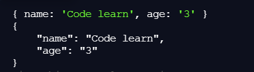

# Bài tập

<!-- https://codelearn.io/sharing/7-meo-va-thu-thuat-trong-javascript -->

## 1. Lọc ra những giá trị xuất hiện một lần trong mảng.
Kiểu đối tượng Set trong Javascript và toán tử spread ra mắt ở phiên bản ES6. Chúng ta có thể kết hợp 2 điều này để tạo ra một mảng mới từ mảng đã cho và các phần tử trong mảng chỉ xuất hiện một lần.
```
const array = [1, 1, 2, 5, 3, 4, 4, 5]
const uniqueArray = [...new Set(array)]

console.log(uniqueArray)
// Results: [1, 2, 5, 3, 4]
```
## 2. Every and some.
**Every** function trả về giá trị boolean. Nếu tất cả phần tử trong mảng thỏa mãn điều kiện thì sẽ trả về **true**. Bên cạnh đó, **some** function chỉ kiểm trả nếu tồn tại ít nhất một phần tử trong mảng thỏa điều kiện thì trả về true.
```
const firstArray = [12, 2, 3, 5, 6]
const secondArray = [20, -5, 3, 1, 6]

const isPositive = (number) => {
  return number > 0;
}

console.log(firstArray.every(isPositive));
// true (vì tất cả phần tử trong mảng này đều thỏa điều kiện)
console.log(secondArray.every(isPositive));
// false (vì có một phần tử -5 không thỏa điều kiện)

console.log(firstArray.some(isPositive));
// true
console.log(secondArray.some(isPositive))
// true (tồn tại phần tử thỏa điều kiện)
```
## 3. Chuyển từ số sang kiểu Boolean.
Khai báo một biến có giá trị boolean, ngoài cách khai báo thông thường (cho giá trị của biến là true hoặc false) thì có thể làm theo cách dưới đây.
```
const isTrue = !0;
const isFalse = !1;
const alsoFalse = !!0;

console.log(isTrue);
// true
console.log(isFalse);
// false
console.log(alsoFalse);
// false
```
## 4. Chuyển sang kiểu String.
Với những ngôn ngữ, ta có thể chuyển số sang string bằng hàm **toString()**. Javascript cũng vậy, tuy nhiên còn có cách khác nhanh gọn hơn để làm điều đó như ví dụ dưới đây.
```
const value = 1 + "";

console.log(value);
// "1"
```
## 5. Chuyển sang kiểu Number.
Việc chuyển từ String sang Number có thể sử dụng **parseInt()** trong Javascript. Nhưng có cách khác ngắn hơn để làm điều này đó chính ra sử dụng toán tử +.
```
var value = "15"
value = +value;

console.log(value);
// 15
console.log(typeof value);
// "number"
```
## 6. Chuyển từ số thập phân sang số nguyên.
Nếu muốn chuyển từ một số thập phân sang số nguyên, bạn có thể sử dụng các function của Object Math như **Math.floor()**, **Math.ceil()** hoặc **Math.round()**. Nhưng cách nhanh nhất để làm điều này là sử dụng toán tử bitwise OR ( | ).
```
console.log(5.9 | 0); // 5
console.log(5.1 | 0); // 5
```
## 7. Format code JSON.
Kiểu JSON nếu hiển thị trên một đường thẳng sẽ rất khó đọc, để dễ dàng đọc kiểu JSON hơn thì chúng ta có thể sử dụng method **stringify()** như ví dụ dưới đây.
```
let obj = {name: 'Code learn', age: '3'}

console.log(obj)
console.log(JSON.stringify(obj, null, '\t'))
```
Kết quả:

<p align="center">
    
</p>

<!-- https://codelearn.io/sharing/7-meo-va-thu-thuat-trong-javascript -->

Testcase
Mình ít thấy testcase theo dòng mà thường là test-case theo chức năng. Ví dụ với màn hình login (viết BDD chẳng hạn) sẽ có các test case sau:

* Vào màn hình login, check các input để trống và focus để * vào input username / email.
* Nếu chưa nhập đủ 2 input thì nút login bị disable.
* Nhập đúng, vào màn hình home.
* Nhập sai format email, có thông báo lỗi.
* Nhập sai email / password, báo lỗi không match.
. Nhập đúng nhưng account bị inactive, báo lỗi acc đã bị khóa.
* Login bằng google+ ok.
. Login bằng google+ nhưng không nhận được response từ google+

Khi đó sẽ có các test function sau:

* testInputInit()
* testInputValidateNull()
* testLoginOK()
* testInputValidateEmail()
* testInputNotMatchEmailPassword
* testLoginInactive()
* testLoginGoogleOK()
* testLoginGoogleTimeout()

mỗi function là 1 test case và mình ghi rõ đầu vào đầu ra ở hàm mô tả (hoặc cho 1 dataset in/out vào đó). Dùng jsdoc generate ra, cho vào excel, thế là xong. Các hàm này chưa cần implement gì cả nên assert sẽ toàn fail nếu chạy cả test suite. Khi nào sếp bảo là viết unittest đi thì mình implement (tuy nhiên, hay nhất là nên viết assert trước khi viết function cần test, như vậy sẽ nhanh hơn là viết function trước, sau viết test case. Với lại, chạy ra xanh đỏ nhìn cũng hay hay, gây hứng thú phết. Đỏ lòm là bực mình mà xanh rì là sướng)

Làm unittest hay ở chỗ mình không cần phải nhớ có bao nhiêu case cần trap trong óc làm gì cả. Tất cả rành rành ở IDE rồi, đỡ phải lôi tài liệu, đỡ phải nhức đầu, … Nói chung, cứ cái gì cần nhớ thì ghi luôn vào IDE là hay nhất.

À, với cả vụ viết test case phải làm trước khi làm code thì mình mới rõ cần bao nhiêu if else để trap qua các case chứ. Chứ code xong rồi, viết testcase thì thành ra là viết report xem chức năng này hoạt động thế nào thì đúng hơn.
