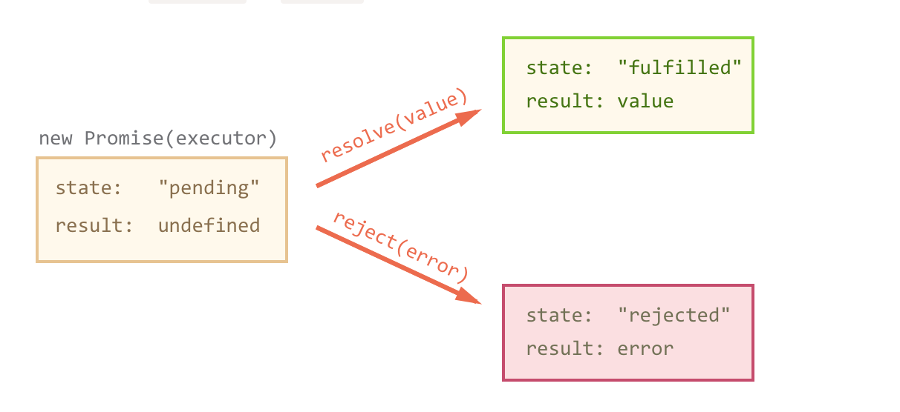

# Promise Là Gì? Khi Nào Sử Dụng Promise ?

## Yêu cầu người đọc về promise

* Hiểu cơ bản về javascript
* Đã biết sử dụng callback trong javascript

## Promise trong javascript là gì?

Thật ra do có nhiều các bạn thần thánh Promise cho nên cho nó là thứ cao siêu và thần thánh. Đúng là nó cao siêu thật nhưng nó không thần thánh và khó hiểu hoặc khó sử dụng như vậy. Thực tế là promise là một special JavaScript object cũng giống như các object khác mà thôi. Promise giúp chúng ta thực thi những func khác và trả về cho chúng ta để tiếp tục xử lý với nhiều công đoạn.

Nói đơn giản nhé. Khi ngỏ lời yêu một cô gái nào đó. Khi mở lời "Em có làm người yêu anh không?" Đó chính là một promise cụ thể là new Promise(). Và khi ngỏ lời thì trạng thái sẽ là pending, và đương nhiên kết quả là chưa biết cô ấy đồng ý hay không? Cho nên result là không biết.

## Khi nào nên sử dụng promise javascript

Nhiều trường hợp bắt buộc trong lập trình chúng ta phải lập trình đồng bộ, nghĩa là bạn phải chạy function 1 để có data 1, dùng data 1 để query data 2. Mà trong javascript là chạy bất đồng bộ, nên chính lúc này bạn phải sử dụng Promise. Nhưng trước hết bạn xem cú pháp về Promise. Đoạn này nên ghi rõ ra, và cú pháp của promise là như thế này:

```
let promise = new Promise(function(resolve, reject) { // tương đương với ngỏ lời yêu

})
```

Khi promise thực thi hoàn thành công việc, nó sẽ gọi một trong các hàm mà nó nhận làm đối số.
Đó là `resolve(value)` và `reject(error)`. Nó đồng nghĩa là khi ngỏ lời yêu thì sau khi chờ đợi pending thì sẽ có hai kết quả từ cô gái đó.

Đồng ý or Từ Chối.. Hai đối số trên cũng vậy.

* `resolve(value)` - Đồng ý lúc đó `status` sẽ là **"fulfilled"**, và `result` chính là **values**.
* `reject(error)` đồng nghĩa với việc từ chối, xem như một lỗi khi tỏ tình, lúc đó `status` sẽ là **"rejected"** và `result` chính là **error**.


Vậy chúng ta hiểu nôm na về câu chuyện tình yêu nhé. Và bây giờ chúng ta sẽ đi vào một ví dụ cụ thể để hiểu rõ hơn Promise là gì? Và khi nào áp dụng nó nhé. Ví dụ: Cô ấy đồng ý nhé. hé hé

```
//Em có yêu anh không?
let promise = new Promise(function(resolve, reject) {
//Cô ấy giả vờ suy nghĩa tầm 1000ms nhé

setTimeout(() => resolve("Dạ, em yêu anh"), 1000); // ngon rồi , ngon rồi nghĩa là cô ấy trả lời


})
```

Khi Promise được giải quyết thành công thì đó có thể là một tin vui. **Chú ý** nhé chúng ta chỉ biết `status` là **fulfilled** thôi nhé. Chưa biết không yêu hay có yêu đâu. Muốn biết được thì tiếp tục chạy hàm `.then().` Tiếp tục xử lý tiếp.

// resolve runs the first function in .then promise.then( result => alert(result), // shows "Dạ, em yêu anh" sau 1000ms error => alert(error) // đương nhiên hàm này sẽ không chạy, vì status là cô ấy trả lời và thành công. )

Ví dụ cô ây từ chối

```
//Em có yêu anh không?
let promise = new Promise(function(resolve, reject) {

//Cô ấy gỉa vờ suy nghĩa tầm 1000ms nhé và im luôn :D

setTimeout(() => reject(new Error("Whoops!")), 1000); // Rất tiếc bản về xem lại bản thân mình đi tại sao lại như vậy chứ :(

})
```

Đó là một ví dụ giúp chúng ta xử lý sau khi cô ấy nhận lời yêu thì có thể kiss or đi chơi được rồi.

Cũng giống trên

```
// reject runs the second function in .then
promise.then(
result => alert(result), // doesn't run
error => alert(error) // shows "Error: Whoops!" after 1 second
)
```

Qua một ví dụ cụ thể chúng ta thấy thật ra sử dụng promise cũng không quá khó khăn nhưng đó là một basic, còn rất nhiều cú pháp và đôi lúc trên đường đời tấp nập à quên đường đời LTV thì có nhiều cú pháp nó còn ma mi hơn nữa hay còn gọi là Promises chaining Một ví dụ về Promises chaining

```
new Promise(function(resolve, reject) {

setTimeout(() => resolve('em yêu anh'), 1000); // (*)

}).then(function(result) { // (**)

alert(result); // em yêu anh
return 'kiss thôi...';

}).then(function(result) { // (***)

alert(result); // kiss thôi
return 'Đi chơi thôi';

}).then(function(result) {

alert(result); // Đi chơi thôi
return 'oh yea baby'; //kakakakak

})
```
