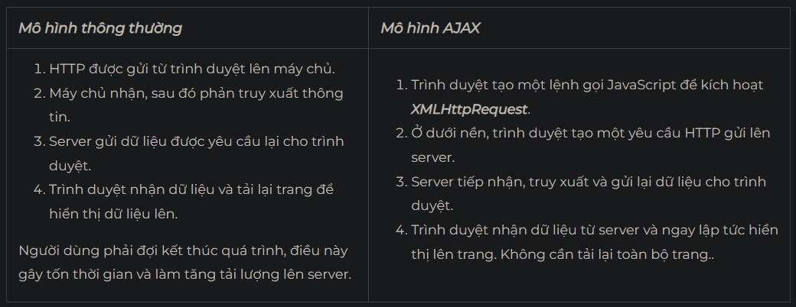

# AJAX

## AJAX là gì?

là chữ viết tắt của Asynchronous JavaScript and XML, AJAX = Asynchronous JavaScript and XML. Đây là một công nghệ giúp chung ta tạo ra những Web động mà hoàn toàn không reload lại trang nên rất mượt và đẹp. Vậy Asynchronous, JavaScript, XML trong từ AJAX là gì:

Asynchronous, hay nói ngắn hơn là Async – bất đồng bộ. Bất đồng bộ có nghĩa là một chương trình có thể xử lý không theo tuần tự các hàm. Sẽ không có quy trình, có thể nhảy đi bỏ qua bước nào đó. Ích lợi dễ thấy nhất của bất đồng bộ là chương trình có thể xử lý nhiều công việc một lúc.
JavaScript là một ngôn ngữ lập trình nổi tiếng. Trong số rất nhiều chức năng của nó là khả năng quản lý nội dung động của website và hỗ trợ tương tác với người dùng.
XML là một dạng của ngôn ngữ markup như HTML, chữ đầy đủ của nó là eXtensible Markup Language. Nếu HTML được dùng để hiển thị dữ liệu, XML được thiết kế để chứa dữ liệu.

## AJAX hiện đại

### AJAX trước đây

Bạn hãy nhớ đến tính năng tự động hoàn thiện của Google. Nó giúp bạn dự đoán và hoàn thiện từ khóa trong quá trình gõ. Từ khóa thay đổi theo thời gian thực nhưng trang web của Google vẫn giữ nguyên như cũ. Trong thập niên 90s, khi internet vẫn chưa phát triển, tính năng này cần Google phải cho tải trang lại mỗi lần có đề nghị mới hiện lên màn hình. AJAX giúp việc trao đổi dữ liệu nội bộ và presentation layer hoạt động đồng thời. Tuy nhiên không ảnh hưởng đến chức năng của nhau.

Ajax được ứng dụng phổ biến trong hầu hết các website hiện nay, cụ thể nhất là công cụ tìm kiếm Google. \
Ajax được ứng dụng phổ biến trong hầu hết các website hiện nay, cụ thể nhất là công cụ tìm kiếm Google.
Ý tưởng của AJAX đã thực sự có từ giữ thập kỷ 90. Nhờ Google, nó đã được công nhận rộng rãi hơn khi mà Google triển khai ý tưởng này lên Google Mail và Google Maps năm 2004. Ngày nay, nó đã được dùng khắp các ứng dụng web để tinh giản quá trình giao tiếp với server.

### **AJAX ngày nay**

* **Hệ thống đánh giá và xếp hạng**
    Bạn đã từng bao giờ đưa đánh giá về sản phẩm bạn mua online chưa? Đã bao giờ thử điền form bầu chọn online chưa? Cả 2 hoạt động này chắc hẳn đều sử dụng AJAX. Khi bạn click vào nút đánh giá hay bình chọn, website sẽ nhận kết quả nhưng toàn trang web vẫn không đổi.
* **Chat rooms**
    Một số website thiết lập chat room tích hợp này trên trang chính của họ, để bạn có thể nói chuyện trực tiếp với nhân viên hỗ trợ. Nhưng bạn không phải lo việc bạn cần tải trang mỗi lần chat. AJAX không tải lại trang mỗi khi bạn gửi và nhận một tin nhắn mới.
* **Thông báo trending của Twitter**
    Twitter đã từng sử dụng AJAX cho các cập nhật mới. Mỗi lần có tweet mới trong các chủ đề nóng, Twitter sẽ cập nhật thông tin mới mà không ảnh hưởng đến trang chính.

Tóm lại, AJAX hoạt động đa nhiệm. Nếu bạn từng gặp trường hợp 2 tác vụ hoạt động đồng thời, một cái chạy và một cái tĩnh, có thể đó chính là sản phẩm của AJAX.

## AJAX hoạt động như thế nào?

Bạn cần lưu ý AJAX không phải dùng một công nghệ duy nhất, cũng không phải ngôn ngữ lập trình. Như đã nói ở trên, AJAX là một bộ kỹ thuật phát triển web. Bộ hệ thống này bao gồm:

* **HTML/XHTML** làm ngôn ngữ chính và CSS để tạo phong cách.
* **The Document Object Model (DOM)** để hiển thị dữ liệu động và tạo tương tác.
* **XML** để trao đổi dự liệu nội bộ và XSLT để xử lý nó. Nhiều lập trình viên đã thay thế bằng **JSON** vì nó gần với **JavaScript** hơn.
* **XMLHttpRequest** object để giao tiếp bất đồng bộ.
* Cuối cùng, **JavaScript** làm ngôn ngữ lập trình để kết nối toàn bộ các công nghệ trên lại.

Có thể bạn cần có [kiến thức](https://wiki.matbao.net/kien-thuc/) kỹ thuật để hiểu về nó hoàn toàn. Tuy nhiên, quy trình cơ bản của AJAX lại rất đơn giản. Bạn chỉ cần nhìn vào sơ đồ sau là thấy.

### **Sơ đồ hoạt động**Bạn cần lưu ý AJAX không phải dùng một công nghệ duy nhất, cũng không phải ngôn ngữ lập trình. Như đã nói ở trên, AJAX là một bộ kỹ thuật phát triển web. Bộ hệ thống này bao gồm

* **HTML/XHTML** làm ngôn ngữ chính và CSS để tạo phong cách.
* **The Document Object Model (DOM)** để hiển thị dữ liệu động và tạo tương tác.
* **XML** để trao đổi dự liệu nội bộ và XSLT để xử lý nó. Nhiều lập trình viên đã thay thế bằng **JSON** vì nó gần với **JavaScript** hơn.
* **XMLHttpRequest** object để giao tiếp bất đồng bộ.
* Cuối cùng, **JavaScript** làm ngôn ngữ lập trình để kết nối toàn bộ các công nghệ trên lại.

Có thể bạn cần có [kiến thức](https://wiki.matbao.net/kien-thuc/) kỹ thuật để hiểu về nó hoàn toàn. Tuy nhiên, quy trình cơ bản của AJAX lại rất đơn giản. Bạn chỉ cần nhìn vào sơ đồ sau là thấy.

### **Sơ đồ hoạt động**


### **Bảng so sánh**



## Tại sao nên dùng AJAX?

Có 4 lợi ích chính của việc sử dụng Ajax, cụ thể là:

* **Callbacks**: Ajax được sử dụng để thực hiện một cuộc gọi lại. **AJAX** thực hiện việc truy xuất hoặc lưu dữ liệu mà không gửi toàn bộ trang trở lại máy chủ. Bằng cách gửi lại một phần trang web đến máy chủ, việc sử dụng mạng được giảm thiểu và các hoạt động diễn ra nhanh hơn. Trong các trang web băng thông hạn chế, điều này có thể cải thiện đáng kể hiệu suất mạng. Dữ liệu được gửi đến và đi từ máy chủ một cách tối thiểu.
* **Thực hiện các cuộc gọi không đồng bộ**: Ajax cho phép bạn thực hiện các cuộc gọi không đồng bộ đến một máy chủ web. Điều này cho phép trình duyệt của người dùng tránh phải chờ tất cả dữ liệu đến trước khi cho phép người dùng hành động một lần nữa.
* **Thân thiện với người dùng**: Vì không phải post lại trang lên server, các ứng dụng hỗ trợ Ajax sẽ luôn nhanh hơn và thân thiện với người dùng hơn.
* **Tăng tốc độ**: Mục đích chính của Ajax là **cải thiện tốc độ**, **hiệu suất** và **khả năng sử dụng của một ứng dụng web**. Một ví dụ tuyệt vời của Ajax là tính năng xếp hạng phim trên Netflix. Người dùng đánh giá một bộ phim và xếp hạng cá nhân của họ cho bộ phim đó sẽ được lưu vào cơ sở dữ liệu của họ mà không cần chờ trang làm mới hoặc tải lại.

## jQuery Ajax là gì?

jQuery Ajax là jQuery cung cấp một số phương thức để thực hiện các chức năng ajax. Chúng ta có thể yêu cầu các text, HTML, XML và JSON từ server sử dụng cả giao thức HTTP GET và HTTP POST, chúng ta cũng có thể lấy dữ liệu từ bên ngoài trực tiếp vào trong phần tử được chọn.

Hàm `$.ajax()` của JQuery được sử dụng để thực hiện các request HTTP bất đồng bộ (async). Nó đã được thêm vào thư viện này từ rất lâu, tồn tại từ phiên bản 1.0. Ba hàm `$.get()`, `$.post()` và `$.load()` có thể coi là một hàm `$.ajax()` với những thiết lập có sẵn. Sau đây là cú pháp tổng quát của hàm `$.ajax()`    :

```
$.ajax(url[, options])
$.ajax([options])
```

Tham số url là một chuỗi chứa URL mà bạn muốn sử dụng AJAX để thực hiện request, trong khi đó tham số options là một object thuần chứa các thiết lập cho request AJAX đó.

Ở dạng đầu tiên, phương thức này thực hiện một request AJAX sử dụng tham số url và các cài đặt được chỉ định ở options. Ở dạng thứ hai, URL được chỉ định trong tham số options, hoặc có thể được lược bỏ trong trường hợp request này được gửi đến chính đường dẫn của trang hiện tại. Bạn có thể xem document chính thức của `$.ajax()` để hiểu rõ hơn về các option của AJAX.

## Các phương thức cơ bản của jQuery Ajax

**jQuery Ajax** có khá nhiều phương thức khác nhau. Tuy nhiên dưới đây Mắt Bão sẽ đề cập 3 phương thức cơ bản nhất gồm:

* Phương thức jquery load () jQuery Ajax
* Phương thức Post () trong JQuery Ajax
* Phương thức Get () trong Jquery Ajax

Hãy cùng tìm hiểu chi tiết về 3 phương thức nói trên!

### Phương thức jquery load () jQuery Ajax là gì?

Phương thức load() lấy dữ liệu từ server và trả dữ liệu cho phần tử được chọn.

Cú pháp:

```
$(selector).load(URL,data,callback);
```

* _**URL**_: mà bạn muốn lấy dữ liệu.
* _**Data**_: cặp key/value gửi đi cùng với yêu cầu.
* _**Callback**_: tên của hàm sẽ được thực thi sau khi phương thức load hoàn thành.

Ví dụ: Ta có file _**demo\_test.txt**_

```
<h2>jQuery and AJAX is FUN!!!</h2>
<p id="p1">This is some text in a paragraph.</p>
```

Load nội dung của file “demo_test.txt“ vào trong một div với id = div1

```
<!DOCTYPE html>
<html>
<head>
<script src="https://ajax.googleapis.com/ajax/libs/jquery/1.12.4/jquery.min.js"></script>
<script>
$(document).ready(function(){
$("button").click(function(){
$("#div1").load("demo_test.txt");
});
});
</script>
</head>
<body>

<div id="div1"><h2>Let jQuery AJAX Change This Text</h2></div>

<button>Get External Content</button>

</body>
</html>
```

### Phương thức Post () trong JQuery Ajax là gì?

Có tác dụng lấy dữ liệu từ server bằng phương thức HTTP POST REQUEST

Cú pháp:

```
$(selector).post(URL,data,function(data,status,xhr),dataType)
```

* **url**: required , đường dẫn đến file cần lấy thông tin
* **data**: không bắt buộc ,là một đối tượng object gồm các key : value sẽ gửi lên server
* **function(data, status , xhr)**: là function sẽ xử lý khi thực hiện thành công với các parameters. Với:
  * **data** : bao gồm các dữ liệu trả về từ request
  * **status** : gồm trạng thái request (“success” , “notmodified” , “error” , “timeout” , or “parsererror”)
  * **xhr** : gồm các đối tượng XMLHttpRequest
* **dataType**: là dạng dữ liệu trả về. (text, json, script, xml,html,jsonp )

Ví dụ : Ta có file “_**demo\_test\_post.asp**_“

```
<%
dim fname,city
fname=Request.Form("name")
city=Request.Form("city")
Response.Write("Dear " & fname & ". ")
Response.Write("Hope you live well in " & city & ".")
%>
```

```
<!DOCTYPE html>
<html>
<head>
<script src="https://ajax.googleapis.com/ajax/libs/jquery/1.12.4/jquery.min.js"></script>
<script>
$(document).ready(function(){
$("button").click(function(){
$.post("demo_test_post.asp",
{
name: "Donald Duck",
city: "Duckburg"
},
function(data,status){
alert("Data: " + data + "nStatus: " + status);
});
});
});
</script>
</head>
<body>

<button>Send an HTTP POST request to a page and get the result back</button>

</body>
</html>
```

* _**Tham số đầu tiên của $ .post ()**_ là **URL nhận request** (“demo\_test\_post.asp)
* _**Tham số thứ hai là data**_ :gửi dữ liệu name và city thông qua phương thức post . Trang “demo\_test\_post.asp” đọc các dữ liệu , xử lý chúng, và trả về một kết quả.
* _**Tham số thứ hai là một function call back**_, tham số callback đầu tiên data lưu nội dung của các trang yêu cầu, và tham số thứ hai status giữ trạng thái của yêu cầu.Sau khi request được trả về status là success

### Phương thức Get () trong Jquery Ajax là gì?

Là phương pháp lấy dữ liệu từ server bằng phương thức HTTP GET

Tương tự như phương thức Post , phương thức get có cú pháp là :

```
$.get(URL,data,function(data,status,xhr),dataType)
```

Ví dụ :

```
<!DOCTYPE html>
<html>
<head>
<script src="https://ajax.googleapis.com/ajax/libs/jquery/1.12.4/jquery.min.js"></script>
<script>
$(document).ready(function(){
$("button").click(function(){
$.get("demo_test.asp", function(data, status){
alert("Data: " + data + "nStatus: " + status);
});
});
});
</script>
</head>
<body>

<button>Send an HTTP GET request to a page and get the result back</button>

</body>
</html>
```

* Tham số đầu tiên của `$.get()` là URL file nhận request ( “demo_test.asp”).
* Tham số thứ hai là một function call back, tham số callback đầu tiên data lưu nội dung của các trang yêu cầu, và tham số thứ hai status giữ trạng thái của yêu cầu.Sau khi request được trả về status là success.
