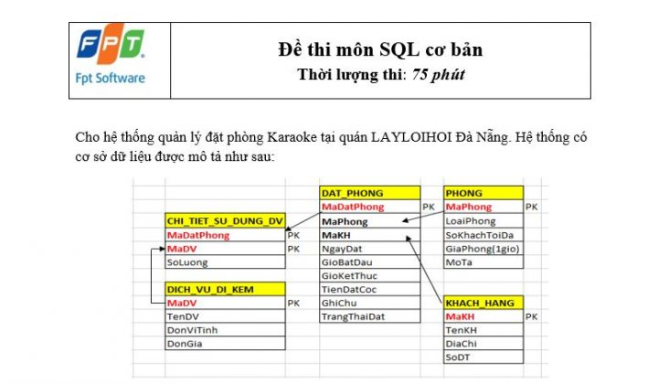
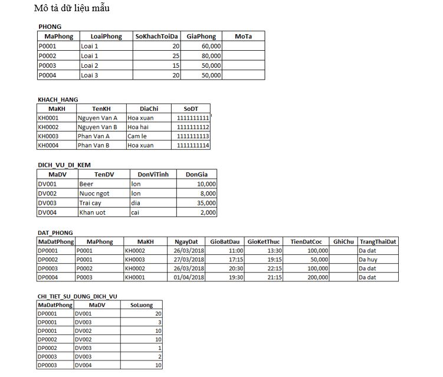

# Bài kiểm tra SQL 01
## I. Đề bài
<p align="center">
    
</p>

## II. Lưu ý:
* KHACH_HANG: lưu trữ thông tin của khách hàng
* PHONG: lưu trữ thông tin phòng karaoke
* DICH_VU_DI_KEM: lưu trữ thông tin các dịch vụ đi kèm được cung cấp tại quán Karaoke.
* DAT_PHONG: lưu trữ thông tin đặt phòng karaoke của khách hàng
* CHI_TIET_SU_DUNG_DV: lưu trữ thông tin chi tiết khi khách hàng sử dụng các dịch vụ đi kèm.
* PK: là các trường tham gia vào khóa chính của bảng
<p align="center">
    
</p>

## III. Yêu cầu
Viết câu lệnh SQL để thực hiện các yêu cầu sau (mỗi yêu cầu chỉ được viết tối đa 1 câu lệnh SQL):

Câu 1:Liệt kê MaDatPhong, MaDV, SoLuong của tất cả các dịch vụ có số lượng lớn hơn 3 và nhỏ hơn 10. (1 điểm)

Câu 2: Cập nhật dữ liệu trên trường GiaPhong thuộc bảng PHONG tăng lên 10,000 VNĐ so với giá phòng hiện tại, chỉ cập nhật giá phòng của những phòng có số khách tối đa lớn hơn 10. (1 điểm)

Câu 3: Xóa tất cả những đơn đặt phòng (từ bảng DAT_PHONG) có trạng thái đặt (TrangThaiDat) là “Da huy”. (1 điểm)

Câu 4: Hiển thị TenKH của những khách hàng có tên bắt đầu là một trong các ký tự “H”, “N”, “M” và có độ dài tối đa là 20 ký tự. (1 điểm)

Câu 5: Hiển thị TenKH của tất cả các khách hàng có trong hệ thống, TenKH nào trùng nhau thì chỉ hiển thị một lần. Sinh viên sử dụng hai cách khác nhau để thực hiện yêu cầu trên, mỗi cách sẽ được 0,5 điểm. (1 điểm)

Câu 6: Hiển thị MaDV, TenDV, DonViTinh, DonGia của những dịch vụ đi kèm có DonViTinh là “lon” và có DonGia lớn hơn 10,000 VNĐ hoặc những dịch vụ đi kèm có DonViTinh là “Cai” và có DonGia nhỏ hơn 5,000 VNĐ. (1 điểm)

Câu 7: Hiển thị MaDatPhong, MaPhong, LoaiPhong, SoKhachToiDa, GiaPhong, MaKH, TenKH, SoDT, NgayDat, GioBatDau, GioKetThuc, MaDichVu, SoLuong, DonGia của những đơn đặt phòng có năm đặt phòng là “2016”, “2017” và đặt những phòng có giá phòng > 50,000 VNĐ/ 1 giờ. (1 điểm)

Câu 8: Hiển thị MaDatPhong, MaPhong, LoaiPhong, GiaPhong, TenKH, NgayDat, TongTienHat, TongTienSuDungDichVu, TongTienThanhToan tương ứng với từng mã đặt phòng có trong bảng DAT_PHONG. Những đơn đặt phòng nào không sử dụng dịch vụ đi kèm thì cũng liệt kê thông tin của đơn đặt phòng đó ra. (1 điểm)

TongTienHat = GiaPhong * (GioKetThuc – GioBatDau)
TongTienSuDungDichVu = SoLuong * DonGia
TongTienThanhToan = TongTienHat + sum (TongTienSuDungDichVu)

Câu 9: Hiển thị MaKH, TenKH, DiaChi, SoDT của những khách hàng đã từng đặt phòng karaoke có địa chỉ ở “Hoa xuan”. (1 điểm)

Câu 10: Hiển thị MaPhong, LoaiPhong, SoKhachToiDa, GiaPhong, SoLanDat của những phòng được khách hàng đặt có số lần đặt lớn hơn 2 lần và trạng thái đặt là “Da dat”. (1 điểm)

## IV. Hướng dẫn:
### A. Xây dựng database và insert dữ liệu
```
CREATE DATABASE LAYLOIHOI_DB

CREATE TABLE KHACH_HANG(
    MAKH INT PRIMARY KEY,
    TENKH VARCHAR(30),
    DIACHI VARCHAR(50),
    SODT CHAR(11)
)
CREATE TABLE PHONG(
    MAPHONG INT PRIMARY KEY,
    LOAIPHONG VARCHAR(20),
    SOKHACHTOIDA INT,
    GIAPHONG DECIMAL(6,3),
    MOTA VARCHAR(255)
)
CREATE TABLE DAT_PHONG(
    MADATPHONG INT PRIMARY KEY,
    MAPHONG INT,
    MAKH INT,
    NGAYDAT DATE,
    GIOBATDAU TIME,
    GIOKETTHUC TIME,
    TIENDATCOC DECIMAL(6,3),
    GHICHU VARCHAR(255),
    TRANGTHAIDAT VARCHAR(30),
    FOREIGN KEY (MAPHONG) REFERENCES PHONG(MAPHONG),
    FOREIGN KEY (MAKH) REFERENCES khach_hang(MAKH)
)
CREATE TABLE DICH_VU_DI_KEM(
    MADV INT PRIMARY KEY,
    TENDV VARCHAR(255),
    DONVITINH VARCHAR(30),
    DONGIA DECIMAL(6,3)
)
CREATE TABLE CHI_TIET_SU_DUNG_DV(
    MADATPHONG INT,
    MADV INT,
    SOLUONG INT,
    PRIMARY KEY (MADATPHONG, MADV),
    FOREIGN KEY (MADATPHONG) REFERENCES dat_phong(MADATPHONG)
)

-- INSERT DATA

INSERT INTO `phong` (`MAPHONG`, `LOAIPHONG`, `SOKHACHTOIDA`, `GIAPHONG`, `MOTA`) VALUES
(1, 'LOAI 1', 20, '60.000', ''),
(2, 'LOAI 1', 25, '80.000', ''),
(3, 'LOAI 2', 15, '50.000', ''),
(4, 'LOAI 3', 20, '50.000', '');

INSERT INTO `khach_hang` (`MAKH`, `TENKH`, `DIACHI`, `SODT`) VALUES
(1, 'MARIA OZAWA', 'HOA XUAN', '11111111111'),
(2, 'TOKUDA', 'HOA XUAN', '11111111112'),
(3, 'MIKAMI YUA', 'HOA XUAN', '11111111113'),
(4, 'NGUYEN VAN D', 'HOA XUAN', '11111111114');

INSERT INTO `dich_vu_di_kem` (`MADV`, `TENDV`, `DONVITINH`, `DONGIA`) VALUES
(1, 'HOT GIRL', 'EM', '10.000'),
(2, 'HOA HAU', 'EM', '20.000'),
(3, 'BEER', 'LON', '10.000'),
(4, 'TRAI CAY', 'DIA', '35.000');


INSERT INTO `dat_phong` (`MADATPHONG`, `MAPHONG`, `MAKH`, `NGAYDAT`, `GIOBATDAU`, `GIOKETTHUC`, `TIENDATCOC`, `GHICHU`, `TRANGTHAIDAT`) VALUES
(1, 1, 2, '2018-03-26', '11:00:00', '13:00:00', '100.000', '', 'DA DAT'),
(2, 1, 3, '2018-03-27', '17:15:00', '19:15:00', '50.000', '', 'DA HUY'),
(3, 2, 2, '2018-03-26', '20:30:00', '22:15:00', '100.000', '', 'DA DAT'),
(4, 3, 1, '2018-04-01', '19:30:00', '21:15:00', '200.000', '', 'DA DAT');

INSERT INTO `chi_tiet_su_dung_dv` (`MADATPHONG`, `MADV`, `SOLUONG`) VALUES
(1, 1, 20),
(1, 2, 10),
(1, 3, 3),
(2, 2, 10),
(2, 3, 1),
(3, 3, 2),
(3, 4, 10);
```
### Đáp án Bài test SQL cơ bản FPT FSOFT 2018
```
Câu 1:

SELECT MADATPHONG, MADV, SOLUONG
FROM chi_tiet_su_dung_dv
WHERE SOLUONG BETWEEN 4 AND 9

Câu 2:

UPDATE phong
SET GIAPHONG = GIAPHONG + 10
WHERE SOKHACHTOIDA > 10

Câu 3:

DELETE
FROM dat_phong
WHERE TRANGTHAIDAT = 'DA HUY'

Câu 4:

SELECT TENKH
FROM khach_hang
WHERE TENKH LIKE '[HNM]%' and LEN(TENKH) <= 20

Câu 5:

SELECT DISTINCT TENKH
FROM khach_hang

SELECT TENKH
FROM khach_hang
GROUP BY TENKH

Câu 6:

SELECT MADV, TENDV, DONVITINH, DONGIA
FROM dich_vu_di_kem
WHERE ( DONVITINH LIKE 'lon' AND DONGIA > 10 ) OR ( DONVITINH LIKE 'CAI' AND DONGIA < 5)

Câu 7: // Sử dụng JOIN kết nối các bảng và dùng hàm hỗ trợ của SQL thôi ^^!

SELECT dp.MADATPHONG, dp.MAPHONG, p.LOAIPHONG, p.SOKHACHTOIDA, p.GIAPHONG, kh.MAKH, kh.TENKH, kh.SODT, dp.NGAYDAT, dp.GIOBATDAU, dp.GIOKETTHUC, dv.MADV, ct.SOLUONG, dv.DONGIA
FROM dat_phong dp
JOIN khach_hang kh
on dp.MAKH = kh.MAKH
JOIN phong p
on dp.MAPHONG = p.MAPHONG
JOIN chi_tiet_su_dung_dv ct
ON dp.MADATPHONG = ct.MADATPHONG
JOIN dich_vu_di_kem dv
ON ct.MADV = dv.MADV
WHERE (YEAR(NGAYDAT) = 2016 OR YEAR(NGAYDAT) = 2018) AND P.GIAPHONG > 50

Câu 8: // trong thực tế  k tính thời gian bằng GIOKETHUC - GIOBATDAU đâu đây là người ta cho sẵn biểu thức thế thôi, mà chúng ta phải dùng hàm TIMEDIFF(time_end, time_start ) để tính chính xác thời gian và lấy ra Giờ phút giây của nó bằng hàm DATEPART(), tiếp đó tính tổng số giây. Nó cho giá phòng trong 1 giờ thì chúng ta phải đổi ra 1 giây bao nhiêu tiền, Tổng tiền phòng bằng tổng giây * tiền phòng 1 giây ^^!

SELECT dp.MADATPHONG, p.MAPHONG, p.LOAIPHONG, p.GIAPHONG, kh.TENKH, dp.NGAYDAT, p.GIAPHONG * (GIOKETTHUC - GIOBATDAU)  AS TONGTIENHAT, SUM(ct.SOLUONG * dv.DONGIA) AS TONGTIENSUDUNGDV, ( p.GIAPHONG * (GIOKETTHUC - GIOBATDAU) + SUM(CT.SOLUONG * dv.DONGIA ))
FROM dat_phong dp
JOIN khach_hang kh
on dp.MAKH = kh.MAKH
JOIN phong p
on dp.MAPHONG = p.MAPHONG
JOIN chi_tiet_su_dung_dv ct
ON dp.MADATPHONG = ct.MADATPHONG
JOIN dich_vu_di_kem dv
ON ct.MADV = dv.MADV
GROUP BY dp.MADATPHONG

Câu 9: // Câu này có thể dùng IN hoặc EXIST khuyến khích dùng EXISTS vì SQL SERVER sẽ đưa ra kết quả nhanh hơn

SELECT kh.MAKH, kh.TENKH, kh.DIACHI, kh.SODT
FROM khach_hang kh
WHERE kh.DIA CHI = 'HOA XUAN' AND EXISTS (
    SELECT *
    FROM dat_phong dp
    WHERE kh.MAKH = dp.MAKH )

Câu 10: // Câu 10 điểm này theo mình thì là câu cho điểm 10 :D

SELECT p.MAPHONG,p.LOAIPHONG,p.SOKHACHTOIDA,p.GIAPHONG, COUNT(dp.MAPHONG) AS SOLUONGDAT
FROM phong p
JOIN dat_phong dp
ON p.MAPHONG = dp.MAPHONG
WHERE dp.TRANGTHAIDAT = 'DA DAT'
GROUP BY p.MAPHONG
HAVING COUNT(dp.MAPHONG) > 2
```
