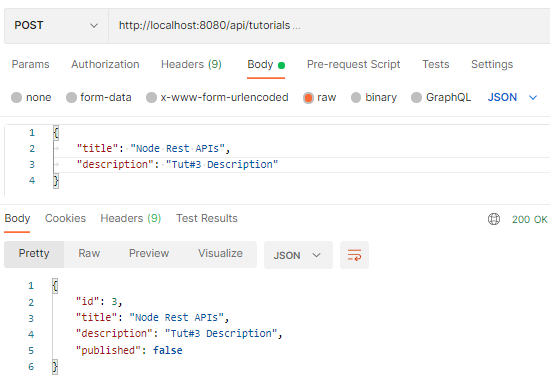
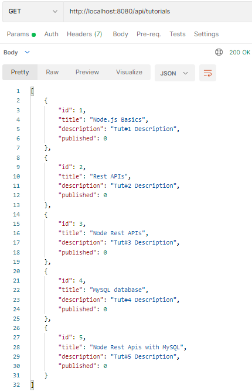
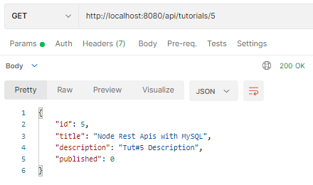
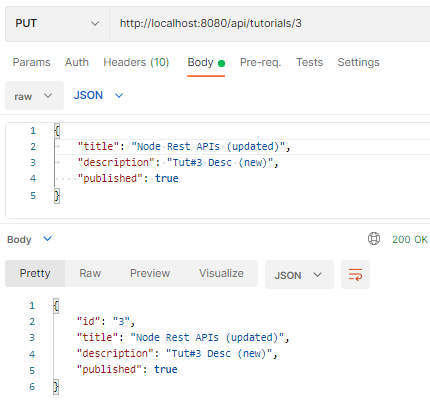
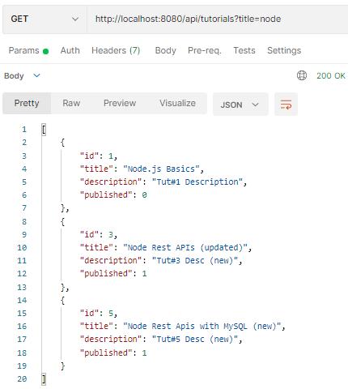
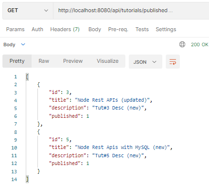
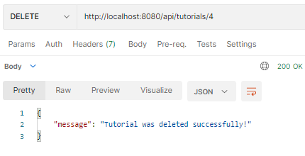

# Bài tập thực hành RestApi

## Bài 1. Test api tutorial  có sẵn - CRUD

### Application overview

---
We will build Rest Apis for creating, retrieving, updating, deleting and searching Tutorials.

First, we start with an Express web server. Next, we add configuration for MySQL database, create Tutorial model, write the controller. Then we define routes for handling all CRUD

### Api overview

---
|Methods|Urls| Actions
|---|---|---|
GET | api/tutorials|  get all Tutorials
GET | api/tutorials/:id|  get Tutorial by id
POST | api/tutorials|  add new Tutorial
PUT | api/tutorials/:id|  update Tutorial by id
DELETE | api/tutorials/:id|  remove Tutorial by id
DELETE | api/tutorials|  remove all Tutorials
GET | api/tutorials/published|  find all published Tutorials
GET | api/tutorials?title=[kw]|  find all Tutorials which title contains 'kw'

### Request

---

* Tạo mới Tutorial
* Tìm kiếm Tutorial
* Xóa hoặc sửa Tutorial

### Test the APIs

---

1. Clone soure từ nhánh...
2. cài đặt, chạy source trên localhost:8080
3. Dùng postman crud dựa trên api document đã cho

---

#### Create a new Tutorial using POST `/tutorials` Api



After creating some new Tutorials, we can check MySQL table:

```
mysql> SELECT * FROM tutorials;
+----+---------------------------+-------------------+-----------+
| id | title                     | description       | published |
+----+---------------------------+-------------------+-----------+
|  1 | Node.js Basics            | Tut#1 Description |         0 |
|  2 | Rest APIs                 | Tut#2 Description |         0 |
|  3 | Node Rest APIs            | Tut#3 Description |         0 |
|  4 | MySQL database            | Tut#4 Description |         0 |
|  5 | Node Rest Apis with MySQL | Tut#5 Description |         0 |
+----+---------------------------+-------------------+-----------+
```

#### Retrieve all Tutorials using GET /tutorials Api



#### Retrieve a single Tutorial by id using GET `/tutorials/:id` Api



#### Update a Tutorial using PUT `/tutorials/:id` Api


<br>Check **tutorials** table after some rows are updated:

```
mysql> SELECT * FROM tutorials;
+----+---------------------------------+-------------------+-----------+
| id | title                           | description       | published |
+----+---------------------------------+-------------------+-----------+
|  1 | Node.js Basics                  | Tut#1 Description |         0 |
|  2 | Rest APIs                       | Tut#2 Description |         0 |
|  3 | Node Rest APIs (updated)        | Tut#3 Desc (new)  |         1 |
|  4 | MySQL database                  | Tut#4 Description |         0 |
|  5 | Node Rest Apis with MySQL (new) | Tut#5 Desc (new)  |         1 |
+----+---------------------------------+-------------------+-----------+
```

#### Find Tutorials by title using GET `/tutorials` Api



#### Find all published Tutorials



#### Delete a Tutorial using DELETE `/tutorials/:id` Api



Now there are no rows in tutorials table:
```
mysql> SELECT * FROM tutorials;
Empty set (0.00 sec)
```
