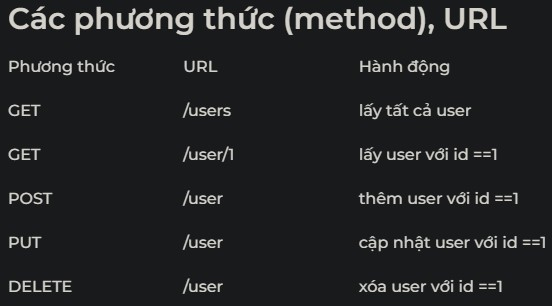

# Bài tập thực hành RestApi

## Bài 2. Tạo danh sách user với nodejs - mysql

### Yêu cầu

Viết một RestApi user với các chưc năng sau:

* Lấy toàn bộ danh sách user
* Lấy user
* Thêm user
* Cập nhật user
* Xóa user



### Hướng dẫn

**1. Tạo thư mục**

    ```
    mkdir crud-api
    cd crud-api
    ```

**2. Cài đặt npm nodejs<br>**
Sau khi tạo thư mục crud-api. Tiếp theo cài đặt npm , Express, MySQL và body-parser

    ```
    npm init --yes
    npm install
    npm install express --save
    npm install mysql --save
    npm install body-parser --save
    ```
**3. Tạo cơ sở dữ liệu (database) và bảng (table)**
Tiếp theo chúng ta cần tạo cơ sở dữ liệu và bảng để thực hiện thao tác CURD NodeJS

```
-- Cấu trúc bảng cho users
CREATE TABLE IF NOT EXISTS users ( id int(11) NOT NULL, name varchar(200) NOT NULL, email varchar(200) NOT NULL, created_at datetime NOT NULL DEFAULT CURRENT_TIMESTAMP ) ENGINE=InnoDB DEFAULT CHARSET=latin1;
ALTER TABLE users ADD PRIMARY KEY (id);
ALTER TABLE users MODIFY id int(11) NOT NULL AUTO_INCREMENT;
```

**4. Thêm dữ liệu vào cơ sở dữ liệu**

```
INSERT INTO users (id, name, email, created_at) VALUES
  (1, 'Max', 'max@gmail.com', '2020-03-18 23:20:20'),
  (2, 'John', 'john@gmail.com', '2020-03-18 23:45:20'),
  (3, 'David', 'david@gmail.com', '2020-03-18 23:30:20'),
  (4, 'James', 'james@gmail.com', '2020-03-18 23:10:20'),
  (5, 'Shaw', 'shaw@gmail.com', '2020-03-18 23:15:20');
```

**5. Tạo file server.js**
Tạo file trong thư mục curd-api và đặt kết nối. ``server.js`` là điểm vào(entry point).

```
var express = require('express');
 var app = express();
 var bodyParser = require('body-parser');
 app.use(bodyParser.json());
 app.use(bodyParser.urlencoded({
     extended: true
 }));
 // route mặc định
 app.get('/', function (req, res) {
     return res.send({ error: true, message: 'hello' })
 });
 // chỉnh port
 app.listen(3000, function () {
     console.log('Node app is running on port 3000');
 });
 module.exports = app;
```

**6. Tạo kết nối với cơ sở dữ liệu nodejs**
Dùng để tìm và cập nhật dữ liệu vào cơ sở dữ liệu

```
var dbConn = mysql.createConnection({
     host: 'localhost',
     user: 'root',
     password: '',
     database: 'node_js_api'
 });
 // kết nối vào cơ sở dữ liệu
 dbConn.connect();
```

### Code mẫu

#### Lấy toàn bộ danh sách user

Đầu tiên dùng phương thức GET như bảng trên để lấy tất cả dữ liệu user

```
// Truy xuất tất cả dữ liệu user
 app.get('/users', function (req, res) {
     dbConn.query('SELECT * FROM users', function (error, results, fields) {
         if (error) throw error;
         return res.send({ error: false, data: results, message: 'users list.' });
     });
 });
```

Gọi API bằng URL : `http://127.0.0.1:3000/users`

#### Lấy user

Đầu tiên dùng phương thức GET như bảng trên để lấy tất cả dữ liệu user

```
// Truy xuất user với id
 app.get('/user/:id', function (req, res) {
     let user_id = req.params.id;
     if (!user_id) {
      return res.status(400).send({ error: true, message: 'Please provide user_id' });
     }
     dbConn.query('SELECT * FROM users where id=?', user_id, function (error, results, fields) {
      if (error) throw error;
       return res.send({ error: false, data: results[0], message: 'users list.' });
     });
 });
```

Gọi API bằng URL `http://127.0.0.1/user/1`

#### Thêm user

Tạo route để thêm dữ liệu vào CSDL khi người dùng gửi yêu cầu (request) thêm với id==1

```
// Thêm user mới
 app.post('/user', function (req, res) {
     let user = req.body.user;
     if (!user) {
       return res.status(400).send({ error:true, message: 'Please provide user' });
     }
    dbConn.query("INSERT INTO users SET ? ", { user: user }, function (error, results, fields) {
   if (error) throw error;
     return res.send({ error: false, data: results, message: 'New user has been created successfully.' });
     });
 });
```

Gọi API bằng URL :  `http://127.0.0.1:3000/add`

#### Cập nhật user

Tạo route để cập nhật dữ liệu vào CSDL khi người dùng gửi yêu cầu (request) cập nhật với id==1

```
//  Cập nhật user với id
 app.put('/user', function (req, res) {
 let user_id = req.body.user_id;
 let user = req.body.user;
 if (!user_id || !user) {
   return res.status(400).send({ error: user, message: 'Please provide user and user_id' });
 }
 dbConn.query("UPDATE users SET user = ? WHERE id = ?", [user, user_id], function (error, results, fields) {
   if (error) throw error;
   return res.send({ error: false, data: results, message: 'user has been updated successfully.' });
  });
 });
 ```

Gọi vào API với URL : `http://127.0.0.1/user/{id}`

#### Xóa user

Tạo route mới để xóa dữ liệu khỏi CSDL khi người dùng gửi yêu cầu (request) xóa

```
//  Xóa user
 app.delete('/user', function (req, res) {
 let user_id = req.body.user_id;
 if (!user_id) {
     return res.status(400).send({ error: true, message: 'Please provide user_id' });
 }
 dbConn.query('DELETE FROM users WHERE id = ?', [user_id], function (error, results, fields) {
     if (error) throw error;
     return res.send({ error: false, data: results, message: 'User has been updated successfully.' });
 });
 });
```

Gọi API bằng URL : `http://127.0.0.1/user/{id}`

Đây là toàn bộ file `server.js nodejs`

```
var express = require('express');
var app = express();
var bodyParser = require('body-parser');
var mysql = require('mysql');
app.use(bodyParser.json());
app.use(bodyParser.urlencoded({
    extended: true
}));
app.get('/', function (req, res) {
    return res.send({ error: true, message: 'hello' })
});
var dbConn = mysql.createConnection({
    host: 'localhost',
    user: 'root',
    password: '',
    database: 'node_js_api'
});
dbConn.connect();
app.get('/users', function (req, res) {
    dbConn.query('SELECT * FROM users', function (error, results, fields) {
        if (error) throw error;
        return res.send({ error: false, data: results, message: 'users list.' });
    });
});
app.get('/user/:id', function (req, res) {
    let user_id = req.params.id;
    if (!user_id) {
        return res.status(400).send({ error: true, message: 'Please provide user_id' });
    }
    dbConn.query('SELECT * FROM users where id=?', user_id, function (error, results, fields) {
        if (error) throw error;
        return res.send({ error: false, data: results[0], message: 'users list.' });
    });
});
app.post('/user', function (req, res) {
    let user = req.body.user;
    if (!user) {
        return res.status(400).send({ error:true, message: 'Please provide user' });
    }
    dbConn.query("INSERT INTO users SET ? ", { user: user }, function (error, results, fields) {
        if (error) throw error;
        return res.send({ error: false, data: results, message: 'New user has been created successfully.' });
    });
});
app.put('/user', function (req, res) {
    let user_id = req.body.user_id;
    let user = req.body.user;
    if (!user_id || !user) {
        return res.status(400).send({ error: user, message: 'Please provide user and user_id' });
    }
    dbConn.query("UPDATE users SET user = ? WHERE id = ?", [user, user_id], function (error, results, fields) {
        if (error) throw error;
        return res.send({ error: false, data: results, message: 'user has been updated successfully.' });
    });
});
app.delete('/user', function (req, res) {
    let user_id = req.body.user_id;
    if (!user_id) {
        return res.status(400).send({ error: true, message: 'Please provide user_id' });
    }
    dbConn.query('DELETE FROM users WHERE id = ?', [user_id], function (error, results, fields) {
        if (error) throw error;
        return res.send({ error: false, data: results, message: 'User has been updated successfully.' });
    });
});
app.listen(3000, function () {
    console.log('Node app is running on port 3000');
});
module.exports = app;
```
