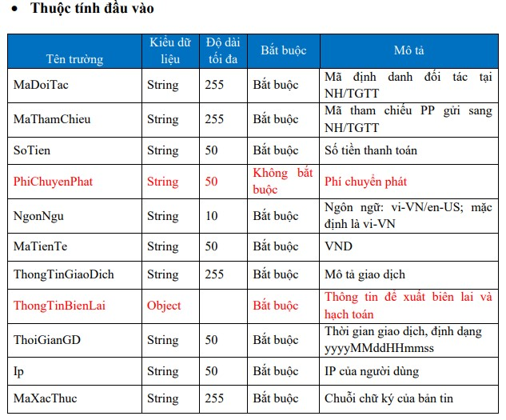
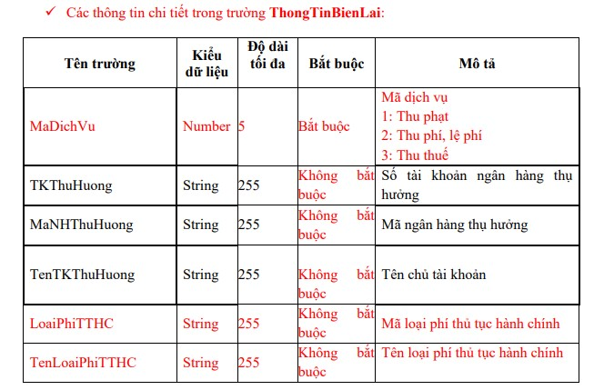
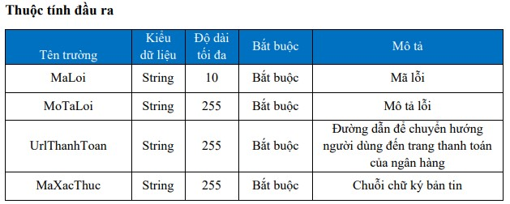

# RESTful API

## RESTful API là gì?
Có thể nói bản thân REST không phải là một loại công nghệ. Nó là phương thức tạo API với nguyên lý tổ chức nhất định. Những nguyên lý này nhằm hướng dẫn lập trình viên tạo môi trường xử lý API request được toàn diện.

RESTful API là một tiêu chuẩn dùng trong việc thiết kế API cho các ứng dụng web (thiết kế Web services) để tiện cho việc quản lý các resource. Nó chú trọng vào tài nguyên hệ thống (tệp văn bản, ảnh, âm thanh, video, hoặc dữ liệu động…), bao gồm các trạng thái tài nguyên được định dạng và được truyền tải qua HTTP.

<p align="center">
    
</p>

## Các thành phần

**RESTful API** là một tiêu chuẩn dùng trong việc thiết kế các API cho các ứng dụng web để quản lý các resource. RESTful là một trong những kiểu thiết kế API được sử dụng phổ biến ngày nay để cho các ứng dụng (web, mobile…) khác nhau giao tiếp với nhau.

Chức năng quan trọng nhất của **REST** là quy định cách sử dụng các HTTP method (như GET, POST, PUT, DELETE…) và cách định dạng các URL cho ứng dụng web để quản các resource. RESTful không quy định logic code ứng dụng và không giới hạn bởi ngôn ngữ lập trình ứng dụng, bất kỳ ngôn ngữ hoặc framework nào cũng có thể sử dụng để thiết kế một **RESTful API**.
### RESTful hoạt động như thế nào?
<p align="center">
    
</p>

REST hoạt động chủ yếu dựa vào giao thức HTTP. Các hoạt động cơ bản nêu trên sẽ sử dụng những phương thức HTTP riêng.

* GET (SELECT): Trả về một Resource hoặc một danh sách Resource.
* POST (CREATE): Tạo mới một Resource.
* PUT (UPDATE): Cập nhật thông tin cho Resource.
* DELETE (DELETE): Xoá một Resource.

Những phương thức hay hoạt động này thường được gọi là CRUD tương ứng với Create, Read, Update, Delete – Tạo, Đọc, Sửa, Xóa.

>Hiện tại đa số lập trình viên viết RESTful API giờ đây đều chọn JSON là format chính thức nhưng cũng có nhiều người chọn XML làm format, nói chung dùng thế nào cũng được miễn tiện và nhanh.
### Authentication và dữ liệu trả về
RESTful API không sử dụng `session` và `cookie`, nó sử dụng một access_token với mỗi request. Dữ liệu trả về thường có cấu trúc như sau:
```
{
    "data" : {
        "id": "1",
        "name": "TopDev"
    }
}
```
### Status code
Khi chúng ta request một API nào đó thường thì sẽ có vài status code để nhận biết sau:

* 200 OK – Trả về thành công cho những phương thức GET, PUT, PATCH hoặc DELETE.
* 201 Created – Trả về khi một Resouce vừa được tạo thành công.
* 204 No Content – Trả về khi Resource xoá thành công.
* 304 Not Modified – Client có thể sử dụng dữ liệu cache.
* 400 Bad Request – Request không hợp lệ
* 401 Unauthorized – Request cần có auth.
* 403 Forbidden – bị từ chối không cho phép.
* 404 Not Found – Không tìm thấy resource từ URI
* 405 Method Not Allowed – Phương thức không cho phép với user hiện tại.
* 410 Gone – Resource không còn tồn tại, Version cũ đã không còn hỗ trợ.
* 415 Unsupported Media Type – Không hỗ trợ kiểu Resource này.
* 422 Unprocessable Entity – Dữ liệu không được xác thực
* 429 Too Many Requests – Request bị từ chối do bị giới hạn

### HTTP Request
HTTP request có tất cả 9 loại method , 2 loại được sử dụng phổ biến nhất là GET và POST

* GET: được sử dụng để lấy thông tin từ server theo URI đã cung cấp.
* HEAD: giống với GET nhưng response trả về không có body, chỉ có header.
* POST: gửi thông tin tới sever thông qua các biểu mẫu http.
* PUT: ghi đè tất cả thông tin của đối tượng với những gì được gửi lên.
* PATCH: ghi đè các thông tin được thay đổi của đối tượng.
* DELETE: xóa tài nguyên trên server.
* CONNECT: thiết lập một kết nối tới server theo URI.
* OPTIONS: mô tả các tùy chọn giao tiếp cho resource.
* TRACE: thực hiện một bài test loop – back theo đường dẫn đến resource.
### Authorization
Hiện tại có 3 cơ chế Authorize chính:

* HTTP Basic
* JSON Web Token (JWT)
* OAuth2

Tùy thuộc vào service của bạn, mà hãy chọn loại Authorize có mức độ phù hợp, cố gắng giữ nó càng đơn giản càng tốt.
### CORS Policy
[CORS là gì](https://topdev.vn/blog/cors-la-gi/)?
### API Document
Ai cũng biết việc viết API docs là cần thiết, tuy nhiên để có một API docs hoàn chỉnh cũng tiêu tốn khá nhiều thời gian. Nhất là trong lúc dự án gấp rút thì mọi người thường chỉ để API docs ở mức siêu cơ bản. Tham khảo thêm cách viết API Document.

API document là một phần tương tự như Unit Test vậy – lấy ngắn để nuôi dài.

Nếu không được chăm sóc kỹ, thì đến lúc maintain hoặc thay đổi spec thì hậu quả sẽ rất thảm khốc, dưới đây là một số lưu ý lúc viết docs:

* Mô tả đầy đủ về params request: gồm những params nào, datatype, require hay optional.
* Nên đưa ra các ví dụ về HTTP requests và responses với data chuẩn.
* Cập nhật Docs thường xuyên, để sát nhất với API có bất cứ thay đổi gì.
* Format, cú pháp cần phải nhất quán, mô tả rõ ràng, chính xác.

## Ví dụ về mô tả api
API Khởi tạo giao dịch

---

* Request method: POST <br>
* Header: Content-type = application/json<br>
* Tham số đầu vào và đầu ra là một đối tượng JSON với các thuộc tính dưới đây:

---

<p align="center">
    
</p>

<p align="center">
    
</p>

<p align="center">
    
</p>
