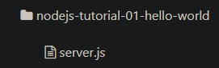

# Node.js – Cài đặt môi trường phát triển trên Linux
Những nội dung có trong bài này:

1. Cài đặt Nodejs.
2. Cài đặt Visual Studio Code.
3. Viết ứng dụng huyền thoại: Hello World.
## Cài đặt Nodejs.

```
sudo apt-get update
sudo apt install nodejs npm
sudo ln -s "$(which nodejs)" /usr/bin/node
```
## Cài đặt Visual Studio Code.
Đã cài từ tuần 1
## Viết ứng dụng huyền thoại: Hello World.
Việc đầu tiên là khởi tạo ứng dụng, mình tạo 1 thư mục để lưu trữ code, và 1 file tên là server.js, cấu trúc như sau:

<p align="center">
    
</p>

Tiếp theo mở Terminal đến thư mục `nodejs-tutorial-01-hello-world` và chạy lệnh khởi tạo nhanh một project node:
```
npm init -y
```
Sau khi lệnh trên chạy xong, một file tên là **package.json** sẽ tự động được tạo, các bạn cứ hiểu file này là file cấu hình của npm, giúp cho npm hiểu nó cần phải cài đặt cái gì, thông tin về ứng dụng, phiên bản, …

– Bây giờ chúng ta sẽ viết code cho file **server.js**, mình sẽ viết ứng dụng này theo 2 cách để các bạn dễ phân biệt:

### Cách thứ nhất
là dùng module http của Nodejs, đây là module được tích hợp sẵn khi cài Nodejs, cũng có thể hiểu đơn giản đây là cách viết Nodejs thuần không sử dụng Framework.
```
const http = require('http');
const hostname = 'localhost';
const port = 8017;
const server = http.createServer((req, res) => {
    res.statusCode = 200;
    res.setHeader('Content-Type', 'text/html');
    res.end('<h1>Hello Worlddd!</h1><hr>');
});
server.listen(port, hostname, () => {
    console.log(`Hello Tuấn anh, I am running at ${ hostname }:${ port }/`);
});
```
– Chạy chương trình tương tự như cách thứ nhất và cho kết quả cũng vậy.
### Cách thứ hai là sử dụng Framework Express
Cài đặt Express: `npm install express --save`
```
const express = require('express');
const app = express();
const hostname = 'localhost';
const port = 8017;
app.get('/', (req, res) => {
    res.send('<h1>Hello World!</h1><hr>');
});
app.listen(port, hostname, () => {
    console.log(`Hello Trung Quan, I am running at ${ hostname }:${ port }/`);
});
```
– Chạy chương trình tương tự như cách thứ nhất và cho kết quả cũng vậy.

<p align="center">
    
</p>
