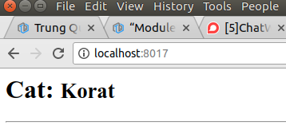
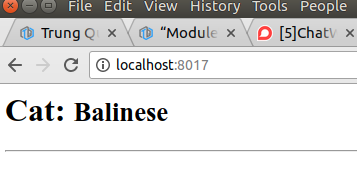
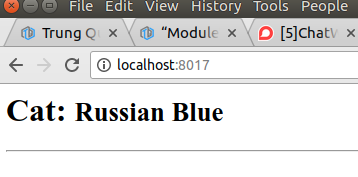
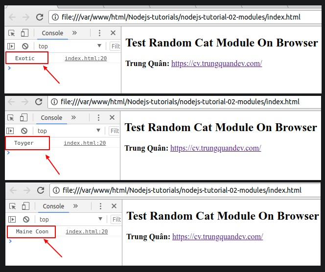

# “Module” trong Node.js, khái niệm và thực tiễn.
## 1. Khái niệm Module trong Nodejs.

Hiểu vui vui như là: khi mặc đồ lên người, có quần, áo, mũ, giày, tất … các thứ kết hợp lại với nhau mặc lên người bạn, thì trông sẽ khác hẳn so với việc bạn mang cả đống vải quấn xung quanh mình thay cho quần áo đúng không? =))

Từ đó “Module” trong Nodejs ra đời:

“Node.js sử dụng kiến trúc Module để đơn giản hóa việc tạo ra các ứng dụng phức tạp. Module là giống như các thư viện trong C, C#, Java, … Mỗi module chứa một tập các hàm chức năng có liên quan đến một “đối tượng” của Module.”

“Các module được giữ tách biệt riêng với nhau, tách riêng với code base, khi nào cần sử dụng những cái nào thì gọi chúng ra và kết hợp lại với nhau tùy logic xử lý của bạn.”

Giống như bạn có một cái tủ đồ nhiều ngăn, ngăn để áo, ngăn để quần, ngăn để tất…vv. Hôm nay bạn có hẹn đi chơi với bạn gái, dĩ nhiên là phải ăn mặc chỉn chu đầy đủ quần áo rồi :v bây giờ chỉ việc mở từng ngăn tủ lấy đồ ra mix lại với nhau thôi.

“Tóm lại, mình hiểu theo một cách đơn giản thế này: Module là các đoạn code được đóng gói lại với nhau và được giữ Private, chỉ các hàm và biến được định nghĩa bên trong Module là có thể truy cập và thao tác với nhau. Còn khi nào cần sử dụng Module từ bên ngoài thì chúng ta sẽ chìa các API là các biến, các hàm, hoặc cả 2 biến và hàm ra bên ngoài bằng cách sử dụng đối tượng exports hoặc module.exports.“


## 2. Module tích hợp sẵn trong Nodejs và Module tải về từ bên ngoài.
– Các module tích hợp (Built-in Modules):

Đây là những module mà sau khi cài đặt Nodejs xong bạn đã có thể gọi ra và sử dụng. Ví dụ như http, https, fs, path…vv…
Danh sách các module tích hợp đều được liệt kê ở đây: https://www.w3schools.com/nodejs/ref_modules.asp

Như ví dụ ở bài trước, mình có sử dụng một module tích hợp là http để viết ứng dụng Hello world! Chỉ việc gọi ra và sử dụng luôn.

– Các module bên ngoài (External Modules):

Điều thực sự khiến cho Nodejs nổi tiếng mà mình nhận thấy đó không phải là ở các module tích hợp, mà chính là một hệ sinh thái khổng lồ của các module mã nguồn mở bên ngoài được cung cấp bởi cộng đồng Nodejs.

Chúng ta có thể cài đặt được các module bên ngoài này thông qua NPM và một trang web cực kỳ thân thuộc với những ai làm việc cùng Nodejs đó là **https://www.npmjs.com**

Cũng ở bài trước, mình có sử dụng một module bên ngoài đó là express để viết ứng dụng Hello world!

Câu lệnh cài đặt: `npm install --save express`

Và khi muốn sử dụng thì sẽ gọi `require("express")`;
## 3. Tự viết và sử dụng một Module đơn giản.

Trong phần này, ý tưởng mình nghĩ ra là viết một module có chức năng trả về ngẫu nhiên tên của một chú mèo trong một mảng danh sách tên các loài mèo 😀

– Bước 1: Viết Module và chìa ra API: file `cat.js`

Mình sẽ viết một Module `cat.js` trong đó export (chìa ra) một function là `getRandomCat`:
```
function getRandomCat (catsArr) {
    return catsArr[Math.floor(Math.random() * catsArr.length)];
}
module.exports = {
    getRandomCat: getRandomCat,
};
```
– Bước 2: Tham chiếu tới module và sử dụng: file server.js

Mình sẽ require một module bên ngoài là express và require module cat.js vừa tạo ở trên.

(Bài viết tiếp theo mình sẽ đi sâu vào module express, nên trong bài này các bạn chỉ cần tập trung vào module cat mà chúng ta tự viết thôi nhé.)
```
const express = require('express');
const cat = require('./cat');

const hostname = 'localhost';
const port = 8017;
const app = express();
app.get('/', (req, res) => {
    let catsArr = ["Maine Coon", "Sphynx", "Toyger", "Balinese", "Burmese", "Russian Blue", "Turkish Van", "Exotic", "Selkirk Rex", "Korat"];
    let randomCat = cat.getRandomCat(catsArr);
    res.send(`<h1>Cat: <small>${ randomCat }</small></h1><hr>`);
});

app.listen(port, hostname, () => {
    console.log(`Hello Trung Quan, I am running at ${ hostname }:${ port }/`);
});
```
Cụ thể trong đoạn code trên mình có tạo ra một mảng catArr gồm tên của 10 loài mèo khác nhau, sau đó gọi đến function `getRandomCat` của module cat.js mà mình đã require ở trên để lấy ra một chú mèo ngẫu nghiên. Cuối cùng là trả về tên của chú mèo đó về rồi hiển thị ra trình duyệt.

Chạy lệnh `node server.js` và ra trình duyệt chạy, kết quả mỗi lần f5 trình duyệt sẽ hiển thị ra ngẫu nhiên khác nhau tên của 1 chú mèo.
<p align="center">
    
    
    
</p>

## 4. Cách viết một Module chạy trên cả Client (Browser) và Server (Nodejs).
Tại sao mình lại đề cập đến vấn đề này, thử giả định một trường hợp viết code validate một số dữ liệu đầu vào cho ứng dụng như username hay password chẳng hạn. Nếu chúng ta dùng ngôn ngữ phía server là một ngôn ngữ bất kỳ **khác với Javascript** như: PHP, Ruby, Python hay Java… Thì chúng ta sẽ phải viết 2 lần cùng một đoạn logic code ở phía client và server, vừa **dư thừa code** vừa **phiền phức khi cần thay đổi điều kiện validate.**

Ở đây chúng ta **dùng Nodejs, viết mã Javascript**, nên có thể viết code 1 lần , rồi ở cả 2 phía client và server đều dùng lại đoạn code đó được, rất là tiện.

Nhưng có một vấn đề nảy sinh, đó là phía trình duyệt **chưa hỗ trợ các hàm export, module.export và require**. Nên chúng ta sẽ phải viết code khác đi một chút, ý tưởng là dùng **if-else** để kiểm tra xem nếu tồn tại các hàm **export, module.export** thì dùng chúng, còn nếu không tồn tại tức là **undefined** thì xuất khẩu ra một biến **global** mà phía trình duyệt sử dụng được.

Và kỹ thuật sử dụng là **bọc toàn bộ code của module** trong một **closure** và truyền đối tượng **exports** vào như là một đối số, sau đó sử dụng toán tử 3 ngôi để kiểm tra điều kiện và trả về đối tượng **exports** cho phía server nodejs sử dụng, hoặc một biến **global** là **getRandomCatBrowser** cho phía Client trình duyệt sử dụng.

Bây giờ mình sẽ sửa đoạn code module **cat.js** ở phần 3 như sau:
```
//cat.js
(function(exports) {
    exports.getRandomCat = function (catsArr) {
        return catsArr[Math.floor(Math.random() * catsArr.length)];
    };
}(typeof exports === 'undefined' ? this.getRandomCatBrowser = {} : exports));
// end
```
_“Mình có một lưu ý nhỏ ở đây, đối tượng **this** trong trình duyệt tương đương với đối tượng **window**, có nghĩa là **this.getRandomCatBrowser** cũng có thể viết là **window.getRandomCatBrowser**.”_

– Thực thi code như ở phần 3 bạn vẫn sẽ nhận được kết quả là những chú mèo ngẫu nhiên như vậy.

– Tiếp theo, mình tạo thêm một **file index.html** để test việc gọi module này phía trình duyệt.
```
<!--
 //file index.html
-->
<!DOCTYPE html>
<html lang="en">
<head>
    <meta charset="UTF-8">
    <meta name="viewport" content="width=device-width, initial-scale=1.0">
    <meta http-equiv="X-UA-Compatible" content="ie=edge">
    <title>Document</title>
    <script src="cat.js"></script>
    <script>
        let catsArr = ["Maine Coon", "Sphynx", "Toyger", "Balinese", "Burmese", "Russian Blue", "Turkish Van", "Exotic", "Selkirk Rex", "Korat"];
        let randomCat = getRandomCatBrowser.getRandomCat(catsArr);
        console.log(randomCat);
    </script>
</head>
<body>
    <h2>Test Random Cat Module On Browser</h2>
    <p>
        <span style="font-weight:bold;">Trung Quân:</span>
        <a href="https://cv.trungquandev.com/" target="_blank">https://cv.trungquandev.com/</a>
    </p>
</body>
</html>
<!--
 * end
-->
```
Mở tab Console lên kiểm tra và kết quả thu về tương tự như bên server, như vậy module cat.js của chúng ta đã hoạt động được ở cả Client (Browser) và Server (Nodejs):

<p align="center">
    
</p>
