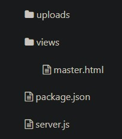
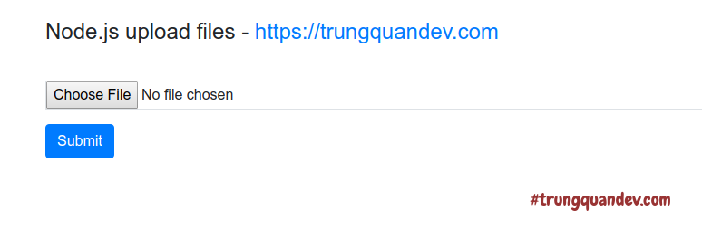

# Upload file trong Node.js?
##  1. Tạo sẵn giao diện Form Upload
Cấu trúc thư mục ứng dụng như sau:
<p align="center">
    
</p>

*   Nội dung file **server.js**
```
/**
 * server.js
 */

let http = require("http");
let url = require("url");
let fs = require("fs");

let server = http.createServer((req, res) => {
    let urlData = url.parse(req.url, true);
    let fileName = "./views" + urlData.pathname;

    if(urlData.pathname === "/") {
        fileName = "./views/master.html";
    }

    fs.readFile(fileName, (err, data) => {
        if(err) {
            console.log(err);
            res.writeHead(404, {"Content-Type": "text/html"});
            res.write("404 Not Found");

            return res.end();
        }
        res.writeHead(200, {"Content-Type": "text/html"});
        res.write(data);

        return res.end();
    });
});

server.listen(8017, "localhost", () => {
  console.log(`Hello Trung Quan, I'm running at localhost:8017/`);
});
```
*  Nội dung file **master.html**
```
<!--
* Created by trungquandev.com's author on 10/03/2019.
*/
// views/master.html
-->
<!DOCTYPE html>
<html lang="en">
<head>
    <meta charset="UTF-8">
    <meta name="viewport" content="width=device-width, initial-scale=1.0">
    <meta http-equiv="X-UA-Compatible" content="ie=edge">
    <link rel="shortcut icon" href="https://trungquandev.com/wp-content/uploads/2016/11/LOGO.png" />
    <title>Node.js upload files</title>
    <!-- Get bootstrap from CDN-->
    <link rel="stylesheet" href="https://stackpath.bootstrapcdn.com/bootstrap/4.3.1/css/bootstrap.min.css">
    <script src="https://stackpath.bootstrapcdn.com/bootstrap/4.3.1/js/bootstrap.bundle.min.js"></script>
</head>
<body>
    <div class="container">
        <div class="row">
            <div class="col-sm-8">
                <br>
                <h4>
                    Node.js upload files - trungquandev
                </h4>
                <div class=""></div>
                <form action="/upload" method="POST" enctype="multipart/form-data">
                    <div class="form-group">
                        <label for="example-input-file">&nbsp;</label>
                        <input type="file" name="file" class="form-control-file border">
                    </div>
                    <button type="submit" class="btn btn-primary">Submit</button>
                </form>
            </div>
        </div>
    </div>
</body>
</html>
```

_“Lưu ý là trong thẻ \
 ở trên phải có một thuộc tính là **enctype=”multipart/form-data”** và thẻ \
 phải có một cái name ví dụ như **name=”file”** ở trên nhé.”_

Kết quả sau khi chạy ứng dụng: **node server.js**
<p align="center">
    
</p>

## 2. Xử lý Upload file với Formidable
Nói qua về thằng này một chút, mình trích lời [giới thiệu chính thức của Formidable](https://www.npmjs.com/package/formidable) thì nó là một module giúp chúng ta phân tích dữ liệu biểu mẫu, đặc biệt là tập trung vào việc encoding các hình ảnh và video, hay nói dễ hiểu và ngắn gọn hơn là **tập trung vào việc tải lên các tệp tin.**

Một số tính năng mà module này liệt kê ra như sau:

*   **Non-buffering multipart parser:** Tốc độ cao, lên tới xấp xỉ 500mb/giây và không cần bộ nhớ đệm cho việc phân tích cú pháp.
*   **Automatically writing file uploads to disk:** Tự động ghi lại các tập tin tải lên.
*   **Graceful error handling:** Cú pháp bắt lỗi & xử lý lỗi dễ dàng.
*   **Low memory footprint:** Có thể hiểu đơn giản là thư viện này ăn ít Ram.
*   **Very high test coverage:** Thư viện này đã được viết test rất cẩn thận (theo như chúng nó nói =))


Rồi, xem qua lý thuyết như vậy thôi, mình sẽ bắt đầu triển khai một ví dụ để các bạn biết cách dùng module này cho việc upload nhé:

_“Cụ thể hơn, trong ví dụ dưới đây, mình sẽ sử dụng các module **http-fs-url** để tạo server, và kết hợp dùng **formidable** để xử lý upload file. Chưa dùng framework **express.js** nhé, **express.js** để phần 3 mình sẽ làm ví dụ với **multer**.”_

Cài đặt module: **npm install --save formidable** hoặc **npm i -S formidable**

Ở file **server.js** có 2 việc cần làm:

*   Việc đầu tiên là chúng ta nạp module **formidable**:
*   Việc thứ hai là viết thêm một đoạn code kiểm tra điều kiện upload file bên trong function **createServer()**…

– Nội dung file **server.js** sau khi thay đổi như sau (mình đã comment giải thích rõ ràng những đoạn code mới thêm vào rồi nha)
```
/**
 * Created by trungquandev.com's author on 10/03/2019.
 * server.js
 */
let http = require("http");
let url = require("url");
let fs = require("fs");
let formidable = require("formidable");

let server = http.createServer((req, res) => {
    // Kiểm tra nếu như url truyền lên là /upload và phương thức là post
    if (req.url == "/upload" && req.method.toLowerCase() == "post") {
      // Khởi tạo biến form bằng IncomingForm để phân tích một tập tin tải lên
      let form = new formidable.IncomingForm();
      // Cấu hình thư mục sẽ chứa file trên server với hàm .uploadDir
      form.uploadDir = "uploads/"
      // Xử lý upload file với hàm .parse
      form.parse(req, (err, fields, files) => {
        if (err) throw err;
        // Lấy ra đường dẫn tạm của tệp tin trên server
        let tmpPath = files.file.path;
        // Khởi tạo đường dẫn mới, mục đích để lưu file vào thư mục uploads của chúng ta
        let newPath = form.uploadDir + files.file.name;
        // Đổi tên của file tạm thành tên mới và lưu lại
        fs.rename(tmpPath, newPath, (err) => {
          if (err) throw err;

          switch (files.file.type) {
            // Kiểm tra nếu như là file ảnh thì render ảnh và hiển thị lên.
            case "image/jpeg":
              fs.readFile(newPath, (err, fileUploaded) => {
                res.writeHead(200,{"Content-type":"image/jpeg"});
                res.end(fileUploaded);
              });
              break;
            // Còn lại các loại file khác thì chỉ hiển thị nội dung thông báo upload thành công.
            default:
              res.writeHead(200, {"Content-Type": "text/html"});
              res.end(`Upload file <strong>${files.file.name}</strong> successfuly`);
              break;
          }
        });
      });
      // Return ở đây để code không chạy tiếp xuống dưới
      return;
    }
    // Nếu không phải action upload thì trả về client cái form upload
    let urlData = url.parse(req.url, true);
    let fileName = "./views" + urlData.pathname;
    if(urlData.pathname === "/") {
        fileName = "./views/master.html";
    }
    fs.readFile(fileName, (err, data) => {
      if(err) {
        console.log(err);
        res.writeHead(404, {"Content-Type": "text/html"});
        res.write("404 Not Found");
        return res.end();
      }
      res.writeHead(200, {"Content-Type": "text/html"});
      res.write(data);
      return res.end();
    });
});

server.listen(8017, "localhost", () => {
  console.log(`Hello Trung Quan, I'm running at localhost:8017/`);
});
```

