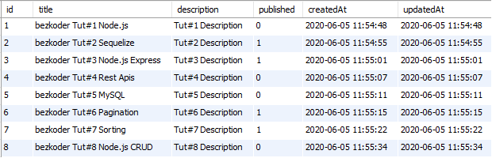
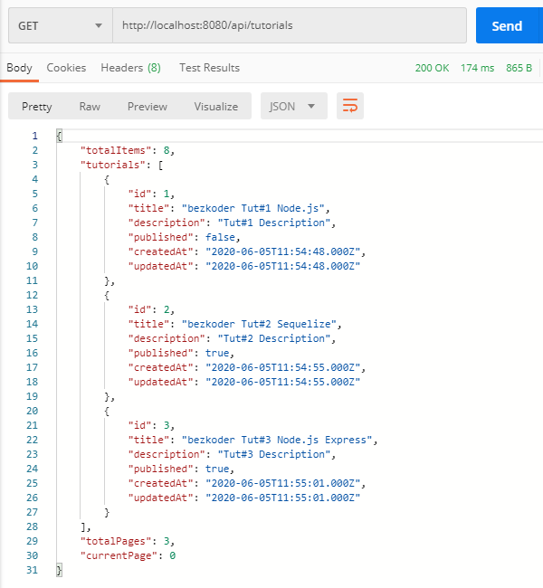
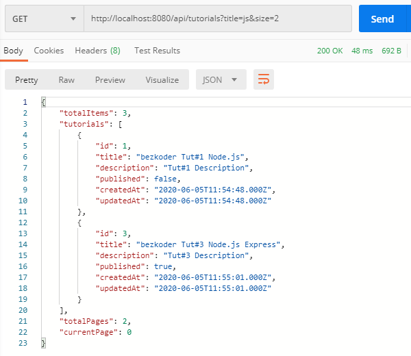

# Server side Pagination in Node.js with Sequelize & MySQL

## Server side pagination is better for

* Large data set
* Faster initial page load
* Accessibility for those not running JavaScript
* Complex view business logic

## Node.js Pagination with Sequelize and MySQL overview

Assume that we have tutorials table in database like this:



Node.js Express Server will exports API for pagination (with/without filter), here are some url samples:

* /api/tutorials?page=1&size=5
* /api/tutorials?size=5: using default value for page
* /api/tutorials?title=data&page=1&size=3: pagination & filter by title containing ‘data’
* /api/tutorials/published?page=2: pagination & filter by ‘published’ status

This is structure of the result that we want to get from the APIs:

```
{
    "totalItems": 8,
    "tutorials": [...],
    "totalPages": 3,
    "currentPage": 1
}
```

Read Tutorials with default page index (0) and page size (3):


Indicate page index = 2 but not specify size (default: 3) for total 8 items:

* page_0: 3 items
* page_1: 3 items
* page_2: 2 items


Indicate size = 2 but not specify page index (default: 0):


Pagination and filter by title that contains a string:



## Node.js Sequelize for Pagination

To help us deal with this situation, Sequelize provides way to implement pagination with offset and limit properties in the query object that we pass to query methods.

* offset: quantity of items to skip
* limit: quantity of items to fetch

For example, there are total 8 items.
– { offset: 3 }: skip first 3 items, fetch 5 remaining items.
– { limit: 2 }: fetch first 2 items.
– { offset: 3, limit: 2 }: skip first 3 items, fetch 4th and 5th items.

We’re gonna use findAll() and findAndCountAll() methods which accept the pagination information above for paging.

## **Sequelize findAll**

This is how we use [findAll()](https://sequelize.org/master/class/lib/model.js~Model.html#static-method-findAll) with limit and offset properties:

```
model.findAll({
  limit,
  offset,
  where: {}, // conditions
});
```

Now try it to query our tutorials data:

```
model.findAll({
  limit: 2,
  offset: 3,
  where: {}, // conditions
});
```

The result:

```
[
    {
        "id": 4,
        "title": "bezkoder Tut#4 Rest Apis",
        "description": "Tut#4 Description",
        "published": false,
        "createdAt": "2020-06-05T11:55:07.000Z",
        "updatedAt": "2020-06-05T11:55:07.000Z"
    },
    {
        "id": 5,
        "title": "bezkoder Tut#5 MySQL",
        "description": "Tut#5 Description",
        "published": false,
        "createdAt": "2020-06-05T11:55:11.000Z",
        "updatedAt": "2020-06-05T11:55:11.000Z"
    }
]
```

With where condition:

```
model.findAll({
  limit: 2,
  offset: 1,
  where: { title: { [Op.like]: `%js%` } }, // conditions
});
```

The result:

```
[
    {
        "id": 3,
        "title": "bezkoder Tut#3 Node.js Express",
        "description": "Tut#3 Description",
        "published": true,
        "createdAt": "2020-06-05T11:55:01.000Z",
        "updatedAt": "2020-06-05T11:55:01.000Z"
    },
    {
        "id": 8,
        "title": "bezkoder Tut#8 Node.js CRUD",
        "description": "Tut#8 Description",
        "published": false,
        "createdAt": "2020-06-05T11:55:34.000Z",
        "updatedAt": "2020-06-05T11:55:34.000Z"
    }
]
```

You can see that the response skips item with id=1 at position 0 because we set the offset=1.
The information seems not enough when working with large data. We don’t know the total number of items that match the query, the result also shows a piece for which data we need.

That’s the reason why findAndCountAll() comes to us.

### **Sequelize findAndCountAll**

[findAndCountAll()](https://sequelize.org/master/class/lib/model.js~Model.html#static-method-findAndCountAll) is more useful for paging than findAll(). It is because it also gets the total number of rows matching the query.

```
model.findAndCountAll({
  limit,
  offset,
  where: {}, // conditions
});
```

Query our tutorials data:

```
model.findAndCountAll({
  limit: 2,
  offset: 3,
  where: {}, // conditions
});
```

Instead of getting only a JSON array, we have count and rows in the result:

```
{
    "count": 8,
    "rows": [
        {
            "id": 4,
            "title": "bezkoder Tut#4 Rest Apis",
            "description": "Tut#4 Description",
            "published": false,
            "createdAt": "2020-06-05T11:55:07.000Z",
            "updatedAt": "2020-06-05T11:55:07.000Z"
        },
        {
            "id": 5,
            "title": "bezkoder Tut#5 MySQL",
            "description": "Tut#5 Description",
            "published": false,
            "createdAt": "2020-06-05T11:55:11.000Z",
            "updatedAt": "2020-06-05T11:55:11.000Z"
        }
    ]
}
```

With where condition:

```
model.findAndCountAll({
  limit: 2,
  offset: 1,
  where: { title: { [Op.like]: `%js%` } }, // conditions
});
```

The result:

```
{
    "count": 3,
    "rows": [
        {
            "id": 3,
            "title": "bezkoder Tut#3 Node.js Express",
            "description": "Tut#3 Description",
            "published": true,
            "createdAt": "2020-06-05T11:55:01.000Z",
            "updatedAt": "2020-06-05T11:55:01.000Z"
        },
        {
            "id": 8,
            "title": "bezkoder Tut#8 Node.js CRUD",
            "description": "Tut#8 Description",
            "published": false,
            "createdAt": "2020-06-05T11:55:34.000Z",
            "updatedAt": "2020-06-05T11:55:34.000Z"
        }
    ]
}
```

## Setup Node.js Express Application

We need to install necessary modules: express, sequelize, mysql2.
Run the command:

```
npm install express sequelize mysql2 cors --save
```

## Configure MySQL database & Sequelize

In the app folder, we create a separate config folder for configuration with db.config.js file like this:

```
module.exports = {
  HOST: "localhost",
  USER: "root",
  PASSWORD: "password",
  DB: "testdb",
  dialect: "mysql",
  pool: {
    max: 5,
    min: 0,
    acquire: 30000,
    idle: 10000
  }
};
```

First five parameters are for MySQL connection.
pool is optional, it will be used for Sequelize connection pool configuration:

* max: maximum number of connection in pool
* min: minimum number of connection in pool
* idle: maximum time, in milliseconds, that a connection can be idle before being released
* acquire: maximum time, in milliseconds, that pool will try to get connection before throwing error

## **Initialize Sequelize**

We’re gonna initialize Sequelize in **app**/**models** folder that will contain model in the next step.

Now create **app**/**models**/_index.js_ with the following code:

```
const dbConfig = require("../config/db.config.js");

const Sequelize = require("sequelize");
const sequelize = new Sequelize(dbConfig.DB, dbConfig.USER, dbConfig.PASSWORD, {
  host: dbConfig.HOST,
  dialect: dbConfig.dialect,
  operatorsAliases: false,

  pool: {
    max: dbConfig.pool.max,
    min: dbConfig.pool.min,
    acquire: dbConfig.pool.acquire,
    idle: dbConfig.pool.idle
  }
});

const db = {};

db.Sequelize = Sequelize;
db.sequelize = sequelize;

db.tutorials = require("./tutorial.model.js")(sequelize, Sequelize);

module.exports = db;
```

Don’t forget to call **sync()** method in server.js:

```
...
const app = express();
app.use(...);

const db = require("./app/models");
db.sequelize.sync();

...
```

In development, you may need to drop existing tables and re-sync database. Just use **force:true** as following code:

```

db.sequelize.sync({ force: true }).then(() => {
  console.log("Drop and re-sync db.");
});
```

## Create Data Model

In models folder, create `tutorial.model.js` file like this:

```
module.exports = (sequelize, Sequelize) => {
  const Tutorial = sequelize.define("tutorial", {
    title: {
      type: Sequelize.STRING
    },
    description: {
      type: Sequelize.STRING
    },
    published: {
      type: Sequelize.BOOLEAN
    }
  });

  return Tutorial;
};
```

This Sequelize Model represents **tutorials** table in MySQL database. These columns will be generated automatically: _id_, _title_, _description_, _published_, _createdAt_, _updatedAt_.

After initializing Sequelize, we don’t need to write CRUD functions, Sequelize supports all of them. Now you can easily use following methods with pagination:

* get all Tutorials: [findAll](https://sequelize.org/master/class/lib/model.js~Model.html#static-method-findAll)({ limit, offset })
* find all Tutorials by title: findAll({ where: { title: ... }, limit, offset })
* find and count all Tutorials: findAndCountAll({ limit, offset })
* find and count all Tutorials by title: findAndCountAll({ where: { title: ... }, limit, offset })

In the Controller, we only use findAndCountAll({ where, limit, offset }) because it is enough for all we need.

## **Controller with Pagination**

Earlier on the section above, we’ve known the specific properties in a query object that we pass to findAndCountAll() method: offset and limit. But the API receives page and size.

Here is way to calculate:

* limit = size
* offset = page \* size

Notice that we start counting from page **0**.

For example, if we want get page number 5 (page=5) and on each page there is 8 records (size=8), the calculations will look like this:

* limit = size = 8
* offset = page \* size = 5 \* 8 = 40

So on page 5, there are records from 40 to 47.

Generally, in the HTTP request URLs, paging parameters are optional. So if our Rest API supports pagination, we should provide default values to make paging work even when Client does not specify these parameters.

```
const getPagination = (page, size) => {
  const limit = size ? +size : 3;
  const offset = page ? page * limit : 0;

  return { limit, offset };
};
```

By default, 3 Tutorials will be fetched from database in page index 0.

The response data will contains count and rows:

```
{
    "count": 8,
    "rows": [
        {
            ...
        },
        {
            ...
        }
    ]
}
```

We need to get the result with the structure:

```
{
    "totalItems": 8,
    "tutorials": [...],
    "totalPages": 3,
    "currentPage": 1
}
```

So, let’s write the function to map default response to desired structure:

```
const getPagingData = (data, page, limit) => {
  const { count: totalItems, rows: tutorials } = data;
  const currentPage = page ? +page : 0;
  const totalPages = Math.ceil(totalItems / limit);

  return { totalItems, tutorials, totalPages, currentPage };
};
```

Now the code in `tutorial.controller.js` will look like this:

```
const db = require("../models");
const Tutorial = db.tutorials;
const Op = db.Sequelize.Op;

const getPagination = ...;
const getPagingData = ...;

// Retrieve all Tutorials from the database.
exports.findAll = (req, res) => {
  const { page, size, title } = req.query;
  var condition = title ? { title: { [Op.like]: `%${title}%` } } : null;

  const { limit, offset } = getPagination(page, size);

  Tutorial.findAndCountAll({ where: condition, limit, offset })
    .then(data => {
      const response = getPagingData(data, page, limit);
      res.send(response);
    })
    .catch(err => {
      res.status(500).send({
        message:
          err.message || "Some error occurred while retrieving tutorials."
      });
    });
};

// find all published Tutorial
exports.findAllPublished = (req, res) => {
  const { page, size } = req.query;
  const { limit, offset } = getPagination(page, size);

  Tutorial.findAndCountAll({ where: { published: true }, limit, offset })
    .then(data => {
      const response = getPagingData(data, page, limit);
      res.send(response);
    })
    .catch(err => {
      res.status(500).send({
        message:
          err.message || "Some error occurred while retrieving tutorials."
      });
    });
};

// other CRUD functions
```

## **Create Node.js Express API layer**

The final part is to use the Controller methods in _tutorial.routes.js_ with Express Router.
There are 2 important endpoints: /api/tutorials/ and /api/tutorials/published.

```
module.exports = app => {
  const tutorials = require("../controllers/tutorial.controller.js");

  var router = require("express").Router();

  // Retrieve all Tutorials
  router.get("/", tutorials.findAll);

  // Retrieve all published Tutorials
  router.get("/published", tutorials.findAllPublished);

  ...

  app.use('/api/tutorials', router);
};
```

