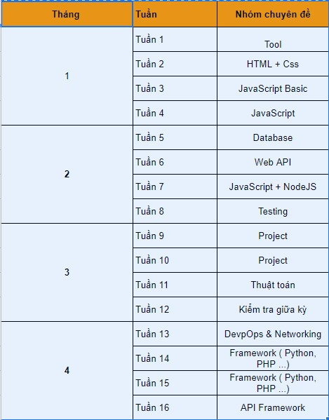

<h1>Giới thiệu khóa học</h1>

<!-- Yêu cầu công việc thị trường -->

  

    Yêu cầu công việc thị trường
  

* **Yêu cầu chung**: Quản lý source code vs GIT. Kinh nghiệm làm việc: Nhận bài toán, Phân tích bài toán, Giải bải toán.

* **Yêu cầu cụ thể**:

  * [Yêu cầu với backend](backend-developer-job-description-template.md)
  * [Yêu cầu với frontend](frontend-developer-job-description-template.md)

<!-- Thực trạng -->

  

    Thực trạng
  

* Mất thời gian để học lại kiến thức mới
* Dễ mất phương hướng
* Không có lợi thế cạnh tranh

<!-- Yêu cầu về khóa học -->

  

    Yêu cầu về khóa học
  

* Chương trình học lý thuyết phải song song với thực hành.

* Giáo trình học thực tiễn, bám sát sự chuyển đổi của nghề.
* Giảng viên tận tâm, nhiệt tình và ưu tiên các giảng viên có kinh nghiệm làm nghề lâu năm.
* Cơ sở vật chất hiện đại, tiên tiến, đáp ứng nhu cầu thực hành trên lớp.
* Được thực hiện dự án thật để cọ xát, nâng cao kinh nghiệm và kỹ năng sau này.

<!-- Kiến thức thu được sau khóa học -->

  

    Kiến thức thu được sau khóa học
  

* HTML, CSS:
  * Định nghĩa, cách sử dụng
  * Biết cách xây dựng giao diện web với HTML, CSS
  * Biết cách phân tích giao diện website, cắt giao diện website bán hàng: figma or pts.
  * Biết cách đặt tên class CSS theo chuẩn BEM
  * Biết cách làm giao diện web responsive
  * Làm chủ Flexbox khi dựng bố cục website
  * Hiệu ứng animation
  * Sở hữu 2 giao diện web khi học xong khóa học
  * Học được cách làm UI chỉn chu, kỹ tính
* JavaScript:
  * syntax
  * ajax call qua một sever nodejs có sẵ, có tài liệu api
* database:
* nodejs:
  * tạo database cho website todolist
  * tạo database cho website bán hàng
    * Phân tích quan hệ: sản phẩm, khách hàng, phản hồi, ...
    * Tạo đúng các bảng và quan hệ
    * học query thêm xóa sửa, select cơ bảng
    * học thêm query phân trang trigger cũng đc
  * Phân chia module của web
  * Tạo restfull api, viết tài liệu mô tả api
  * test restfull api, từng module đơn lẻ
    Lưu ý: mỗi học viên được làm mọt mudl khác nhau: sản phẩm, khách hàng,...
    Tiên hành ghép module vào nhau bằng git
    Thực hiện test toàn hệ thống
  * Tiến hành ghép với các module frontend
        nếu sử dụng html call ajax
        Sử dụng nodejs render frontend cũng được

<!-- Cách học -->

  

    Cách học
  

* Việc đi học không phải để học hết các kiến thức mình cần, mà là để học được “cách học”.
Quả đúng như thế, nhất là khi công nghệ thay đổi không ngừng thì kiến thức nhà trường dạy rất nhanh trở nên lạc hậu.

* Không quan trọng việc chúng ta đã học được bao nhiêu ngôn ngữ, mà quan trọng là chúng ta phải tìm ra cách học phù hợp với mình,
    hiệu quả với công việc mình đang làm!
* Việc học coding nhìn chung cần sự kiên nhẫn, ham học hỏi, tư duy logic, cẩn thận. Biết tiếng Anh là một lợi thế.
* Thường thì sinh viên học lập trình năm nhất, năm hai rất nhanh bỏ vì hoặc tập trung vào những thứ lan man như giải thuật hoặc học quá nhiều ngôn ngữ.
  * Không học tràn lan. Xác định mục tiêu học tập.
  * Một lộ trình - Một người bạn, Nhiều động lực
  * Dự án nhỏ. Để tăng tư duy lập trình, hãy tự đặt ra cho mình một vài dự án nho nhỏ.
* ứng dụng tính tiền hoặc quản lý thời gian, web bán hàng v…v.
* Xác định mình muốn học gì, làm gì
* Xác định sơ lộ trình học
* Cắm đầu vào học, sau đó tìm tài liệu dần và cập nhật lại lộ trình
* Áp dụng kiến thức đã học vào để code ra một cái gì đó.

<!-- Lộ trình học -->

  

    Lộ trình học
  

<!-- Tổng kết -->

  

    Tổng kết
  

* Nguyên lý hoạt động của ngôn ngữ lập trình
* Kiến trúc cơ bản của một phần mềm thông dụng
* Thực hành viết một phần mềm đơn giản

* Cách hoạt động của quản lý dữ liệu, hệ thống quản lý dữ liệu
* Tổ chức cơ sở dữ liệu quan hệ (relational database)
* Mô hình quan hệ thực thể (ERD) - Không bắt buộb
* Liên hệ ràng buộc dữ liệu (relationship) - Không bắt buộc

* Hoạt động phân tích nghiệp vụ trong quy trình tổng thể
* Vai trò, hoạt động và quy trình phân tích nghiệp vụ trong mội trường IT

